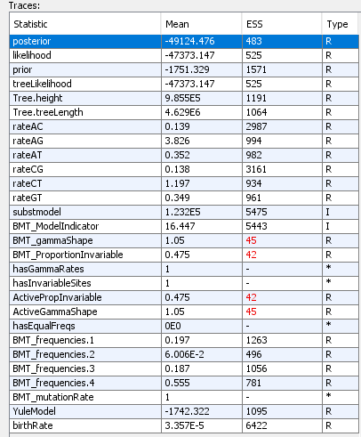
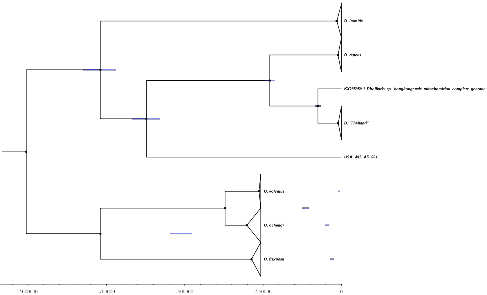
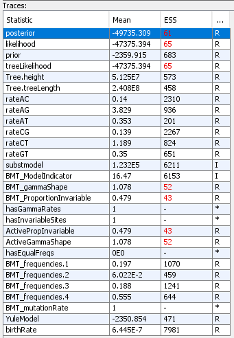
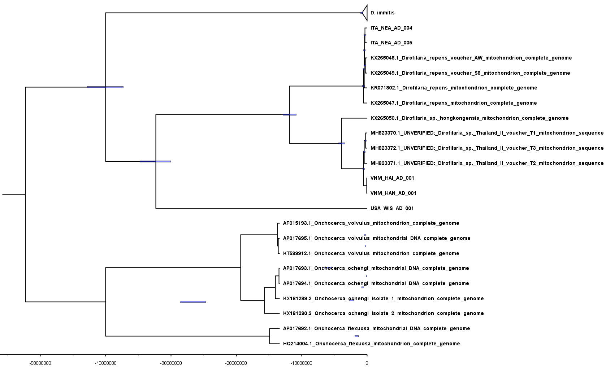
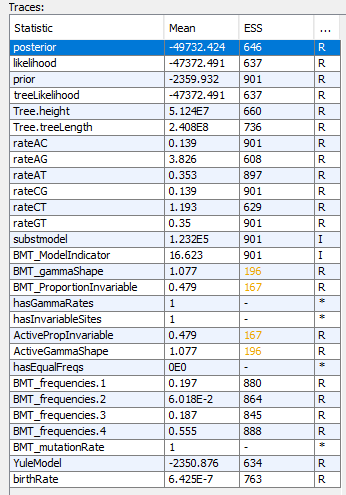
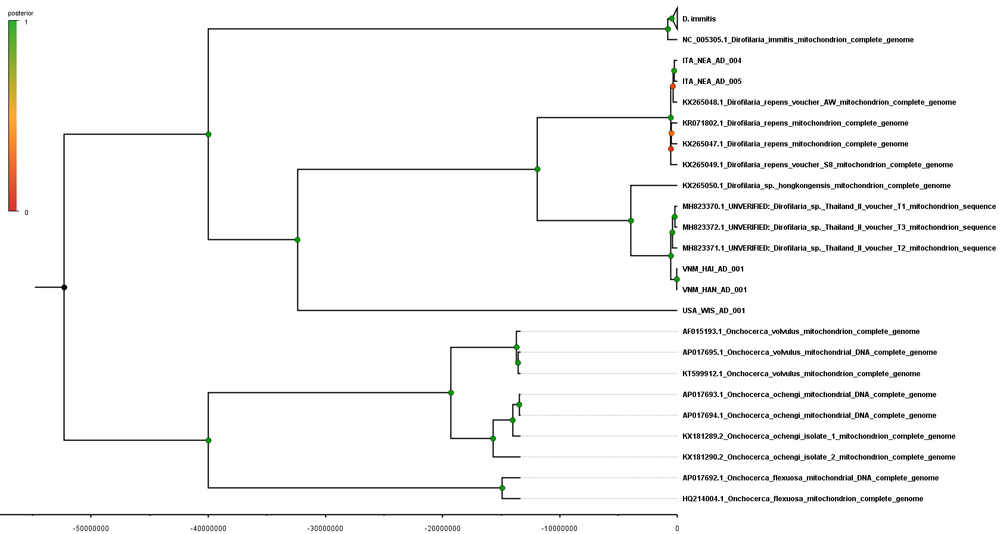
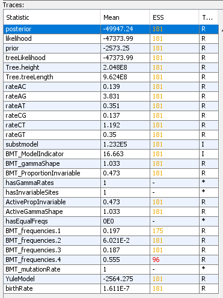
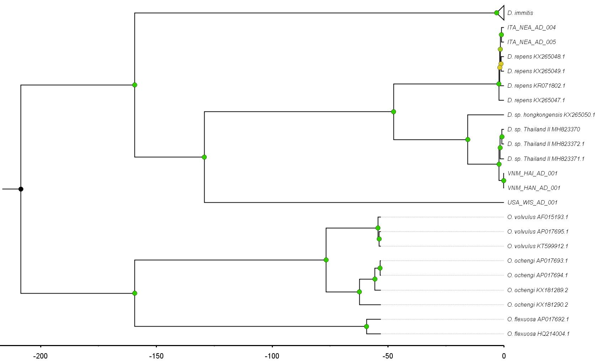

# BEAST2 on mitochondria

BEAST version 2.7.7

Denver 2004 paper: https://doi.org/10.1038/nature02697
- mutation rate estimate of 2.1 × 10-8 mutations per site per generation (standard error of the mean, s.e.m. = ± 6.7 × 10-9)
-NUCLEAR rate

Denver 2009 paper: https://doi.org/10.1073/pnas.0904895106
- average base-substitution rate of 2.7 (±0.4) × 10−9 per site per generation
- NUCLEAR rate

Denver 2000 paper: https://doi.org/10.1126/science.289.5488.2342
- total mutation rate equal to 1.6 × 10−7 per site per generation (±3.1 × 10−8)
- MITO rate

More recent Konrad 2017 paper: https://doi.org/10.1093/molbev/msx051
- overall spontaneous mitochondrial mutation rate, μtotal, of 1.05 × 10−7 per site per generation (95% CI: 0.52 to 1.80 × 10−7).
- MITO rate

## BEAST RUN 1

- Sequences: Mito D. immitis & all outgroups (Dirofilaria & Oncho)
- Mutation rate: 1.6E-7 (upper 1.91E-7, lower 1.29E-7) (Denver 2000)
- Model: Yule
- Chain length 10000000, log every 1000



Some ESS values are below 200, need to run for more steps or alter parameters?




# BEAST RUN 2


- Sequences: Mito D. immitis & all outgroups (Dirofilaria & Oncho)
- Mutation rate: 1.6E-7 (upper 1.91E-7, lower 1.29E-7) (Denver 2000) -----> SLOW IT DOWN TO GENERATION = 1 YEAR
- C. elegans generation time is let's say ~ 1 week so D. immitis generation time of 1 year (52 weeks) is 52 times slower. So mutation rate would be 3.07E-9 (upper 3.67E-9, lower 2.48E-9)
- Model: Yule
- Chain length 10000000, log every 1000



ESS values really aren't great. Run for longer.



# BEAST RUN 3 (RUN 2 FOR LONGER)

- Sequences: Mito D. immitis & all outgroups (Dirofilaria & Oncho)
- Mutation rate: 1.6E-7 (upper 1.91E-7, lower 1.29E-7) (Denver 2000) -----> SLOW IT DOWN TO GENERATION = 1 YEAR
- C. elegans generation time is let's say ~ 1 week so D. immitis generation time of 1 year (52 weeks) is 52 times slower. So mutation rate would be 3.07E-9 (upper 3.67E-9, lower 2.48E-9)
- Model: Yule
- Chain length 50000000, log every 50000



Some ESS values are still below 200, but it's much better than the previous run. Note: this run took ~ 24h.



Tree looks similar to the previous run, but with better ESS values. This suggests D. immitis diverged from other Dirofilaria species ~ 40 million years ago, which aligns with the timeline of the origin of canids. D. immitis species have very short branch lengths, so mtDNA seems to suggest they diversified very recently.

# BEAST RUN 4

- Sequences: Mito D. immitis & all outgroups (Dirofilaria & Oncho)
- Mutation rate: 1.6E-7 (upper 1.91E-7, lower 1.29E-7) (Denver 2000) -----> SLOW IT DOWN TO GENERATION = 4 YEARS
- C. elegans generation time is let's say ~ 1 week so D. immitis generation time of 4 years (208 weeks) is 208 times slower. So mutation rate would be 7.692307692E-10 (upper 9.182692308E-10, lower 6.201923077E-10)
- Model: Yule
- So slightly longer chain length and less frequent logging - Chain length 100000000, log every 500000



ESS values are just below 200... may need to run again with altered parameters.



Now D. immitis divergence from other species is >150 mya.


# BEAST RUN 5

- Sequences: Mito D. immitis & all outgroups (Dirofilaria & Oncho)
- Strict clock
- Mutation rate: 1.6E-7 (upper 1.91E-7, lower 1.29E-7) (Denver 2000) -----> SLOW IT DOWN TO GENERATION = 1 YEAR
- C. elegans generation time is let's say ~ 1 week so D. immitis generation time of 1 year (52 weeks) is 52 times slower. So mutation rate would be 3.07E-9 (upper 3.67E-9, lower 2.48E-9)
- Model: Birth Death Model
- Chain length 100,000,000, log every 100,000


Was taking forever, try running on HPC instead.

```bash
module load beast/2.6.3-cpu-only

cd /lustre/scratch125/pam/teams/team333/rp24/DIRO/DATA/03_ANALYSIS/05_ANALYSIS/BEAST

bsub.py -q long 20 beast2 "beast -beagle -beagle_GPU mito_outgroups_yule_g1_LONGER2.xml"


 -R "select[mem>10000] rusage[mem=10000]" -M10000 -o beast2.o -e beast2.e -J beast2 -q normal beast -beagle -beagle_GPU mito_outgroups_yule_g1_LONGER2.xml


```