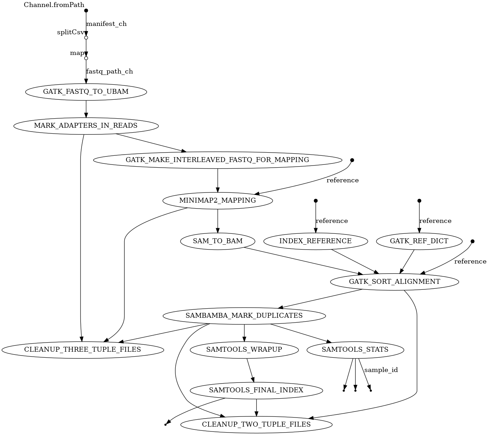

# Dirofilaria immitis WGS Lab Book - Batch4

### Rose Power USYD May 2024

## Download public data

module load bsub.py/0.42.1
bsub.py 10 public_data "../public_data.sh"

```bash
module load cellgen/sratoolkit/3.0.10
cd /lustre/scratch125/pam/teams/team333/rp24/DIRO/DATA/02_FASTQ

# Lau paper data: https://doi.org/10.1016/j.crpvbd.2021.100007
fastq-dump --split-files --origfmt --gzip SRR13154017
fastq-dump --split-files --origfmt --gzip SRR13154016
fastq-dump --split-files --origfmt --gzip SRR13154015
fastq-dump --split-files --origfmt --gzip SRR13154014
fastq-dump --split-files --origfmt --gzip SRR13154013

# Gandasegui paper data: https://doi.org/10.1016/j.ijpara.2023.07.006
# (Shin 2020)
wget -nc ftp://ftp.sra.ebi.ac.uk/vol1/fastq/SRR105/039/SRR10533239/SRR10533239_2.fastq.gz
wget -nc ftp://ftp.sra.ebi.ac.uk/vol1/fastq/SRR105/036/SRR10533236/SRR10533236_2.fastq.gz
wget -nc ftp://ftp.sra.ebi.ac.uk/vol1/fastq/SRR105/038/SRR10533238/SRR10533238_1.fastq.gz
wget -nc ftp://ftp.sra.ebi.ac.uk/vol1/fastq/SRR105/040/SRR10533240/SRR10533240_1.fastq.gz
wget -nc ftp://ftp.sra.ebi.ac.uk/vol1/fastq/SRR105/040/SRR10533240/SRR10533240_2.fastq.gz
wget -nc ftp://ftp.sra.ebi.ac.uk/vol1/fastq/SRR105/039/SRR10533239/SRR10533239_1.fastq.gz
wget -nc ftp://ftp.sra.ebi.ac.uk/vol1/fastq/SRR105/037/SRR10533237/SRR10533237_2.fastq.gz
wget -nc ftp://ftp.sra.ebi.ac.uk/vol1/fastq/SRR105/036/SRR10533236/SRR10533236_1.fastq.gz
wget -nc ftp://ftp.sra.ebi.ac.uk/vol1/fastq/SRR105/037/SRR10533237/SRR10533237_1.fastq.gz
wget -nc ftp://ftp.sra.ebi.ac.uk/vol1/fastq/SRR105/038/SRR10533238/SRR10533238_2.fastq.gz

# (Godel 2012)
wget -nc ftp://ftp.sra.ebi.ac.uk/vol1/fastq/ERR034/ERR034941/ERR034941_1.fastq.gz
wget -nc ftp://ftp.sra.ebi.ac.uk/vol1/fastq/ERR034/ERR034943/ERR034943_2.fastq.gz
wget -nc ftp://ftp.sra.ebi.ac.uk/vol1/fastq/ERR034/ERR034940/ERR034940_2.fastq.gz
wget -nc ftp://ftp.sra.ebi.ac.uk/vol1/fastq/ERR034/ERR034940/ERR034940_1.fastq.gz
wget -nc ftp://ftp.sra.ebi.ac.uk/vol1/fastq/ERR034/ERR034942/ERR034942_2.fastq.gz
wget -nc ftp://ftp.sra.ebi.ac.uk/vol1/fastq/ERR034/ERR034942/ERR034942_1.fastq.gz
wget -nc ftp://ftp.sra.ebi.ac.uk/vol1/fastq/ERR034/ERR034941/ERR034941_2.fastq.gz
wget -nc ftp://ftp.sra.ebi.ac.uk/vol1/fastq/ERR034/ERR034943/ERR034943_1.fastq.gz
```


## Organising my raw data

```bash
# copy data to my directory
cd /lustre/scratch125/pam/teams/team333/rp24/DIRO/DATA/02_FASTQ
cp -r /lustre/scratch125/pam/teams/team333/sd21/dirofilaria_immitis/POPGEN/NEWDATA_2024/* .
# leftover folder 
cp -r /lustre/scratch125/pam/teams/team333/sd21/dirofilaria_immitis/POPGEN/NEWDATA_2024/X201SC24023507-Z01-F001/ .

# check md5

# WGS_2
# 1GB
cd /lustre/scratch125/pam/teams/team333/rp24/DIRO/DATA/02_FASTQ/WGS_2/1GB/X201SC21061962-Z01-F002
md5sum -c MD5.txt # all ok
# 10 GB
cd /lustre/scratch125/pam/teams/team333/rp24/DIRO/DATA/02_FASTQ/WGS_2/10GB/X201SC21061962-Z01-F003/X201SC21061962-Z01-F003
md5sum -c MD5.txt # all ok

# WGS_3
# 1GB
cd /lustre/scratch125/pam/teams/team333/rp24/DIRO/DATA/02_FASTQ/WGS_3/1G/X201SC21061962-Z01-F004/X201SC21061962-Z01-F004
md5sum -c MD5.txt # all ok
# 10 GB
cd /lustre/scratch125/pam/teams/team333/rp24/DIRO/DATA/02_FASTQ/WGS_3/10G/X201SC21061962-Z01-F005/X201SC21061962-Z01-F005
md5sum -c MD5.txt # all ok

# WGS_4
# 1GB
cd /lustre/scratch125/pam/teams/team333/rp24/DIRO/DATA/02_FASTQ/WGS_4/1GB/X201SC21061962-Z01-F006/X201SC21061962-Z01-F006
md5sum -c MD5.txt # all ok
# 10GB
cd /lustre/scratch125/pam/teams/team333/rp24/DIRO/DATA/02_FASTQ/WGS_4/10GB/X201SC21061962-Z01-F007/X201SC21061962-Z01-F007
md5sum -c MD5.txt # all ok

# WGS_5
cd /lustre/scratch125/pam/teams/team333/rp24/DIRO/DATA/02_FASTQ/WGS_5/X201SC23061100-Z01-F002_01/X201SC23061100-Z01-F002_01
md5sum -c MD5.txt # all ok

# WGS_6
cd /lustre/scratch125/pam/teams/team333/rp24/DIRO/DATA/02_FASTQ/WGS_6/X201SC23103745-Z01-F001_01/X201SC23103745-Z01-F001_01
md5sum -c MD5.txt # all ok
# EXTRA_3
cd /lustre/scratch125/pam/teams/team333/rp24/DIRO/DATA/02_FASTQ/WGS_6/EXTRA_3/X201SC23103745-Z01-F002/X201SC23103745-Z01-F002
md5sum -c MD5.txt # all ok

# WGS_7
cd /lustre/scratch125/pam/teams/team333/rp24/DIRO/DATA/02_FASTQ/X201SC24023507-Z01-F001
md5sum -c MD5.txt # all ok
# MALAYSIA
cd /lustre/scratch125/pam/teams/team333/rp24/DIRO/DATA/02_FASTQ/WGS_7/MALAYSIA/X201SC24040556-Z01-F002
md5sum -c MD5.txt # all ok


# move files into 1 folder
cd /lustre/scratch125/pam/teams/team333/rp24/DIRO/DATA/02_FASTQ
find . -type f -name "*.fq.gz" -exec mv {} . \;

cd /lustre/scratch125/pam/teams/team333/rp24/DIRO/DATA/02_FASTQ/X201SC24023507-Z01-F001
find . -type f -name "*.fq.gz" -exec mv {} .. \;

# manually removed files not belonging to this project
```


## Merge fastq files for same samples

module load bsub.py/0.42.1
bsub.py 10 -q long merge_fastq "../merge_fastq.sh"

```bash
cd /lustre/scratch125/pam/teams/team333/rp24/DIRO/DATA/02_FASTQ/merged
RAW=/lustre/scratch125/pam/teams/team333/rp24/DIRO/DATA/02_FASTQ

# JS6277
zcat ${RAW}/JS6277_FSFP220054790-1r_HV3C5DSX2_L4_1.fq.gz ${RAW}/JS6277_FSFP220054790-1r_HWTNHDSX2_L1_1.fq.gz ${RAW}/JS6277_FSFP220054790-1r_HWTT7DSX2_L2_1.fq.gz | gzip > JS6277_1.fq.gz

zcat ${RAW}/JS6277_FSFP220054790-1r_HV3C5DSX2_L4_2.fq.gz ${RAW}/JS6277_FSFP220054790-1r_HWTNHDSX2_L1_2.fq.gz ${RAW}/JS6277_FSFP220054790-1r_HWTT7DSX2_L2_2.fq.gz | gzip > JS6277_2.fq.gz


# JS6278
zcat ${RAW}/JS6278_FSFP220054791-1r_HTY2GDSX2_L1_1.fq.gz ${RAW}/JS6278_FSFP220054791-1r_HWTNHDSX2_L1_1.fq.gz ${RAW}/JS6278_FSFP220054791-1r_HWTNJDSX2_L3_1.fq.gz | gzip > JS6278_1.fq.gz


zcat ${RAW}/JS6278_FSFP220054791-1r_HTY2GDSX2_L1_2.fq.gz ${RAW}/JS6278_FSFP220054791-1r_HWTNHDSX2_L1_2.fq.gz ${RAW}/JS6278_FSFP220054791-1r_HWTNJDSX2_L3_2.fq.gz | gzip > JS6278_2.fq.gz


# JS6279
zcat ${RAW}/JS6279_FSFP220054792-1r_HTY2GDSX2_L1_1.fq.gz ${RAW}/JS6279_FSFP220054792-1r_HWTNHDSX2_L1_1.fq.gz ${RAW}/JS6279_FSFP220054792-1r_HWTT7DSX2_L2_1.fq.gz | gzip > JS6279_1.fq.gz

zcat ${RAW}/JS6279_FSFP220054792-1r_HTY2GDSX2_L1_2.fq.gz ${RAW}/JS6279_FSFP220054792-1r_HWTNHDSX2_L1_2.fq.gz ${RAW}/JS6279_FSFP220054792-1r_HWTT7DSX2_L2_2.fq.gz | gzip > JS6279_2.fq.gz


# JS6280
zcat ${RAW}/JS6280_FSFP220054793-1r_H22KNDSX3_L2_1.fq.gz ${RAW}/JS6280_FSFP220054793-1r_HTY2GDSX2_L1_1.fq.gz ${RAW}/JS6280_FSFP220054793-1r_HWTNHDSX2_L1_1.fq.gz ${RAW}/JS6280_FSFP220054793-1r_HWTNJDSX2_L3_1.fq.gz | gzip > JS6280_1.fq.gz

zcat ${RAW}/JS6280_FSFP220054793-1r_H22KNDSX3_L2_2.fq.gz ${RAW}/JS6280_FSFP220054793-1r_HTY2GDSX2_L1_2.fq.gz ${RAW}/JS6280_FSFP220054793-1r_HWTNHDSX2_L1_2.fq.gz ${RAW}/JS6280_FSFP220054793-1r_HWTNJDSX2_L3_2.fq.gz | gzip > JS6280_2.fq.gz


# JS6281
zcat ${RAW}/JS6281_FSFP220054794-1r_HTY2GDSX2_L1_1.fq.gz ${RAW}/JS6281_FSFP220054794-1r_HWTNHDSX2_L1_1.fq.gz ${RAW}/JS6281_FSFP220054794-1r_HWTT7DSX2_L2_1.fq.gz | gzip > JS6281_1.fq.gz

zcat ${RAW}/JS6281_FSFP220054794-1r_HTY2GDSX2_L1_2.fq.gz ${RAW}/JS6281_FSFP220054794-1r_HWTNHDSX2_L1_2.fq.gz ${RAW}/JS6281_FSFP220054794-1r_HWTT7DSX2_L2_2.fq.gz | gzip > JS6281_2.fq.gz


# JS6342
zcat ${RAW}/JS6342_DKDN220004094-1A_HKNF7DSX3_L1_1.fq.gz ${RAW}/JS6342_DKDN220004094-1A_HKNFLDSX3_L1_1.fq.gz ${RAW}/JS6342_DSFP220004094-1a_HLGLMDSX3_L1_1.fq.gz ${RAW}/JS6342_DSFP220004094-1a_HLGNNDSX3_L1_1.fq.gz | gzip > JS6342_1.fq.gz

zcat ${RAW}/JS6342_DKDN220004094-1A_HKNF7DSX3_L1_2.fq.gz ${RAW}/JS6342_DKDN220004094-1A_HKNFLDSX3_L1_2.fq.gz ${RAW}/JS6342_DSFP220004094-1a_HLGLMDSX3_L1_2.fq.gz ${RAW}/JS6342_DSFP220004094-1a_HLGNNDSX3_L1_2.fq.gz | gzip > JS6342_2.fq.gz


# JS6343
zcat ${RAW}/JS6343_DKDN220004095-1A_HJTWTDSX3_L1_1.fq.gz ${RAW}/JS6343_DKDN220004095-1A_HKNF7DSX3_L3_1.fq.gz ${RAW}/JS6343_DSFP220004095-1a_HJJFMDSX3_L2_1.fq.gz | gzip > JS6343_1.fq.gz

zcat ${RAW}/JS6343_DKDN220004095-1A_HJTWTDSX3_L1_2.fq.gz ${RAW}/JS6343_DKDN220004095-1A_HKNF7DSX3_L3_2.fq.gz ${RAW}/JS6343_DSFP220004095-1a_HJJFMDSX3_L2_2.fq.gz | gzip > JS6343_2.fq.gz


# JS6344
zcat ${RAW}/JS6344_DKDN220004096-1A_HJTWTDSX3_L2_1.fq.gz ${RAW}/JS6344_DKDN220004096-1A_HKNF7DSX3_L1_1.fq.gz ${RAW}/JS6344_DSFP220004096-1a_HJJFMDSX3_L2_1.fq.gz | gzip > JS6344_1.fq.gz

zcat ${RAW}/JS6344_DKDN220004096-1A_HJTWTDSX3_L2_2.fq.gz ${RAW}/JS6344_DKDN220004096-1A_HKNF7DSX3_L1_2.fq.gz ${RAW}/JS6344_DSFP220004096-1a_HJJFMDSX3_L2_2.fq.gz | gzip > JS6344_2.fq.gz


# JS6345
zcat ${RAW}/JS6345_DKDN220004097-1A_HKNF7DSX3_L1_1.fq.gz ${RAW}/JS6345_DSFP220004097-1a_HJJFMDSX3_L2_1.fq.gz | gzip > JS6345_1.fq.gz

zcat ${RAW}/JS6345_DKDN220004097-1A_HKNF7DSX3_L1_2.fq.gz ${RAW}/JS6345_DSFP220004097-1a_HJJFMDSX3_L2_2.fq.gz | gzip > JS6345_2.fq.gz


# JS6347
zcat ${RAW}/JS6347_DKDN220004099-1A_HKNF7DSX3_L1_1.fq.gz ${RAW}/JS6347_DSFP220004099-1a_HJJFMDSX3_L2_1.fq.gz | gzip > JS6347_1.fq.gz

zcat ${RAW}/JS6347_DKDN220004099-1A_HKNF7DSX3_L1_2.fq.gz ${RAW}/JS6347_DSFP220004099-1a_HJJFMDSX3_L2_2.fq.gz | gzip > JS6347_2.fq.gz


# JS6349
zcat ${RAW}/JS6349_DKDN220004101-1A_HKNF7DSX3_L2_1.fq.gz ${RAW}/JS6349_DSFP220004101-1a_HJJFMDSX3_L2_1.fq.gz | gzip > JS6349_1.fq.gz

zcat ${RAW}/JS6349_DKDN220004101-1A_HKNF7DSX3_L2_2.fq.gz ${RAW}/JS6349_DSFP220004101-1a_HJJFMDSX3_L2_2.fq.gz | gzip > JS6349_2.fq.gz


#JS6350
zcat ${RAW}/JS6350_DKDN220004102-1A_HKNF7DSX3_L1_1.fq.gz ${RAW}/JS6350_DSFP220004102-1a_HJJFMDSX3_L2_1.fq.gz | gzip > JS6350_1.fq.gz

zcat ${RAW}/JS6350_DKDN220004102-1A_HKNF7DSX3_L1_2.fq.gz ${RAW}/JS6350_DSFP220004102-1a_HJJFMDSX3_L2_2.fq.gz | gzip > JS6350_2.fq.gz


# JS6351
zcat ${RAW}/JS6351_DKDN220004103-1A_HKNF7DSX3_L1_1.fq.gz ${RAW}/JS6351_DSFP220004103-1a_HJJFMDSX3_L2_1.fq.gz | gzip > JS6351_1.fq.gz

zcat ${RAW}/JS6351_DKDN220004103-1A_HKNF7DSX3_L1_2.fq.gz ${RAW}/JS6351_DSFP220004103-1a_HJJFMDSX3_L2_2.fq.gz | gzip > JS6351_2.fq.gz


# JS6352
zcat ${RAW}/JS6352_DKDN220004104-1A_HJTWTDSX3_L1_1.fq.gz ${RAW}/JS6352_DKDN220004104-1A_HKNF7DSX3_L1_1.fq.gz ${RAW}/JS6352_DSFP220004104-1a_HJJFMDSX3_L2_1.fq.gz | gzip > JS6352_1.fq.gz

zcat ${RAW}/JS6352_DKDN220004104-1A_HJTWTDSX3_L1_2.fq.gz ${RAW}/JS6352_DKDN220004104-1A_HKNF7DSX3_L1_2.fq.gz ${RAW}/JS6352_DSFP220004104-1a_HJJFMDSX3_L2_2.fq.gz | gzip > JS6352_2.fq.gz


# JS6353
zcat ${RAW}/JS6353_DKDN220004105-1A_HJTWTDSX3_L1_1.fq.gz ${RAW}/JS6353_DKDN220004105-1A_HKNF7DSX3_L1_1.fq.gz ${RAW}/JS6353_DSFP220004105-1a_HJJFMDSX3_L2_1.fq.gz | gzip > JS6353_1.fq.gz

zcat ${RAW}/JS6353_DKDN220004105-1A_HJTWTDSX3_L1_2.fq.gz ${RAW}/JS6353_DKDN220004105-1A_HKNF7DSX3_L1_2.fq.gz ${RAW}/JS6353_DSFP220004105-1a_HJJFMDSX3_L2_2.fq.gz | gzip > JS6353_2.fq.gz


# JS6354
zcat ${RAW}/JS6354_DKDN220004106-1A_HJTWTDSX3_L1_1.fq.gz ${RAW}/JS6354_DKDN220004106-1A_HKNF7DSX3_L2_1.fq.gz ${RAW}/JS6354_DSFP220004106-1a_HJJFMDSX3_L2_1.fq.gz | gzip > JS6354_1.fq.gz

zcat ${RAW}/JS6354_DKDN220004106-1A_HJTWTDSX3_L1_2.fq.gz ${RAW}/JS6354_DKDN220004106-1A_HKNF7DSX3_L2_2.fq.gz ${RAW}/JS6354_DSFP220004106-1a_HJJFMDSX3_L2_2.fq.gz | gzip > JS6354_2.fq.gz


# JS6355
zcat ${RAW}/JS6355_DKDN220004107-1A_HKNF7DSX3_L3_1.fq.gz ${RAW}/JS6355_DSFP220004107-1a_HJJFMDSX3_L2_1.fq.gz | gzip > JS6355_1.fq.gz

zcat ${RAW}/JS6355_DKDN220004107-1A_HKNF7DSX3_L3_2.fq.gz ${RAW}/JS6355_DSFP220004107-1a_HJJFMDSX3_L2_2.fq.gz | gzip > JS6355_2.fq.gz


# JS6356
zcat ${RAW}/JS6356_DKDN220004108-1A_HJTWTDSX3_L1_1.fq.gz ${RAW}/JS6356_DKDN220004108-1A_HKNF7DSX3_L1_1.fq.gz ${RAW}/JS6356_DSFP220004108-1a_HJJFMDSX3_L2_1.fq.gz | gzip > JS6356_1.fq.gz

zcat ${RAW}/JS6356_DKDN220004108-1A_HJTWTDSX3_L1_2.fq.gz ${RAW}/JS6356_DKDN220004108-1A_HKNF7DSX3_L1_2.fq.gz ${RAW}/JS6356_DSFP220004108-1a_HJJFMDSX3_L2_2.fq.gz | gzip > JS6356_2.fq.gz


# JS6357
zcat ${RAW}/JS6357_DKDN220004109-1A_HKNF7DSX3_L1_1.fq.gz ${RAW}/JS6357_DSFP220004109-1a_HJJFMDSX3_L2_1.fq.gz | gzip > JS6357_1.fq.gz

zcat ${RAW}/JS6357_DKDN220004109-1A_HKNF7DSX3_L1_2.fq.gz ${RAW}/JS6357_DSFP220004109-1a_HJJFMDSX3_L2_2.fq.gz | gzip > JS6357_2.fq.gz


# JS6358
zcat ${RAW}/JS6358_DKDN220004110-1A_HKNF7DSX3_L1_1.fq.gz ${RAW}/JS6358_DSFP220004110-1a_HJJFMDSX3_L2_1.fq.gz | gzip > JS6358_1.fq.gz

zcat ${RAW}/JS6358_DKDN220004110-1A_HKNF7DSX3_L1_2.fq.gz ${RAW}/JS6358_DSFP220004110-1a_HJJFMDSX3_L2_2.fq.gz | gzip > JS6358_2.fq.gz


# JS6360
zcat ${RAW}/JS6360_DKDN220004112-1A_HKNF7DSX3_L1_1.fq.gz ${RAW}/JS6360_DSFP220004112-1a_HLGNNDSX3_L1_1.fq.gz | gzip > JS6360_1.fq.gz

zcat ${RAW}/JS6360_DKDN220004112-1A_HKNF7DSX3_L1_2.fq.gz ${RAW}/JS6360_DSFP220004112-1a_HLGNNDSX3_L1_2.fq.gz | gzip > JS6360_2.fq.gz


# JS6368
zcat ${RAW}/JS6368_DKDN220008346-1A_HKWGTDSX3_L3_1.fq.gz ${RAW}/JS6368_DKDN220008346-1A_HVJMNDSX3_L1_1.fq.gz | gzip > JS6368_1.fq.gz

zcat ${RAW}/JS6368_DKDN220008346-1A_HKWGTDSX3_L3_2.fq.gz ${RAW}/JS6368_DKDN220008346-1A_HVJMNDSX3_L1_2.fq.gz | gzip > JS6368_2.fq.gz


# JS6369
zcat ${RAW}/JS6369_DKDN220008347-1A_HKWGTDSX3_L3_1.fq.gz ${RAW}/JS6369_DKDN220008347-1A_HVJMNDSX3_L1_1.fq.gz | gzip > JS6369_1.fq.gz

zcat ${RAW}/JS6369_DKDN220008347-1A_HKWGTDSX3_L3_2.fq.gz ${RAW}/JS6369_DKDN220008347-1A_HVJMNDSX3_L1_2.fq.gz | gzip > JS6369_2.fq.gz


# JS6370
zcat ${RAW}/JS6370_DKDN220008348-1A_HKWGTDSX3_L3_1.fq.gz ${RAW}/JS6370_DKDN220008348-1A_HVJMNDSX3_L1_1.fq.gz | gzip > JS6370_1.fq.gz

zcat ${RAW}/JS6370_DKDN220008348-1A_HKWGTDSX3_L3_2.fq.gz ${RAW}/JS6370_DKDN220008348-1A_HVJMNDSX3_L1_2.fq.gz | gzip > JS6370_2.fq.gz
```

There are some extra samples to merge before proceeding with analysis:
bsub.py 1 merge_fastq2 "../merge_fastq2.sh"

```bash
cd /lustre/scratch125/pam/teams/team333/rp24/DIRO/DATA/02_FASTQ/merged
RAW=/lustre/scratch125/pam/teams/team333/rp24/DIRO/DATA/02_FASTQ

# JS6648
zcat ${RAW}/JS6648_DKDN230043077-1A_H7MFFDSX7_L1_1.fq.gz ${RAW}/JS6648_DKDN230043077-1A_HC2NMDSX7_L2_1.fq.gz | gzip > JS6648_1.fq.gz
zcat ${RAW}/JS6648_DKDN230043077-1A_H7MFFDSX7_L1_2.fq.gz ${RAW}/JS6648_DKDN230043077-1A_HC2NMDSX7_L2_2.fq.gz | gzip > JS6648_2.fq.gz

# JS6656
zcat ${RAW}/JS6656_DKDN230043085-1A_H7MFFDSX7_L1_1.fq.gz ${RAW}/JS6656_DKDN230043085-1A_HC2NMDSX7_L2_1.fq.gz | gzip > JS6656_1.fq.gz
zcat ${RAW}/JS6656_DKDN230043085-1A_H7MFFDSX7_L1_2.fq.gz ${RAW}/JS6656_DKDN230043085-1A_HC2NMDSX7_L2_2.fq.gz | gzip > JS6656_2.fq.gz

# JS6657
zcat ${RAW}/JS6657_DKDN230043086-1A_H7MFFDSX7_L1_1.fq.gz ${RAW}/JS6657_DKDN230043086-1A_HC2NMDSX7_L2_1.fq.gz | gzip > JS6657_1.fq.gz
zcat ${RAW}/JS6657_DKDN230043086-1A_H7MFFDSX7_L1_2.fq.gz ${RAW}/JS6657_DKDN230043086-1A_HC2NMDSX7_L2_2.fq.gz | gzip > JS6657_2.fq.gz

# JS6659
zcat ${RAW}/JS6659_DKDN230043088-1A_H7WVCDSX7_L1_1.fq.gz ${RAW}/JS6659_DKDN230043088-1A_H7MFFDSX7_L2_1.fq.gz | gzip > JS6659_1.fq.gz
zcat ${RAW}/JS6659_DKDN230043088-1A_H7WVCDSX7_L1_2.fq.gz ${RAW}/JS6659_DKDN230043088-1A_H7MFFDSX7_L2_2.fq.gz  | gzip > JS6659_2.fq.gz
```


### Check that files merged correctly

Check that we have the same number of reads before & after merging (count number of lines). Collect stats into Excel sheet.

**Forward reads**

```bash
cd /lustre/scratch125/pam/teams/team333/rp24/DIRO/DATA/02_FASTQ
mkdir RAW_MULTIPLE
# manually moved all samples with multiple fastq files into this folder
mkdir COUNT

# Count Forward reads
cd RAW_MULTIPLE

# Raw data files
for f in *_1.fq.gz; do echo $f;zcat $f|wc -l ; done > ../COUNT/count_raw_1.txt

cd ../COUNT

# Every 2nd line moved to new column
sed 'N;s/\n/ /g' count_raw_1.txt | column -t > raw_1.txt

# Get list of unique sample names. Make sample list file.
awk '{print $1}' OFS="\t" raw_1.txt | cut -c1-6 | uniq > samples_1.txt

# Finds all files for each individual sample. Saves to new file for each sample.
for f in $(cat samples_1.txt); do
grep $f raw_1.txt > ${f}_raw_1.txt
done

# prints sample ID and total at the bottom. Extract last line.
for f in JS*_raw_1.txt; do awk '{sum+=$2;print $1" "$2} END {print "'$f'", sum}' $f | tail -1 > total_$f; done

# combine files
cat total_JS*_raw_1.txt > total_raw_1.txt

# remove files I don't need anymore
rm *JS*.txt


# Merged data files
cd ../merged

# Forward reads
for f in *_1.fq.gz; do echo $f;zcat $f|wc -l ; done > ../COUNT/count_merged_1.txt

cd ../COUNT

# Every 2nd line moved to new column
sed 'N;s/\n/ /g' count_merged_1.txt | column -t > merged_1.txt


# Join the raw & merged stats for FORWARD reads
paste total_raw_1.txt merged_1.txt | column -s $'\t' -t > total_both_1.txt

# Make txt file into csv file
mv total_both_1.txt total_both_1.csv
```


**Reverse reads**

```bash
# Count Reverse reads
cd ../RAW_MULTIPLE

# Raw data files
for f in *_2.fq.gz; do echo $f;zcat $f|wc -l ; done > ../COUNT/count_raw_2.txt

cd ../COUNT

# Every 2nd line moved to new column
sed 'N;s/\n/ /g' count_raw_2.txt | column -t > raw_2.txt

# Get list of unique sample name. Make sample list file.
awk '{print $1}' OFS="\t" raw_2.txt | cut -c1-6 | uniq > samples_2.txt

# Finds all files for each individual sample. Saves to new file for each sample.
for f in $(cat samples_2.txt); do
grep $f raw_2.txt > ${f}_raw_2.txt
done

# prints sample ID and total at the bottom. Extract last line.
for f in JS*_raw_2.txt; do awk '{sum+=$2;print $1" "$2} END {print "'$f'", sum}' $f | tail -1 > total_$f; done

# combine files
cat total_JS*_raw_2.txt > total_raw_2.txt

# remove files I don't need anymore
rm *JS*.txt


# Merged data files
cd ../merged

# Forward reads
for f in *_2.fq.gz; do echo $f;zcat $f|wc -l ; done > ../COUNT/count_merged_2.txt

cd ../COUNT

# Every 2nd line moved to new column
sed 'N;s/\n/ /g' count_merged_2.txt | column -t > merged_2.txt


# Join the raw & merged stats for FORWARD reads
paste total_raw_2.txt merged_2.txt | column -s $'\t' -t > total_both_2.txt

# Make txt file into csv file
mv total_both_2.txt total_both_2.csv

# moved merged fastq files into directory with all the other fastq.
```
Now we have 2 excel files: 1. Raw vs merged FORWARD reads and 2. Raw vs merged REVERSE reads. Compare the total numbers and ensure that they match up so we didn't lose any data in the merging process.

After inspecting the tables, everything matches up. We have the same number of lines in the raw and merged fastq files. We can continue with the analysis using the merged files.


## FastQC


We want to get some stats on the raw data.

```bash
# set variables
WORKING_DIR=/lustre/scratch125/pam/teams/team333/rp24/DIRO/DATA
OUT_DIR=${WORKING_DIR}/03_ANALYSIS/01_PREP/FASTQC/RAW
cd ${OUT_DIR}
# make a list of the files
for file in ${WORKING_DIR}/02_FASTQ/*.gz; do
  basename ${file}
done > ${OUT_DIR}/fastq.list
FASTQ_LIST=${OUT_DIR}/fastq.list

# load modules
module load fastqc/0.12.1--hdfd78af_0
module load bsub.py/0.42.1

# set up run files
n=1
while read SAMPLE; do
echo -e "fastqc -t 1 -o ${OUT_DIR} ${WORKING_DIR}/02_FASTQ/${SAMPLE}" > run_fastqc_raw_${SAMPLE}.tmp.job_${n};
let "n+=1";
done < ${FASTQ_LIST}

chmod a+x run_fastqc_raw*

#run
for i in run_fastqc_raw*; do
    bsub.py --threads 1 4 ${i} "./${i}";
done

# clean up
mkdir LOGS
mv run_fastqc_raw_*.e run_fastqc_raw_*.o LOGS
rm run_fastqc_raw_*

# check for any errors
cd LOGS
grep -i "Exited" *.o
grep -i "Successfully completed" *.o | wc -l
grep -i "Error" *.e
# All ok

# multiqc
# Load module
module load multiqc/1.17--pyhdfd78af_1
module load bsub.py/0.42.1
bsub.py 4 multiqc_raw "multiqc ${OUT_DIR} -o ${OUT_DIR}"
```


## Trimmomatic

```bash
# set variables
WORKING_DIR=/lustre/scratch125/pam/teams/team333/rp24/DIRO/DATA
IN_DIR=${WORKING_DIR}/02_FASTQ
cd ${WORKING_DIR}/03_ANALYSIS/01_PREP
mkdir TRIMMOMATIC
cd TRIMMOMATIC
OUT_DIR=${WORKING_DIR}/03_ANALYSIS/01_PREP/TRIMMOMATIC

# load modules
module load trimmomatic/0.39--1

# make a list of sample names
for file in ${WORKING_DIR}/02_FASTQ/*_1.f*q.gz; do
  basename ${file}
done > ${OUT_DIR}/samples.list

# set up run files
n=1
while read LONG_SAMPLE_1; do
LONG_SAMPLE_2=${LONG_SAMPLE_1/_1./_2.} # full file name
SHORT_SAMPLE=$(basename "$LONG_SAMPLE_1" | cut -d'_' -f1) # sample name only

JOB_FILE="run_trimmomatic_${SHORT_SAMPLE}.tmp.job_${n}"

echo -e "trimmomatic PE \
-threads 1 \
-phred33 \
${IN_DIR}/${LONG_SAMPLE_1} \
${IN_DIR}/${LONG_SAMPLE_2} \
${OUT_DIR}/${SHORT_SAMPLE}_1_trimpaired.fq.gz ${OUT_DIR}/${SHORT_SAMPLE}_1_trimunpaired.fq.gz \
${OUT_DIR}/${SHORT_SAMPLE}_2_trimpaired.fq.gz ${OUT_DIR}/${SHORT_SAMPLE}_2_trimunpaired.fq.gz \
SLIDINGWINDOW:10:20 MINLEN:50" > ${JOB_FILE};
let "n+=1";
done < samples.list

chmod a+x run_trimmomatic*

#run
for i in run_trimmomatic*; do
    bsub.py --threads 1 20 ${i} "./${i}";
done


# SLIDINGWINDOW:10:20 means it will scan the read with a 10-base wide sliding window, cutting when the average quality per base drops below 20.

# Instead of SLIDINGWINDOW, in my previous practice code I used 'AVGQUAL:30 MINLEN:150'.

# clean up
mkdir LOGS
mv run_trimmomatic_*.e run_trimmomatic_*.o LOGS
rm run_trimmomatic_*

# check for any errors
cd LOGS
grep -i "Exited" *.o
grep -i "Successfully completed." *.o | wc -l
grep -i "error" *.e
# no errors
```


## FastQC after trimming

Check to see how the data looks after trimming.

```bash
# set variables
WORKING_DIR=/lustre/scratch125/pam/teams/team333/rp24/DIRO/DATA
cd ${WORKING_DIR}/03_ANALYSIS/01_PREP/FASTQC
mkdir TRIMMED
cd TRIMMED
OUT_DIR=${WORKING_DIR}/03_ANALYSIS/01_PREP/FASTQC/TRIMMED
IN_DIR=${WORKING_DIR}/03_ANALYSIS/01_PREP/TRIMMOMATIC

# make a list of the files
for file in ${IN_DIR}/*trimpaired.fq.gz; do
  basename ${file}
done > ${OUT_DIR}/fastq.list
FASTQ_LIST=${OUT_DIR}/fastq.list

# load modules
module load bsub.py/0.42.1
module load fastqc/0.12.1--hdfd78af_0

# set up run files
n=1
while read SAMPLE; do
echo -e "fastqc -t 1 -o ${OUT_DIR} ${IN_DIR}/${SAMPLE}" > run_fastqc_trimmed_${SAMPLE}.tmp.job_${n};
let "n+=1";
done < ${FASTQ_LIST}

chmod a+x run_fastqc_trimmed*

#run
for i in run_fastqc_trimmed*; do
    bsub.py --threads 1 4 ${i} "./${i}";
done

# clean up
mkdir LOGS
mv run_fastqc_trimmed_*.e run_fastqc_trimmed_*.o LOGS
rm run_fastqc_trimmed_*

# check for any errors
cd LOGS
grep -i "Exited" *.o
grep -i "error" *.e

# multiqc
# Load module
module load multiqc/1.17--pyhdfd78af_1
module load bsub.py/0.42.1
multiqc ${OUT_DIR} -o ${OUT_DIR}
```

## Prep reference genome

We want to map the reads to 3 different genomes:
- Nuclear & mitochondrial D. immitis
- D. immitis-associated Wolbachia endosymbiont
- Domestic dog *Canis lupus familiaris* (GenBank accession: GCA_014441545) # This is the one used in: https://doi.org/10.1016/j.ijpara.2023.07.006 

```bash
cd ${WORKING_DIR}/01_REF

# Load modules
module load bwa/0.7.17-r1188

# Download dimmitis_WSI_2.2 genome (contains nuclear, mitochondrial and Wolbachia genomes of D. immitis)
wget ftp://ngs.sanger.ac.uk/production/pathogens/sd21/dimmitis_genome/dimmitis_WSI_2.2.fa

# Download dog genome (GenBank accession: GCA_014441545)
wget ftp://ftp.ncbi.nlm.nih.gov/genomes/all/GCF/014/441/545/GCF_014441545.1_ROS_Cfam_1.0/GCF_014441545.1_ROS_Cfam_1.0_genomic.fna.gz
# check md5
if [ "$(md5sum GCF_014441545.1_ROS_Cfam_1.0_genomic.fna.gz | awk '{ print $1 }')" == "f12c773440593411b2ad1378e1b2905b" ]; then echo "MD5 checksum matches."; else echo "MD5 checksum does not match."; fi
## MD5 checksum matches.
# unzip
gunzip GCF_014441545.1_ROS_Cfam_1.0_genomic.fna.gz

# Combine reference genomes
cat dimmitis_WSI_2.2.fa GCF_014441545.1_ROS_Cfam_1.0_genomic.fna > reference_di_wol_dog.fa

# index reference genome
bsub.py 4 reference_index "bwa index reference_di_wol_dog.fa"
```


### Map trimmed reads to combined D. immitis & Wol & dog genome

- cat the 2 references together
- map reads to the combined reference
- samtools to pull out DI scaffolds I want
- do stats before filtering, so I can see how many were mapped, then how many after filtering etc. Do before samtools view -q 15.


## Map trimmed reads to combined D. immitis/Wol/dog genome

### Looping method

The below method is fine, but it submits separate jobs for each sample. There will be many pending jobs, which may take some time.

```bash
# set variables
WORKING_DIR=/lustre/scratch125/pam/teams/team333/rp24/DIRO/DATA
REF=${WORKING_DIR}/01_REF/reference_di_wol_dog.fa
IN_DIR=${WORKING_DIR}/03_ANALYSIS/01_PREP/TRIMMOMATIC
OUT_DIR=${WORKING_DIR}/03_ANALYSIS/02_MAP/bwa-mem

cd ${OUT_DIR}

# make a list of the sample names
for file in ${IN_DIR}/*.fq.gz; do
  basename ${file} | cut -d'_' -f1
done | sort | uniq > ${OUT_DIR}/samples.list
SAMPLE_LIST=${OUT_DIR}/samples.list

# Load modules
module load bwa/0.7.17-r1188

# set up run files
n=1
while read SAMPLE; do
echo "bwa mem ${REF} \
-t 2 \
-R '@RG\tID:${SAMPLE}\tSM:${SAMPLE}' \
${IN_DIR}/${SAMPLE}_1_trimpaired.fq.gz \
${IN_DIR}/${SAMPLE}_2_trimpaired.fq.gz \
> ${OUT_DIR}/${SAMPLE}.tmp.sam" > run_mapping_${SAMPLE}.tmp.job_${n};
let "n+=1";
done < ${SAMPLE_LIST}

chmod a+x run_mapping_*

#run
for i in run_mapping_*; do
    bsub.py --threads 2 20 ${i} "./${i}";
done
```

### Nextflow pipeline - quicker

Alternatively, I can try using Steve's new Nextflow mapping pipeline which is pretty quick. It will run many samples at a time.

- It requires a manifest: a comma delimited file containing sample name, path to read 1, and path to read 2.
- Example manifest can be found at: /nfs/users/nfs_s/sd21/lustre_link/haemonchus_contortus/EPRINOMECTIN/MAPPING_WGS/eprinomectin_wgs.mapping.manifest
- Uses minimap2 as a mapper and GATK/Samtools/Sambamba for further processing.
- Help with the module can be found at: https://ssg-confluence.internal.sanger.ac.uk/display/PaMI/mapping-helminth (internal website)



#### Test using 1 sample

```bash
# Load modules
module load bsub.py/0.42.1
module load mapping-helminth/v1.0.9

# Set variables
WORKING_DIR=/lustre/scratch125/pam/teams/team333/rp24/DIRO/DATA
REF= ${WORKING_DIR}/01_REF/reference_di_wol_dog.fa
IN_DIR=${WORKING_DIR}/03_ANALYSIS/02_MAP/test

cd ${IN_DIR}

# Run pipeline
bsub.py 4 mapping_test "mapping-helminth --input ${IN_DIR}/test_wgs.mapping.manifest --reference ${REF}"
```

#### Run for all samples

```bash
# Load modules
module load bsub.py/0.42.1
module load mapping-helminth/v1.0.9

# Set variables
WORKING_DIR=/lustre/scratch125/pam/teams/team333/rp24/DIRO/DATA
REF=${WORKING_DIR}/01_REF/reference_di_wol_dog.fa
IN_DIR=${WORKING_DIR}/03_ANALYSIS/01_PREP/TRIMMOMATIC
OUT_DIR=${WORKING_DIR}/03_ANALYSIS/02_MAP

cd ${OUT_DIR}

# Get sample list
for file in ${IN_DIR}/*.fq.gz; do
  basename ${file} | cut -d'_' -f1
done | sort | uniq > ${OUT_DIR}/samples.list
SAMPLE_LIST=${OUT_DIR}/samples.list

# Prep manifest
echo "ID,R1,R2" > wgs.mapping.manifest
while read SAMPLE; do
echo "${SAMPLE},${IN_DIR}/${SAMPLE}_1_trimpaired.fq.gz,${IN_DIR}/${SAMPLE}_2_trimpaired.fq.gz" >> wgs.mapping.manifest;
done < ${SAMPLE_LIST}

# Run pipeline
bsub.py --threads 20 20 mapping "mapping-helminth --input ${IN_DIR}/wgs.mapping.manifest --reference ${REF}"
```

## Extract reads that mapped to the *D. immitis* genome

If I mapped to the *D. immitis* and dog genomes separately, there could be reads that mapped to both genomes. To avoid this, I mapped to the combined D. immitis/dog genome. I can now extract the reads that mapped to only the *D. immitis* genome and use this for downstream analyses.


```bash
WORKING_DIR=/lustre/scratch125/pam/teams/team333/rp24/DIRO/DATA
OUT_DIR=${WORKING_DIR}/03_ANALYSIS/02_MAP/EXTRACT
REF=${WORKING_DIR}/01_REF/dimmitis_WSI_2.2.fa
SAMPLE_LIST=${WORKING_DIR}/03_ANALYSIS/02_MAP/samples.list

# Set working directory
cd ${WORKING_DIR}/01_REF

# Load modules
module load samtools/1.14--hb421002_0

# Index the reference file (from Steve's paper) using samtools faidx
samtools faidx ${REF}

# Get the scaffolds/positions.
head ${REF}.fai
# Column 1 is the chromosome/scaffold, column 2 is how long it is, then there's some other info.

# Get chromosome, then start and end positions
awk '{print $1, "1", $2}' OFS="\t" ${REF}.fai | head

# Save this info as a bed file
awk '{print $1, "1", $2}' OFS="\t" ${REF}.fai > dimmitis_WSI_2.2.bed
BED=${WORKING_DIR}/01_REF/dimmitis_WSI_2.2.bed
# Now we have a nice bed file that has info telling us where things are


# Extract reads that only mapped to D. immitis.
cd /lustre/scratch125/pam/teams/team333/rp24/DIRO/DATA/03_ANALYSIS/02_MAP

n=1
while read SAMPLE; do
echo "samtools view --threads 4 --bam --with-header --target-file ${BED} /lustre/scratch125/pam/teams/team333/sd21/dirofilaria_immitis/POPGEN/NEWDATA_2024/results/${SAMPLE}/${SAMPLE}.bam > ${OUT_DIR}/${SAMPLE}_extract.bam" > run_extract_${SAMPLE}.tmp.job_${n};
let "n+=1";
done < ${SAMPLE_LIST}
# Should still be in sorted form
# -b flag makes sure the output is bam
# -h flag includes the header in SAM output

chmod a+x run_extract_*

#run
for i in run_extract_*; do
    bsub.py --threads 4 20 ${i} "./${i}";
done

mkdir LOGS
mv run_extract_*.e run_extract_*.o LOGS
rm run_extract_*

# check for any errors
cd LOGS
grep -i "Exited" *.o
grep -i "Successfully completed." *.o | wc -l
grep -i "error" *.e
# All ok


# I do not have to sort the bam file again, it should still be sorted.

## QC
# How many D. immitis reads were extracted?

bsub.py 4 extract_flagstat "../extract_flagstat.sh"

WORKING_DIR=/lustre/scratch125/pam/teams/team333/rp24/DIRO/DATA
OUT_DIR=${WORKING_DIR}/03_ANALYSIS/02_MAP/EXTRACT
SAMPLE_LIST=${WORKING_DIR}/03_ANALYSIS/02_MAP/samples.list

module load samtools/1.14--hb421002_0

while read SAMPLE; do
samtools flagstat ${OUT_DIR}/${SAMPLE}_extract.bam > ${OUT_DIR}/${SAMPLE}_extract_flagstat.txt;
done < ${SAMPLE_LIST}

```


## Index the extracted bam files

```bash
cd /lustre/scratch125/pam/teams/team333/rp24/DIRO/DATA/03_ANALYSIS/02_MAP

n=1
while read SAMPLE; do
echo "samtools index ${OUT_DIR}/${SAMPLE}_extract.bam" > run_extract_index_${SAMPLE}.tmp.job_${n};
let "n+=1";
done < ${SAMPLE_LIST}

chmod a+x run_extract_index_*

#run
for i in run_extract_index_*; do
    bsub.py --threads 2 10 ${i} "./${i}";
done

# check for any errors
grep -i "Exited" *.o
grep -i "Successfully completed." *.o | wc -l
grep -i "error" *.e
# All ok

mv run_extract_index*.e run_extract_index*.o LOGS
rm run_extract_index*
```


## Variant calling

Steve's code:

```bash
#!/bin/bash

#-------------------------------------------------------------------------------
# run_gatk_hc.sh
#-------------------------------------------------------------------------------

# stephen doyle
# Jan 2023

# Export environment variables
export PREFIX=DIMMITIS_POPGEN  # prefix for output files
export REFERENCE=/lustre/scratch125/pam/teams/team333/rp24/DIRO/DATA/01_REF/dimmitis_WSI_2.2.fa  # path to reference genome
export BAM_LIST=/nfs/users/nfs_s/sd21/lustre_link/dirofilaria_immitis/POPGEN/NEWDATA_2024/VARIANTS/original.bamlist  # path to list of BAM files

# Load GATK module
module load gatk/4.1.4.1

# Define file locations
export LOG_FILES="${PWD}/gatk_hc_${PREFIX}/LOG_FILES"  # directory for log files
export REFERENCE_FILES="${PWD}/gatk_hc_${PREFIX}/REFERENCE_FILES"  # directory for reference files
export GATK_HC_GVCFs="${PWD}/gatk_hc_${PREFIX}/GATK_HC_GVCFs"  # directory for GATK HC GVCF files
export GATK_HC_MERGED="${PWD}/gatk_hc_${PREFIX}/GATK_HC_MERGED"  # directory for merged haplotype caller files

# Create directories if they don't exist
[ -d ${LOG_FILES} ] || mkdir -p ${LOG_FILES}
[ -d ${REFERENCE_FILES} ] || mkdir -p ${REFERENCE_FILES}
[ -d ${GATK_HC_GVCFs} ] || mkdir -p ${GATK_HC_GVCFs}
[ -d ${GATK_HC_MERGED} ] || mkdir -p ${GATK_HC_MERGED}


# Save current script in run folder to reproduce the exact output
cp ${PWD}/run_gatk_hc.sh ${PWD}/gatk_hc_${PREFIX}/commands.$(date -Iminutes).txt


#-------------------------------------------------------------------------------
### 01. Prepare reference files
#-------------------------------------------------------------------------------

func_build_reference() {
    # Check if the reference genome file already exists
    if [ -f "${REFERENCE_FILES}/REF.fa" ]; then
        echo "Reference is already setup. Moving on."
        exit 0
    else
        # Copy the reference genome file to the REFERENCE_FILES directory
        cp "${REFERENCE}" "${REFERENCE_FILES}/REF.fa"
        # Create an index file for the reference genome
        samtools faidx "${REFERENCE_FILES}/REF.fa"
        # Create a dictionary file for the reference genome
        samtools dict "${REFERENCE_FILES}/REF.fa" > "${REFERENCE_FILES}/REF.dict"

        # Append the BAM_LIST file to the bam.list file in the REFERENCE_FILES directory
        cat "${BAM_LIST}" >> "${REFERENCE_FILES}/bam.list"

        # Split the reference genome file into chunks of approximately 10 Mb in size
        fastaq split_by_base_count "${REFERENCE_FILES}/REF.fa" "${REFERENCE_FILES}/REFsplit" 10000000

        # For each chunked genome section, create a list of contig/scaffold names
        for i in "${REFERENCE_FILES}/REFsplit"* ; do
            # Extract the name of the chunked genome section
            NAME=$( echo "${i}" | awk -F '/' '{print $NF}' )
            # Extract the contig/scaffold names from the chunked genome section
            grep ">" "${i}" | sed 's/>//g' > "${REFERENCE_FILES}/${NAME}.list"
        done
    fi
}

export -f func_build_reference


#-------------------------------------------------------------------------------
### 02. Make GVCF per sample
#-------------------------------------------------------------------------------
func_make_gvcf() { 

# make jobs
COUNT=0
while read BAM; do
	n=1

    SAMPLE=$( echo ${BAM} | awk -F '/' '{print $NF}' | sed -e 's/.bam//g' )

    # check if the sample directory exists already - if yes, stop and move on
    if [ -d "${GATK_HC_GVCFs}/${SAMPLE}_GATK_HC_GVCF_complete" ] ; then
        echo -e "\nThere is already a run started/completed with this sample name. Rename and start again, or move on to the enxt sample\n"
        continue
	else

    # make sample directories
    mkdir ${GATK_HC_GVCFs}/${SAMPLE}_GATK_HC_GVCF_started
	mkdir ${GATK_HC_GVCFs}/${SAMPLE}_GATK_HC_GVCF_started/LOGFILES

     echo "gatk GatherVcfsCloud \\" > ${GATK_HC_GVCFs}/${SAMPLE}_GATK_HC_GVCF_started/run_gather_${SAMPLE}_gvcf

    for SEQUENCE in ${REFERENCE_FILES}/REFsplit*list; do
        SEQUENCE=$( echo ${SEQUENCE} | awk -F '/' '{print $NF}' )
	    echo -e "gatk HaplotypeCaller --input ${BAM} --output ${GATK_HC_GVCFs}/${SAMPLE}_GATK_HC_GVCF_started/${n}.${SAMPLE}.tmp.g.vcf.gz --reference ${REFERENCE_FILES}/REF.fa --intervals ${REFERENCE_FILES}/${SEQUENCE} --emit-ref-confidence GVCF " > ${GATK_HC_GVCFs}/${SAMPLE}_GATK_HC_GVCF_started/run_hc_${SAMPLE}.tmp.job_${n};
	    echo -e "--input ${GATK_HC_GVCFs}/${SAMPLE}_GATK_HC_GVCF_started/${n}.${SAMPLE}.tmp.g.vcf.gz \\" >> ${GATK_HC_GVCFs}/${SAMPLE}_GATK_HC_GVCF_started/run_gather_${SAMPLE}_gvcf;
	    let "n+=1";
        done;

	echo -e "--output ${GATK_HC_GVCFs}/${SAMPLE}_GATK_HC_GVCF_started/${SAMPLE}.g.vcf.gz; tabix -p vcf ${GATK_HC_GVCFs}/${SAMPLE}_GATK_HC_GVCF_started/${SAMPLE}.g.vcf.gz" >> ${GATK_HC_GVCFs}/${SAMPLE}_GATK_HC_GVCF_started/run_gather_${SAMPLE}_gvcf;

	echo -e "rm ${GATK_HC_GVCFs}/${SAMPLE}_GATK_HC_GVCF_started/*.tmp.* && mv ${GATK_HC_GVCFs}/${SAMPLE}_GATK_HC_GVCF_started ${GATK_HC_GVCFs}/${SAMPLE}_GATK_HC_GVCF_complete" > ${GATK_HC_GVCFs}/${SAMPLE}_GATK_HC_GVCF_started/run_clean_${SAMPLE};

	chmod a+x ${GATK_HC_GVCFs}/${SAMPLE}_GATK_HC_GVCF_started/run_*

	# setup job conditions
	JOBS=$( ls -1 ${GATK_HC_GVCFs}/${SAMPLE}_GATK_HC_GVCF_started/run_hc_* | wc -l )
	ID="U$(date +%s)"

	#submit job array to call variants put scaffold / contig
	bsub -q long -R'span[hosts=1] select[mem>15000] rusage[mem=15000]' -n 6 -M15000 -J "gatk_make_gvcf_${ID}_[1-$JOBS]%100" -e "${GATK_HC_GVCFs}/${SAMPLE}_GATK_HC_GVCF_started/LOGFILES/gatk_make_gvcf_${ID}_[1-$JOBS].e" -o "${GATK_HC_GVCFs}/${SAMPLE}_GATK_HC_GVCF_started/LOGFILES/gatk_make_gvcf_${ID}_[1-$JOBS].o" "${GATK_HC_GVCFs}/${SAMPLE}_GATK_HC_GVCF_started/run_hc_${SAMPLE}.tmp.job_\$LSB_JOBINDEX"

	#submit job to gather gvcfs into a single, per sample gvcf
	bsub -q normal -w "done(gatk_make_gvcf_${ID}_[1-$JOBS])" -R'span[hosts=1] select[mem>500] rusage[mem=500]' -n 1 -M500 -J "gatk_gather_gvcf_${ID}" -e "${GATK_HC_GVCFs}/${SAMPLE}_GATK_HC_GVCF_started/LOGFILES/gatk_gather_gvcf_${ID}.e" -o "${GATK_HC_GVCFs}/${SAMPLE}_GATK_HC_GVCF_started/LOGFILES/gatk_gather_gvcf_${ID}s.o" "${GATK_HC_GVCFs}/${SAMPLE}_GATK_HC_GVCF_started/run_gather_${SAMPLE}_gvcf"

	# clean up
	bsub -q normal -w "done(gatk_gather_gvcf_${ID})" -R'span[hosts=1] select[mem>500] rusage[mem=500]' -n 1 -M500 -J "gatk_clean_gvcf_${ID}" -e "${GATK_HC_GVCFs}/${SAMPLE}_GATK_HC_GVCF_started/LOGFILES/gatk_clean_gvcf_${ID}.e" -o "${GATK_HC_GVCFs}/${SAMPLE}_GATK_HC_GVCF_started/LOGFILES/gatk_clean_gvcf_${ID}.o" "${GATK_HC_GVCFs}/${SAMPLE}_GATK_HC_GVCF_started/run_clean_${SAMPLE}"

	sleep 1
	fi
done < ${BAM_LIST}


# check that GVCF directories are complete before finishing this step
while true; do
  found=0
  count=$(cat $BAM_LIST | wc -l)
while read -r NAME; do 
    if [ -d "${GATK_HC_GVCFs}/${NAME}_GATK_HC_GVCF_complete" ]; then
      found=$((found + 1))
    fi
    done  < <(cat "$BAM_LIST" | awk -F '/' '{print $NF}' | sed 's/.bam//g' )  
  if [ ${found} -eq ${count} ]; then
    echo "Directories are complete. Moving on."
    break
  fi
  echo "Directories not found, waiting..."
  sleep 20
done

}

export -f func_make_gvcf


#-------------------------------------------------------------------------------
### 03. Merge GVCFs
#-------------------------------------------------------------------------------
func_merge_gvcf() { 

ls -1 ${GATK_HC_GVCFs}/*complete/*gz > ${GATK_HC_MERGED}/gvcf.list

[ -d ${GATK_HC_MERGED}/LOGFILES ] || mkdir -p ${GATK_HC_MERGED}/LOGFILES


n=1
for SEQUENCE in ${REFERENCE_FILES}/REFsplit*list; do
    SEQUENCE=$( echo ${SEQUENCE} | awk -F '/' '{print $NF}' )
    echo -e "gatk CombineGVCFs -R ${REFERENCE_FILES}/REF.fa --intervals ${REFERENCE_FILES}/${SEQUENCE} \\" > ${GATK_HC_MERGED}/run_merge_gvcfs.tmp.job_${n}
    while read SAMPLE; do
        echo -e "--variant ${SAMPLE} \\" >> ${GATK_HC_MERGED}/run_merge_gvcfs.tmp.job_${n};
   done < ${GATK_HC_MERGED}/gvcf.list
   echo -e "--output ${GATK_HC_MERGED}/${n}.cohort.tmp.g.vcf.gz" >> ${GATK_HC_MERGED}/run_merge_gvcfs.tmp.job_${n};
   let "n+=1"; 
done

chmod a+x ${GATK_HC_MERGED}/run_merge_gvcfs.tmp.job_*

# setup job conditions
JOBS=$( ls -1 ${GATK_HC_MERGED}/run_merge_gvcfs.tmp.job_* | wc -l )
ID="U$(date +%s)"

#submit job array to call variants put scaffold / contig
bsub -q long -R'span[hosts=1] select[mem>30000] rusage[mem=30000]' -n 10 -M30000 -J "gatk_merge_gvcf_[1-$JOBS]%100" -e "${GATK_HC_MERGED}/LOGFILES/gatk_merge_gvcf_[1-$JOBS].e" -o "${GATK_HC_MERGED}/LOGFILES/gatk_merge_gvcf_[1-$JOBS].o" "${GATK_HC_MERGED}/run_merge_gvcfs.tmp.job_\$LSB_JOBINDEX"

rm ${GATK_HC_MERGED}/MERGE_ARRAY_FINISHED
bsub -w "done(gatk_merge_gvcf_)" -q normal -R'span[hosts=1] select[mem>100] rusage[mem=100]' -n 1 -M100 -J "gatk_merge_gvcf_finish" -e "${GATK_HC_MERGED}/LOGFILES/gatk_merge_gvcf_finish.e" -o "${GATK_HC_MERGED}/LOGFILES/gatk_merge_gvcf_finish.o" "touch ${GATK_HC_MERGED}/MERGE_ARRAY_FINISHED"

until [ -f "${GATK_HC_MERGED}/MERGE_ARRAY_FINISHED" ]
do
     sleep 10
done

}

export -f func_merge_gvcf


#-------------------------------------------------------------------------------
### 04. Genotype GVCFs
#-------------------------------------------------------------------------------

func_genotype_gvcfs() { 

# split each chromosome up into separate jobs, and run genotyping on each individually.   
n=1
for SEQUENCE in ${REFERENCE_FILES}/REFsplit*list; do
    SEQUENCE=$( echo ${SEQUENCE} | awk -F '/' '{print $NF}' )
    echo -e "gatk GenotypeGVCFs \
    -R ${REFERENCE_FILES}/REF.fa \
    -V ${GATK_HC_MERGED}/${n}.cohort.tmp.g.vcf.gz \
    --intervals ${REFERENCE_FILES}/${SEQUENCE} \
    -O ${GATK_HC_MERGED}/${n}.cohort.tmp.vcf.gz -G StandardAnnotation -G AS_StandardAnnotation" > ${GATK_HC_MERGED}/run_hc_genotype.tmp.job_${n};
    let "n+=1"; 
done

chmod a+x ${GATK_HC_MERGED}/run_hc_genotype*

# setup job conditions
JOBS=$( ls -1 ${GATK_HC_MERGED}/run_hc_genotype* | wc -l )
ID="U$(date +%s)"

bsub -q long -R'span[hosts=1] select[mem>20000] rusage[mem=20000]' -n 6 -M20000 -J "gatk_genotype_cohort_gvcf_[1-$JOBS]" -e "${GATK_HC_MERGED}/LOGFILES/gatk_genotype_cohort_gvcf_[1-$JOBS].e" -o "${GATK_HC_MERGED}/LOGFILES/gatk_genotype_cohort_gvcf_[1-$JOBS].o" "${GATK_HC_MERGED}/run_hc_genotype.tmp.job_*\$LSB_JOBINDEX"

rm ${GATK_HC_MERGED}/GENOTYPE_ARRAY_FINISHED
bsub -w "done(gatk_genotype_cohort_gvcf_)" -q normal -R'span[hosts=1] select[mem>100] rusage[mem=100]' -n 1 -M100 -J "gatk_genotype_cohort_gvcf_finish" -e "${GATK_HC_MERGED}/LOGFILES/gatk_genotype_cohort_gvcf_finish.e" -o "${GATK_HC_MERGED}/LOGFILES/gatk_genotype_cohort_gvcf_finish.o" "touch ${GATK_HC_MERGED}/GENOTYPE_ARRAY_FINISHED"

until [ -f "${GATK_HC_MERGED}/GENOTYPE_ARRAY_FINISHED" ]
do
     sleep 10
done

}

export -f func_genotype_gvcfs


#-------------------------------------------------------------------------------
### 05. Finish making VCF and cleanup
#-------------------------------------------------------------------------------


func_finish_vcf() {

    # 
    ls ${GATK_HC_MERGED}/*.cohort.tmp.vcf.gz > ${GATK_HC_MERGED}/cohort.vcf.list

    # concatenate the vcf files in the list
    vcf-concat --files ${GATK_HC_MERGED}/cohort.vcf.list > ${GATK_HC_MERGED}/${PREFIX}.cohort.$(date -I).vcf

    # Compress the combined VCF file with bgzip
    bgzip -f ${GATK_HC_MERGED}/${PREFIX}.cohort.$(date -I).vcf

    # Create a tabix index for the compressed combined VCF file
    tabix -f ${GATK_HC_MERGED}/${PREFIX}.cohort.$(date -I).vcf.gz
    
    # Remove all files in the directory specified by GATK_HC_MERGED that match the pattern *tmp*
    rm ${GATK_HC_MERGED}/*tmp*

}

export -f func_finish_vcf


#-------------------------------------------------------------------------------
# running the pipeline
#-------------------------------------------------------------------------------

# func_build_reference
bsub -E 'test -e /nfs/users/nfs_s/sd21' -R "select[mem>1000] rusage[mem=1000]" -M1000 -o ${LOG_FILES}/gatk_01_build_reference.o -e ${LOG_FILES}/gatk_01_build_reference.e -J gatk_01_build_reference_${PREFIX} func_build_reference

# func_make_gvcf
bsub -w "done(gatk_01_build_reference_${PREFIX})" -E 'test -e /nfs/users/nfs_s/sd21' -R "select[mem>50000] rusage[mem=50000]" -q long -M50000 -n20 -o ${LOG_FILES}/gatk_02_make_gvcf.o -e ${LOG_FILES}/gatk_02_make_gvcf.e -J gatk_02_make_gvcf_${PREFIX} func_make_gvcf

# func_merge_gvcf
bsub -w "done(gatk_02_make_gvcf_${PREFIX})" -E 'test -e /nfs/users/nfs_s/sd21' -R "select[mem>50000] rusage[mem=50000]" -q long -M50000 -n20 -o ${LOG_FILES}/gatk_03_merge_gvcf.o -e ${LOG_FILES}/gatk_03_merge_gvcf.e -J gatk_03_merge_gvcf_${PREFIX} func_merge_gvcf

# func_genotype_gvcfs
bsub -w "done(gatk_03_merge_gvcf_${PREFIX})" -E 'test -e /nfs/users/nfs_s/sd21' -R "select[mem>50000] rusage[mem=50000]" -q long -M50000 -n20 -o ${LOG_FILES}/gatk_04_genotype_gvcfs.o -e ${LOG_FILES}/gatk_04_genotype_gvcfs.e -J gatk_04_genotype_gvcfs_${PREFIX} func_genotype_gvcfs

# func_finish_vcf
bsub -w "done(gatk_04_genotype_gvcfs_${PREFIX})" -E 'test -e /nfs/users/nfs_s/sd21' -R "select[mem>1000] rusage[mem=1000]" -q long -M1000 -n1 -o ${LOG_FILES}/gatk_05_finish_vcf.o -e ${LOG_FILES}/gatk_05_finish_vcf.e -J gatk_05_finish_vcf_${PREFIX} func_finish_vcf

```

Re-reun with the extra samples:

```bash
#!/bin/bash

#-------------------------------------------------------------------------------
# run_gatk_hc.sh
#-------------------------------------------------------------------------------

# stephen doyle
# Jan 2023

# Export environment variables
export PREFIX=DIMMITIS_POPGEN  # prefix for output files
export REFERENCE=/lustre/scratch125/pam/teams/team333/rp24/DIRO/DATA/01_REF/dimmitis_WSI_2.2.fa  # path to reference genome
export BAM_LIST=/nfs/users/nfs_s/sd21/lustre_link/dirofilaria_immitis/POPGEN/NEWDATA_2024/VARIANTS/extra.bamlist  # path to list of BAM files

# Load GATK module
module load gatk/4.1.4.1

# Define file locations
export LOG_FILES="${PWD}/gatk_hc_${PREFIX}/LOG_FILES"  # directory for log files
export REFERENCE_FILES="${PWD}/gatk_hc_${PREFIX}/REFERENCE_FILES"  # directory for reference files
export GATK_HC_GVCFs="${PWD}/gatk_hc_${PREFIX}/GATK_HC_GVCFs"  # directory for GATK HC GVCF files
export GATK_HC_MERGED="${PWD}/gatk_hc_${PREFIX}/GATK_HC_MERGED"  # directory for merged haplotype caller files

# Create directories if they don't exist
[ -d ${LOG_FILES} ] || mkdir -p ${LOG_FILES}
[ -d ${REFERENCE_FILES} ] || mkdir -p ${REFERENCE_FILES}
[ -d ${GATK_HC_GVCFs} ] || mkdir -p ${GATK_HC_GVCFs}
[ -d ${GATK_HC_MERGED} ] || mkdir -p ${GATK_HC_MERGED}


# Save current script in run folder to reproduce the exact output
cp ${PWD}/run_gatk_hc.sh ${PWD}/gatk_hc_${PREFIX}/commands.$(date -Iminutes).txt


#-------------------------------------------------------------------------------
### 01. Prepare reference files
#-------------------------------------------------------------------------------

func_build_reference() {
    # Check if the reference genome file already exists
    if [ -f "${REFERENCE_FILES}/REF.fa" ]; then
        echo "Reference is already setup. Moving on."
        exit 0
    else
        # Copy the reference genome file to the REFERENCE_FILES directory
        cp "${REFERENCE}" "${REFERENCE_FILES}/REF.fa"
        # Create an index file for the reference genome
        samtools faidx "${REFERENCE_FILES}/REF.fa"
        # Create a dictionary file for the reference genome
        samtools dict "${REFERENCE_FILES}/REF.fa" > "${REFERENCE_FILES}/REF.dict"

        # Append the BAM_LIST file to the bam.list file in the REFERENCE_FILES directory
        cat "${BAM_LIST}" >> "${REFERENCE_FILES}/bam.list"

        # Split the reference genome file into chunks of approximately 10 Mb in size
        fastaq split_by_base_count "${REFERENCE_FILES}/REF.fa" "${REFERENCE_FILES}/REFsplit" 10000000

        # For each chunked genome section, create a list of contig/scaffold names
        for i in "${REFERENCE_FILES}/REFsplit"* ; do
            # Extract the name of the chunked genome section
            NAME=$( echo "${i}" | awk -F '/' '{print $NF}' )
            # Extract the contig/scaffold names from the chunked genome section
            grep ">" "${i}" | sed 's/>//g' > "${REFERENCE_FILES}/${NAME}.list"
        done
    fi
}

export -f func_build_reference


#-------------------------------------------------------------------------------
### 02. Make GVCF per sample
#-------------------------------------------------------------------------------
func_make_gvcf() { 

# make jobs
COUNT=0
while read BAM; do
	n=1

    SAMPLE=$( echo ${BAM} | awk -F '/' '{print $NF}' | sed -e 's/.bam//g' )

    # check if the sample directory exists already - if yes, stop and move on
    if [ -d "${GATK_HC_GVCFs}/${SAMPLE}_GATK_HC_GVCF_complete" ] ; then
        echo -e "\nThere is already a run started/completed with this sample name. Rename and start again, or move on to the enxt sample\n"
        continue
	else

    # make sample directories
    mkdir ${GATK_HC_GVCFs}/${SAMPLE}_GATK_HC_GVCF_started
	mkdir ${GATK_HC_GVCFs}/${SAMPLE}_GATK_HC_GVCF_started/LOGFILES

     echo "gatk GatherVcfsCloud \\" > ${GATK_HC_GVCFs}/${SAMPLE}_GATK_HC_GVCF_started/run_gather_${SAMPLE}_gvcf

    for SEQUENCE in ${REFERENCE_FILES}/REFsplit*list; do
        SEQUENCE=$( echo ${SEQUENCE} | awk -F '/' '{print $NF}' )
	    echo -e "gatk HaplotypeCaller --input ${BAM} --output ${GATK_HC_GVCFs}/${SAMPLE}_GATK_HC_GVCF_started/${n}.${SAMPLE}.tmp.g.vcf.gz --reference ${REFERENCE_FILES}/REF.fa --intervals ${REFERENCE_FILES}/${SEQUENCE} --emit-ref-confidence GVCF " > ${GATK_HC_GVCFs}/${SAMPLE}_GATK_HC_GVCF_started/run_hc_${SAMPLE}.tmp.job_${n};
	    echo -e "--input ${GATK_HC_GVCFs}/${SAMPLE}_GATK_HC_GVCF_started/${n}.${SAMPLE}.tmp.g.vcf.gz \\" >> ${GATK_HC_GVCFs}/${SAMPLE}_GATK_HC_GVCF_started/run_gather_${SAMPLE}_gvcf;
	    let "n+=1";
        done;

	echo -e "--output ${GATK_HC_GVCFs}/${SAMPLE}_GATK_HC_GVCF_started/${SAMPLE}.g.vcf.gz; tabix -p vcf ${GATK_HC_GVCFs}/${SAMPLE}_GATK_HC_GVCF_started/${SAMPLE}.g.vcf.gz" >> ${GATK_HC_GVCFs}/${SAMPLE}_GATK_HC_GVCF_started/run_gather_${SAMPLE}_gvcf;

	echo -e "rm ${GATK_HC_GVCFs}/${SAMPLE}_GATK_HC_GVCF_started/*.tmp.* && mv ${GATK_HC_GVCFs}/${SAMPLE}_GATK_HC_GVCF_started ${GATK_HC_GVCFs}/${SAMPLE}_GATK_HC_GVCF_complete" > ${GATK_HC_GVCFs}/${SAMPLE}_GATK_HC_GVCF_started/run_clean_${SAMPLE};

	chmod a+x ${GATK_HC_GVCFs}/${SAMPLE}_GATK_HC_GVCF_started/run_*

	# setup job conditions
	JOBS=$( ls -1 ${GATK_HC_GVCFs}/${SAMPLE}_GATK_HC_GVCF_started/run_hc_* | wc -l )
	ID="U$(date +%s)"

	#submit job array to call variants put scaffold / contig
	bsub -q long -R'span[hosts=1] select[mem>15000] rusage[mem=15000]' -n 6 -M15000 -J "gatk_make_gvcf_${ID}_[1-$JOBS]%100" -e "${GATK_HC_GVCFs}/${SAMPLE}_GATK_HC_GVCF_started/LOGFILES/gatk_make_gvcf_${ID}_[1-$JOBS].e" -o "${GATK_HC_GVCFs}/${SAMPLE}_GATK_HC_GVCF_started/LOGFILES/gatk_make_gvcf_${ID}_[1-$JOBS].o" "${GATK_HC_GVCFs}/${SAMPLE}_GATK_HC_GVCF_started/run_hc_${SAMPLE}.tmp.job_\$LSB_JOBINDEX"

	#submit job to gather gvcfs into a single, per sample gvcf
	bsub -q normal -w "done(gatk_make_gvcf_${ID}_[1-$JOBS])" -R'span[hosts=1] select[mem>500] rusage[mem=500]' -n 1 -M500 -J "gatk_gather_gvcf_${ID}" -e "${GATK_HC_GVCFs}/${SAMPLE}_GATK_HC_GVCF_started/LOGFILES/gatk_gather_gvcf_${ID}.e" -o "${GATK_HC_GVCFs}/${SAMPLE}_GATK_HC_GVCF_started/LOGFILES/gatk_gather_gvcf_${ID}s.o" "${GATK_HC_GVCFs}/${SAMPLE}_GATK_HC_GVCF_started/run_gather_${SAMPLE}_gvcf"

	# clean up
	bsub -q normal -w "done(gatk_gather_gvcf_${ID})" -R'span[hosts=1] select[mem>500] rusage[mem=500]' -n 1 -M500 -J "gatk_clean_gvcf_${ID}" -e "${GATK_HC_GVCFs}/${SAMPLE}_GATK_HC_GVCF_started/LOGFILES/gatk_clean_gvcf_${ID}.e" -o "${GATK_HC_GVCFs}/${SAMPLE}_GATK_HC_GVCF_started/LOGFILES/gatk_clean_gvcf_${ID}.o" "${GATK_HC_GVCFs}/${SAMPLE}_GATK_HC_GVCF_started/run_clean_${SAMPLE}"

	sleep 1
	fi
done < ${BAM_LIST}


# check that GVCF directories are complete before finishing this step
while true; do
  found=0
  count=$(cat $BAM_LIST | wc -l)
while read -r NAME; do 
    if [ -d "${GATK_HC_GVCFs}/${NAME}_GATK_HC_GVCF_complete" ]; then
      found=$((found + 1))
    fi
    done  < <(cat "$BAM_LIST" | awk -F '/' '{print $NF}' | sed 's/.bam//g' )  
  if [ ${found} -eq ${count} ]; then
    echo "Directories are complete. Moving on."
    break
  fi
  echo "Directories not found, waiting..."
  sleep 20
done

}

export -f func_make_gvcf


#-------------------------------------------------------------------------------
### 03. Merge GVCFs
#-------------------------------------------------------------------------------
func_merge_gvcf() { 

ls -1 ${GATK_HC_GVCFs}/*complete/*gz > ${GATK_HC_MERGED}/gvcf.list

[ -d ${GATK_HC_MERGED}/LOGFILES ] || mkdir -p ${GATK_HC_MERGED}/LOGFILES


n=1
for SEQUENCE in ${REFERENCE_FILES}/REFsplit*list; do
    SEQUENCE=$( echo ${SEQUENCE} | awk -F '/' '{print $NF}' )
    echo -e "gatk CombineGVCFs -R ${REFERENCE_FILES}/REF.fa --intervals ${REFERENCE_FILES}/${SEQUENCE} \\" > ${GATK_HC_MERGED}/run_merge_gvcfs.tmp.job_${n}
    while read SAMPLE; do
        echo -e "--variant ${SAMPLE} \\" >> ${GATK_HC_MERGED}/run_merge_gvcfs.tmp.job_${n};
   done < ${GATK_HC_MERGED}/gvcf.list
   echo -e "--output ${GATK_HC_MERGED}/${n}.cohort.tmp.g.vcf.gz" >> ${GATK_HC_MERGED}/run_merge_gvcfs.tmp.job_${n};
   let "n+=1"; 
done

chmod a+x ${GATK_HC_MERGED}/run_merge_gvcfs.tmp.job_*

# setup job conditions
JOBS=$( ls -1 ${GATK_HC_MERGED}/run_merge_gvcfs.tmp.job_* | wc -l )
ID="U$(date +%s)"

#submit job array to call variants put scaffold / contig
bsub -q long -R'span[hosts=1] select[mem>30000] rusage[mem=30000]' -n 10 -M30000 -J "gatk_merge_gvcf_[1-$JOBS]%100" -e "${GATK_HC_MERGED}/LOGFILES/gatk_merge_gvcf_[1-$JOBS].e" -o "${GATK_HC_MERGED}/LOGFILES/gatk_merge_gvcf_[1-$JOBS].o" "${GATK_HC_MERGED}/run_merge_gvcfs.tmp.job_\$LSB_JOBINDEX"

rm ${GATK_HC_MERGED}/MERGE_ARRAY_FINISHED
bsub -w "done(gatk_merge_gvcf_)" -q normal -R'span[hosts=1] select[mem>100] rusage[mem=100]' -n 1 -M100 -J "gatk_merge_gvcf_finish" -e "${GATK_HC_MERGED}/LOGFILES/gatk_merge_gvcf_finish.e" -o "${GATK_HC_MERGED}/LOGFILES/gatk_merge_gvcf_finish.o" "touch ${GATK_HC_MERGED}/MERGE_ARRAY_FINISHED"

until [ -f "${GATK_HC_MERGED}/MERGE_ARRAY_FINISHED" ]
do
     sleep 10
done

}

export -f func_merge_gvcf


#-------------------------------------------------------------------------------
### 04. Genotype GVCFs
#-------------------------------------------------------------------------------

func_genotype_gvcfs() { 

# split each chromosome up into separate jobs, and run genotyping on each individually.   
n=1
for SEQUENCE in ${REFERENCE_FILES}/REFsplit*list; do
    SEQUENCE=$( echo ${SEQUENCE} | awk -F '/' '{print $NF}' )
    echo -e "gatk GenotypeGVCFs \
    -R ${REFERENCE_FILES}/REF.fa \
    -V ${GATK_HC_MERGED}/${n}.cohort.tmp.g.vcf.gz \
    --intervals ${REFERENCE_FILES}/${SEQUENCE} \
    -O ${GATK_HC_MERGED}/${n}.cohort.tmp.vcf.gz -G StandardAnnotation -G AS_StandardAnnotation" > ${GATK_HC_MERGED}/run_hc_genotype.tmp.job_${n};
    let "n+=1"; 
done

chmod a+x ${GATK_HC_MERGED}/run_hc_genotype*

# setup job conditions
JOBS=$( ls -1 ${GATK_HC_MERGED}/run_hc_genotype* | wc -l )
ID="U$(date +%s)"

bsub -q long -R'span[hosts=1] select[mem>20000] rusage[mem=20000]' -n 6 -M20000 -J "gatk_genotype_cohort_gvcf_[1-$JOBS]" -e "${GATK_HC_MERGED}/LOGFILES/gatk_genotype_cohort_gvcf_[1-$JOBS].e" -o "${GATK_HC_MERGED}/LOGFILES/gatk_genotype_cohort_gvcf_[1-$JOBS].o" "${GATK_HC_MERGED}/run_hc_genotype.tmp.job_*\$LSB_JOBINDEX"

rm ${GATK_HC_MERGED}/GENOTYPE_ARRAY_FINISHED
bsub -w "done(gatk_genotype_cohort_gvcf_)" -q normal -R'span[hosts=1] select[mem>100] rusage[mem=100]' -n 1 -M100 -J "gatk_genotype_cohort_gvcf_finish" -e "${GATK_HC_MERGED}/LOGFILES/gatk_genotype_cohort_gvcf_finish.e" -o "${GATK_HC_MERGED}/LOGFILES/gatk_genotype_cohort_gvcf_finish.o" "touch ${GATK_HC_MERGED}/GENOTYPE_ARRAY_FINISHED"

until [ -f "${GATK_HC_MERGED}/GENOTYPE_ARRAY_FINISHED" ]
do
     sleep 10
done

}

export -f func_genotype_gvcfs


#-------------------------------------------------------------------------------
### 05. Finish making VCF and cleanup
#-------------------------------------------------------------------------------


func_finish_vcf() {

    # 
    ls ${GATK_HC_MERGED}/*.cohort.tmp.vcf.gz > ${GATK_HC_MERGED}/cohort.vcf.list

    # concatenate the vcf files in the list
    vcf-concat --files ${GATK_HC_MERGED}/cohort.vcf.list > ${GATK_HC_MERGED}/${PREFIX}.cohort.$(date -I).vcf

    # Compress the combined VCF file with bgzip
    bgzip -f ${GATK_HC_MERGED}/${PREFIX}.cohort.$(date -I).vcf

    # Create a tabix index for the compressed combined VCF file
    tabix -f ${GATK_HC_MERGED}/${PREFIX}.cohort.$(date -I).vcf.gz
    
    # Remove all files in the directory specified by GATK_HC_MERGED that match the pattern *tmp*
    rm ${GATK_HC_MERGED}/*tmp*

}

export -f func_finish_vcf


#-------------------------------------------------------------------------------
# running the pipeline
#-------------------------------------------------------------------------------

# func_build_reference
bsub -E 'test -e /nfs/users/nfs_s/sd21' -R "select[mem>1000] rusage[mem=1000]" -M1000 -o ${LOG_FILES}/gatk_01_build_reference.o -e ${LOG_FILES}/gatk_01_build_reference.e -J gatk_01_build_reference_${PREFIX} func_build_reference

# func_make_gvcf
bsub -w "done(gatk_01_build_reference_${PREFIX})" -E 'test -e /nfs/users/nfs_s/sd21' -R "select[mem>50000] rusage[mem=50000]" -q long -M50000 -n20 -o ${LOG_FILES}/gatk_02_make_gvcf.o -e ${LOG_FILES}/gatk_02_make_gvcf.e -J gatk_02_make_gvcf_${PREFIX} func_make_gvcf

# func_merge_gvcf
bsub -w "done(gatk_02_make_gvcf_${PREFIX})" -E 'test -e /nfs/users/nfs_s/sd21' -R "select[mem>50000] rusage[mem=50000]" -q long -M50000 -n20 -o ${LOG_FILES}/gatk_03_merge_gvcf.o -e ${LOG_FILES}/gatk_03_merge_gvcf.e -J gatk_03_merge_gvcf_${PREFIX} func_merge_gvcf

# func_genotype_gvcfs
bsub -w "done(gatk_03_merge_gvcf_${PREFIX})" -E 'test -e /nfs/users/nfs_s/sd21' -R "select[mem>50000] rusage[mem=50000]" -q long -M50000 -n20 -o ${LOG_FILES}/gatk_04_genotype_gvcfs.o -e ${LOG_FILES}/gatk_04_genotype_gvcfs.e -J gatk_04_genotype_gvcfs_${PREFIX} func_genotype_gvcfs

# func_finish_vcf
bsub -w "done(gatk_04_genotype_gvcfs_${PREFIX})" -E 'test -e /nfs/users/nfs_s/sd21' -R "select[mem>1000] rusage[mem=1000]" -q long -M1000 -n1 -o ${LOG_FILES}/gatk_05_finish_vcf.o -e ${LOG_FILES}/gatk_05_finish_vcf.e -J gatk_05_finish_vcf_${PREFIX} func_finish_vcf


```


