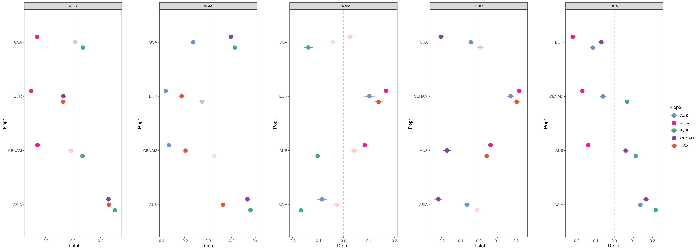

# ADMIXTOOLS

## Convert vcf file to eigenstrat format

Useful tutorials:
- https://speciationgenomics.github.io/ADMIXTOOLS_admixr/
- https://bodkan.net/admixr/articles/01-tutorial.html

ADMIXTOOLS requires eigenstrat input files. To convert a vcf file to eigenstrat, we will use a conversion script written by Joana. That script just requires the name of the vcf file (NB - the script can use uncompressed vcfs too).
- downloaded convertVCFtoEigenstrat.sh from: https://github.com/joanam/scripts/blob/e8c6aa4b919b58d69abba01e7b7e38a892587111/convertVCFtoEigenstrat.sh


```bash
# create conda environment
conda create --name admixtools
conda init --all
conda activate admixtools

# install admixtools and eigensoft
conda install bioconda::admixtools
conda install bioconda::eigensoft

# load other modules
module load bsub.py/0.42.1
#module load compilers/gcc/12.2
module load vcftools/0.1.16-c4
#module load perl-velvetoptimiser/2.2.6
module load plink/1.90b6.18--h516909a_0
module load bcftools/1.14--h88f3f91_0

cd /lustre/scratch125/pam/teams/team333/rp24/DIRO/DATA/03_ANALYSIS/06_ANALYSIS/ADMIXTOOLS

# create link
ln -s /lustre/scratch125/pam/teams/team333/rp24/DIRO/DATA/03_ANALYSIS/04_VARIANTS/FILTER1/OUTGROUPS/FINAL_SETS/nuclear_samples3x_missing0.9.chr1to4.recode.vcf

# generate "chrom-map.txt" for chromosome names
bcftools view -H nuclear_samples3x_missing0.9.chr1to4.recode.vcf | cut -f 1 | uniq | awk '{print $0"\t"$0}' > chrom-map.txt
## This command appends each chromosome name ($0) with a tab character ("\t") and then repeats the chromosome name again ($0) before redirecting the output to "chrom-map.txt".


# Convert vcf to eigenstrat format
chmod a+x convertVCFtoEigenstrat_hw.sh
bsub.py 4 eigenstrat "./convertVCFtoEigenstrat_hw.sh nuclear_samples3x_missing0.9.chr1to4.recode"
## modify to allow non-standard chromosomes because eigenstrat format expects chromosomes to be called "1, 2, 3 etc". Indicate a "chom-map.txt" file in the vcftools command.

# this produced 3 important files I need for admixtools:
# .snp
# .eigenstratgeno
# .ind - modified col 3 of .ind file to have continent groups. Make sure it is all 1 word, otherwise things won't work.
```


## D statistic

The 4-population test, implemented here as D-statistics, is also a formal test for admixture based on a four taxon 4 statistic, which can provide some information about the direction of gene flow.
For any 4 populations (W, X, Y, Z), qpDstat computes the D-statistics as - 
num = (w − x)(y − z )
den = (w + x − 2wx)(y + z − 2yz )

D = num/ den

The output of qpDstat is informative about the direction of gene flow. So for 4 populations (W, X, Y, Z) as follows - 
If the Z-score is +ve, then the gene flow occured either between W and Y or X and Z 
If the Z-score is -ve, then the gene flow occured either between W and Z or X and Y. 

Run using different outgroups:

- D. ursi
- D. repens
- D. 'Thai'

And run using all the D. immitis pops from different continents as source populations.

```bash
# loop through the populations to generate the pop file as input
OUTGROUP=URSI
for i in AUS ASIA EUR CENAM USA; do
     for j in  AUS ASIA EUR CENAM USA; do
          for k in AUS ASIA EUR CENAM USA; do
               if [[ "$i" == "$j" ]] || [[ "$i" == "$OUTGROUP" ]] || [[ "$j" == "$OUTGROUP" ]] || [[ "$i" == "$k" ]] || [[ "$j" == "$k" ]] || [[ "$k" == "$OUTGROUP" ]]; then
                    :
                    else
                    echo -e "${k}\t${j}\t${i}\t${OUTGROUP}" >> admixtools_pops_dstat_ursi.txt;
               fi;
          done;
     done;
done

# run admixtools to generate D-stats
qpDstat -p PARAMETER_FILE_dstat_ursi > qpDstat_ursi.out

# PARAMETER_FILE_dstat:
genotypename:   nuclear_samples3x_missing0.9.chr1to4.recode.eigenstratgeno (in eigenstrat format)
snpname:        nuclear_samples3x_missing0.9.chr1to4.recode.snp      (in eigenstrat format)
indivname:      nuclear_samples3x_missing0.9.chr1to4.recode.ind    (in eigenstrat format)
popfilename:    admixtools_pops_dstat_ursi.txt
inbreed: YES

# extract the relevant output lines
grep "result" qpDstat_ursi.out | awk '{print $2,$3,$4,$5,$6,$7,$8,$9,$10,$11}' OFS="\t" > qpDstat_ursi.clean.out
```

Plot in R:

```R
# Plot D statistics

# load libraries
library(tidyverse)
library(RColorBrewer)
library(ggstance)

setwd("C:/Users/rpow2134/OneDrive - The University of Sydney (Staff)/Documents/HW_WGS/R_analysis/batch4/FILTER1/OUTGROUPS/admixtools")

set.see
############################### URSI AS OUTGROUP
# read data
data <- read.delim("qpDstat_ursi.clean.out", header=F, sep="\t")

# headings
colnames(data) <- c("Pop1", "Pop2", "Pop3", "Outgroup", "D_stat", "SE", "Z", "BABA", "ABBA", "SNPs")

# specify whether absolute value of Z is > 3
data <- mutate(data, SIG = ifelse(abs(Z) > 3, "YES", "NO"))

# colours
red_palette1 <- brewer.pal(n = 9, name = "YlOrRd")
red_palette2 <- brewer.pal(n=9, name = "YlOrBr")
blue_palette <- brewer.pal(n = 9, name = "Blues")
green_palette1 <- brewer.pal(n = 9, name = "BuGn")
green_palette2 <- brewer.pal(n=9, name = "YlGn")

colour_map <- c("AUS" = "cornflowerblue",
             "ASIA" = "hotpink",
             "EUR" = green_palette1[6],
             "CENAM" = "darkviolet",
             "USA" = red_palette1[6])


# Replace population names with corresponding color names
data$Pop2Color <- colour_map[data$Pop2]
# Adjust colors so that if the abs(Z) < 3, the points appear duller
data$Color <- mapply(function(sig, colour) {
  if (sig == "YES") {
    return(colour)
  } else {
    return(adjustcolor(colour, alpha.f = 0.2))
  }
}, data$SIG, data$Pop2Color)


## POP1: AUS
# subset data
pop3_AUS <- "AUS"
data_AUS <- data[data$Pop3 == pop3_AUS, ]

qpDstat_ursi_plot_AUS <- ggplot(data_AUS, aes(x = D_stat, y = Pop1, color = Color)) +
  geom_point(position = position_dodge(width = 0.3), size = 4) + # Add points
  geom_errorbar(aes(xmin = D_stat - SE, xmax = D_stat + SE, y = Pop1), 
                width = 0.0,
                position = position_dodge(width = 0.3)) + # Add error bars
  geom_vline(xintercept = 0, color = "grey", linetype = "dashed", linewidth = 0.5) + # Add dashed line at x = 0
  theme_bw() +
  labs(x = "D-stat", y = "Pop1") +
  facet_wrap(~Pop3, nrow = 1) +
  scale_color_identity(guide = "legend", name = "Pop2", breaks = colour_map, labels = names(colour_map)) +
  theme(
    panel.grid.major = element_blank(),
    panel.grid.minor = element_blank()
  )
qpDstat_ursi_plot_AUS
ggsave("qpDstat_ursi_plot_AUS.png", qpDstat_ursi_plot_AUS, height=8, width=5)


## POP1: ASIA
# subset data
pop3_ASIA <- "ASIA"
data_ASIA <- data[data$Pop3 == pop3_ASIA, ]

qpDstat_ursi_plot_ASIA <- ggplot(data_ASIA, aes(x = D_stat, y = Pop1, color = Color)) +
  geom_point(position = position_dodge(width = 0.3), size = 4) + # Add points
  geom_errorbar(aes(xmin = D_stat - SE, xmax = D_stat + SE, y = Pop1), 
                width = 0.0,
                position = position_dodge(width = 0.3)) + # Add error bars
  geom_vline(xintercept = 0, color = "grey", linetype = "dashed", linewidth = 0.5) + # Add dashed line at x = 0
  theme_bw() +
  labs(x = "D-stat", y = "Pop1") +
  facet_wrap(~Pop3, nrow = 1) +
  scale_color_identity(guide = "legend", name = "Pop2", breaks = colour_map, labels = names(colour_map)) +
  theme(
    panel.grid.major = element_blank(),
    panel.grid.minor = element_blank()
  )
qpDstat_ursi_plot_ASIA
ggsave("qpDstat_ursi_plot_ASIA.png", qpDstat_ursi_plot_ASIA, height=8, width=5)


## POP1: EUR
# subset data
pop3_EUR <- "EUR"
data_EUR <- data[data$Pop3 == pop3_EUR, ]

qpDstat_ursi_plot_EUR <- ggplot(data_EUR, aes(x = D_stat, y = Pop1, color = Color)) +
  geom_point(position = position_dodge(width = 0.3), size = 4) + # Add points
  geom_errorbar(aes(xmin = D_stat - SE, xmax = D_stat + SE, y = Pop1), 
                width = 0.0,
                position = position_dodge(width = 0.3)) + # Add error bars
  geom_vline(xintercept = 0, color = "grey", linetype = "dashed", linewidth = 0.5) + # Add dashed line at x = 0
  theme_bw() +
  labs(x = "D-stat", y = "Pop1") +
  facet_wrap(~Pop3, nrow = 1) +
  scale_color_identity(guide = "legend", name = "Pop2", breaks = colour_map, labels = names(colour_map)) +
  theme(
    panel.grid.major = element_blank(),
    panel.grid.minor = element_blank()
  )
qpDstat_ursi_plot_EUR
ggsave("qpDstat_ursi_plot_EUR.png", qpDstat_ursi_plot_EUR, height=8, width=5)


## POP1: CENAM
# subset data
pop3_CENAM <- "CENAM"
data_CENAM <- data[data$Pop3 == pop3_CENAM, ]

qpDstat_ursi_plot_CENAM <- ggplot(data_CENAM, aes(x = D_stat, y = Pop1, color = Color)) +
  geom_point(position = position_dodge(width = 0.3), size = 4) + # Add points
  geom_errorbar(aes(xmin = D_stat - SE, xmax = D_stat + SE, y = Pop1), 
                width = 0.0,
                position = position_dodge(width = 0.3)) + # Add error bars
  geom_vline(xintercept = 0, color = "grey", linetype = "dashed", linewidth = 0.5) + # Add dashed line at x = 0
  theme_bw() +
  labs(x = "D-stat", y = "Pop1") +
  facet_wrap(~Pop3, nrow = 1) +
  scale_color_identity(guide = "legend", name = "Pop2", breaks = colour_map, labels = names(colour_map)) +
  theme(
    panel.grid.major = element_blank(),
    panel.grid.minor = element_blank()
  )
qpDstat_ursi_plot_CENAM
ggsave("qpDstat_ursi_plot_CENAM.png", qpDstat_ursi_plot_CENAM, height=8, width=5)


## POP1: USA
# subset data
pop3_USA <- "USA"
data_USA <- data[data$Pop3 == pop3_USA, ]

qpDstat_ursi_plot_USA <- ggplot(data_USA, aes(x = D_stat, y = Pop1, color = Color)) +
  geom_point(position = position_dodge(width = 0.3), size = 4) + # Add points
  geom_errorbar(aes(xmin = D_stat - SE, xmax = D_stat + SE, y = Pop1), 
                width = 0.0,
                position = position_dodge(width = 0.3)) + # Add error bars
  geom_vline(xintercept = 0, color = "grey", linetype = "dashed", linewidth = 0.5) + # Add dashed line at x = 0
  theme_bw() +
  labs(x = "D-stat", y = "Pop1") +
  facet_wrap(~Pop3, nrow = 1) +
  scale_color_identity(guide = "legend", name = "Pop2", breaks = colour_map, labels = names(colour_map)) +
  theme(
    panel.grid.major = element_blank(),
    panel.grid.minor = element_blank()
  )
qpDstat_ursi_plot_USA
ggsave("qpDstat_ursi_plot_USA.png", qpDstat_ursi_plot_USA, height=8, width=5)
```



Excess allele sharing for AUS:
- ASIA
- CENAM
- USA

Excess allele sharing for ASIA:
- AUS
- USA

Excess allele sharing for CENAM:
- AUS
- EUR

Excess allele sharing for EUR:
- AUS
- CENAM

Excess allele sharing for USA:
- AUS
- ASIA
- CENAM

From looking at this, it would suggest that AUS is the ancestral population because it has the most allele sharing. However, we know that is not plausible as Australia didn't have the canid host until ~3.5 kya. Instead, perhaps Australia is a bit of a mix of everything.

This shows that the D. immitis dispersal is not super super recent, because if that were the case, then there would be allele sharing between all populations because they would basically be identical. But it's also not super super ancient, because there is still some strong shared ancestry.


## outgroup f3 stats

From this tutorial: https://compvar-workshop.readthedocs.io/en/latest/contents/03_f3stats/f3stats.html#f4-statistics

F3 stats can measure admixture, as well as how closely two populations (A and B) are related to one another using a distant outgroup (C).

```bash
# make a new populations file

# URSI outgroup
# set the outgroup
OUTGROUP=URSI

# loop throguh the populations to generate the pop file as input to admixtools
for i in URSI AUS ASIA EUR CENAM USA; do
     for j in  URSI AUS ASIA EUR CENAM USA; do
          if [[ "$i" == "$j" ]] || [[ "$i" == "$OUTGROUP" ]] || [[ "$j" == "$OUTGROUP" ]]; then
               :
               else
               echo -e "${i}\t${j}\t${OUTGROUP}" >> admixtools_pops_f3.txt;
          fi;
     done;
done

# remove any duplicates in pops A and B


# REPENS outgroup
# set the outgroup
OUTGROUP=REPENS

# loop throguh the populations to generate the pop file as input to admixtools
for i in REPENS AUS ASIA EUR CENAM USA; do
     for j in  REPENS AUS ASIA EUR CENAM USA; do
          if [[ "$i" == "$j" ]] || [[ "$i" == "$OUTGROUP" ]] || [[ "$j" == "$OUTGROUP" ]]; then
               :
               else
               echo -e "${i}\t${j}\t${OUTGROUP}" >> admixtools_pops_f3.txt;
          fi;
     done;
done


# THAI outgroup
# set the outgroup
OUTGROUP=DTHAI

# loop throguh the populations to generate the pop file as input to admixtools
for i in DTHAI AUS ASIA EUR CENAM USA; do
     for j in  DTHAI AUS ASIA EUR CENAM USA; do
          if [[ "$i" == "$j" ]] || [[ "$i" == "$OUTGROUP" ]] || [[ "$j" == "$OUTGROUP" ]]; then
               :
               else
               echo -e "${i}\t${j}\t${OUTGROUP}" >> admixtools_pops_f3.txt;
          fi;
     done;
done


# run admixtools to generate f3 stats
qp3Pop -p PARAMETER_FILE_f3 > qp3Pop.out
```

PARAMETER_FILE:

```bash
genotypename:   nuclear_samples3x_missing0.9.chr1to4.recode.eigenstratgeno (in eigenstrat format)
snpname:        nuclear_samples3x_missing0.9.chr1to4.recode.snp      (in eigenstrat format)
indivname:      nuclear_samples3x_missing0.9.chr1to4.recode.ind    (in eigenstrat format)
popfilename:    admixtools_pops_f3.txt
inbreed: YES
printsd: YES
```

```bash
grep "result" qp3Pop.out | awk '{print $2,$3,$4,$5,$6,$7,$8}' OFS="\t" > qp3Pop.clean.out
# didnt work using these other species as outgroups.
```


## qpGraph

```bash
# install qpBrute
conda env create --name qpbrute --file https://raw.githubusercontent.com/ekirving/qpbrute/master/environment.yaml
# activate env
conda activate qpbrute

# parameter file
DIR:   ./
S1:              sim1           
indivname:       ../nuclear_samples3x_missing0.9.chr1to4.recode.ind  
snpname:         ../nuclear_samples3x_missing0.9.chr1to4.recode.snp       
genotypename:    ../nuclear_samples3x_missing0.9.chr1to4.recode.eigenstratgeno  
outpop:         NULL     
blgsize:        0.05
lsqmode:       YES
diag:          .0001
hires:         YES
initmix:      1000 
precision:    .0001  
zthresh:      3.0
terse:        NO
useallsnps:   YES

# graph file - start very simple first. we know CENAM is from EUR, AUS is from ASIA.
# qpgraph1:
root     R
label    AUS AUS 
label    ASIA   ASIA     
label    EUR   EUR    
label    CENAM   CENAM   
label    USA   USA
edge root_usa R USA
edge root_a1 R A1
edge A1_eur A1 EUR
edge A1_asia A1 ASIA
edge eur_cenam EUR CENAM
edge asia_aus ASIA AUS

qpGraph -p PARAMETER_FILE_qpgraph -g qpgraph1 -o qpgraph1.ggg -d qpgraph1.dot > qpgraph1.out

# qpgraph2:
root     R
label    AUS AUS 
label    ASIA   ASIA     
label    EUR   EUR    
label    CENAM   CENAM   
label    USA   USA
edge root_usa R USA
edge root_a1 R A1
edge A1_eur A1 EUR
edge A1_asia A1 ASIA
edge eur_cenam EUR CENAM
edge asia_aus ASIA AUS
admix mix_usa_asia USA ASIA
admix mix_cenam_aus CENAM AUS
admix mix_usa_cenam USA CENAM
admix mix_usa_eur USA EUR

qpGraph -p PARAMETER_FILE_qpgraph -g qpgraph2 -o qpgraph2.ggg -d qpgraph2.dot > qpgraph2.out

# go simpler

#qpgraph3:
root     R
label    ASIA   ASIA     
label    EUR   EUR    
edge root_A1 R A1
edge A1_asia A1 ASIA
edge A1_usa A1 USA
edge root_eur R EUR

qpGraph -p PARAMETER_FILE_qpgraph -g qpgraph3 -o qpgraph3.ggg -d qpgraph3.dot > qpgraph3.out

#qpgraph4: Now add EUR -> CENAM
root     R
label    ASIA   ASIA     
label    EUR   EUR    
edge root_A1 R A1
edge A1_asia A1 ASIA
edge A1_usa A1 USA
edge root_eur R EUR
edge eur_cenam EUR CENAM

qpGraph -p PARAMETER_FILE_qpgraph -g qpgraph4 -o qpgraph4.ggg -d qpgraph4.dot > qpgraph4.out

#qpgraph5: Now add ASIA -> AUS
root     R
label    ASIA   ASIA     
label    EUR   EUR    
edge root_A1 R A1
edge A1_asia A1 ASIA
edge A1_usa A1 USA
edge root_eur R EUR
edge eur_cenam EUR CENAM
edge asia_aus ASIA AUS

qpGraph -p PARAMETER_FILE_qpgraph -g qpgraph5 -o qpgraph5.ggg -d qpgraph5.dot > qpgraph5.out

# no outliers!
```

## qpBrute

Now try qpbrute - it searches for the best model automatically, so it will be a better option. Use URSI as outgroup.

```bash
# exhaustive search - will search all possible models
bsub.py --threads 10 10 qpBrute "qpBrute --threads 10 --par qpbrute_run1.par --prefix qpbrute_run1 --pops AUS ASIA EUR CENAM USA --out URSI"
# THIS WORKED
# FINISHED: Found 49 unique solution(s) from a total of 5,144 unique graphs!


# heuristic search - focuses on the most promising models
bsub.py --threads 10 10 qpBrute_heur "qpBrute --threads 10 --par qpbrute_run2.par --prefix qpbrute_run2 --pops AUS ASIA EUR CENAM USA --out URSI --heuristic"
# ERROR: Cannot resolve the graph from any permutation of the given nodes.
#FINISHED: Found 0 unique solution(s) from a total of 107 unique graphs!
# Ok so heuristic search doesn't work for this dataset...
```

# qpBayes

To calculate Bayes factors

```bash
module load cellgen/R/4.3.1
R

install.packages("optimbase_1.0-10.tar.gz", repos = NULL, type = "source") # worked
install.packages("optimsimplex_1.0-8.tar.gz", repos = NULL, type = "source") # worked
install.packages("neldermead_1.0-12.tar.gz", repos = NULL, type = "source") # worked
install.packages('foreach') # worked
install.packages('pracma') # worked
install.packages("admixturegraph_1.0.2.tar.gz", repos = NULL, type = "source") # worked?


bsub.py --threads 10 20 qpBayes "qpBayes --threads 10 \
    --geno ../nuclear_samples3x_missing0.9.chr1to4.recode.eigenstratgeno \
    --ind ../nuclear_samples3x_missing0.9.chr1to4.recode.ind   \
    --snp ../nuclear_samples3x_missing0.9.chr1to4.recode.snp  \
    --prefix qpbrute_run1 \
    --pops AUS ASIA EUR CENAM USA \
    --out URSI"

    ea6ffc108913
```
   


## Qpwave

```bash
# parameter file
genotypename:   nuclear_samples3x_missing0.9.chr1to4.recode.eigenstratgeno
snpname:       nuclear_samples3x_missing0.9.chr1to4.recode.snp
indivname:     nuclear_samples3x_missing0.9.chr1to4.recode.ind
popleft:       popleft_AUS.txt
popright:      popright_AUS.txt
details:       YES 
allsnps: YES
# did this for each pop

qpWave -p PARAMETER_FILE_qpwave > qpwave
```


## F4 ratio test

F4 ratio estimation allows inference of the mixing proportions of an admixture event, even without access to accurate surrogates for the ancestral populations.

For any 5 populations that are related to each other, we can compute the admixture proportion \alpha as - 

\alpha = f4(A,O; X,C)/ f4(A,O; B, C) 

```bash
qpF4ratio -p PARAMETER_FILE_F4ratio_ >logfile

A:
B:
X:
C:
O:

# loop through the populations to generate the pop file as input
OUTGROUP=URSI
for i in AUS ASIA EUR CENAM USA; do
     for j in  AUS ASIA EUR CENAM USA; do
          for k in AUS ASIA EUR CENAM USA; do
               if [[ "$i" == "$j" ]] || [[ "$i" == "$OUTGROUP" ]] || [[ "$j" == "$OUTGROUP" ]] || [[ "$i" == "$k" ]] || [[ "$j" == "$k" ]] || [[ "$k" == "$OUTGROUP" ]]; then
                    :
                    else
                    echo -e "${k}\t${j}\t${i}\t${OUTGROUP}" >> admixtools_pops_dstat_ursi.txt;
               fi;
          done;
     done;
done

# run admixtools to generate D-stats
qpDstat -p PARAMETER_FILE_dstat_ursi > qpDstat_ursi.out

# PARAMETER_FILE_dstat:
genotypename:   nuclear_samples3x_missing0.9.chr1to4.recode.eigenstratgeno (in eigenstrat format)
snpname:        nuclear_samples3x_missing0.9.chr1to4.recode.snp      (in eigenstrat format)
indivname:      nuclear_samples3x_missing0.9.chr1to4.recode.ind    (in eigenstrat format)
popfilename:    admixtools_pops_dstat_ursi.txt
inbreed: YES

# extract the relevant output lines
grep "result" qpDstat_ursi.out | awk '{print $2,$3,$4,$5,$6,$7,$8,$9,$10,$11}' OFS="\t" > qpDstat_ursi.clean.out
```


## f3 stats

```bash
# make a new populations file
admixtools_pops.txt

# URSI outgroup
# set the outgroup
OUTGROUP=URSI

# loop throguh the populations to generate the pop file as input to admixtools
for i in URSI AUS ASIA EUR CENAM USA; do
     for j in  URSI AUS ASIA EUR CENAM USA; do
          if [[ "$i" == "$j" ]] || [[ "$i" == "$OUTGROUP" ]] || [[ "$j" == "$OUTGROUP" ]]; then
               :
               else
               echo -e "${i}\t${j}\t${OUTGROUP}" >> admixtools_pops.txt;
          fi;
     done;
done

# remove any duplicates


# REPENS outgroup
# set the outgroup
OUTGROUP=REPENS

# loop throguh the populations to generate the pop file as input to admixtools
for i in REPENS AUS ASIA EUR CENAM USA; do
     for j in  REPENS AUS ASIA EUR CENAM USA; do
          if [[ "$i" == "$j" ]] || [[ "$i" == "$OUTGROUP" ]] || [[ "$j" == "$OUTGROUP" ]]; then
               :
               else
               echo -e "${i}\t${j}\t${OUTGROUP}" >> admixtools_pops.txt;
          fi;
     done;
done


# THAI outgroup
# set the outgroup
OUTGROUP=THAI

# loop throguh the populations to generate the pop file as input to admixtools
for i in THAI AUS ASIA EUR CENAM USA; do
     for j in  THAI AUS ASIA EUR CENAM USA; do
          if [[ "$i" == "$j" ]] || [[ "$i" == "$OUTGROUP" ]] || [[ "$j" == "$OUTGROUP" ]]; then
               :
               else
               echo -e "${i}\t${j}\t${OUTGROUP}" >> admixtools_pops.txt;
          fi;
     done;
done


# run admixtools to generate f3 stats
qp3Pop -p PARAMETER_FILE > qp3Pop.out
```

PARAMETER_FILE:

```bash
genotypename:   nuclear_samples3x_missing0.8.chr1to4.recode.eigenstratgeno (in eigenstrat format)
snpname:        nuclear_samples3x_missing0.8.chr1to4.recode.snp      (in eigenstrat format)
indivname:      nuclear_samples3x_missing0.8.chr1to4.recode.ind    (in eigenstrat format)
popfilename:    admixtools_pops.txt
inbreed: YES
printsd: YES
```

```bash
grep "result" qp3Pop.out | awk '{print $2,$3,$4,$5,$6,$7,$8}' OFS="\t" > qp3Pop.clean.out
# didnt work using these other species as outgroups. Maybe just compare within the D. immitis.
```


```bash
# AUS as outgroup
# set the outgroup
OUTGROUP=AUS

# loop throguh the populations to generate the pop file as input to admixtools
for i in AUS ASIA EUR CENAM USA; do
     for j in  AUS ASIA EUR CENAM USA; do
          if [[ "$i" == "$j" ]] || [[ "$i" == "$OUTGROUP" ]] || [[ "$j" == "$OUTGROUP" ]]; then
               :
               else
               echo -e "${i}\t${j}\t${OUTGROUP}" >> admixtools_pops.txt;
          fi;
     done;
done

# ASIA as outgroup
# set the outgroup
OUTGROUP=ASIA

# loop throguh the populations to generate the pop file as input to admixtools
for i in AUS ASIA EUR CENAM USA; do
     for j in  AUS ASIA EUR CENAM USA; do
          if [[ "$i" == "$j" ]] || [[ "$i" == "$OUTGROUP" ]] || [[ "$j" == "$OUTGROUP" ]]; then
               :
               else
               echo -e "${i}\t${j}\t${OUTGROUP}" >> admixtools_pops.txt;
          fi;
     done;
done

# EUR as outgroup
# set the outgroup
OUTGROUP=EUR

# loop throguh the populations to generate the pop file as input to admixtools
for i in AUS ASIA EUR CENAM USA; do
     for j in  AUS ASIA EUR CENAM USA; do
          if [[ "$i" == "$j" ]] || [[ "$i" == "$OUTGROUP" ]] || [[ "$j" == "$OUTGROUP" ]]; then
               :
               else
               echo -e "${i}\t${j}\t${OUTGROUP}" >> admixtools_pops.txt;
          fi;
     done;
done

# CENAM as outgroup
# set the outgroup
OUTGROUP=CENAM

# loop throguh the populations to generate the pop file as input to admixtools
for i in AUS ASIA EUR CENAM USA; do
     for j in  AUS ASIA EUR CENAM USA; do
          if [[ "$i" == "$j" ]] || [[ "$i" == "$OUTGROUP" ]] || [[ "$j" == "$OUTGROUP" ]]; then
               :
               else
               echo -e "${i}\t${j}\t${OUTGROUP}" >> admixtools_pops.txt;
          fi;
     done;
done

# USA as outgroup
# set the outgroup
OUTGROUP=USA

# loop through the populations to generate the pop file as input to admixtools
for i in AUS ASIA EUR CENAM USA; do
     for j in  AUS ASIA EUR CENAM USA; do
          if [[ "$i" == "$j" ]] || [[ "$i" == "$OUTGROUP" ]] || [[ "$j" == "$OUTGROUP" ]]; then
               :
               else
               echo -e "${i}\t${j}\t${OUTGROUP}" >> admixtools_pops.txt;
          fi;
     done;
done

# remove duplicates

# run admixtools to generate f3 stats
qp3Pop -p PARAMETER_FILE > qp3Pop.out

```


## Plot f3 stats

```R
# load libraries
library(tidyverse)

setwd("")

# read data
data <- read.delim("qp3Pop.clean.out", header=F, sep="\t")

# fix headings
colnames(data) <- c("Source_1", "Source_2", "Outgroup", "f_3", "std_err", "Z_score", "SNPs")

# make a plot
ggplot(data,aes(f_3, reorder(paste0(Source_1,",",Source_2), -f_3))) +
     geom_point(size = 2) +
     geom_segment(aes(x = f_3-std_err, y = paste0(Source_1,",",Source_2), xend = f_3+std_err, yend = paste0(Source_1,",",Source_2))) +
     theme_bw() + xlim(0,1) +
     labs(x = "f3(Source1,Source2;Outgroup)" , y = "") +
     facet_grid(Outgroup~., scale="free_y", space = "free_y")

# save it
ggsave("plot_admixtools_f3_statistics.png")
ggsave("plot_admixtools_f3_statistics.pdf", height = 4, width = 5, useDingbats = FALSE)
```


## f4 ratio

```bash
# run admixtools to generate f4 ratios
qpF4ratio -p PARAMETER_FILE_dstat >qpF4ratio.out
```


# Sanger isn't connecting, try in Artemis for now

```bash
module load anaconda3

# create conda environment
conda create --name admixr
conda init --all
```
```bash
#!/bin/bash

# PBS directives 
#PBS -P RDS-FSC-Heartworm_MLR-RW
#PBS -N admixr
#PBS -l select=1:ncpus=1:mem=10GB
#PBS -l walltime=01:00:00
#PBS -m abe
#PBS -q defaultQ
#PBS -o admixr.txt

module load anaconda3
module load vcftools
module load plink
module load bcftools

conda activate admixr

cd /scratch/RDS-FSC-Heartworm_MLR-RW/batch4

# generate "chrom-map.txt" for chromosome names
bcftools view -H nuclear_samples3x_missing0.8.chr1to4.recode.vcf | cut -f 1 | uniq | awk '{print $0"\t"$0}' > chrom-map.txt
## This command appends each chromosome name ($0) with a tab character ("\t") and then repeats the chromosome name again ($0) before redirecting the output to "chrom-map.txt".


# Convert vcf to eigenstrat format
chmod a+x convertVCFtoEigenstrat_hw.sh
./convertVCFtoEigenstrat_hw.sh nuclear_samples3x_missing0.8.chr1to4.recode
## modify to allow non-standard chromosomes because eigenstrat format expects chromosomes to be called "1, 2, 3 etc". Indicate a "chrom-map.txt" file in the vcftools command.
# my file wasn't working, had a look at Steve's to see where I'm going wrong

# this produced 3 important files I need for admixtools:
# .snp
# .eigenstratgeno # i changed this to .geno so that eigenstrat would recognise it
# .ind - modified col 3 of .ind file to have country groups. Make sure it is all 1 word e.g. needed to change "Costa Rica" to Costa_Rica".
```


## admixr in R

Admixr is an R package that provides a more straightforward way to use ADMIXTOOLS.

```bash
# open R on command line
R
##R version 4.1.0 (2021-05-18) -- "Camp Pontanezen"
```

```R
# install
install.packages("admixr")
# made personal library '~/R/x86_64-pc-linux-gnu-library/4.1’ and downloaded the admixtools package there
# selected CRAN mirror for use in this session:  2: Australia (Canberra) [https]

# make sure R can find admixtools binaries on the $PATH

export PATH="/nfs/users/nfs_r/rp24/miniconda3/envs/admixtools/bin"

# load packages
library(tidyverse)
library(admixr)
library(ggplot2)

# set data prefix
data_prefix <- "/lustre/scratch125/pam/teams/team333/rp24/DIRO/DATA/BATCH3/02_VARIANTS/ADMIXTOOLS/nuclear_samples3x_missing0.9.chr1to4.recode.RENAMED"

# read in data
snps <- eigenstrat(data_prefix)
snps

#count SNPs
##The count_snps function can be useful for quality control, weighting of admixture statistics (D, f4, etc.) in regression analyses etc.
snp_info <- count_snps(snps)
snp_info
'# A tibble: 81 × 4
   id        sex   label     present
   <chr>     <chr> <chr>       <int>
 1 ERR034940 U     USA        155325
 2 ERR034941 U     Italy      171468
 3 Dog2.1    U     Australia  174564
 4 Dog2.2    U     Australia  174348
 5 Dog2.3    U     Australia  174557
 6 Dog2.4    U     Australia  174555
 7 JS6281    U     Australia  174585
 8 JS6342    U     Australia  174374
 9 JS6343    U     Australia  174540
10 JS6344    U     Australia  174533
# … with 71 more rows
'

# Now we can calculate some statistics...


# D statistic (ABBA-BABA test)

## "Significant departure of D from zero indicates an excess of allele sharing between the first and the third population (positive D), or an excess of allele sharing between the second and the third population (negative D). If we get D that is not significantly different from 0, this suggests that the first and second populations form a clade, and don’t differ in the rate of allele sharing with the third population (this is the null hypothesis that the data is compared against)."


# Q1: Do Australian heartworms and Thailand heartworms share more alleles with one another than expected by chance? Use D. repens as outgroup.
##Using the admixr package we can then calculate our D statistic simply by running:

# D(non-Europe pops W,African,Neanderthal,Chimp).
result <- d(W = "Australia", X = "USA", Y = "Thailand", Z = "D.repens", data = snps)
# Z is the outgroup


# Q2: Do Central American heartworms show evidence of closer genetic affinity with pops from Europe?
result <- d(W = "Panama", X = "Thailand", Y = "Romania", Z = "D.repens", data = snps)
# Z is the outgroup

head(result)

# plot
plot_dstat <- ggplot(result, aes(fct_reorder(W, D), D, color = abs(Zscore) > 2)) +
  geom_point() +
  geom_hline(yintercept = 0, linetype = 2) +
  geom_errorbar(aes(ymin = D - 2 * stderr, ymax = D + 2 * stderr))

ggsave("plot_dstat.pdf", plot = plot_dstat)

# flip axes
plot_dstat2 <- ggplot(result, aes(fct_reorder(W, D), D, color = abs(Zscore) > 2)) +
  geom_point() +
  geom_hline(yintercept = 0, linetype = 2) +
  geom_errorbar(aes(ymin = D - 2 * stderr, ymax = D + 2 * stderr)) +
  coord_flip()

ggsave("plot_dstat2.pdf", plot = plot_dstat2)

## We can see that the D values for Australia are significantly different from 0, meaning that the data rejects the null hypothesis of no Thailand ancestry in Australians. So this suggests that Thailand admixed with the ancestors of present-day Australian worms.


# f4 statistic 

## Very similar to D statistic
## "Significant departure of f4 from 0 can be interpreted as evidence of gene flow."
## "You might be wondering why we have both f4 and D if they are so similar. The truth is that f4 is, among other things, directly informative about the amount of shared genetic drift (“branch length”) between pairs of populations, which is a very useful theoretical property. Other than that, it’s often a matter of personal preference and so admixr provides functions for calculating both."

result <- f4(W = pops, X = "Yoruba", Y = "Vindija", Z = "Chimp", data = snps)

head(result)

'

'

# f4-ratio statistic

## If the D and f4 stats told us that a certain population carries ancestry from another population, what if we want to know how MUCH of this ancestry they have? What proportion of their genomes is of this origin?

result <- f4ratio(X = pops, A = "Altai", B = "Vindija", C = "Yoruba", O = "Chimp", data = snps)

head(result)
# The ancestry proportion (a number between 0 and 1) is given in the alpha column

ggplot(result, aes(fct_reorder(X, alpha), alpha, color = abs(Zscore) > 2)) +
  geom_point() +
  geom_errorbar(aes(ymin = alpha - 2 * stderr, ymax = alpha + 2 * stderr)) +
  geom_hline(yintercept = 0, linetype = 2) +
  labs(y = "Neandertal ancestry proportion", x = "present-day individual")


# f3 statistic

## Let's say we are interested in relative divergence times between pairs of HW populations, and we want to know in which approximate order they split off from each other. To address this question, we can use f3 statistic by fixing the C outgroup as D. repens, and calculating pairwise f3 stats between all D. immitis populations.

pops <- c("Australia", "USA", "Thailand", "Panama", "Costa_Rica", "Italy", "Romania")

result <- f3(A = pops, B = pops, C = "D_repens", data = snps)
#or
result <- f3(A = "Europe", B = pops, C = "D_repens", data = snps)

head(result)

# sort the population labels according to an increasing f3 value relative to French/lowest one
ordered <- filter(result, A == "Mbuti", B != "Mbuti") %>% arrange(f3) %>% .[["B"]] %>% c("Mbuti")

# plot heatmap of pairwise f3 values
result %>%
  filter(A != B) %>%
  mutate(A = factor(A, levels = ordered),
         B = factor(B, levels = ordered)) %>%
  ggplot(aes(A, B)) + geom_tile(aes(fill = f3))


```


# Convert PLINK format to .geno, .ind, and .snp files
plink --bfile hw --recodeAD --out hw
## This command will produce hw.raw file containing genotype information.

./plink2geno.py hw.raw > hw.geno
./plink2ind.py hw.raw > hw.ind
./plink2snp.py hw.raw > hw.snp


# Convert plink format to Eigenstrat format
convertf -p par.PED.EIGENSTRAT
#par.PED.EIGENSTRAT:
'
genotypename:	data_hw.bed
snpname:	data_hw.bim
indivname:	data_hw.fam
outputformat:	EIGENSTRAT
genotypeoutname:	data_hw.geno
snpoutname:	data_hw.snp
indivoutname:	data_hw.ind
'

# some samples are being ignored because eigenstrat format requires sex information. Add sex info into the .fam file column 6.


# this produces 3 important files I need for admixtools:
# .snp
# .eigenstratgeno
# .ind
```

chmod a+x nuclear_samples3x_missing0.9.chr1to4.recode.RENAMED.ind
chmod a+x nuclear_samples3x_missing0.9.chr1to4.recode.RENAMED.snp
chmod a+x nuclear_samples3x_missing0.9.chr1to4.recode.RENAMED.eigenstratgeno

