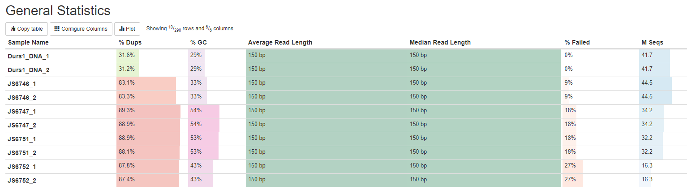

# Troubleshooting outgroups

The outgroup data looked a bit funny when attempting to run admixtools F3. Let's investigate.


There's 5-14% difference in the mtDNA, so the nuclear is unlikely to be as high. We would expect there to have been more SNPs, so perhaps it is a technical reason it hasnm't worked well.



The duplicated sequences are very high and most would've been thrown away in deduplication, and the mapping % weren't that great either.

Low mapping rates could be due to diversity, or there could be little worm DNA in there. Check for contamination.

## kraken to test for contamination

```bash
# load modules
module load bsub.py/0.42.1
module load kraken2/2.1.2

# build custom database
WORKING_DIR=/lustre/scratch125/pam/teams/team333/rp24/DIRO/DATA
cd ${WORKING_DIR}/03_ANALYSIS/01_PREP/KRAKEN

DBNAME='kraken_dog_bear_human_Di.db'

# download taxonomy
kraken2-build --download-taxonomy --db $DBNAME


# add ref genome from dog to kraken database
kraken2-build --add-to-library /lustre/scratch125/pam/teams/team333/rp24/DIRO/DATA/01_REF/GCF_014441545.1_ROS_Cfam_1.0_genomic.fna --no-masking --db $DBNAME


# download American black bear
cd REFS
wget ftp://ftp.ncbi.nlm.nih.gov/genomes/all/GCF/020/975/775/GCF_020975775.1_gsc_jax_bbear_1.0/GCF_020975775.1_gsc_jax_bbear_1.0_genomic.fna.gz
if [ "$(md5sum GCF_020975775.1_gsc_jax_bbear_1.0_genomic.fna.gz | awk '{ print $1 }')" == "38e099b357366455579be84d88deec8f" ]; then echo "MD5 checksum matches."; else echo "MD5 checksum does not match."; fi
## MD5 checksum matches.
# unzip
gunzip GCF_020975775.1_gsc_jax_bbear_1.0_genomic.fna.gz
# add to kraken database
cd ..
kraken2-build --add-to-library REFS/GCF_020975775.1_gsc_jax_bbear_1.0_genomic.fna --no-masking --db $DBNAME


# download human
cd REFS
wget ftp://ftp.ncbi.nlm.nih.gov/genomes/all/GCF/000/001/405/GCF_000001405.40_GRCh38.p14/GCF_000001405.40_GRCh38.p14_genomic.fna.gz
if [ "$(md5sum GCF_000001405.40_GRCh38.p14_genomic.fna.gz  | awk '{ print $1 }')" == "c30471567037b2b2389d43c908c653e1" ]; then echo "MD5 checksum matches."; else echo "MD5 checksum does not match."; fi
## MD5 checksum matches.
# unzip
gunzip GCF_000001405.40_GRCh38.p14_genomic.fna.gz
# add to kraken database
cd ..
kraken2-build --add-to-library REFS/GCF_000001405.40_GRCh38.p14_genomic.fna --no-masking --db $DBNAME


# add Di
#We have dowloanded it from NCBI databes, since it includes the taxonomy info from NCBI
cd REFS
wget ftp://ftp.ncbi.nlm.nih.gov/genomes/all/GCA/001/077/395/GCA_001077395.1_ASM107739v1/GCA_001077395.1_ASM107739v1_genomic.fna.gz
if [ "$(md5sum GCA_001077395.1_ASM107739v1_genomic.fna.gz | awk '{ print $1 }')" == "32025403ce2abb28e69d754ed6110156" ]; then echo "MD5 checksum matches."; else echo "MD5 checksum does not match."; fi
## MD5 checksum matches.
# unzip
gunzip GCA_001077395.1_ASM107739v1_genomic.fna.gz
# add to kraken database
cd ..
kraken2-build --add-to-library REFS/GCA_001077395.1_ASM107739v1_genomic.fna --no-masking --db $DBNAME


# build database
bsub.py --threads 8 100 kraken_build "kraken2-build --threads 4 --build --db $DBNAME"
# this can take a while

# create loop
while read line; do
    kraken2 --db $DBNAME --report $line\.kraken --paired ../$line\/$line\_val_1.fq.gz ../$line\/$line\_val_2.fq.gz;
done < fastq.txt
```


## How well does D. repens map to D. immitis?

- Can make fake reads from a D. repens assembly, then map them to D. immitis. This allows us to see how well D. repens maps to D. immitis in a controlled way.

I can try using BBMap randomreads.sh:
This generates random synthetic reads from a reference genome: https://github.com/BioInfoTools/BBMap/blob/master/sh/randomreads.sh

```bash
# load modules
module load bbtools/39.01
module load samtools/1.14--hb421002_0

cd /lustre/scratch125/pam/teams/team333/rp24/DIRO/DATA/03_ANALYSIS/05_ANALYSIS/OUTGROUPS/DREPENS/DATA

# download ref genome for D. repens
wget ftp://ftp.ncbi.nlm.nih.gov/genomes/all/GCA/008/729/115/GCA_008729115.1_FGCZ_Drep_1.0/*.fna.gz
if [ "$(md5sum GCA_008729115.1_FGCZ_Drep_1.0_genomic.fna.gz | awk '{ print $1 }')" == "5187f349044c7ca68c7305e566c0c577" ]; then echo "MD5 checksum matches."; else echo "MD5 checksum does not match."; fi
## MD5 checksum matches.
# unzip
gunzip GCA_008729115.1_FGCZ_Drep_1.0_genomic.fna.gz
# index
bsub.py 2 repens_index "samtools faidx DATA/GCA_008729115.1_FGCZ_Drep_1.0_genomic.fna"

cd ..
chmod a+x randomreads.sh
bsub.py 10 repens_randomreads "randomreads.sh ref=DATA/GCA_008729115.1_FGCZ_Drep_1.0_genomic.fna out1=Drep_1.fq out2=Drep_2.fq length=150 coverage=35 paired=true midq=32"
```

### Map fake reads to combined D. immitis & Wol & dog genome

```bash
# load modules
module load mapping-helminth/v1.0.9

# Set variables
WORKING_DIR=/lustre/scratch125/pam/teams/team333/rp24/DIRO/DATA
REF=${WORKING_DIR}/01_REF/reference_di_wol_dog.fa
IN_DIR=${WORKING_DIR}/03_ANALYSIS/05_ANALYSIS/OUTGROUPS/DREPENS

# Run nextflow mapping pipeline
bsub.py 4 repens_randomreads_mapping "mapping-helminth --input ${IN_DIR}/repens_randomreads_wgs.mapping.manifest --reference ${REF}"
```


- Can use raw reads from public D. repens data & see how well that maps to D. immitis
