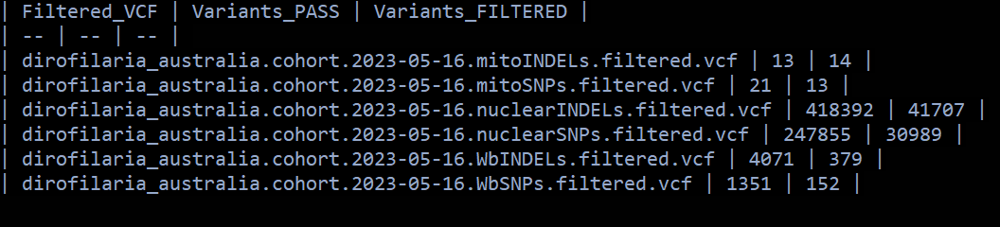

### Make some density plots of the data and get quantiles in R

```R
# load libraries
library(patchwork)
require(data.table)
library(tidyverse)
library(gridExtra)

setwd("C:/Users/rpow2134/OneDrive - The University of Sydney (Staff)/Documents/HW_WGS/R_analysis/snps_qc")

# Import data
## Nuclear SNPs & indels
VCF_nuclear_snps <- fread('GVCFall_nuclearSNPs.table', header = TRUE, fill=TRUE, na.strings=c("","NA"), sep = "\t")
VCF_nuclear_snps <- sample_frac(VCF_nuclear_snps, 0.2) # select fraction of rows
VCF_nuclear_indels <- fread('GVCFall_nuclearINDELs.table', header = TRUE, fill=TRUE, na.strings=c("","NA"), sep = "\t")
VCF_nuclear_indels <- sample_frac(VCF_nuclear_indels, 0.2)
dim(VCF_nuclear_snps) # returns the dimensions of the data frame
dim(VCF_nuclear_indels)
VCF_nuclear <- rbind(VCF_nuclear_snps, VCF_nuclear_indels) # joins multiple rows to form a single batch
VCF_nuclear$Variant <- factor(c(rep("SNPs", dim(VCF_nuclear_snps)[1]), rep("Indels", dim(VCF_nuclear_indels)[1]))) # make a new column saying whether it's a SNP or indel

## Mitochondrial SNPs & indels
VCF_mito_snps <- fread('GVCFall_mitoSNPs.table', header = TRUE, fill=TRUE, na.strings=c("","NA"), sep = "\t")
VCF_mito_indels <- fread('GVCFall_mitoINDELs.table', header = TRUE, fill=TRUE, na.strings=c("","NA"), sep = "\t")
dim(VCF_mito_snps)
dim(VCF_mito_indels)
VCF_mito <- rbind(VCF_mito_snps, VCF_mito_indels)
VCF_mito$Variant <- factor(c(rep("SNPs", dim(VCF_mito_snps)[1]), rep("Indels", dim(VCF_mito_indels)[1])))

## Wolbachia SNPs & indels
VCF_wb_snps <- fread('GVCFall_WbSNPs.table', header = TRUE, fill=TRUE, na.strings=c("","NA"), sep = "\t")
VCF_wb_indels <- fread('GVCFall_WbINDELs.table', header = TRUE, fill=TRUE, na.strings=c("","NA"), sep = "\t")
dim(VCF_wb_snps)
dim(VCF_wb_indels)
VCF_wb <- rbind(VCF_wb_snps, VCF_wb_indels)
VCF_wb$Variant <- factor(c(rep("SNPs", dim(VCF_wb_snps)[1]), rep("Indels", dim(VCF_wb_indels)[1])))

# Set colours for the plots
snps <- '#A9E2E4'
indels <- '#F4CCCA'

# make function which makes plots
fun_variant_summaries <- function(data, title){
  # gatk hardfilter: SNP & INDEL QUAL < 0
  QUAL_quant <- quantile(data$QUAL, c(.01,.99), na.rm=T)
  
  QUAL <-
    ggplot(data, aes(x=log10(QUAL), fill=Variant)) +
    geom_density(alpha=.3) +
    geom_vline(xintercept=0, size=0.7, col="red") +
    geom_vline(xintercept=c(log10(QUAL_quant[2]), log10(QUAL_quant[3])), size=0.7, col="blue") +
    #xlim(0,10000) +
    theme_bw() +
    labs(title=paste0(title,": QUAL"))
  
  
  # DP doesnt have a hardfilter
  DP_quant <- quantile(data$DP, c(.01,.99), na.rm=T)
  
  DP <-
    ggplot(data, aes(x=log10(DP), fill=Variant)) +
    geom_density(alpha=0.3) +
    geom_vline(xintercept=log10(DP_quant), col="blue") +
    theme_bw() +
    labs(title=paste0(title,": DP"))
  
  # gatk hardfilter: SNP & INDEL QD < 2
  QD_quant <- quantile(data$QD, c(.01,.99), na.rm=T)
  
  QD <-
    ggplot(data, aes(x=QD, fill=Variant)) +
    geom_density(alpha=.3) +
    geom_vline(xintercept=2, size=0.7, col="red") +
    geom_vline(xintercept=QD_quant, size=0.7, col="blue") +
    theme_bw() +
    labs(title=paste0(title,": QD"))
  
  # gatk hardfilter: SNP FS > 60, INDEL FS > 200
  FS_quant <- quantile(data$FS, c(.01,.99), na.rm=T)
  
  FS <-
    ggplot(data, aes(x=log10(FS), fill=Variant)) +
    geom_density(alpha=.3) +
    geom_vline(xintercept=c(log10(60), log10(200)), size=0.7, col="red") +
    geom_vline(xintercept=log10(FS_quant), size=0.7, col="blue") +
    #xlim(0,250) +
    theme_bw() +
    labs(title=paste0(title,": FS"))
  
  # gatk hardfilter: SNP & INDEL MQ < 30
  MQ_quant <- quantile(data$MQ, c(.01,.99), na.rm=T)
  
  MQ <-
    ggplot(data, aes(x=MQ, fill=Variant)) + geom_density(alpha=.3) +
    geom_vline(xintercept=40, size=0.7, col="red") +
    geom_vline(xintercept=MQ_quant, size=0.7, col="blue") +
    theme_bw() +
    labs(title=paste0(title,": MQ"))
  
  # gatk hardfilter: SNP MQRankSum < -20
  MQRankSum_quant <- quantile(data$MQRankSum, c(.01,.99), na.rm=T)
  
  MQRankSum <-
    ggplot(data, aes(x=log10(MQRankSum), fill=Variant)) + geom_density(alpha=.3) +
    geom_vline(xintercept=log10(-20), size=0.7, col="red") +
    geom_vline(xintercept=log10(MQRankSum_quant), size=0.7, col="blue") +
    theme_bw() +
    labs(title=paste0(title,": MQRankSum"))
  
  
  # gatk hardfilter: SNP SOR < 4 , INDEL SOR > 10
  SOR_quant <- quantile(data$SOR, c(.01, .99), na.rm=T)
  
  SOR <-
    ggplot(data, aes(x=SOR, fill=Variant)) +
    geom_density(alpha=.3) +
    geom_vline(xintercept=c(4, 10), size=1, colour = c(snps,indels)) +
    geom_vline(xintercept=SOR_quant, size=0.7, col="blue") +
    theme_bw() +
    labs(title=paste0(title,": SOR"))
  
  # gatk hardfilter: SNP ReadPosRankSum <-10 , INDEL ReadPosRankSum < -20
  ReadPosRankSum_quant <- quantile(data$ReadPosRankSum, c(.01,.99), na.rm=T)
  
  ReadPosRankSum <-
    ggplot(data, aes(x=ReadPosRankSum, fill=Variant)) +
    geom_density(alpha=.3) +
    geom_vline(xintercept=c(-10,10,-20,20), size=1, colour = c(snps,snps,indels,indels)) +
    xlim(-10, 10) +
    geom_vline(xintercept=ReadPosRankSum_quant, size=0.7, col="blue") +
    theme_bw() +
    labs(title=paste0(title,": ReadPosRankSum"))
  
  
  plot <- QUAL + DP + QD + FS + MQ + MQRankSum + SOR + ReadPosRankSum + plot_layout(ncol=2)
  
  print(plot)
  
  ggsave(paste0("plot_",title,"_variant_summaries.png"), height=20, width=15, type="cairo")
  
  
  # generate a table of quantiles for each variant feature
  QUAL_quant <- data %>% group_by(Variant) %>% summarise(quants = list(quantile(QUAL, probs = c(0.01,0.05,0.95,0.99),na.rm=T))) %>% unnest_wider(quants)
  QUAL_quant$name <- "QUAL"
  DP_quant <- data %>% group_by(Variant) %>% summarise(quants = list(quantile(DP, probs = c(0.01,0.05,0.95,0.99),na.rm=T))) %>% unnest_wider(quants)
  DP_quant$name <- "DP"
  QD_quant <- data %>% group_by(Variant) %>% summarise(quants = list(quantile(QD, probs = c(0.01,0.05,0.95,0.99),na.rm=T))) %>% unnest_wider(quants)
  QD_quant$name <- "QD"
  FS_quant <- data %>% group_by(Variant) %>% summarise(quants = list(quantile(FS, probs = c(0.01,0.05,0.95,0.99),na.rm=T))) %>% unnest_wider(quants)
  FS_quant$name <- "FS"
  MQ_quant <- data %>% group_by(Variant) %>% summarise(quants = list(quantile(MQ, probs = c(0.01,0.05,0.95,0.99),na.rm=T))) %>% unnest_wider(quants)
  MQ_quant$name <- "MQ"
  MQRankSum_quant <- data %>% group_by(Variant) %>% summarise(quants = list(quantile(MQRankSum, probs = c(0.01,0.05,0.95,0.99),na.rm=T))) %>% unnest_wider(quants)
  MQRankSum_quant$name <- "MQRankSum"
  SOR_quant <- data %>% group_by(Variant) %>% summarise(quants = list(quantile(SOR, probs = c(0.01,0.05,0.95,0.99),na.rm=T))) %>% unnest_wider(quants)
  SOR_quant$name <- "SOR"
  ReadPosRankSum_quant <- data %>% group_by(Variant) %>% summarise(quants = list(quantile(ReadPosRankSum, probs = c(0.01,0.05,0.95,0.99),na.rm=T))) %>% unnest_wider(quants)
  ReadPosRankSum_quant$name <- "ReadPosRankSum"
  
  quantiles <- bind_rows(QUAL_quant,DP_quant, QD_quant, FS_quant, MQ_quant, MQRankSum_quant, SOR_quant, ReadPosRankSum_quant)
  quantiles$name <- c("QUAL_Indels","QUAL_SNPs","DP_indels","DP_SNPs", "QD_indels","QD_SNPs", "FS_indels","FS_SNPs", "MQ_indels","MQ_SNPs", "MQRankSum_indels","MQRankSum_SNPs", "SOR_indels","SOR_SNPs","ReadPosRankSum_indels","ReadPosRankSum_SNPs")
  
  png(paste0("table_",title,"_variant_quantiles.png"), width=1000,height=500,bg = "white")
  print(quantiles)
  grid.table(quantiles)
  dev.off()
  
}
```

```R
# run nuclear variants
fun_variant_summaries(VCF_nuclear,"nuclear")
```


```R
# run mitochondrial variants
fun_variant_summaries(VCF_mito,"mitochondrial")
```


```R
# run wolbachia variants
fun_variant_summaries(VCF_wb,"wolbachia")
```


### Plot for mtDNA

The mitochondrial genome has fewer SNPs so we might want to plot the individual points instead of density. This will give us a better idea of how to filter this data.


Using geom_jitter():


You can now visualise the points much better.


### Attending to the quantiles, thresholds for specific parameters are established

```bash
#Nuclear
gatk VariantFiltration \
--reference ${REFERENCE} \
--variant dirofilaria_australia.cohort.2023-05-16.nuclearSNPs.vcf \
--filter-expression 'QUAL < 34 || DP < 119 || DP > 8569 || MQ < 28.76 || SOR > 8.592 || QD < 0.450 || FS > 63.394 || MQRankSum < -9.383 || ReadPosRankSum < -3.914 || ReadPosRankSum > 2.871' \
--filter-name "SNP_filtered" \
--output dirofilaria_australia.cohort.2023-05-16.nuclearSNPs.filtered.vcf

gatk VariantFiltration \
--reference ${REFERENCE} \
--variant dirofilaria_australia.cohort.2023-05-16.nuclearINDELs.vcf \
--filter-expression 'QUAL < 68 || DP < 344 || DP > 4444 || MQ < 36.50 || SOR > 5.282 || QD < 1.175 || FS > 5.159 || MQRankSum < -3.820 || ReadPosRankSum < -2.859 || ReadPosRankSum > 2.470' \
--filter-name "INDEL_filtered" \
--output dirofilaria_australia.cohort.2023-05-16.nuclearINDELs.filtered.vcf

#Mitochondrial
gatk VariantFiltration \
--reference ${REFERENCE} \
--variant dirofilaria_australia.cohort.2023-05-16.mitoSNPs.vcf \
--filter-expression ' QUAL < 281 || DP < 42483 || DP > 180573 || MQ < 43.74 || SOR > 8.817 || QD < 0.407 || FS > 78.730 || MQRankSum < -1.621 || ReadPosRankSum < -16.583 || ReadPosRankSum > 2.843 ' \
--filter-name "SNP_filtered" \
--output dirofilaria_australia.cohort.2023-05-16.mitoSNPs.filtered.vcf

gatk VariantFiltration \
--reference ${REFERENCE} \
--variant dirofilaria_australia.cohort.2023-05-16.mitoINDELs.vcf \
--filter-expression 'QUAL < 158 || DP < 48740 || DP > 150482 || MQ < 48.26 || SOR > 8.328 || QD < 0.039 || FS > 128.666 || MQRankSum < -7.096 || ReadPosRankSum < -12.517 || ReadPosRankSum > 4.800' \
--filter-name "INDEL_filtered" \
--output dirofilaria_australia.cohort.2023-05-16.mitoINDELs.filtered.vcf

#Wolbachia
gatk VariantFiltration \
--reference ${REFERENCE} \
--variant dirofilaria_australia.cohort.2023-05-16.WbSNPs.vcf \
--filter-expression ' QUAL < 31 || DP < 13753 || DP > 24876 || MQ < 49.33 || SOR > 8.162 || QD < 0.450 || FS > 24.869 || MQRankSum < -9.328 || ReadPosRankSum < -5.619 || ReadPosRankSum > 3.195 ' \
--filter-name "SNP_filtered" \
--output dirofilaria_australia.cohort.2023-05-16.WbSNPs.filtered.vcf

gatk VariantFiltration \
--reference ${REFERENCE} \
--variant dirofilaria_australia.cohort.2023-05-16.WbINDELs.vcf \
--filter-expression 'QUAL < 50 || DP < 16665 || DP > 25631 || MQ < 47.29 || SOR > 4.050 || QD < 1.600 || FS > 2.395 || MQRankSum < -1.834 || ReadPosRankSum < -2.799 || ReadPosRankSum > 1.930' \
--filter-name "INDEL_filtered" \
--output dirofilaria_australia.cohort.2023-05-16.WbINDELs.filtered.vcf

```
This is the summary of the filtered variants ('filter.stats'):


### Filter genotypes based on x3 depth per genotype

```bash
#Nuclear 
gatk VariantFiltration \
--reference ${REFERENCE} \
--variant ${VCF%.vcf.gz}.nuclearSNPs.filtered.vcf \
--genotype-filter-expression ' DP < 3 '  \
--genotype-filter-name "DP_lt3" \
--output ${VCF%.vcf.gz}.nuclearSNPs.DPfiltered.vcf

gatk SelectVariants \
--reference ${REFERENCE} \
--variant ${VCF%.vcf.gz}.nuclearSNPs.DPfiltered.vcf \
--set-filtered-gt-to-nocall \
--output ${VCF%.vcf.gz}.nuclearSNPs.DPfilterNoCall.vcf

#Mito
gatk VariantFiltration \
--reference ${REFERENCE} \
--variant ${VCF%.vcf.gz}.mitoSNPs.filtered.vcf \
--genotype-filter-expression ' DP < 3 '  \
--genotype-filter-name "DP_lt3" \
--output ${VCF%.vcf.gz}.mitoSNPs.DPfiltered.vcf

gatk SelectVariants \
--reference ${REFERENCE} \
--variant ${VCF%.vcf.gz}.mitoSNPs.DPfiltered.vcf \
--set-filtered-gt-to-nocall \
--output ${VCF%.vcf.gz}.mitoSNPs.DPfilterNoCall.vcf

#wolbachia
gatk VariantFiltration \
--reference ${REFERENCE} \
--variant ${VCF%.vcf.gz}.WbSNPs.filtered.vcf \
--genotype-filter-expression ' DP < 3 '  \
--genotype-filter-name "DP_lt3" \
--output ${VCF%.vcf.gz}.WbSNPs.DPfiltered.vcf

gatk SelectVariants \
--reference ${REFERENCE} \
--variant ${VCF%.vcf.gz}.WbSNPs.DPfiltered.vcf \
--set-filtered-gt-to-nocall \
--output ${VCF%.vcf.gz}.WbSNPs.DPfilterNoCall.vcf
```

### Now we apply a set of standard filters for population genomics

```bash
#Nuclear variants
vcftools \
--vcf ${VCF%.vcf.gz}.nuclearSNPs.DPfilterNoCall.vcf \
--remove-filtered-geno-all \
--remove-filtered-all \
--min-alleles 2 \
--max-alleles 2 \
--hwe 1e-06 \
--maf 0.05 \
--recode \
--recode-INFO-all \
--out ${VCF%.vcf.gz}.nuclear_SNPs.final
# After filtering, kept 31 out of 31 Individuals
# After filtering, kept 177288 out of a possible 278838 Sites
#--- nuclear SNPs
vcftools --vcf dirofilaria_australia.cohort.2023-05-16.nuclear_SNPs.final.recode.vcf --remove-indels
#> After filtering, kept 31 out of 31 Individuals
# After filtering, kept 177288 out of a possible 177288 Sites
#--- nuclear  INDELs
vcftools --vcf dirofilaria_australia.cohort.2023-05-16.nuclear_SNPs.final.recode.vcf --keep-only-indels
#> After filtering, kept 31 out of 31 Individuals
# After filtering, kept 0 out of a possible 177288 Sites


#Mitochondrial variants
vcftools \
--vcf ${VCF%.vcf.gz}.mitoSNPs.DPfilterNoCall.vcf \
--remove-filtered-geno-all \
--remove-filtered-all \
--min-alleles 2 \
--max-alleles 2 \
--maf 0.05 \
--recode \
--recode-INFO-all \
--out ${VCF%.vcf.gz}.mito_SNPs.final
#> After filtering, kept 31 out of 31 Individuals
#> After filtering, kept 6 out of a possible 28 Sites
#--- mito SNPs
vcftools --vcf dirofilaria_australia.cohort.2023-05-16.mito_SNPs.final.recode.vcf --remove-indels
#> After filtering, kept 31 out of 31 Individuals
# After filtering, kept 6 out of a possible 6 Sites
#--- mito INDELs
vcftools --vcf dirofilaria_australia.cohort.2023-05-16.mito_SNPs.final.recode.vcf --keep-only-indels
#> After filtering, kept 31 out of 31 Individuals
# After filtering, kept 0 out of a possible 6 Sites


#wolbachia variants
vcftools \
--vcf ${VCF%.vcf.gz}.WbSNPs.DPfilterNoCall.vcf \
--remove-filtered-geno-all \
--remove-filtered-all \
--min-alleles 2 \
--max-alleles 2 \
--maf 0.05 \
--recode \
--recode-INFO-all \
--out ${VCF%.vcf.gz}.Wb_SNPs.final
#> After filtering, kept 31 out of 31 Individuals
# After filtering, kept 18 out of a possible 1497 Sites
#--- Wb SNPs
vcftools --vcf dirofilaria_australia.cohort.2023-05-16.Wb_SNPs.final.recode.vcf --remove-indels
# After filtering, kept 31 out of 31 Individuals
# After filtering, kept 18 out of a possible 18 Sites
#--- Wb INDELs
vcftools --vcf dirofilaria_australia.cohort.2023-05-16.Wb_SNPs.final.recode.vcf --keep-only-indels
# After filtering, kept 31 out of 31 Individuals
# After filtering, kept 0 out of a possible 18 Sites
```

### Now, we are filtering by missingness

### Check the missingess in R


JS6346 and JS6359 both only had ~1G of data sequences which might explain the missingness.


Not sure about the missingness here.


### Let's check different thresholds for each dataset

```bash
# For nuclear variants
for i in 0.7 0.8 0.9 1; do
     vcftools --vcf ${VCF%.vcf.gz}.nuclear_SNPs.final.recode.vcf --keep nuclear_samplelist.keep --max-missing ${i} ;
done

# max-missing = 0.7
# After filtering, kept 31 out of 31 Individuals
# After filtering, kept 174594 out of a possible 177288 Sites

# max-missing = 0.8
# After filtering, kept 31 out of 31 Individuals
# After filtering, kept 173103 out of a possible 177288 Sites

# max-missing = 0.9
# After filtering, kept 31 out of 31 Individuals
# After filtering, kept 168978 out of a possible 177288 Sites

# max-missing = 1
# After filtering, kept 31 out of 31 Individuals
# After filtering, kept 22953 out of a possible 177288 Sites

# For mito variants
for i in 0.7 0.8 0.9 1; do
     vcftools --vcf ${VCF%.vcf.gz}.mito_SNPs.final.recode.vcf --keep mito_samplelist.keep --max-missing ${i} ;
done

# max-missing = 0.7
# After filtering, kept 31 out of 31 Individuals
# After filtering, kept 6 out of a possible 6 Sites

# max-missing = 0.8
# After filtering, kept 31 out of 31 Individuals
# After filtering, kept 6 out of a possible 6 Sites

# max-missing = 0.9
# After filtering, kept 31 out of 31 Individuals
# After filtering, kept 6 out of a possible 6 Sites

# max-missing = 1
# After filtering, kept 31 out of 31 Individuals
# After filtering, kept 6 out of a possible 6 Sites

# For Wb variants
for i in 0.7 0.8 0.9 1; do
     vcftools --vcf ${VCF%.vcf.gz}.Wb_SNPs.final.recode.vcf --keep wb_samplelist.keep --max-missing ${i} ;
done

# max-missing = 0.7
# After filtering, kept 31 out of 31 Individuals
# After filtering, kept 18 out of a possible 18 Sites

# max-missing = 0.8
# After filtering, kept 31 out of 31 Individuals
# After filtering, kept 18 out of a possible 18 Sites

# max-missing = 0.9
# After filtering, kept 31 out of 31 Individuals
# After filtering, kept 18 out of a possible 18 Sites

# max-missing = 1
# After filtering, kept 31 out of 31 Individuals
# After filtering, kept 9 out of a possible 18 Sites
```

Selecting a max missingness of 0.8 for nuclear, 0.8 for mito and 0.9 for Wb is sensible.

```bash
# For nuclear
vcftools --vcf ${VCF%.vcf.gz}.nuclear_SNPs.final.recode.vcf \
     --keep nuclear_samplelist.keep \
     --max-missing 0.8 \
     --recode --recode-INFO-all \
     --out FINAL_SETS/nuclear_samples3x_missing0.8

# For mito
vcftools --vcf ${VCF%.vcf.gz}.mito_SNPs.final.recode.vcf \
     --keep mito_samplelist.keep \
     --max-missing 0.8 \
     --recode --recode-INFO-all \
     --out FINAL_SETS/mito_samples3x_missing0.8

# For wb
vcftools --vcf ${VCF%.vcf.gz}.Wb_SNPs.final.recode.vcf \
     --keep wb_samplelist.keep \
     --max-missing 0.9 \
     --recode --recode-INFO-all \
     --out FINAL_SETS/wb_samples3x_missing0.9
```
