# Dirofilaria immitis WGS Lab Book - Extra Data

### Rose Power USYD 2023

In this workbook, I will use the new batch of data I got and I will obtain the additional public data from Javier's paper. I will analyse this data to get the GVCF files. Then I will do joint variant calling using this data as well as my original 31 samples.


## Get public data mentioned in Javier's paper

```bash
#!/bin/bash

# PBS directives 
#PBS -P RDS-FSC-Heartworm_MLR-RW
#PBS -N shin_godel
#PBS -l select=1:ncpus=16:mem=50GB
#PBS -l walltime=03:00:00
#PBS -m e
#PBS -q defaultQ
#PBS -o shin_godel.txt

# Submit job
## qsub ../shin_godel.pbs

cd /scratch/RDS-FSC-Heartworm_MLR-RW/mapping/steve_data/fastq

# (Shi 2020) data
wget -nc ftp://ftp.sra.ebi.ac.uk/vol1/fastq/SRR105/039/SRR10533239/SRR10533239_2.fastq.gz
wget -nc ftp://ftp.sra.ebi.ac.uk/vol1/fastq/SRR105/036/SRR10533236/SRR10533236_2.fastq.gz
wget -nc ftp://ftp.sra.ebi.ac.uk/vol1/fastq/SRR105/038/SRR10533238/SRR10533238_1.fastq.gz
wget -nc ftp://ftp.sra.ebi.ac.uk/vol1/fastq/SRR105/040/SRR10533240/SRR10533240_1.fastq.gz
wget -nc ftp://ftp.sra.ebi.ac.uk/vol1/fastq/SRR105/040/SRR10533240/SRR10533240_2.fastq.gz
wget -nc ftp://ftp.sra.ebi.ac.uk/vol1/fastq/SRR105/039/SRR10533239/SRR10533239_1.fastq.gz
wget -nc ftp://ftp.sra.ebi.ac.uk/vol1/fastq/SRR105/037/SRR10533237/SRR10533237_2.fastq.gz
wget -nc ftp://ftp.sra.ebi.ac.uk/vol1/fastq/SRR105/036/SRR10533236/SRR10533236_1.fastq.gz
wget -nc ftp://ftp.sra.ebi.ac.uk/vol1/fastq/SRR105/037/SRR10533237/SRR10533237_1.fastq.gz
wget -nc ftp://ftp.sra.ebi.ac.uk/vol1/fastq/SRR105/038/SRR10533238/SRR10533238_2.fastq.gz

# (Godel 2012)
wget -nc ftp://ftp.sra.ebi.ac.uk/vol1/fastq/ERR034/ERR034941/ERR034941_1.fastq.gz
wget -nc ftp://ftp.sra.ebi.ac.uk/vol1/fastq/ERR034/ERR034943/ERR034943_2.fastq.gz
wget -nc ftp://ftp.sra.ebi.ac.uk/vol1/fastq/ERR034/ERR034940/ERR034940_2.fastq.gz
wget -nc ftp://ftp.sra.ebi.ac.uk/vol1/fastq/ERR034/ERR034940/ERR034940_1.fastq.gz
wget -nc ftp://ftp.sra.ebi.ac.uk/vol1/fastq/ERR034/ERR034942/ERR034942_2.fastq.gz
wget -nc ftp://ftp.sra.ebi.ac.uk/vol1/fastq/ERR034/ERR034942/ERR034942_1.fastq.gz
wget -nc ftp://ftp.sra.ebi.ac.uk/vol1/fastq/ERR034/ERR034941/ERR034941_2.fastq.gz
wget -nc ftp://ftp.sra.ebi.ac.uk/vol1/fastq/ERR034/ERR034943/ERR034943_1.fastq.gz
```


Script files are in /project/RDS-FSC-Heartworm_MLR-RW/HW_WGS_ALL/extra_data
Scratch stuff will be in /scratch/RDS-FSC-Heartworm_MLR-RW/mapping/extra_data


## FastQC & Multi-QC

We want to get some stats on the raw data.

```bash
#!/bin/bash

# PBS directives 
#PBS -P RDS-FSC-Heartworm_MLR-RW
#PBS -N fastqc
#PBS -l select=1:ncpus=1:mem=10GB
#PBS -l walltime=00:30:00
#PBS -m e
#PBS -q defaultQ
#PBS -o fastqc.txt
#PBS -M rosemonde.power@sydney.edu.au
#PBS -J 1-18

# Submit job
## qsub ../fastqc.pbs

# Load modules
module load fastqc/0.11.8

# FastQC
cd /scratch/RDS-FSC-Heartworm_MLR-RW/mapping/extra_data/analysis

NCPU=2
OUTDIR=/scratch/RDS-FSC-Heartworm_MLR-RW/mapping/extra_data/analysis/fastqc/raw

config=/scratch/RDS-FSC-Heartworm_MLR-RW/mapping/extra_data/analysis/info.txt
sample=$(awk -v taskID=$PBS_ARRAY_INDEX '$1==taskID {print $2}' $config) 

echo "sample is: $sample"

fastqc -t $NCPU -o ${OUTDIR} /project/RDS-FSC-Heartworm_MLR-RW/HW_WGS_ALL/extra_data/fastq/${sample}.fastq.gz
```

```bash
#!/bin/bash

# PBS directives 
#PBS -P RDS-FSC-Heartworm_MLR-RW
#PBS -N fastqc2
#PBS -l select=1:ncpus=1:mem=10GB
#PBS -l walltime=00:30:00
#PBS -m e
#PBS -q defaultQ
#PBS -o fastqc2.txt
#PBS -M rosemonde.power@sydney.edu.au
#PBS -J 1-42

# Submit job
## qsub ../fastqc2.pbs

# Load modules
module load fastqc/0.11.8

# FastQC
cd /scratch/RDS-FSC-Heartworm_MLR-RW/mapping/extra_data/analysis

NCPU=2
OUTDIR=/scratch/RDS-FSC-Heartworm_MLR-RW/mapping/extra_data/analysis/fastqc/raw

config=/scratch/RDS-FSC-Heartworm_MLR-RW/mapping/extra_data/analysis/info2.txt
sample=$(awk -v taskID=$PBS_ARRAY_INDEX '$1==taskID {print $2}' $config) 

echo "sample is: $sample"

fastqc -t $NCPU -o ${OUTDIR} /project/RDS-FSC-Heartworm_MLR-RW/HW_WGS_ALL/extra_data/fastq/${sample}.fq.gz
```

## MultiQC

```bash
#!/bin/bash

# PBS directives 
#PBS -P RDS-FSC-Heartworm_MLR-RW
#PBS -N multiqc
#PBS -l select=1:ncpus=1:mem=10GB
#PBS -l walltime=00:20:00
#PBS -m e
#PBS -q defaultQ
#PBS -o multiqc.txt
#PBS -M rosemonde.power@sydney.edu.au

# Submit job
## qsub ../multiqc.pbs
cd /project/RDS-FSC-Heartworm_MLR-RW/MultiQC

module load git
module load python/3.9.15

# Run MultiQC to combine all of the FastQC reports for the raw fastq files
multiqc /scratch/RDS-FSC-Heartworm_MLR-RW/mapping/extra_data/analysis/fastqc/raw -o //scratch/RDS-FSC-Heartworm_MLR-RW/mapping/extra_data/analysis/fastqc/raw
```


## Trimming

### Trimmomatic

```bash
#!/bin/bash

# PBS directives 
#PBS -P RDS-FSC-Heartworm_MLR-RW
#PBS -N trimmomatic
#PBS -l select=1:ncpus=2:mem=25GB
#PBS -l walltime=02:00:00
#PBS -m e
#PBS -q defaultQ
#PBS -o trimmomatic.txt
#PBS -J 1-9

# qsub ../trimmomatic.pbs

config=/scratch/RDS-FSC-Heartworm_MLR-RW/mapping/extra_data/analysis/trimmomatic/info.txt
sample=$(awk -v taskID=$PBS_ARRAY_INDEX '$1==taskID {print $2}' $config) 
NCPU=2

echo "sample is: $sample"

cd /scratch/RDS-FSC-Heartworm_MLR-RW/mapping/extra_data/analysis/trimmomatic

# Load modules
module load trimmomatic/0.38

# Run Trimmomatic
java -jar /usr/local/trimmomatic/0.38/trimmomatic-0.38.jar PE \
-threads $NCPU \
-phred33 \
/project/RDS-FSC-Heartworm_MLR-RW/HW_WGS_ALL/extra_data/fastq/${sample}_1.fastq.gz \
/project/RDS-FSC-Heartworm_MLR-RW/HW_WGS_ALL/extra_data/fastq/${sample}_2.fastq.gz \
${sample}_1_trimpaired.fq.gz ${sample}_1_trimunpaired.fq.gz \
${sample}_2_trimpaired.fq.gz ${sample}_2_trimunpaired.fq.gz \
SLIDINGWINDOW:10:20 MINLEN:50

# SLIDINGWINDOW:10:20 means it will scan the read with a 10-base wide sliding window, cutting when the average quality per base drops below 20.

# Instead of SLIDINGWINDOW, in my previous practice code I used 'AVGQUAL:30 MINLEN:150'.
```
Assume all files are phred33 quality encoded? The SRR files have '????' in the quality scores so I'll have to check this somehow..


```bash
#!/bin/bash

# PBS directives 
#PBS -P RDS-FSC-Heartworm_MLR-RW
#PBS -N trimmomatic2
#PBS -l select=1:ncpus=2:mem=25GB
#PBS -l walltime=02:00:00
#PBS -m e
#PBS -q defaultQ
#PBS -o trimmomatic2.txt
#PBS -J 1-21

# qsub ../trimmomatic2.pbs

config=/scratch/RDS-FSC-Heartworm_MLR-RW/mapping/extra_data/analysis/trimmomatic/info2.txt
sample=$(awk -v taskID=$PBS_ARRAY_INDEX '$1==taskID {print $2}' $config) 
NCPU=2

echo "sample is: $sample"

cd /scratch/RDS-FSC-Heartworm_MLR-RW/mapping/extra_data/analysis/trimmomatic

# Load modules
module load trimmomatic/0.38

# Run Trimmomatic
java -jar /usr/local/trimmomatic/0.38/trimmomatic-0.38.jar PE \
-threads $NCPU \
-phred33 \
/project/RDS-FSC-Heartworm_MLR-RW/HW_WGS_ALL/extra_data/fastq/${sample}_1.fq.gz \
/project/RDS-FSC-Heartworm_MLR-RW/HW_WGS_ALL/extra_data/fastq/${sample}_2.fq.gz \
${sample}_1_trimpaired.fq.gz ${sample}_1_trimunpaired.fq.gz \
${sample}_2_trimpaired.fq.gz ${sample}_2_trimunpaired.fq.gz \
SLIDINGWINDOW:10:20 MINLEN:50

# SLIDINGWINDOW:10:20 means it will scan the read with a 10-base wide sliding window, cutting when the average quality per base drops below 20.

# Instead of SLIDINGWINDOW, in my previous practice code I used 'AVGQUAL:30 MINLEN:150'.
```


## FastQC & Multi-QC AFTER TRIMMING

Check to see how the data looks after trimming.

```bash
#!/bin/bash

# PBS directives 
#PBS -P RDS-FSC-Heartworm_MLR-RW
#PBS -N fastQC_trimmed
#PBS -l select=1:ncpus=1:mem=10GB
#PBS -l walltime=00:20:00
#PBS -m e
#PBS -q defaultQ
#PBS -o fastQC_trimmed.txt
#PBS -J 1-60

# Submit job
## qsub ../fastqc_trimmed.pbs

# Load modules
module load fastqc/0.11.8

# FastQC
cd /scratch/RDS-FSC-Heartworm_MLR-RW/mapping/extra_data/analysis
NCPU=1
OUTDIR=/scratch/RDS-FSC-Heartworm_MLR-RW/mapping/extra_data/analysis/fastqc/trimmed

config=/scratch/RDS-FSC-Heartworm_MLR-RW/mapping/extra_data/analysis/fastqc/trimmed/info.txt
sample=$(awk -v taskID=$PBS_ARRAY_INDEX '$1==taskID {print $2}' $config) 

fastqc -t $NCPU -o ${OUTDIR} /scratch/RDS-FSC-Heartworm_MLR-RW/mapping/extra_data/analysis/trimmomatic/${sample}_trimpaired.fq.gz
```

```bash
#!/bin/bash

# PBS directives 
#PBS -P RDS-FSC-Heartworm_MLR-RW
#PBS -N multiqc_trimmed
#PBS -l select=1:ncpus=1:mem=2GB
#PBS -l walltime=00:10:00
#PBS -m e
#PBS -q defaultQ
#PBS -o multiqc_trimmed.txt

# Submit job
# qsub ../multiqc_trimmed.pbs

# Run MultiQC to combine all of the FastQC reports for the trimmed fastq files

cd /project/RDS-FSC-Heartworm_MLR-RW/MultiQC

# Load modules
module load git/2.25.0
module load python/3.9.15

multiqc /scratch/RDS-FSC-Heartworm_MLR-RW/mapping/extra_data/analysis/fastqc/trimmed -o //scratch/RDS-FSC-Heartworm_MLR-RW/mapping/extra_data/analysis/fastqc/trimmed
```


### Map trimmed reads to combined D. immitis & Wol & dog genome


```bash
#!/bin/bash

# PBS directives 
#PBS -P RDS-FSC-Heartworm_MLR-RW
#PBS -N mapping
#PBS -l select=1:ncpus=16:mem=50GB
#PBS -l walltime=01:00:00
#PBS -m abe
#PBS -q defaultQ
#PBS -o mapping.txt
#PBS -J 1-30

# qsub ../mapping.pbs

config=/scratch/RDS-FSC-Heartworm_MLR-RW/mapping/extra_data/analysis/mapping/info.txt
sample=$(awk -v taskID=$PBS_ARRAY_INDEX '$1==taskID {print $2}' $config) 
NCPU=16

# Set working directory
cd /scratch/RDS-FSC-Heartworm_MLR-RW/mapping/extra_data/analysis/mapping

# Load modules
module load bwa/0.7.17

# map the reads, with a separate mapping job for each sample
bwa mem /project/RDS-FSC-Heartworm_MLR-RW/HW_WGS_ALL/data/analysis/mapping/reference_di_wol_dog.fa \
-t $NCPUS \
../trimmomatic/${sample}_1_trimpaired.fq.gz \
../trimmomatic/${sample}_2_trimpaired.fq.gz \
> /scratch/RDS-FSC-Heartworm_MLR-RW/mapping/extra_data/analysis/mapping/${sample}.tmp.sam

# Set the num_threads param to directly scale with the number of cpus using the PBS environment variable "${NCPUS}).

```


Convert to bam & sort the mapped reads:

```bash
#!/bin/bash

# PBS directives 
#PBS -P RDS-FSC-Heartworm_MLR-RW
#PBS -N mapping_sort
#PBS -l select=1:ncpus=1:mem=100GB
#PBS -l walltime=04:00:00
#PBS -m e
#PBS -q defaultQ
#PBS -o mapping_sort.txt
#PBS -J 1-30

# qsub ../mapping_sort.pbs

config=/scratch/RDS-FSC-Heartworm_MLR-RW/mapping/extra_data/analysis/mapping/info.txt
sample=$(awk -v taskID=$PBS_ARRAY_INDEX '$1==taskID {print $2}' $config) 
NCPU=1

echo "sample is: $sample"

# Set working directory
cd /scratch/RDS-FSC-Heartworm_MLR-RW/mapping/extra_data/analysis/mapping

# Load modules
module load samtools/1.9

# Mapping stats
samtools flagstat ${sample}.tmp.sam > flagstat1/${sample}_flagstat1.txt
	
# convert the sam to bam format
samtools view -q 15 -b -o ${sample}.tmp.bam ${sample}.tmp.sam

# sort the mapped reads in the bam file
samtools sort ${sample}.tmp.bam -o ${sample}.sorted.bam
 
# index the sorted bam
samtools index ${sample}.sorted.bam

# Mapping stats after filtering
samtools flagstat ${sample}.sorted.bam > flagstat2/${sample}_flagstat2.txt
```


Combine flagstat files for all samples so it's easier to read.

```bash
#!/bin/bash

# PBS directives 
#PBS -P RDS-FSC-Heartworm_MLR-RW
#PBS -N multiqc_flagstat1
#PBS -l select=1:ncpus=1:mem=1GB
#PBS -l walltime=00:02:30
#PBS -m e
#PBS -q defaultQ
#PBS -o multiqc_flagstat1.txt

# Submit job
# qsub ../multiqc_flagstat1.pbs

cd /project/RDS-FSC-Heartworm_MLR-RW/MultiQC

# Load modules
module load git/2.25.0
module load python/3.9.15

multiqc /scratch/RDS-FSC-Heartworm_MLR-RW/mapping/extra_data/analysis/mapping/flagstat1/*_flagstat1.txt -o /scratch/RDS-FSC-Heartworm_MLR-RW/mapping/extra_data/analysis/mapping/flagstat1
```

```bash
#!/bin/bash

# PBS directives 
#PBS -P RDS-FSC-Heartworm_MLR-RW
#PBS -N multiqc_flagstat2
#PBS -l select=1:ncpus=1:mem=1GB
#PBS -l walltime=00:03:00
#PBS -m e
#PBS -q defaultQ
#PBS -o multiqc_flagstat2.txt

# Submit job
# qsub ../multiqc_flagstat2.pbs

cd /project/RDS-FSC-Heartworm_MLR-RW/MultiQC

# Load modules
module load git/2.25.0
module load python/3.9.15

multiqc /scratch/RDS-FSC-Heartworm_MLR-RW/mapping/extra_data/analysis/mapping/flagstat2/*_flagstat2.txt -o /scratch/RDS-FSC-Heartworm_MLR-RW/mapping/extra_data/analysis/mapping/flagstat2
```


## Extract reads that mapped to the *D. immitis* genome

If I mapped to the *D. immitis* and dog genomes separately, there could be reads that mapped to both genomes. To avoid this, I mapped to the combined D. immitis/dog genome. I can now extract the reads that mapped to only the *D. immitis* genome and use this for downstream analyses.


```bash
#!/bin/bash

# PBS directives 
#PBS -P RDS-FSC-Heartworm_MLR-RW
#PBS -N mapping_extract
#PBS -l select=1:ncpus=1:mem=20GB
#PBS -l walltime=02:00:00
#PBS -m e
#PBS -q defaultQ
#PBS -o mapping_extract.txt
#PBS -J 1-30

# qsub ../mapping_extract.pbs

# Set working directory
cd /scratch/RDS-FSC-Heartworm_MLR-RW/mapping/extra_data/analysis/mapping

# Load modules
module load samtools/1.9

config=/scratch/RDS-FSC-Heartworm_MLR-RW/mapping/extra_data/analysis/mapping/info.txt
sample=$(awk -v taskID=$PBS_ARRAY_INDEX '$1==taskID {print $2}' $config) 
NCPU=1

# Extract reads that only mapped to D. immitis.
samtools view -b -h -L /project/RDS-FSC-Heartworm_MLR-RW/HW_WGS_ALL/data/analysis/mapping/dimmitis_WSI_2.2.bed /scratch/RDS-FSC-Heartworm_MLR-RW/mapping/extra_data/analysis/mapping/${sample}.sorted.bam > /scratch/RDS-FSC-Heartworm_MLR-RW/mapping/extra_data/analysis/mapping/${sample}_extract.bam
# Should still be in sorted form
# -b flag makes sure the output is bam
# -h flag includes the header in SAM output

samtools view /scratch/RDS-FSC-Heartworm_MLR-RW/mapping/extra_data/analysis/mapping/${sample}_extract.bam | head

# I do not have to sort the bam file again, it should still be sorted.

## QC
# How many D. immitis reads were extracted?

samtools flagstat /scratch/RDS-FSC-Heartworm_MLR-RW/mapping/extra_data/analysis/mapping/${sample}_extract.bam > /scratch/RDS-FSC-Heartworm_MLR-RW/mapping/extra_data/analysis/mapping/extract_flagstat/${sample}_extract_flagstat.txt
```

Combine flagstat files for all samples so it's easier to read.

```bash
#!/bin/bash

# PBS directives 
#PBS -P RDS-FSC-Heartworm_MLR-RW
#PBS -N multiqc_extract_flagstat
#PBS -l select=1:ncpus=1:mem=1GB
#PBS -l walltime=00:02:30
#PBS -m e
#PBS -q defaultQ
#PBS -o multiqc_extract_flagstat.txt

# Submit job
# qsub ../multiqc_extract_flagstat.pbs

cd /project/RDS-FSC-Heartworm_MLR-RW/MultiQC

# Load modules
module load git/2.25.0
module load python/3.9.15

multiqc /scratch/RDS-FSC-Heartworm_MLR-RW/mapping/extra_data/analysis/mapping/extract_flagstat/*_extract_flagstat.txt -o /scratch/RDS-FSC-Heartworm_MLR-RW/mapping/extra_data/analysis/mapping/extract_flagstat
```


## Index the extracted bam files

```bash
#!/bin/bash

# PBS directives 
#PBS -P RDS-FSC-Heartworm_MLR-RW
#PBS -N mapping_extract_index
#PBS -l select=1:ncpus=1:mem=10GB
#PBS -l walltime=00:10:00
#PBS -m e
#PBS -q defaultQ
#PBS -o mapping_extract_index.txt
#PBS -J 1-30

#qsub ../mapping_extract_index.pbs

cd /scratch/RDS-FSC-Heartworm_MLR-RW/mapping/extra_data/analysis/mapping

# Load modules
module load samtools/1.9

config=/scratch/RDS-FSC-Heartworm_MLR-RW/mapping/extra_data/analysis/mapping/info.txt
sample=$(awk -v taskID=$PBS_ARRAY_INDEX '$1==taskID {print $2}' $config) 
NCPU=1

samtools index ${sample}_extract.bam
```


## SNPs (raw)


## Adding read groups to bam files

I didn't add read groups during the mapping step, but luckily I can use samtools addreplacerg to add them in after mapping.

```bash
#!/bin/bash

# PBS directives 
#PBS -P RDS-FSC-Heartworm_MLR-RW
#PBS -N read_groups
#PBS -l select=1:ncpus=1:mem=20GB
#PBS -l walltime=00:40:00
#PBS -m e
#PBS -q defaultQ
#PBS -o read_groups.txt
#PBS -J 1-30

# qsub ../read_groups.pbs

WORKING_DIR=/scratch/RDS-FSC-Heartworm_MLR-RW/mapping/extra_data/analysis/mapping
cd "${WORKING_DIR}"

config=/scratch/RDS-FSC-Heartworm_MLR-RW/mapping/extra_data/analysis/mapping/info.txt
SAMPLE_NAME=$(awk -v taskID=$PBS_ARRAY_INDEX '$1==taskID {print $2}' $config)

# Load modules
module load samtools/1.9

samtools addreplacerg -r "@RG\tRG:${SAMPLE_NAME}\tID:${SAMPLE_NAME}\tSM:${SAMPLE_NAME}" -o /scratch/RDS-FSC-Heartworm_MLR-RW/mapping/extra_data/analysis/mapping/bams/${SAMPLE_NAME}_rg.bam  /scratch/RDS-FSC-Heartworm_MLR-RW/mapping/extra_data/analysis/mapping/${SAMPLE_NAME}_extract.bam
```


## Index the read group bam files

```bash
#!/bin/bash

# PBS directives 
#PBS -P RDS-FSC-Heartworm_MLR-RW
#PBS -N rg_index
#PBS -l select=1:ncpus=2:mem=10GB
#PBS -l walltime=00:10:00
#PBS -m e
#PBS -q defaultQ
#PBS -o rg_index.txt
#PBS -J 1-30

# qsub ../rg_index.pbs


WORKING_DIR=/scratch/RDS-FSC-Heartworm_MLR-RW/mapping/extra_data/analysis/mapping/bams
cd "${WORKING_DIR}"

config=/scratch/RDS-FSC-Heartworm_MLR-RW/mapping/extra_data/analysis/mapping/info.txt

sample=$(awk -v taskID=$PBS_ARRAY_INDEX '$1==taskID {print $2}' $config) 
bam=/scratch/RDS-FSC-Heartworm_MLR-RW/mapping/extra_data/analysis/mapping/bams/${sample}_rg.bam

echo "sample is: $sample"
echo "bam is: $bam"

# Load modules
module load samtools/1.9

# index bam files
samtools index ${bam}
```

Transferring final bam files from Artemis -> RDS
```bash
dt-script -P RDS-FSC-Heartworm_MLR-RW \
-m 20GB \
--from /scratch/RDS-FSC-Heartworm_MLR-RW/mapping/extra_data \
--to /rds/PRJ-Heartworm_MLR/scratch/RDS-FSC-Heartworm_MLR-RW/mapping
```

Transferring final bam files from RDS -> Nimbus
```bash
scp -r -i heartworm.pem Z:/PRJ-Heartworm_MLR/scratch/RDS-FSC-Heartworm_MLR-RW/mapping/extra_data/analysis/mapping/bams ubuntu@###.###.###.###:data/
```


## Calling variants in a faster way using arrays

Now run on all samples:

```bash
#!/bin/bash

# PBS directives 
#PBS -P RDS-FSC-Heartworm_MLR-RW
#PBS -N variant_calling
#PBS -l select=1:ncpus=2:mem=20GB
#PBS -l walltime=250:00:00
#PBS -m e
#PBS -q defaultQ
#PBS -o variant_calling.txt
#PBS -J 1-30

# qsub ../variant_calling.pbs


WORKING_DIR=/scratch/RDS-FSC-Heartworm_MLR-RW/mapping/extra_data/analysis/mapping/bams
cd "${WORKING_DIR}"

config=/scratch/RDS-FSC-Heartworm_MLR-RW/mapping/extra_data/analysis/mapping/info.txt
ref=/project/RDS-FSC-Heartworm_MLR-RW/HW_WGS_ALL/data/analysis/mapping/reference_di_wol_dog.fa

sample=$(awk -v taskID=$PBS_ARRAY_INDEX '$1==taskID {print $2}' $config) 
bam=/scratch/RDS-FSC-Heartworm_MLR-RW/mapping/extra_data/analysis/mapping/bams/${sample}_rg.bam
vcf=/scratch/RDS-FSC-Heartworm_MLR-RW/mapping/extra_data/analysis/mapping/vcf/${sample}.g.vcf.gz

# Load modules
#module load gatk/4.2.1.0
module load gatk/4.1.4.1
module load samtools/1.9


# make gvcf per sample
gatk --java-options "-Xmx8g -DGATK_STACKTRACE_ON_USER_EXCEPTION=true" \
HaplotypeCaller \
-R ${ref} \
-I ${bam} \
-O ${vcf} \
-ERC GVCF
```

This worked! Now I can proceed with joint variant calling using these new samples AND the old samples.


## Joint call variants

Merge the GVCF files we generated with HaplotypeCaller into a single GVCF file.

```bash
#!/bin/bash

# PBS directives 
#PBS -P RDS-FSC-Heartworm_MLR-RW
#PBS -N jointcall_variants.pbs
#PBS -l select=1:ncpus=1:mem=80GB
#PBS -l walltime=14:00:00
#PBS -m abe
#PBS -q defaultQ
#PBS -o jointcall_variants.txt
#PBS -M rosemonde.power@sydney.edu.au

# qsub ../jointcall_variants.pbs

# Perform joint genotyping on one or more samples pre-called with HaplotypeCaller

WORKING_DIR=/scratch/RDS-FSC-Heartworm_MLR-RW/mapping/extra_data/analysis/mapping/vcf
cd "${WORKING_DIR}"

cohort=Dirofilaria_immitis_Sep2023
config=/scratch/RDS-FSC-Heartworm_MLR-RW/mapping/extra_data/analysis/mapping/info.txt
ref=/project/RDS-FSC-Heartworm_MLR-RW/HW_WGS_ALL/data/analysis/mapping/reference_di_wol_dog.fa

gvcf=/scratch/RDS-FSC-Heartworm_MLR-RW/mapping/extra_data/analysis/mapping/vcf/${cohort}.g.vcf.gz
vcf=/scratch/RDS-FSC-Heartworm_MLR-RW/mapping/extra_data/analysis/mapping/vcf/${cohort}.vcf.gz

# Load modules
module load gatk/4.2.1.0

# collect all sample g.vcfs in /scratch/<project>/mapping/extra_data/analysis/mapping/vcf to make input for CombineGVCFs
ls /scratch/RDS-FSC-Heartworm_MLR-RW/mapping/vcf/*.g.vcf.gz /scratch/RDS-FSC-Heartworm_MLR-RW/mapping/extra_data/analysis/mapping/vcf/*.g.vcf.gz > /scratch/RDS-FSC-Heartworm_MLR-RW/mapping/extra_data/analysis/mapping/vcf/gvcf.list

args=$(while read line; do
  echo "-V ${line}"
done < /scratch/RDS-FSC-Heartworm_MLR-RW/mapping/extra_data/analysis/mapping/vcf/gvcf.list)

echo $args

# create cohort gvcf
gatk --java-options "-Xmx28g -DGATK_STACKTRACE_ON_USER_EXCEPTION=true" \
        CombineGVCFs \
        -R ${ref} \
        ${args} \
        -O ${gvcf}


# Genotype cohort vcf
gatk --java-options "-Xmx28g -DGATK_STACKTRACE_ON_USER_EXCEPTION=true" \
        GenotypeGVCFs \
        -R ${ref} \
        -V ${gvcf} \
        -O ${vcf}
```
Moved the cohort vcf file to the /filter folder and then moved it back.

## SNPs QC

### Querying SNP and INDEL QC profiles to determine thresholds for filters

Adopted from Javier's paper.

```bash
#!/bin/bash

# PBS directives 
#PBS -P RDS-FSC-Heartworm_MLR-RW
#PBS -N snps_qc
#PBS -l select=1:ncpus=1:mem=10GB
#PBS -l walltime=02:00:00
#PBS -m abe
#PBS -q defaultQ
#PBS -o snps_qc.txt
#PBS -M rosemonde.power@sydney.edu.au

# qsub ../snps_qc.pbs


# load gatk
module load gatk/4.1.4.1

WORKING_DIR=/scratch/RDS-FSC-Heartworm_MLR-RW/mapping/extra_data/analysis/mapping/filter

# set reference, vcf, and mitochondrial and Wb contig
REFERENCE=/project/RDS-FSC-Heartworm_MLR-RW/HW_WGS_ALL/data/analysis/mapping/dimmitis_WSI_2.2.fa
VCF=/scratch/RDS-FSC-Heartworm_MLR-RW/mapping/extra_data/analysis/mapping/filter/Dirofilaria_immitis_Sep2023.vcf.gz
MIT_CONTIG=dirofilaria_immitis_chrMtDNA
WB_CONTIG=dirofilaria_immitis_chrWb


# Make .dict file for reference sequence
## gatk CreateSequenceDictionary -R ${REFERENCE} -O /project/RDS-FSC-Heartworm_MLR-RW/HW_WGS_ALL/data/analysis/mapping/dimmitis_WSI_2.2.dict # already did this previously

cd ${WORKING_DIR}

# select nuclear SNPs
gatk SelectVariants \
--reference ${REFERENCE} \
--variant ${VCF} \
--select-type-to-include SNP \
--exclude-intervals ${MIT_CONTIG} \
--exclude-intervals ${WB_CONTIG} \
--output ${VCF%.vcf.gz}.nuclearSNPs.vcf

# select nuclear INDELs
gatk SelectVariants \
--reference ${REFERENCE} \
--variant ${VCF} \
--select-type-to-include INDEL \
--exclude-intervals ${MIT_CONTIG} \
--exclude-intervals ${WB_CONTIG} \
--output ${VCF%.vcf.gz}.nuclearINDELs.vcf

# select mitochondrial SNPs
gatk SelectVariants \
--reference ${REFERENCE} \
--variant ${VCF} \
--select-type-to-include SNP \
--intervals ${MIT_CONTIG} \
--output ${VCF%.vcf.gz}.mitoSNPs.vcf

# select mitochondrial INDELs
gatk SelectVariants \
--reference ${REFERENCE} \
--variant ${VCF} \
--select-type-to-include INDEL \
--intervals ${MIT_CONTIG} \
--output ${VCF%.vcf.gz}.mitoINDELs.vcf

# select WB SNPs
gatk SelectVariants \
--reference ${REFERENCE} \
--variant ${VCF} \
--select-type-to-include SNP \
--intervals ${WB_CONTIG} \
--output ${VCF%.vcf.gz}.WbSNPs.vcf

# select WB INDELs
gatk SelectVariants \
--reference ${REFERENCE} \
--variant ${VCF} \
--select-type-to-include INDEL \
--intervals ${WB_CONTIG} \
--output ${VCF%.vcf.gz}.WbINDELs.vcf

# make a table of nuclear SNP data
gatk VariantsToTable \
--reference ${REFERENCE} \
--variant Dirofilaria_immitis_Sep2023.nuclearSNPs.vcf \
--fields CHROM --fields POS --fields QUAL --fields QD --fields DP --fields MQ --fields MQRankSum --fields FS --fields ReadPosRankSum --fields SOR \
--output GVCFall_nuclearSNPs.table

# make a table of nuclear INDEL data
gatk VariantsToTable \
--reference ${REFERENCE} \
--variant Dirofilaria_immitis_Sep2023.nuclearINDELs.vcf \
--fields CHROM --fields POS --fields QUAL --fields QD --fields DP --fields MQ --fields MQRankSum --fields FS --fields ReadPosRankSum --fields SOR \
--output GVCFall_nuclearINDELs.table

# make a table of mito SNP data
gatk VariantsToTable \
--reference ${REFERENCE} \
--variant Dirofilaria_immitis_Sep2023.mitoSNPs.vcf \
--fields CHROM --fields POS --fields QUAL --fields QD --fields DP --fields MQ --fields MQRankSum --fields FS --fields ReadPosRankSum --fields SOR \
--output GVCFall_mitoSNPs.table

# make a table of mito INDEL data
gatk VariantsToTable \
--reference ${REFERENCE} \
--variant Dirofilaria_immitis_Sep2023.mitoINDELs.vcf \
--fields CHROM --fields POS --fields QUAL --fields QD --fields DP --fields MQ --fields MQRankSum --fields FS --fields ReadPosRankSum --fields SOR \
--output GVCFall_mitoINDELs.table

# make a table of Wb SNP data
gatk VariantsToTable \
--reference ${REFERENCE} \
--variant Dirofilaria_immitis_Sep2023.WbSNPs.vcf \
--fields CHROM --fields POS --fields QUAL --fields QD --fields DP --fields MQ --fields MQRankSum --fields FS --fields ReadPosRankSum --fields SOR \
--output GVCFall_WbSNPs.table

# make a table of Wb INDEL data
gatk VariantsToTable \
--reference ${REFERENCE} \
--variant Dirofilaria_immitis_Sep2023.WbINDELs.vcf \
--fields CHROM --fields POS --fields QUAL --fields QD --fields DP --fields MQ --fields MQRankSum --fields FS --fields ReadPosRankSum --fields SOR \
--output GVCFall_WbINDELs.table
```


### Make some density plots of the data and get quantiles in R

```R
# load libraries
library(patchwork)
require(data.table)
library(tidyverse)
library(gridExtra)

setwd("C:/Users/rpow2134/OneDrive - The University of Sydney (Staff)/Documents/HW_WGS/R_analysis/extra_data/snps_qc")

# Import data
## Nuclear SNPs & indels
VCF_nuclear_snps <- fread('GVCFall_nuclearSNPs.table', header = TRUE, fill=TRUE, na.strings=c("","NA"), sep = "\t")
VCF_nuclear_snps <- sample_frac(VCF_nuclear_snps, 0.2) # select fraction of rows
VCF_nuclear_indels <- fread('GVCFall_nuclearINDELs.table', header = TRUE, fill=TRUE, na.strings=c("","NA"), sep = "\t")
VCF_nuclear_indels <- sample_frac(VCF_nuclear_indels, 0.2)
dim(VCF_nuclear_snps) # returns the dimensions of the data frame
dim(VCF_nuclear_indels)
VCF_nuclear <- rbind(VCF_nuclear_snps, VCF_nuclear_indels) # joins multiple rows to form a single batch
VCF_nuclear$Variant <- factor(c(rep("SNPs", dim(VCF_nuclear_snps)[1]), rep("Indels", dim(VCF_nuclear_indels)[1]))) # make a new column saying whether it's a SNP or indel

## Mitochondrial SNPs & indels
VCF_mito_snps <- fread('GVCFall_mitoSNPs.table', header = TRUE, fill=TRUE, na.strings=c("","NA"), sep = "\t")
VCF_mito_indels <- fread('GVCFall_mitoINDELs.table', header = TRUE, fill=TRUE, na.strings=c("","NA"), sep = "\t")
dim(VCF_mito_snps)
dim(VCF_mito_indels)
VCF_mito <- rbind(VCF_mito_snps, VCF_mito_indels)
VCF_mito$Variant <- factor(c(rep("SNPs", dim(VCF_mito_snps)[1]), rep("Indels", dim(VCF_mito_indels)[1])))

## Wolbachia SNPs & indels
VCF_wb_snps <- fread('GVCFall_WbSNPs.table', header = TRUE, fill=TRUE, na.strings=c("","NA"), sep = "\t")
VCF_wb_indels <- fread('GVCFall_WbINDELs.table', header = TRUE, fill=TRUE, na.strings=c("","NA"), sep = "\t")
dim(VCF_wb_snps)
dim(VCF_wb_indels)
VCF_wb <- rbind(VCF_wb_snps, VCF_wb_indels)
VCF_wb$Variant <- factor(c(rep("SNPs", dim(VCF_wb_snps)[1]), rep("Indels", dim(VCF_wb_indels)[1])))

# Set colours for the plots
snps <- '#A9E2E4'
indels <- '#F4CCCA'

# make function which makes plots
fun_variant_summaries <- function(data, title){
  # gatk hardfilter: SNP & INDEL QUAL < 0
  QUAL_quant <- quantile(data$QUAL, c(.01,.99), na.rm=T)
  
  QUAL <-
    ggplot(data, aes(x=log10(QUAL), fill=Variant)) +
    geom_density(alpha=.3) +
    geom_vline(xintercept=0, size=0.7, col="red") +
    geom_vline(xintercept=c(log10(QUAL_quant[2]), log10(QUAL_quant[3])), size=0.7, col="blue") +
    #xlim(0,10000) +
    theme_bw() +
    labs(title=paste0(title,": QUAL"))
  
  
  # DP doesnt have a hardfilter
  DP_quant <- quantile(data$DP, c(.01,.99), na.rm=T)
  
  DP <-
    ggplot(data, aes(x=log10(DP), fill=Variant)) +
    geom_density(alpha=0.3) +
    geom_vline(xintercept=log10(DP_quant), col="blue") +
    theme_bw() +
    labs(title=paste0(title,": DP"))
  
  # gatk hardfilter: SNP & INDEL QD < 2
  QD_quant <- quantile(data$QD, c(.01,.99), na.rm=T)
  
  QD <-
    ggplot(data, aes(x=QD, fill=Variant)) +
    geom_density(alpha=.3) +
    geom_vline(xintercept=2, size=0.7, col="red") +
    geom_vline(xintercept=QD_quant, size=0.7, col="blue") +
    theme_bw() +
    labs(title=paste0(title,": QD"))
  
  # gatk hardfilter: SNP FS > 60, INDEL FS > 200
  FS_quant <- quantile(data$FS, c(.01,.99), na.rm=T)
  
  FS <-
    ggplot(data, aes(x=log10(FS), fill=Variant)) +
    geom_density(alpha=.3) +
    geom_vline(xintercept=c(log10(60), log10(200)), size=0.7, col="red") +
    geom_vline(xintercept=log10(FS_quant), size=0.7, col="blue") +
    #xlim(0,250) +
    theme_bw() +
    labs(title=paste0(title,": FS"))
  
  # gatk hardfilter: SNP & INDEL MQ < 30
  MQ_quant <- quantile(data$MQ, c(.01,.99), na.rm=T)
  
  MQ <-
    ggplot(data, aes(x=MQ, fill=Variant)) + geom_density(alpha=.3) +
    geom_vline(xintercept=40, size=0.7, col="red") +
    geom_vline(xintercept=MQ_quant, size=0.7, col="blue") +
    theme_bw() +
    labs(title=paste0(title,": MQ"))
  
  # gatk hardfilter: SNP MQRankSum < -20
  MQRankSum_quant <- quantile(data$MQRankSum, c(.01,.99), na.rm=T)
  
  MQRankSum <-
    ggplot(data, aes(x=log10(MQRankSum), fill=Variant)) + geom_density(alpha=.3) +
    geom_vline(xintercept=log10(-20), size=0.7, col="red") +
    geom_vline(xintercept=log10(MQRankSum_quant), size=0.7, col="blue") +
    theme_bw() +
    labs(title=paste0(title,": MQRankSum"))
  
  
  # gatk hardfilter: SNP SOR < 4 , INDEL SOR > 10
  SOR_quant <- quantile(data$SOR, c(.01, .99), na.rm=T)
  
  SOR <-
    ggplot(data, aes(x=SOR, fill=Variant)) +
    geom_density(alpha=.3) +
    geom_vline(xintercept=c(4, 10), size=1, colour = c(snps,indels)) +
    geom_vline(xintercept=SOR_quant, size=0.7, col="blue") +
    theme_bw() +
    labs(title=paste0(title,": SOR"))
  
  # gatk hardfilter: SNP ReadPosRankSum <-10 , INDEL ReadPosRankSum < -20
  ReadPosRankSum_quant <- quantile(data$ReadPosRankSum, c(.01,.99), na.rm=T)
  
  ReadPosRankSum <-
    ggplot(data, aes(x=ReadPosRankSum, fill=Variant)) +
    geom_density(alpha=.3) +
    geom_vline(xintercept=c(-10,10,-20,20), size=1, colour = c(snps,snps,indels,indels)) +
    xlim(-10, 10) +
    geom_vline(xintercept=ReadPosRankSum_quant, size=0.7, col="blue") +
    theme_bw() +
    labs(title=paste0(title,": ReadPosRankSum"))
  
  
  plot <- QUAL + DP + QD + FS + MQ + MQRankSum + SOR + ReadPosRankSum + plot_layout(ncol=2)
  
  print(plot)
  
  ggsave(paste0("plot_",title,"_variant_summaries.png"), height=20, width=15, type="cairo")
  
  
  # generate a table of quantiles for each variant feature
  QUAL_quant <- data %>% group_by(Variant) %>% summarise(quants = list(quantile(QUAL, probs = c(0.01,0.05,0.95,0.99),na.rm=T))) %>% unnest_wider(quants)
  QUAL_quant$name <- "QUAL"
  DP_quant <- data %>% group_by(Variant) %>% summarise(quants = list(quantile(DP, probs = c(0.01,0.05,0.95,0.99),na.rm=T))) %>% unnest_wider(quants)
  DP_quant$name <- "DP"
  QD_quant <- data %>% group_by(Variant) %>% summarise(quants = list(quantile(QD, probs = c(0.01,0.05,0.95,0.99),na.rm=T))) %>% unnest_wider(quants)
  QD_quant$name <- "QD"
  FS_quant <- data %>% group_by(Variant) %>% summarise(quants = list(quantile(FS, probs = c(0.01,0.05,0.95,0.99),na.rm=T))) %>% unnest_wider(quants)
  FS_quant$name <- "FS"
  MQ_quant <- data %>% group_by(Variant) %>% summarise(quants = list(quantile(MQ, probs = c(0.01,0.05,0.95,0.99),na.rm=T))) %>% unnest_wider(quants)
  MQ_quant$name <- "MQ"
  MQRankSum_quant <- data %>% group_by(Variant) %>% summarise(quants = list(quantile(MQRankSum, probs = c(0.01,0.05,0.95,0.99),na.rm=T))) %>% unnest_wider(quants)
  MQRankSum_quant$name <- "MQRankSum"
  SOR_quant <- data %>% group_by(Variant) %>% summarise(quants = list(quantile(SOR, probs = c(0.01,0.05,0.95,0.99),na.rm=T))) %>% unnest_wider(quants)
  SOR_quant$name <- "SOR"
  ReadPosRankSum_quant <- data %>% group_by(Variant) %>% summarise(quants = list(quantile(ReadPosRankSum, probs = c(0.01,0.05,0.95,0.99),na.rm=T))) %>% unnest_wider(quants)
  ReadPosRankSum_quant$name <- "ReadPosRankSum"
  
  quantiles <- bind_rows(QUAL_quant,DP_quant, QD_quant, FS_quant, MQ_quant, MQRankSum_quant, SOR_quant, ReadPosRankSum_quant)
  quantiles$name <- c("QUAL_Indels","QUAL_SNPs","DP_indels","DP_SNPs", "QD_indels","QD_SNPs", "FS_indels","FS_SNPs", "MQ_indels","MQ_SNPs", "MQRankSum_indels","MQRankSum_SNPs", "SOR_indels","SOR_SNPs","ReadPosRankSum_indels","ReadPosRankSum_SNPs")
  
  png(paste0("table_",title,"_variant_quantiles.png"), width=1000,height=500,bg = "white")
  print(quantiles)
  grid.table(quantiles)
  dev.off()
  
}
```
```R
# run nuclear variants
fun_variant_summaries(VCF_nuclear,"nuclear")
```
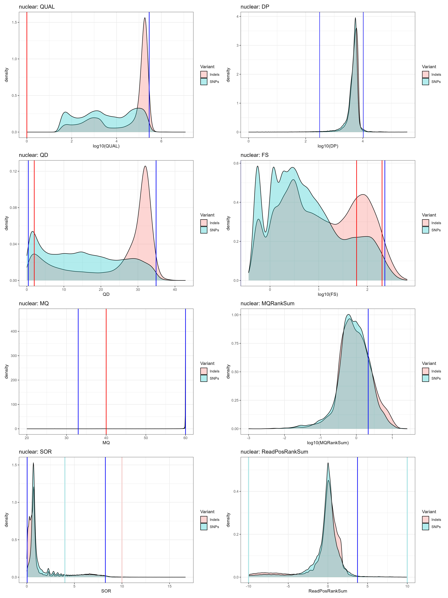
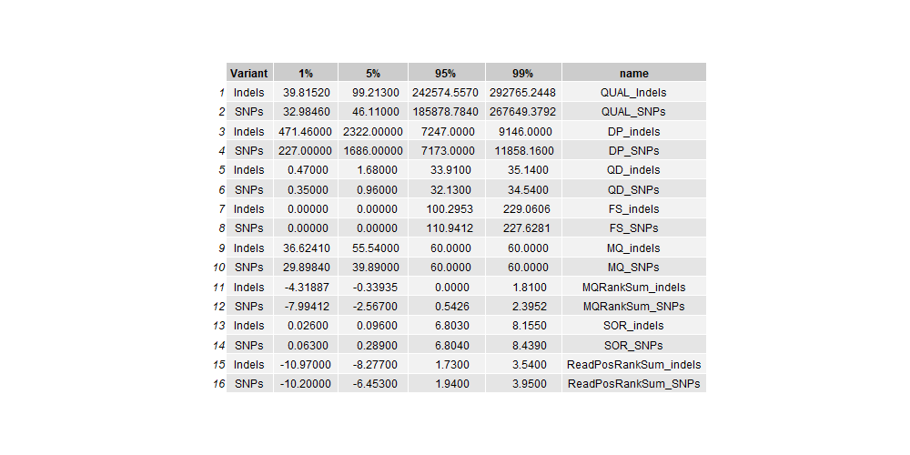

```R
# run mitochondrial variants
fun_variant_summaries(VCF_mito,"mitochondrial")
```
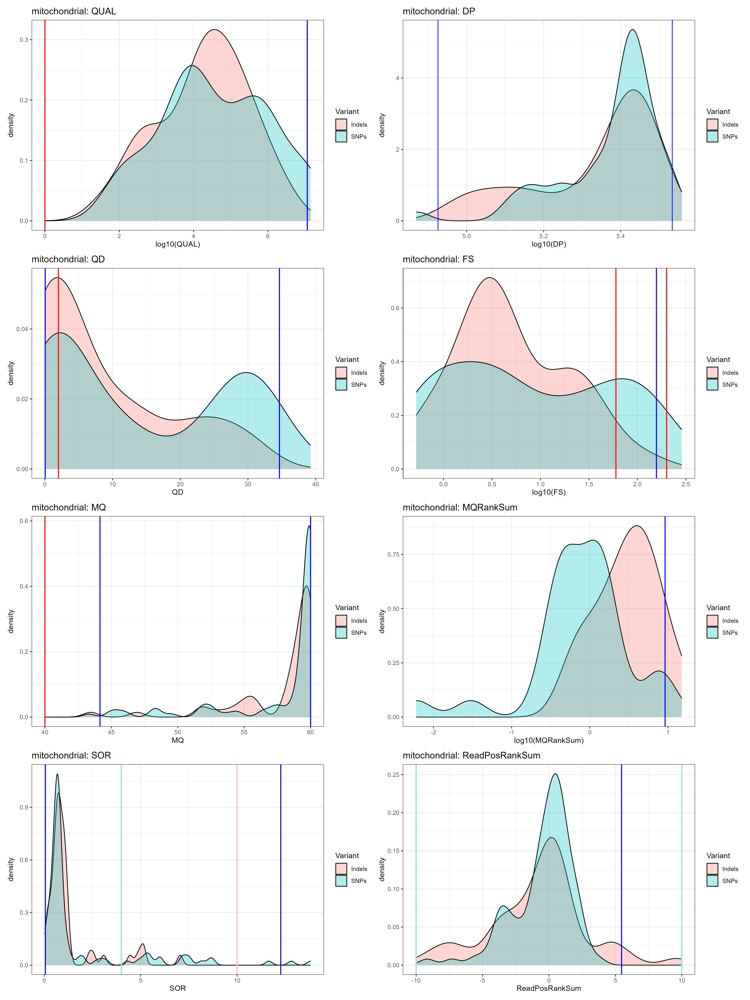
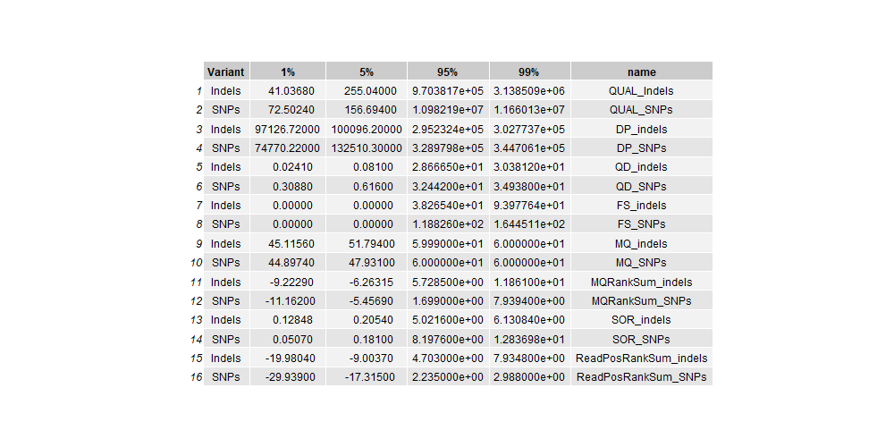

```R
# run wolbachia variants
fun_variant_summaries(VCF_wb,"wolbachia")
```
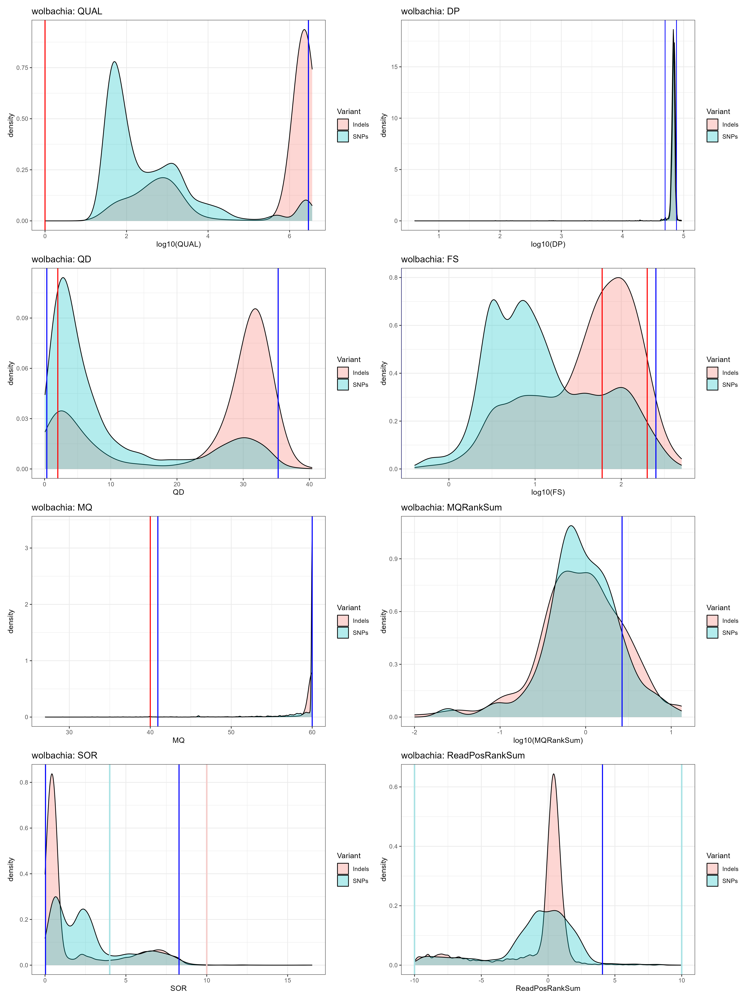
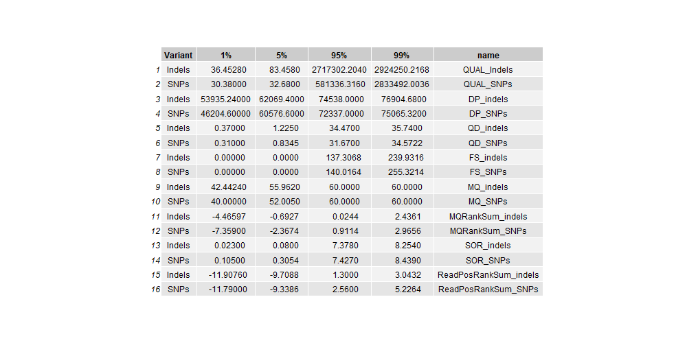

```R
# Plot for mtDNA
##The mitochondrial genome has fewer SNPs so we might want to plot the individual points instead of density. This will give us a better idea of how to filter this data.

  # gatk hardfilter: SNP & INDEL QUAL < 0
  QUAL <-
    ggplot(VCF_mito) +
    geom_point( aes(x=log10(QUAL), y=Variant, colour=Variant)) +
    #xlim(0,10000) +
    theme_bw() +
    labs(title=paste0("mitochondrial",": QUAL"))
  QUAL
  
  # DP doesnt have a hardfilter
  DP <-
    ggplot(VCF_mito) +
    geom_point( aes(x=log10(DP), y=Variant, colour=Variant)) +
    theme_bw() +
    labs(title=paste0("mitochondrial",": DP"))
  DP
  
  # gatk hardfilter: SNP & INDEL QD < 2
  QD <-
    ggplot(VCF_mito) +
    geom_point( aes(x=QD, y=Variant, colour=Variant)) +
    theme_bw() +
    labs(title=paste0("mitochondrial",": QD"))
  QD
  # Removed 1 rows containing missing values (`geom_point()`). 
  
  # gatk hardfilter: SNP FS > 60, INDEL FS > 200
  FS <-
    ggplot(VCF_mito) +
    geom_point( aes(x=log10(FS), y=Variant, colour=Variant)) +
    #xlim(0,250) +
    theme_bw() +
    labs(title=paste0("mitochondrial",": FS"))
  FS
  
  # gatk hardfilter: SNP & INDEL MQ < 30
  MQ <-
    ggplot(VCF_mito) +
    geom_point( aes(x=MQ, y=Variant, colour=Variant)) +
    theme_bw() +
    labs(title=paste0("mitochondrial",": MQ"))
  MQ
  
  # gatk hardfilter: SNP MQRankSum < -20
  MQRankSum <-
    ggplot(VCF_mito) +
    geom_point( aes(x=log10(MQRankSum), y=Variant, colour=Variant)) +
    theme_bw() +
    labs(title=paste0("mitochondrial",": MQRankSum"))
  MQRankSum
  # Removed 86 rows containing missing values (`geom_point()`). 
  
  
  # gatk hardfilter: SNP SOR < 4 , INDEL SOR > 10
  SOR <-
    ggplot(VCF_mito) +
    geom_point( aes(x=SOR, y=Variant, colour=Variant)) +
    theme_bw() +
    labs(title=paste0("mitochondrial",": SOR"))
  SOR
  
  # gatk hardfilter: SNP ReadPosRankSum <-10 , INDEL ReadPosRankSum < -20
  ReadPosRankSum <-
    ggplot(VCF_mito) +
    geom_point( aes(x=ReadPosRankSum, y=Variant, colour=Variant)) +
    theme_bw() +
    labs(title=paste0("mitochondrial",": ReadPosRankSum"))
  ReadPosRankSum
  # Removed 6 rows containing missing values (`geom_point()`). 
  
  
  plot <- QUAL + DP + QD + FS + MQ + MQRankSum + SOR + ReadPosRankSum + plot_layout(ncol=2)
  
  print(plot)
  
  ggsave(paste0("plot_mitochondrial_indiv_variant_summaries.png"), height=20, width=15, type="cairo")
```
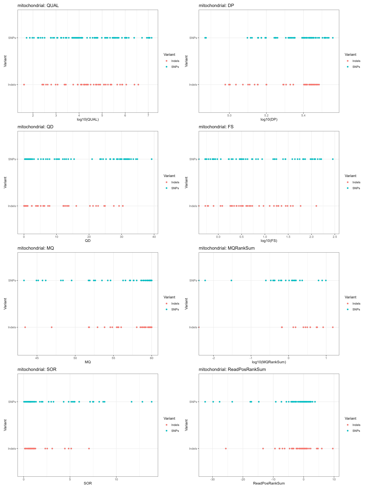
Notice how everything is in 1 line on the y-axis because I used geom_point(). What if there are thousands of points voerlapping one another and I just can't see them? To combat this, I can use geom_jitter() which spreads things out so I can see them properly (but the y-axis doesn't really mean anything, it is simply to help visualise things).


Using geom_jitter():

```R
 # Repeat the same thing as above but use geom_jitter instead of geom_point.
  # gatk hardfilter: SNP & INDEL QUAL < 0
  QUAL <-
    ggplot(VCF_mito) +
    geom_jitter( aes(x=log10(QUAL), y=Variant, colour=Variant)) +
    #xlim(0,10000) +
    theme_bw() +
    labs(title=paste0("mitochondrial",": QUAL"))
  QUAL
  
  # DP doesnt have a hardfilter
  DP <-
    ggplot(VCF_mito) +
    geom_jitter( aes(x=log10(DP), y=Variant, colour=Variant)) +
    theme_bw() +
    labs(title=paste0("mitochondrial",": DP"))
  DP
  
  # gatk hardfilter: SNP & INDEL QD < 2
  QD <-
    ggplot(VCF_mito) +
    geom_jitter( aes(x=QD, y=Variant, colour=Variant)) +
    theme_bw() +
    labs(title=paste0("mitochondrial",": QD"))
  QD
  # Removed 1 rows containing missing values (`geom_point()`). 
  
  # gatk hardfilter: SNP FS > 60, INDEL FS > 200
  FS <-
    ggplot(VCF_mito) +
    geom_jitter( aes(x=log10(FS), y=Variant, colour=Variant)) +
    #xlim(0,250) +
    theme_bw() +
    labs(title=paste0("mitochondrial",": FS"))
  FS
  
  # gatk hardfilter: SNP & INDEL MQ < 30
  MQ <-
    ggplot(VCF_mito) +
    geom_jitter( aes(x=MQ, y=Variant, colour=Variant)) +
    theme_bw() +
    labs(title=paste0("mitochondrial",": MQ"))
  MQ
  
  # gatk hardfilter: SNP MQRankSum < -20
  MQRankSum <-
    ggplot(VCF_mito) +
    geom_jitter( aes(x=log10(MQRankSum), y=Variant, colour=Variant)) +
    theme_bw() +
    labs(title=paste0("mitochondrial",": MQRankSum"))
  MQRankSum
  # Removed 86 rows containing missing values (`geom_point()`). 
  
  
  # gatk hardfilter: SNP SOR < 4 , INDEL SOR > 10
  SOR <-
    ggplot(VCF_mito) +
    geom_jitter( aes(x=SOR, y=Variant, colour=Variant)) +
    theme_bw() +
    labs(title=paste0("mitochondrial",": SOR"))
  SOR
  
  # gatk hardfilter: SNP ReadPosRankSum <-10 , INDEL ReadPosRankSum < -20
  ReadPosRankSum <-
    ggplot(VCF_mito) +
    geom_jitter( aes(x=ReadPosRankSum, y=Variant, colour=Variant)) +
    theme_bw() +
    labs(title=paste0("mitochondrial",": ReadPosRankSum"))
  ReadPosRankSum
  # Removed 6 rows containing missing values (`geom_point()`). 
  
  
  plot <- QUAL + DP + QD + FS + MQ + MQRankSum + SOR + ReadPosRankSum + plot_layout(ncol=2)
  
  print(plot)
  
  ggsave(paste0("plot_mitochondrial_indiv_variant_summaries_jitter.png"), height=20, width=15, type="cairo")
```
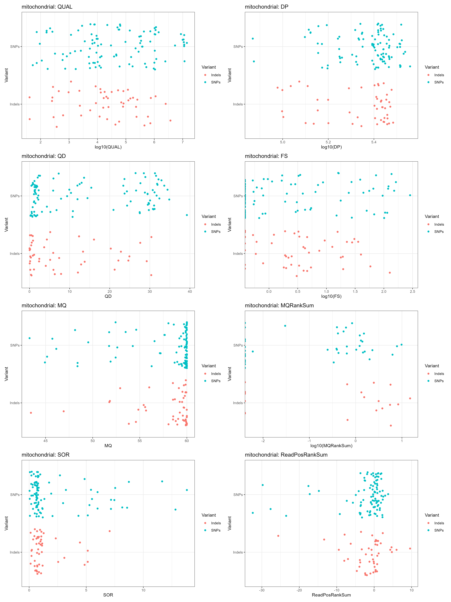
You can now visualise the points much better.


### Attending to the quantiles, thresholds for specific parameters are established

```bash
#!/bin/bash

# PBS directives 
#PBS -P RDS-FSC-Heartworm_MLR-RW
#PBS -N snps_qc2
#PBS -l select=1:ncpus=1:mem=10GB
#PBS -l walltime=00:10:00
#PBS -m e
#PBS -q defaultQ
#PBS -o snps_qc2.txt

# qsub ../snps_qc2.pbs


# load gatk
module load gatk/4.1.4.1

WORKING_DIR=/scratch/RDS-FSC-Heartworm_MLR-RW/mapping/extra_data/analysis/mapping/filter

# set reference, vcf
REFERENCE=/project/RDS-FSC-Heartworm_MLR-RW/HW_WGS_ALL/data/analysis/mapping/dimmitis_WSI_2.2.fa

cd ${WORKING_DIR}

#Nuclear
gatk VariantFiltration \
--reference ${REFERENCE} \
--variant Dirofilaria_immitis_Sep2023.nuclearSNPs.vcf \
--filter-expression 'QUAL < 32 || DP < 242 || DP > 12121 || MQ < 29.72 || SOR > 8.439 || QD < 0.340 || FS > 109.583 || MQRankSum < -7.893 || ReadPosRankSum < -10.220 || ReadPosRankSum > 4.110' \
--filter-name "SNP_filtered" \
--output Dirofilaria_immitis_Sep2023.nuclearSNPs.filtered.vcf

gatk VariantFiltration \
--reference ${REFERENCE} \
--variant Dirofilaria_immitis_Sep2023.nuclearINDELs.vcf \
--filter-expression 'QUAL < 40 || DP < 503 || DP > 9138 || MQ < 36.69 || SOR > 8.155 || QD < 0.450 || FS > 102.876 || MQRankSum < -4.191 || ReadPosRankSum < -11.070 || ReadPosRankSum > 3.450' \
--filter-name "INDEL_filtered" \
--output Dirofilaria_immitis_Sep2023.nuclearINDELs.filtered.vcf

#Mitochondrial
gatk VariantFiltration \
--reference ${REFERENCE} \
--variant Dirofilaria_immitis_Sep2023.mitoSNPs.vcf \
--filter-expression ' QUAL < 73 || DP < 74770 || DP > 344706 || MQ < 44.90 || SOR > 12.837 || QD < 0.309 || FS > 118.826 || MQRankSum < -11.162 || ReadPosRankSum < -29.939 || ReadPosRankSum > 2.988 ' \
--filter-name "SNP_filtered" \
--output Dirofilaria_immitis_Sep2023.mitoSNPs.filtered.vcf

gatk VariantFiltration \
--reference ${REFERENCE} \
--variant Dirofilaria_immitis_Sep2023.mitoINDELs.vcf \
--filter-expression 'QUAL < 41 || DP < 97127 || DP > 302774 || MQ < 45.12 || SOR > 6.131 || QD < 0.024 || FS > 38.265 || MQRankSum < -9.223 || ReadPosRankSum < -19.980 || ReadPosRankSum > 7.935' \
--filter-name "INDEL_filtered" \
--output Dirofilaria_immitis_Sep2023.mitoINDELs.filtered.vcf

#Wolbachia
gatk VariantFiltration \
--reference ${REFERENCE} \
--variant Dirofilaria_immitis_Sep2023.WbSNPs.vcf \
--filter-expression ' QUAL < 30 || DP < 46205 || DP > 75065 || MQ < 40.00 || SOR > 8.439 || QD < 0.310 || FS > 140.016 || MQRankSum < -7.359 || ReadPosRankSum < -11.790 || ReadPosRankSum > 5.226' \
--filter-name "SNP_filtered" \
--output Dirofilaria_immitis_Sep2023.WbSNPs.filtered.vcf

gatk VariantFiltration \
--reference ${REFERENCE} \
--variant Dirofilaria_immitis_Sep2023.WbINDELs.vcf \
--filter-expression 'QUAL < 36 || DP < 53935 || DP > 76905 || MQ < 42.44 || SOR > 8.254 || QD < 0.370 || FS > 137.307 || MQRankSum < -4.466 || ReadPosRankSum < -11.908 || ReadPosRankSum > 3.043' \
--filter-name "INDEL_filtered" \
--output Dirofilaria_immitis_Sep2023.WbINDELs.filtered.vcf

# once done, count the filtered sites - funny use of "|" allows direct markdown table format
echo -e "| Filtered_VCF | Variants_PASS | Variants_FILTERED |\n| -- | -- | -- | " > filter.stats

for i in *filtered.vcf; do
     name=${i}; pass=$( grep -E 'PASS' ${i} | wc -l ); filter=$( grep -E 'filter' ${i} | wc -l );
     echo -e "| ${name} | ${pass} | ${filter} |" >> filter.stats
done
```
This is the summary of the filtered variants ('filter.stats'):
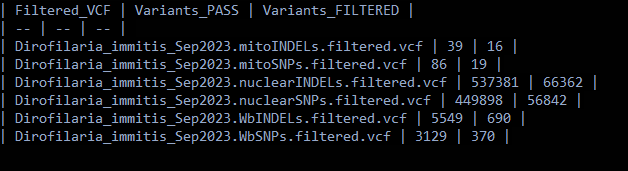

Filtering looks ok. Didn't lose too many SNPs.

Usually we would merge the SNP and INDEL files together to make a joined VCF. However, I want to disregard the indels moving forward and only focus on the SNPs. Some downstream tools don't like having indels in there.


### Filter genotypes based on x3 depth per genotype

```bash
#!/bin/bash

# PBS directives 
#PBS -P RDS-FSC-Heartworm_MLR-RW
#PBS -N snps_qc3
#PBS -l select=1:ncpus=1:mem=10GB
#PBS -l walltime=00:30:00
#PBS -m e
#PBS -q defaultQ
#PBS -o snps_qc3.txt

# qsub ../snps_qc3.pbs

# load gatk
module load gatk/4.1.4.1

WORKING_DIR=/scratch/RDS-FSC-Heartworm_MLR-RW/mapping/extra_data/analysis/mapping/filter

# set reference, vcf
REFERENCE=/project/RDS-FSC-Heartworm_MLR-RW/HW_WGS_ALL/data/analysis/mapping/dimmitis_WSI_2.2.fa
VCF=/scratch/RDS-FSC-Heartworm_MLR-RW/mapping/extra_data/analysis/mapping/filter/Dirofilaria_immitis_Sep2023.vcf.gz

cd ${WORKING_DIR}

#Nuclear 
gatk VariantFiltration \
--reference ${REFERENCE} \
--variant ${VCF%.vcf.gz}.nuclearSNPs.filtered.vcf \
--genotype-filter-expression ' DP < 3 '  \
--genotype-filter-name "DP_lt3" \
--output ${VCF%.vcf.gz}.nuclearSNPs.DPfiltered.vcf

gatk SelectVariants \
--reference ${REFERENCE} \
--variant ${VCF%.vcf.gz}.nuclearSNPs.DPfiltered.vcf \
--set-filtered-gt-to-nocall \
--output ${VCF%.vcf.gz}.nuclearSNPs.DPfilterNoCall.vcf

#Mito
gatk VariantFiltration \
--reference ${REFERENCE} \
--variant ${VCF%.vcf.gz}.mitoSNPs.filtered.vcf \
--genotype-filter-expression ' DP < 3 '  \
--genotype-filter-name "DP_lt3" \
--output ${VCF%.vcf.gz}.mitoSNPs.DPfiltered.vcf

gatk SelectVariants \
--reference ${REFERENCE} \
--variant ${VCF%.vcf.gz}.mitoSNPs.DPfiltered.vcf \
--set-filtered-gt-to-nocall \
--output ${VCF%.vcf.gz}.mitoSNPs.DPfilterNoCall.vcf

#wolbachia
gatk VariantFiltration \
--reference ${REFERENCE} \
--variant ${VCF%.vcf.gz}.WbSNPs.filtered.vcf \
--genotype-filter-expression ' DP < 3 '  \
--genotype-filter-name "DP_lt3" \
--output ${VCF%.vcf.gz}.WbSNPs.DPfiltered.vcf

gatk SelectVariants \
--reference ${REFERENCE} \
--variant ${VCF%.vcf.gz}.WbSNPs.DPfiltered.vcf \
--set-filtered-gt-to-nocall \
--output ${VCF%.vcf.gz}.WbSNPs.DPfilterNoCall.vcf
```

### Now we apply a set of standard filters for population genomics

```bash
#!/bin/bash

# PBS directives 
#PBS -P RDS-FSC-Heartworm_MLR-RW
#PBS -N snps_qc4
#PBS -l select=1:ncpus=1:mem=4GB
#PBS -l walltime=00:05:00
#PBS -m e
#PBS -q defaultQ
#PBS -o snps_qc4.txt

# qsub ../snps_qc4.pbs

# load gatk
module load gatk/4.1.4.1
module load vcftools/0.1.14

WORKING_DIR=/scratch/RDS-FSC-Heartworm_MLR-RW/mapping/extra_data/analysis/mapping/filter/filter1

# set vcf
VCF=/scratch/RDS-FSC-Heartworm_MLR-RW/mapping/extra_data/analysis/mapping/filter/filter1/Dirofilaria_immitis_Sep2023.vcf.gz


cd ${WORKING_DIR}

#Nuclear variants
vcftools \
--vcf ${VCF%.vcf.gz}.nuclearSNPs.DPfilterNoCall.vcf \
--remove-filtered-geno-all \
--remove-filtered-all \
--min-alleles 2 \
--max-alleles 2 \
--hwe 1e-06 \
--maf 0.02 \
--recode \
--recode-INFO-all \
--out ${VCF%.vcf.gz}.nuclear_SNPs.final
# After filtering, kept 61 out of 61 Individuals
#Outputting VCF file...
#After filtering, kept 250164 out of a possible 506734 Sites

# Changed --maf from 0.05 to 0.02 to follow Javier's code

#--- nuclear SNPs
vcftools --vcf Dirofilaria_immitis_Sep2023.nuclear_SNPs.final.recode.vcf --remove-indels
#After filtering, kept 61 out of 61 Individuals
#After filtering, kept 250164 out of a possible 250164 Sites

#--- nuclear  INDELs
vcftools --vcf Dirofilaria_immitis_Sep2023.nuclear_SNPs.final.recode.vcf --keep-only-indels
#After filtering, kept 61 out of 61 Individuals
#After filtering, kept 0 out of a possible 250164 Sites


#Mitochondrial variants
vcftools \
--vcf ${VCF%.vcf.gz}.mitoSNPs.DPfilterNoCall.vcf \
--remove-filtered-geno-all \
--remove-filtered-all \
--min-alleles 2 \
--max-alleles 2 \
--maf 0.02 \
--recode \
--recode-INFO-all \
--out ${VCF%.vcf.gz}.mito_SNPs.final
#After filtering, kept 61 out of 61 Individuals
#Outputting VCF file...
#After filtering, kept 32 out of a possible 99 Sites


#--- mito SNPs
vcftools --vcf Dirofilaria_immitis_Sep2023.mito_SNPs.final.recode.vcf --remove-indels
#After filtering, kept 61 out of 61 Individuals
#After filtering, kept 32 out of a possible 32 Sites

#--- mito INDELs
vcftools --vcf Dirofilaria_immitis_Sep2023.mito_SNPs.final.recode.vcf --keep-only-indels
#After filtering, kept 61 out of 61 Individuals
#After filtering, kept 0 out of a possible 32 Sites


#wolbachia variants
vcftools \
--vcf ${VCF%.vcf.gz}.WbSNPs.DPfilterNoCall.vcf \
--remove-filtered-geno-all \
--remove-filtered-all \
--min-alleles 2 \
--max-alleles 2 \
--maf 0.02 \
--recode \
--recode-INFO-all \
--out ${VCF%.vcf.gz}.Wb_SNPs.final
#After filtering, kept 61 out of 61 Individuals
#Outputting VCF file...
#After filtering, kept 480 out of a possible 3493 Sites


#--- Wb SNPs
vcftools --vcf Dirofilaria_immitis_Sep2023.Wb_SNPs.final.recode.vcf --remove-indels
# After filtering, kept 61 out of 61 Individuals
#After filtering, kept 480 out of a possible 480 Sites

#--- Wb INDELs
vcftools --vcf Dirofilaria_immitis_Sep2023.Wb_SNPs.final.recode.vcf --keep-only-indels
# After filtering, kept 61 out of 61 Individuals
#After filtering, kept 0 out of a possible 480 Sites
```

### Now, we are filtering by missingness

```bash
#!/bin/bash

# PBS directives 
#PBS -P RDS-FSC-Heartworm_MLR-RW
#PBS -N snps_qc5
#PBS -l select=1:ncpus=1:mem=10GB
#PBS -l walltime=00:10:00
#PBS -m e
#PBS -q defaultQ
#PBS -o snps_qc5.txt

# qsub ../snps_qc5.pbs

# load modules
module load gatk/4.1.4.1
module load vcftools/0.1.14

WORKING_DIR=/scratch/RDS-FSC-Heartworm_MLR-RW/mapping/extra_data/analysis/mapping/filter/filter1

# set vcf
VCF=/scratch/RDS-FSC-Heartworm_MLR-RW/mapping/extra_data/analysis/mapping/filter/filter1/Dirofilaria_immitis_Sep2023.vcf.gz

cd ${WORKING_DIR}

#determine missingness per individual
vcftools --vcf ${VCF%.vcf.gz}.nuclear_SNPs.final.recode.vcf --out nuclear --missing-indv
vcftools --vcf ${VCF%.vcf.gz}.mito_SNPs.final.recode.vcf --out mito --missing-indv
vcftools --vcf ${VCF%.vcf.gz}.Wb_SNPs.final.recode.vcf --out wb --missing-indv
```

### Check the missingess in R

```R
 # Check missingness
  data_nuclear <- read.delim("nuclear.imiss", header=T)
  data_mito <- read.delim("mito.imiss", header=T)
  data_wb <- read.delim("wb.imiss", header=T)
  
  #creating the function - per sample
  fun_plot_missingness <- function(data,title) {
    
    plot <- ggplot(data, aes(INDV, 1-F_MISS)) +
      geom_boxplot(color = 'brown') +
      geom_point(size = 1, color = 'brown4') +
      theme_bw() +
      labs(x="Sample ID", y="Proportion of total variants present (1-missingness)")+
      ggtitle(title) +
      theme(axis.text.x = element_text(angle = 45, hjust = 1))
    print(plot)
    ggsave(paste0("plot_missingness_figure",title,".png"))
  }
  
  # plotting for each dataset
  fun_plot_missingness(data_nuclear, "nuclear_variants")
```
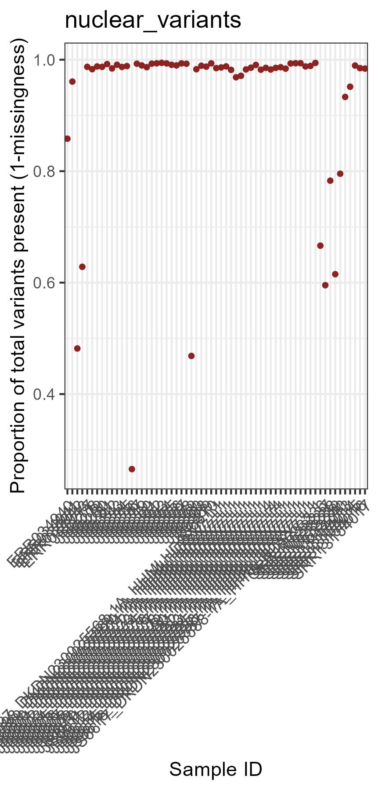


```R
  fun_plot_missingness(data_mito,"mitochondrial_variants")
```
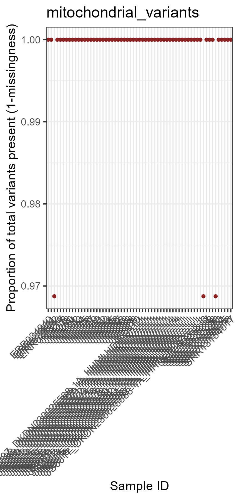

```R
  fun_plot_missingness(data_wb, "wb_variants")
```
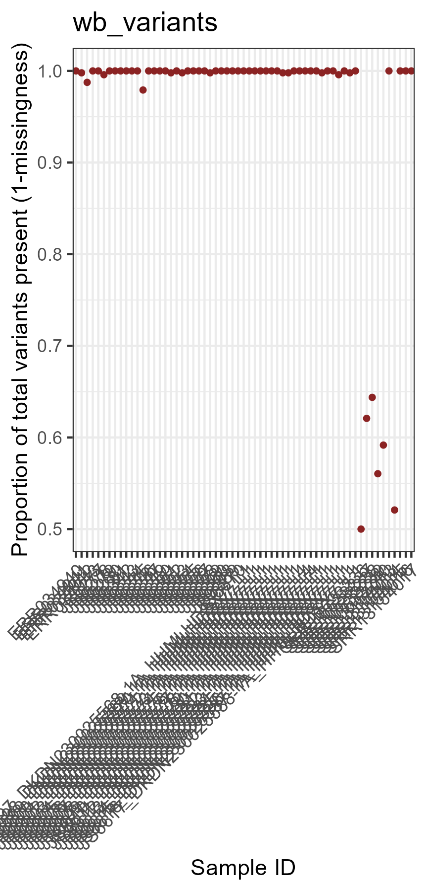


In Javier's code, he generated a different sample list for each database and evaluated the max missingness. For now, I will just keep all the samples.

```bash
# For nuclear (n=31) - nuclear_samplelist.keep
ERR034940
ERR034941
ERR034942
ERR034943
JS6597_DKDN230025568-1A_HHMLHDSX7_L1
JS6598_DKDN230025569-1A_HHMLHDSX7_L1
JS6599_DKDN230025570-1A_HHMLHDSX7_L1
JS6600_DKDN230025571-1A_HHMLHDSX7_L1
JS6601_DKDN230025572-1A_HHMLHDSX7_L1
JS6602_DKDN230025573-1A_HHMLHDSX7_L1
JS6603_DKDN230025574-1A_HHMLHDSX7_L1
JS6604_DKDN230025575-1A_HHMLHDSX7_L1
JS6605_DKDN230025576-1A_HHMLHDSX7_L1
JS6606_DKDN230025577-1A_HHMLHDSX7_L1
JS6607_DKDN230025578-1A_HHMLHDSX7_L4
JS6608_DKDN230025579-1A_HHMLHDSX7_L4
JS6609_DKDN230025580-1A_HHMLHDSX7_L4
JS6610_DKDN230025581-1A_HHMLHDSX7_L1
JS6611_DKDN230025582-1A_HHMLHDSX7_L1
JS6612_DKDN230025583-1A_HHMLHDSX7_L1
JS6613_DKDN230025584-1A_HHMLHDSX7_L1
JS6614_DKDN230025585-1A_HHMLHDSX7_L1
JS6615_DKDN230025586-1A_HHMLHDSX7_L1
JS6616_DKDN230025587-1A_HHMLHDSX7_L1
JS6617_DKDN230025588-1A_HHMLHDSX7_L1
SRR10533236
SRR10533237
SRR10533238
SRR10533239
SRR10533240
JS6277
JS6278
JS6279
JS6280
JS6281
JS6342
JS6343
JS6344
JS6345
JS6346
JS6347
JS6349
JS6350
JS6351
JS6352
JS6353
JS6354
JS6355
JS6356
JS6357
JS6358
JS6359
JS6360
JS6368
JS6369
JS6370
SRR13154013
SRR13154014
SRR13154015
SRR13154016
SRR13154017

# For mithochondiral (n=31) - mito_samplelist.keep
#Same as above

# For wb (n=31) - wb_samplelist.keep
#same as above
```


### Let's check different thresholds for each dataset

```bash
#!/bin/bash

# PBS directives 
#PBS -P RDS-FSC-Heartworm_MLR-RW
#PBS -N snps_qc6
#PBS -l select=1:ncpus=1:mem=10GB
#PBS -l walltime=00:20:00
#PBS -m e
#PBS -q defaultQ
#PBS -o snps_qc6.txt

# qsub ../snps_qc6.pbs

# load gatk
module load gatk/4.1.4.1
module load vcftools/0.1.14

WORKING_DIR=/scratch/RDS-FSC-Heartworm_MLR-RW/mapping/extra_data/analysis/mapping/filter/filter1

# set vcf
VCF=/scratch/RDS-FSC-Heartworm_MLR-RW/mapping/extra_data/analysis/mapping/filter/filter1/Dirofilaria_immitis_Sep2023.vcf.gz

cd ${WORKING_DIR}

# For nuclear variants
for i in 0.7 0.8 0.9 1; do
     vcftools --vcf ${VCF%.vcf.gz}.nuclear_SNPs.final.recode.vcf --keep nuclear_samplelist.keep --max-missing ${i} ;
done

# max-missing = 0.7
# After filtering, kept 61 out of 61 Individuals
#After filtering, kept 245000 out of a possible 250164 Sites

# max-missing = 0.8
# After filtering, kept 61 out of 61 Individuals
#After filtering, kept 240489 out of a possible 250164 Sites

# max-missing = 0.9
# After filtering, kept 61 out of 61 Individuals
#After filtering, kept 205561 out of a possible 250164 Sites

# max-missing = 1
# After filtering, kept 61 out of 61 Individuals
#After filtering, kept 7025 out of a possible 250164 Sites


# For mito variants
for i in 0.7 0.8 0.9 1; do
     vcftools --vcf ${VCF%.vcf.gz}.mito_SNPs.final.recode.vcf --keep mito_samplelist.keep --max-missing ${i} ;
done

# max-missing = 0.7
# After filtering, kept 61 out of 61 Individuals
#After filtering, kept 32 out of a possible 32 Sites

# max-missing = 0.8
# After filtering, kept 61 out of 61 Individuals
#After filtering, kept 32 out of a possible 32 Sites

# max-missing = 0.9
# After filtering, kept 61 out of 61 Individuals
#After filtering, kept 32 out of a possible 32 Sites

# max-missing = 1
# After filtering, kept 61 out of 61 Individuals
#After filtering, kept 30 out of a possible 32 Sites


# For Wb variants
for i in 0.7 0.8 0.9 1; do
     vcftools --vcf ${VCF%.vcf.gz}.Wb_SNPs.final.recode.vcf --keep wb_samplelist.keep --max-missing ${i} ;
done

# max-missing = 0.7
# After filtering, kept 61 out of 61 Individuals
#After filtering, kept 480 out of a possible 480 Sites

# max-missing = 0.8
# After filtering, kept 61 out of 61 Individuals
#After filtering, kept 480 out of a possible 480 Sites

# max-missing = 0.9
# After filtering, kept 61 out of 61 Individuals
#After filtering, kept 473 out of a possible 480 Sites

# max-missing = 1
# After filtering, kept 61 out of 61 Individuals
#After filtering, kept 64 out of a possible 480 Sites
```

Selecting a max missingness of 0.9 for nuclear, 1 for mito and 0.9 for Wb is sensible.

```bash
#!/bin/bash

# PBS directives 
#PBS -P RDS-FSC-Heartworm_MLR-RW
#PBS -N snps_qc7
#PBS -l select=1:ncpus=1:mem=10GB
#PBS -l walltime=00:10:00
#PBS -m e
#PBS -q defaultQ
#PBS -o snps_qc7.txt

# qsub ../snps_qc7.pbs

# load gatk
module load gatk/4.1.4.1
module load vcftools/0.1.14

WORKING_DIR=/scratch/RDS-FSC-Heartworm_MLR-RW/mapping/extra_data/analysis/mapping/filter/filter1

# set vcf
VCF=/scratch/RDS-FSC-Heartworm_MLR-RW/mapping/extra_data/analysis/mapping/filter/filter1/Dirofilaria_immitis_Sep2023.vcf.gz

cd ${WORKING_DIR}

# For nuclear
vcftools --vcf ${VCF%.vcf.gz}.nuclear_SNPs.final.recode.vcf \
     --keep nuclear_samplelist.keep \
     --max-missing 0.9 \
     --recode --recode-INFO-all \
     --out FINAL_SETS/nuclear_samples3x_missing0.9

# For mito
vcftools --vcf ${VCF%.vcf.gz}.mito_SNPs.final.recode.vcf \
     --keep mito_samplelist.keep \
     --max-missing 1 \
     --recode --recode-INFO-all \
     --out FINAL_SETS/mito_samples3x_missing1

# For wb
vcftools --vcf ${VCF%.vcf.gz}.Wb_SNPs.final.recode.vcf \
     --keep wb_samplelist.keep \
     --max-missing 0.9 \
     --recode --recode-INFO-all \
     --out FINAL_SETS/wb_samples3x_missing0.9
```

### Also, we will select only the variants in the chr 1 to chr4, avoiding the chrX and the scaffolds

```bash
#!/bin/bash

# PBS directives 
#PBS -P RDS-FSC-Heartworm_MLR-RW
#PBS -N snps_qc8
#PBS -l select=1:ncpus=1:mem=4GB
#PBS -l walltime=00:10:00
#PBS -m e
#PBS -q defaultQ
#PBS -o snps_qc8.txt

# qsub ../snps_qc8.pbs

# load gatk
module load vcftools/0.1.14

cd /scratch/RDS-FSC-Heartworm_MLR-RW/mapping/extra_data/analysis/mapping/filter/filter1

vcftools --vcf FINAL_SETS/nuclear_samples3x_missing0.9.recode.vcf \
--chr dirofilaria_immitis_chr1 \
--chr dirofilaria_immitis_chr2 \
--chr dirofilaria_immitis_chr3 \
--chr dirofilaria_immitis_chr4 \
--recode --out FINAL_SETS/nuclear_samples3x_missing0.9.chr1to4
# After filtering, kept 61 out of 61 Individuals
#Outputting VCF file...
#After filtering, kept 153555 out of a possible 205561 Sites


vcftools --vcf FINAL_SETS/nuclear_samples3x_missing0.9.chr1to4.recode.vcf --remove-indels
# After filtering, kept 61 out of 61 Individuals
#After filtering, kept 153555 out of a possible 153555 Sites


vcftools --vcf FINAL_SETS/nuclear_samples3x_missing0.9.chr1to4.recode.vcf --keep-only-indels
# After filtering, kept 61 out of 61 Individuals
#After filtering, kept 0 out of a possible 153555 Sites- this makes sense because I removed the indels earlier and only focused on the SNPs.
```

I can run this code to exclude certain samples if I want:

```bash
#!/bin/bash

# PBS directives 
#PBS -P RDS-FSC-Heartworm_MLR-RW
#PBS -N vcf_exclude
#PBS -l select=1:ncpus=8:mem=50GB
#PBS -l walltime=05:00:00
#PBS -m abe
#PBS -q defaultQ
#PBS -o vcf_exclude.txt
#PBS -M rosemonde.power@sydney.edu.au

# qsub ../vcf_exclude.pbs

# load modules
module load bcftools/1.11

cd /scratch/RDS-FSC-Heartworm_MLR-RW/mapping/extra_data/analysis/mapping/filter/FINAL_SETS

bcftools view -s ^ERR034940,ERR034941,ERR034942,ERR034943,SRR10533236,SRR10533237,SRR10533238,SRR10533239,SRR10533240 -o nuclear_samples3x_missing0.9.chr1to4.recode_MYSAMPLES.vcf nuclear_samples3x_missing0.9.chr1to4.recode.vcf
```


Rename samples to more meaningful names:

```bash
#!/bin/bash

# PBS directives 
#PBS -P RDS-FSC-Heartworm_MLR-RW
#PBS -N vcf_rename
#PBS -l select=1:ncpus=2:mem=20GB
#PBS -l walltime=00:20:00
#PBS -m abe
#PBS -q defaultQ
#PBS -o vcf_rename.txt
#PBS -M rosemonde.power@sydney.edu.au

# qsub ../vcf_rename.pbs

# load modules
module load bcftools/1.11

cd /scratch/RDS-FSC-Heartworm_MLR-RW/mapping/extra_data/analysis/mapping/filter/filter1/FINAL_SETS

bcftools reheader -s rename.txt nuclear_samples3x_missing0.9.chr1to4.recode.vcf -o nuclear_samples3x_missing0.9.chr1to4.recode.RENAMED.vcf
```


rename.txt:

ERR034940	ERR034940	
ERR034941	ERR034941	
ERR034942	ERR034942	
ERR034943	ERR034943	
JS6277	Dog2.1	
JS6278	Dog2.2	
JS6279	Dog2.3	
JS6280	Dog2.4	
JS6281	JS6281	
JS6342	JS6342	
JS6343	JS6343	
JS6344	JS6344	
JS6345	JS6345	
JS6346	Fox1	
JS6347	Fox2	
JS6349	JS6349	
JS6350	JS6350	
JS6351	JS6351	
JS6352	JS6352	
JS6353	JS6353	
JS6354	JS6354	
JS6355	JS6355	
JS6356	JS6356	
JS6357	JS6357	
JS6358	JS6358	
JS6359	JS6359	
JS6360	JS6360	
JS6368	JS6368	
JS6369	JS6369	
JS6370	JS6370	
JS6597_DKDN230025568-1A_HHMLHDSX7_L1	JS6597	
JS6598_DKDN230025569-1A_HHMLHDSX7_L1	JS6598	
JS6599_DKDN230025570-1A_HHMLHDSX7_L1	JS6599	
JS6600_DKDN230025571-1A_HHMLHDSX7_L1	JS6600	
JS6601_DKDN230025572-1A_HHMLHDSX7_L1	Dog3.1	
JS6602_DKDN230025573-1A_HHMLHDSX7_L1	Dog3.2	
JS6603_DKDN230025574-1A_HHMLHDSX7_L1	Dog3.3	
JS6604_DKDN230025575-1A_HHMLHDSX7_L1	JS6604	
JS6605_DKDN230025576-1A_HHMLHDSX7_L1	JS6605	
JS6606_DKDN230025577-1A_HHMLHDSX7_L1	JS6606	
JS6607_DKDN230025578-1A_HHMLHDSX7_L4	JS6344-REP	
JS6608_DKDN230025579-1A_HHMLHDSX7_L4	Dog2.3-REP	
JS6609_DKDN230025580-1A_HHMLHDSX7_L4	Dog1-REP	
JS6610_DKDN230025581-1A_HHMLHDSX7_L1	JS6610	
JS6611_DKDN230025582-1A_HHMLHDSX7_L1	JS6611	
JS6612_DKDN230025583-1A_HHMLHDSX7_L1	JS6612	
JS6613_DKDN230025584-1A_HHMLHDSX7_L1	JS6613	
JS6614_DKDN230025585-1A_HHMLHDSX7_L1	JS6614	
JS6615_DKDN230025586-1A_HHMLHDSX7_L1	JS6615	
JS6616_DKDN230025587-1A_HHMLHDSX7_L1	JS6616	
JS6617_DKDN230025588-1A_HHMLHDSX7_L1	JS6617	
SRR10533236	SRR10533236	
SRR10533237	SRR10533237	
SRR10533238	SRR10533238	
SRR10533239	SRR10533239	
SRR10533240	SRR10533240	
SRR13154013	Dog1.1	
SRR13154014	Dog1.2	
SRR13154015	Dog1.3	
SRR13154016	Dog1.4	
SRR13154017	Dog1.5	


Check that it worked:

```bash
# List all sample names in the original VCF
bcftools query -l nuclear_samples3x_missing0.9.chr1to4.recode.RENAMED.vcf
```

Yep all the sample names are changed.


## PCA

```R
######################################################################

# PCA for filt1

######################################################################

library(tidyverse)
library(gdsfmt)
library(SNPRelate)
library(ggsci)
library(ggpubr)
library(reshape2)
library(viridis)
library(vcfR)
library(factoextra)
library(ggrepel)
library(ggtree)
library(poppr)
library(adegenet)
library(ape)
library(ggimage)


# Set working directory
setwd("C:/Users/rpow2134/OneDrive - The University of Sydney (Staff)/Documents/HW_WGS/R_analysis/extra_data/filter1/vcf/input")

#Preparing the data for plotting
# Set colours for different cities
scale_colour_pop <- function(...){
  ggplot2:::manual_scale(
    'colour', 
    values = setNames(
      c('cadetblue1',
        'steelblue1',
        'royalblue4',
        'lightcyan3',
        'darkblue',
        'orchid3',
        'springgreen4',
        'mediumpurple2',
        'orangered3',
        'indianred1',
        'coral2',
        'chocolate1',
        'darkorange3'), 
      c('Lockhart River Cooktown', 'Cairns', 
        'Townsville', 'Rockhampton',
        'Brisbane',
        'Sydney', 'Bangkok', 'Pavia', 'USA', 'Mississippi', 'Illinois', 'Louisiana', 'Georgia')), 
    ...
  )
}


#PCA on nuclear variants using genotypes
snpgdsClose(genofile) # you need this line to close any previous file open, otherwise it won't work if you want to re-run
vcf.in <- "C:/Users/rpow2134/OneDrive - The University of Sydney (Staff)/Documents/HW_WGS/R_analysis/extra_data/filter1/vcf/input/nuclear_samples3x_missing0.9.chr1to4.recode.RENAMED.vcf"
gds<-snpgdsVCF2GDS(vcf.in, "nucDNA.gds", method="biallelic.only")
genofile <- snpgdsOpen(gds)


pca <-snpgdsPCA(genofile, num.thread=2, autosome.only = F)
samples <- as.data.frame(pca$sample.id)
colnames(samples) <- "name"

# Metadata file that describes where the samples come from
metadata_file <- "C:/Users/rpow2134/OneDrive - The University of Sydney (Staff)/Documents/HW_WGS/R_analysis/extra_data/location.csv"
metadata <- read.csv(metadata_file, header = TRUE)

data <- data.frame(sample.id = pca$sample.id,
                   EV1 = pca$eigenvect[,1],  
                   EV2 = pca$eigenvect[,2],
                   EV3 = pca$eigenvect[,3],
                   EV4 = pca$eigenvect[,4],
                   EV5 = pca$eigenvect[,5],
                   EV6 = pca$eigenvect[,6],
                   POPULATION = metadata$city,
                   SAMPLEID = metadata$sample_name,
                   stringsAsFactors = FALSE)

#Generating levels for population and super-population variables
data$POPULATION <- factor(data$POPULATION, 
                          levels = c('Lockhart River Cooktown', 'Cairns', 
                                     'Townsville', 'Rockhampton',
                                     'Brisbane',
                                     'Sydney', 'Bangkok', 'Pavia', 'USA', 'Mississippi', 'Illinois', 'Louisiana', 'Georgia'))


# Plot the eigenvectors
# Calculate the explained variance for non-NaN eigenvalues - some of the later eigenvectors are NaN.
## It is not unusual to have NaN (Not-a-Number) values among the eigenvalues in the context of Principal Component Analysis (PCA). NaN values in eigenvalues typically occur when there is missing or insufficient information in the data for certain principal components to be computed.

explained_variance <- 100 * pca$eigenval[!is.na(pca$eigenval)] / sum(pca$eigenval, na.rm = TRUE)

# Create a barplot
jpeg("C:/Users/rpow2134/OneDrive - The University of Sydney (Staff)/Documents/HW_WGS/R_analysis/extra_data/filter1/vcf/pca/barplot_eigenvalues.jpg", width = 800, height = 600)
barplot(explained_variance, col = "dark green", ylim = c(0, 20))
title(ylab = "Percent of variance explained") 
title(xlab = "Eigenvalues")
dev.off()


# Lets extract the variance associated with the top 4 PCs, so we can use them in our plots.
# Calculate the total variance (excluding NaN values)
eig.total <- sum(pca$eigenval, na.rm = TRUE)


PC1.variance <- formatC(head(pca$eigenval)[1]/eig.total * 100)
PC2.variance <- formatC(head(pca$eigenval)[2]/eig.total * 100)
PC3.variance <- formatC(head(pca$eigenval)[3]/eig.total * 100)
PC4.variance <- formatC(head(pca$eigenval)[4]/eig.total * 100)


PC1.variance
# 16.23
PC2.variance
# 10.17
PC3.variance
# 9.173
PC4.variance
# 7.336


# Make PCA plots

# PC1 vs PC2
PC1_PC2_plot <- ggplot(data, aes(x = EV1, y = EV2, color = POPULATION, label = SAMPLEID)) +
  theme_bw() +
  geom_point(alpha = 0.8, size = 2) +
  geom_text_repel(aes(label = SAMPLEID), box.padding = 0.05, point.padding = 0.01, segment.color = 'grey50', size = 3, hjust = 0, vjust = 0, max.overlaps = Inf, show.legend=FALSE) +
  labs(x = paste0("PC1 variance: ", round(pca$varprop[1] * 100, digits = 2), "%"),
       y = paste0("PC2 variance: ", round(pca$varprop[2] * 100, digits = 2), "%")) +
  scale_colour_pop() +
  theme(legend.position = "right") +  # Adjust legend position as needed
ggtitle("Filter1: PC1 vs PC2")
  
PC1_PC2_plot

ggsave("C:/Users/rpow2134/OneDrive - The University of Sydney (Staff)/Documents/HW_WGS/R_analysis/extra_data/filter1/vcf/pca/PC1_PC2_plot.png", PC1_PC2_plot, height = 6, width = 8)

# PC1 vs PC3
PC1_PC3_plot <- ggplot(data, aes(x = EV1, y = EV3, color = POPULATION, label = SAMPLEID)) +
  theme_bw() +
  geom_point(alpha = 0.8, size = 2) +
  geom_text_repel(aes(label = SAMPLEID), box.padding = 0.05, point.padding = 0.01, segment.color = 'grey50', size = 3, hjust = 0, vjust = 0, max.overlaps = Inf, show.legend=FALSE) +
  labs(x = paste0("PC1 variance: ", round(pca$varprop[1] * 100, digits = 2), "%"),
       y = paste0("PC3 variance: ", round(pca$varprop[3] * 100, digits = 2), "%")) +
  scale_colour_pop() +
  theme(legend.position = "right") +  # Adjust legend position as needed
  ggtitle("Filter1: PC1 vs PC3")

PC1_PC3_plot

ggsave("C:/Users/rpow2134/OneDrive - The University of Sydney (Staff)/Documents/HW_WGS/R_analysis/extra_data/filter1/vcf/pca/PC1_PC3_plot.png", PC1_PC3_plot, height = 6, width = 8)

# PC1 vs PC4
PC1_PC4_plot <- ggplot(data, aes(x = EV1, y = EV4, color = POPULATION, label = SAMPLEID)) +
  theme_bw() +
  geom_point(alpha = 0.8, size = 2) +
  geom_text_repel(aes(label = SAMPLEID), box.padding = 0.05, point.padding = 0.01, segment.color = 'grey50', size = 3, hjust = 0, vjust = 0, max.overlaps = Inf, show.legend=FALSE) +
  labs(x = paste0("PC1 variance: ", round(pca$varprop[1] * 100, digits = 2), "%"),
       y = paste0("PC4 variance: ", round(pca$varprop[4] * 100, digits = 2), "%")) +
  scale_colour_pop() +
  theme(legend.position = "right") +  # Adjust legend position as needed
  ggtitle("Filter1: PC1 vs PC4")

PC1_PC4_plot

ggsave("C:/Users/rpow2134/OneDrive - The University of Sydney (Staff)/Documents/HW_WGS/R_analysis/extra_data/filter1/vcf/pca/PC1_PC4_plot.png", PC1_PC4_plot, height = 6, width = 8)

# PC1 vs PC5
PC1_PC5_plot <- ggplot(data, aes(x = EV1, y = EV5, color = POPULATION, label = SAMPLEID)) +
  theme_bw() +
  geom_point(alpha = 0.8, size = 2) +
  geom_text_repel(aes(label = SAMPLEID), box.padding = 0.05, point.padding = 0.01, segment.color = 'grey50', size = 3, hjust = 0, vjust = 0, max.overlaps = Inf, show.legend=FALSE) +
  labs(x = paste0("PC1 variance: ", round(pca$varprop[1] * 100, digits = 2), "%"),
       y = paste0("PC5 variance: ", round(pca$varprop[5] * 100, digits = 2), "%")) +
  scale_colour_pop() +
  theme(legend.position = "right") +  # Adjust legend position as needed
  ggtitle("Filter1: PC1 vs PC5")

PC1_PC5_plot

ggsave("C:/Users/rpow2134/OneDrive - The University of Sydney (Staff)/Documents/HW_WGS/R_analysis/extra_data/filter1/vcf/pca/PC1_PC5_plot.png", PC1_PC5_plot, height = 6, width = 8)

# PC1 vs PC6
PC1_PC6_plot <- ggplot(data, aes(x = EV1, y = EV6, color = POPULATION, label = SAMPLEID)) +
  theme_bw() +
  geom_point(alpha = 0.8, size = 2) +
  geom_text_repel(aes(label = SAMPLEID), box.padding = 0.05, point.padding = 0.01, segment.color = 'grey50', size = 3, hjust = 0, vjust = 0, max.overlaps = Inf, show.legend=FALSE) +
  labs(x = paste0("PC1 variance: ", round(pca$varprop[1] * 100, digits = 2), "%"),
       y = paste0("PC6 variance: ", round(pca$varprop[6] * 100, digits = 2), "%")) +
  scale_colour_pop() +
  theme(legend.position = "right") +  # Adjust legend position as needed
  ggtitle("Filter1: PC1 vs PC6")

PC1_PC6_plot

ggsave("C:/Users/rpow2134/OneDrive - The University of Sydney (Staff)/Documents/HW_WGS/R_analysis/extra_data/filter1/vcf/pca/PC1_PC6_plot.png", PC1_PC6_plot, height = 6, width = 8)

# PC2 vs PC3
PC2_PC3_plot <- ggplot(data, aes(x = EV2, y = EV3, color = POPULATION, label = SAMPLEID)) +
  theme_bw() +
  geom_point(alpha = 0.8, size = 2) +
  geom_text_repel(aes(label = SAMPLEID), box.padding = 0.05, point.padding = 0.01, segment.color = 'grey50', size = 3, hjust = 0, vjust = 0, max.overlaps = Inf, show.legend=FALSE) +
  labs(x = paste0("PC2 variance: ", round(pca$varprop[2] * 100, digits = 2), "%"),
       y = paste0("PC3 variance: ", round(pca$varprop[3] * 100, digits = 2), "%")) +
  scale_colour_pop() +
  theme(legend.position = "right") +  # Adjust legend position as needed
  ggtitle("Filter1: PC2 vs PC3")

PC2_PC3_plot

ggsave("C:/Users/rpow2134/OneDrive - The University of Sydney (Staff)/Documents/HW_WGS/R_analysis/extra_data/filter1/vcf/pca/PC2_PC3_plot.png", PC2_PC3_plot, height = 6, width = 8)

# PC2 vs PC4
PC2_PC4_plot <- ggplot(data, aes(x = EV2, y = EV4, color = POPULATION, label = SAMPLEID)) +
  theme_bw() +
  geom_point(alpha = 0.8, size = 2) +
  geom_text_repel(aes(label = SAMPLEID), box.padding = 0.05, point.padding = 0.01, segment.color = 'grey50', size = 3, hjust = 0, vjust = 0, max.overlaps = Inf, show.legend=FALSE) +
  labs(x = paste0("PC2 variance: ", round(pca$varprop[2] * 100, digits = 2), "%"),
       y = paste0("PC4 variance: ", round(pca$varprop[4] * 100, digits = 2), "%")) +
  scale_colour_pop() +
  theme(legend.position = "right") +  # Adjust legend position as needed
  ggtitle("Filter1: PC2 vs PC4")

PC2_PC4_plot

ggsave("C:/Users/rpow2134/OneDrive - The University of Sydney (Staff)/Documents/HW_WGS/R_analysis/extra_data/filter1/vcf/pca/PC2_PC4_plot.png", PC2_PC4_plot, height = 6, width = 8)

# PC3 vs PC4
PC3_PC4_plot <- ggplot(data, aes(x = EV3, y = EV4, color = POPULATION, label = SAMPLEID)) +
  theme_bw() +
  geom_point(alpha = 0.8, size = 2) +
  geom_text_repel(aes(label = SAMPLEID), box.padding = 0.05, point.padding = 0.01, segment.color = 'grey50', size = 3, hjust = 0, vjust = 0, max.overlaps = Inf, show.legend=FALSE) +
  labs(x = paste0("PC3 variance: ", round(pca$varprop[3] * 100, digits = 2), "%"),
       y = paste0("PC4 variance: ", round(pca$varprop[4] * 100, digits = 2), "%")) +
  scale_colour_pop() +
  theme(legend.position = "right") +  # Adjust legend position as needed
  ggtitle("Filter1: PC3 vs PC4")

PC3_PC4_plot

ggsave("C:/Users/rpow2134/OneDrive - The University of Sydney (Staff)/Documents/HW_WGS/R_analysis/extra_data/filter1/vcf/pca/PC3_PC4_plot.png", PC3_PC4_plot, height = 6, width = 8)


######################################################################

# PCs on linear plane

######################################################################

# PC1
constant_y <- 0
pc1_line_data <- data.frame(PC1 = data$EV1, Y = constant_y)
PC1_line <- ggplot(pc1_line_data, aes(x = PC1, y = Y)) +
  geom_point(data = data, aes(x = EV1, y = rep(constant_y, nrow(data)), color = POPULATION), alpha = 0.8, size = 3) +
  geom_text_repel(data = data, aes(x = EV1, y = rep(constant_y, nrow(data)), label = SAMPLEID), box.padding = 0.05, point.padding = 0.01, segment.color = 'grey50', size = 2, hjust = 0, vjust = 0, max.overlaps = Inf, show.legend = FALSE) +
  theme_bw() +
  labs(x = "PC1", y = NULL) +
  scale_colour_pop() +
  theme(axis.text.y = element_blank(), axis.ticks.y = element_blank(), legend.position = "none") +
  theme(panel.grid = element_blank())

# Print the plot
print(PC1_line)
# Save plot
ggsave("C:/Users/rpow2134/OneDrive - The University of Sydney (Staff)/Documents/HW_WGS/R_analysis/extra_data/filter1/vcf/pca/PC1_line.png", height=2, width=8)

# PC2
constant_y <- 0
PC2_line_data <- data.frame(PC2 = data$EV2, Y = constant_y)
PC2_line <- ggplot(PC2_line_data, aes(x = PC2, y = Y)) +
  geom_point(data = data, aes(x = EV2, y = rep(constant_y, nrow(data)), color = POPULATION), alpha = 0.8, size = 3) +
  geom_text_repel(data = data, aes(x = EV2, y = rep(constant_y, nrow(data)), label = SAMPLEID), box.padding = 0.05, point.padding = 0.01, segment.color = 'grey50', size = 2, hjust = 0, vjust = 0, max.overlaps = Inf, show.legend = FALSE) +
  theme_bw() +
  labs(x = "PC2", y = NULL) +
  scale_colour_pop() +
  theme(axis.text.y = element_blank(), axis.ticks.y = element_blank(), legend.position = "none") +
  theme(panel.grid = element_blank())

# Print the plot
print(PC2_line)
# Save plot
ggsave("C:/Users/rpow2134/OneDrive - The University of Sydney (Staff)/Documents/HW_WGS/R_analysis/extra_data/filter1/vcf/pca/PC2_line.png", height=2, width=8)

# PC3
constant_y <- 0
PC3_line_data <- data.frame(PC3 = data$EV3, Y = constant_y)
PC3_line <- ggplot(PC3_line_data, aes(x = PC3, y = Y)) +
  geom_point(data = data, aes(x = EV3, y = rep(constant_y, nrow(data)), color = POPULATION), alpha = 0.8, size = 3) +
  geom_text_repel(data = data, aes(x = EV3, y = rep(constant_y, nrow(data)), label = SAMPLEID), box.padding = 0.05, point.padding = 0.01, segment.color = 'grey50', size = 2, hjust = 0, vjust = 0, max.overlaps = Inf, show.legend = FALSE) +
  theme_bw() +
  labs(x = "PC3", y = NULL) +
  scale_colour_pop() +
  theme(axis.text.y = element_blank(), axis.ticks.y = element_blank(), legend.position = "none") +
  theme(panel.grid = element_blank())

# Print the plot
print(PC3_line)
# Save plot
ggsave("C:/Users/rpow2134/OneDrive - The University of Sydney (Staff)/Documents/HW_WGS/R_analysis/extra_data/filter1/vcf/pca/PC3_line.png", height=2, width=8)

# PC4
constant_y <- 0
PC4_line_data <- data.frame(PC4 = data$EV4, Y = constant_y)
PC4_line <- ggplot(PC4_line_data, aes(x = PC4, y = Y)) +
  geom_point(data = data, aes(x = EV4, y = rep(constant_y, nrow(data)), color = POPULATION), alpha = 0.8, size = 3) +
  geom_text_repel(data = data, aes(x = EV4, y = rep(constant_y, nrow(data)), label = SAMPLEID), box.padding = 0.05, point.padding = 0.01, segment.color = 'grey50', size = 2, hjust = 0, vjust = 0, max.overlaps = Inf, show.legend = FALSE) +
  theme_bw() +
  labs(x = "PC4", y = NULL) +
  scale_colour_pop() +
  theme(axis.text.y = element_blank(), axis.ticks.y = element_blank(), legend.position = "none") +
  theme(panel.grid = element_blank())

# Print the plot
print(PC4_line)
# Save plot
ggsave("C:/Users/rpow2134/OneDrive - The University of Sydney (Staff)/Documents/HW_WGS/R_analysis/extra_data/filter1/vcf/pca/PC4_line.png", height=2, width=8)

# PC5
constant_y <- 0
PC5_line_data <- data.frame(PC5 = data$EV5, Y = constant_y)
PC5_line <- ggplot(PC5_line_data, aes(x = PC5, y = Y)) +
  geom_point(data = data, aes(x = EV5, y = rep(constant_y, nrow(data)), color = POPULATION), alpha = 0.8, size = 3) +
  geom_text_repel(data = data, aes(x = EV5, y = rep(constant_y, nrow(data)), label = SAMPLEID), box.padding = 0.05, point.padding = 0.01, segment.color = 'grey50', size = 2, hjust = 0, vjust = 0, max.overlaps = Inf, show.legend = FALSE) +
  theme_bw() +
  labs(x = "PC5", y = NULL) +
  scale_colour_pop() +
  theme(axis.text.y = element_blank(), axis.ticks.y = element_blank(), legend.position = "none") +
  theme(panel.grid = element_blank())

# Print the plot
print(PC5_line)
# Save plot
ggsave("C:/Users/rpow2134/OneDrive - The University of Sydney (Staff)/Documents/HW_WGS/R_analysis/extra_data/filter1/vcf/pca/PC5_line.png", height=2, width=8)

# PC6
constant_y <- 0
PC6_line_data <- data.frame(PC6 = data$EV6, Y = constant_y)
PC6_line <- ggplot(PC6_line_data, aes(x = PC6, y = Y)) +
  geom_point(data = data, aes(x = EV6, y = rep(constant_y, nrow(data)), color = POPULATION), alpha = 0.8, size = 3) +
  geom_text_repel(data = data, aes(x = EV6, y = rep(constant_y, nrow(data)), label = SAMPLEID), box.padding = 0.05, point.padding = 0.01, segment.color = 'grey50', size = 2, hjust = 0, vjust = 0, max.overlaps = Inf, show.legend = FALSE) +
  theme_bw() +
  labs(x = "PC6", y = NULL) +
  scale_colour_pop() +
  theme(axis.text.y = element_blank(), axis.ticks.y = element_blank(), legend.position = "none") +
  theme(panel.grid = element_blank())

# Print the plot
print(PC6_line)
# Save plot
ggsave("C:/Users/rpow2134/OneDrive - The University of Sydney (Staff)/Documents/HW_WGS/R_analysis/extra_data/filter1/vcf/pca/PC6_line.png", height=2, width=8)
```


## Select variants for chr1, chr2, chr3 and chr4 (SEPARATELY)

```bash
#!/bin/bash

# PBS directives 
#PBS -P RDS-FSC-Heartworm_MLR-RW
#PBS -N snps_chr1-4_separate
#PBS -l select=1:ncpus=1:mem=2GB
#PBS -l walltime=00:20:00
#PBS -m e
#PBS -q defaultQ
#PBS -o snps_chr1-4_separate.txt

# qsub ../snps_chr1-4_separate.pbs

# load gatk
module load vcftools/0.1.14

cd /scratch/RDS-FSC-Heartworm_MLR-RW/mapping/extra_data/analysis/mapping/filter/filter1/FINAL_SETS

# chr1
vcftools --vcf nuclear_samples3x_missing0.9.chr1to4.recode.RENAMED.vcf \
--chr dirofilaria_immitis_chr1 \
--recode --out nuclear_samples3x_missing0.9.chr1
# After filtering, kept 61 out of 61 Individuals
#Outputting VCF file...
#After filtering, kept 40623 out of a possible 153555 Sites

# chr2
vcftools --vcf nuclear_samples3x_missing0.9.chr1to4.recode.RENAMED.vcf \
--chr dirofilaria_immitis_chr2 \
--recode --out nuclear_samples3x_missing0.9.chr2
# After filtering, kept 61 out of 61 Individuals
#Outputting VCF file...
#After filtering, kept 35706 out of a possible 153555 Sites

# chr3
vcftools --vcf nuclear_samples3x_missing0.9.chr1to4.recode.RENAMED.vcf \
--chr dirofilaria_immitis_chr3 \
--recode --out nuclear_samples3x_missing0.9.chr3
# After filtering, kept 61 out of 61 Individuals
#Outputting VCF file...
#After filtering, kept 39513 out of a possible 153555 Sites

# chr4
vcftools --vcf nuclear_samples3x_missing0.9.chr1to4.recode.RENAMED.vcf \
--chr dirofilaria_immitis_chr4 \
--recode --out nuclear_samples3x_missing0.9.chr4
# After filtering, kept 61 out of 61 Individuals
#Outputting VCF file...
#After filtering, kept 37713 out of a possible 153555 Sites
```

## PCA per chromosome

```R
######################################################################

# Per chromosome

######################################################################


# Chromosome 1

snpgdsClose(genofile_chr1)
vcf.in_chr1 <- "C:/Users/rpow2134/OneDrive - The University of Sydney (Staff)/Documents/HW_WGS/R_analysis/extra_data/filter1/vcf/input/nuclear_samples3x_missing0.9.chr1.recode.vcf"
gds_chr1<-snpgdsVCF2GDS(vcf.in_chr1, "nucDNA_chr1.gds", method="biallelic.only")
genofile_chr1 <- snpgdsOpen(gds_chr1)


pca_chr1 <-snpgdsPCA(genofile_chr1, num.thread=2, autosome.only = F)
samples_chr1 <- as.data.frame(pca_chr1$sample.id)
colnames(samples_chr1) <- "name"

data_chr1 <- data.frame(sample.id = pca_chr1$sample.id,
                        EV1_chr1 = pca_chr1$eigenvect[,1],  
                        EV2_chr1 = pca_chr1$eigenvect[,2],
                        EV3_chr1 = pca_chr1$eigenvect[,3],
                        EV4_chr1 = pca_chr1$eigenvect[,4],
                        EV5_chr1 = pca_chr1$eigenvect[,5],
                        EV6_chr1 = pca_chr1$eigenvect[,6],
                        POPULATION = metadata$city,
                        SAMPLEID = metadata$sample_name,
                        stringsAsFactors = FALSE)

#Generating levels for population and super-population variables
data_chr1$POPULATION <- factor(data_chr1$POPULATION, 
                               levels = c('Lockhart River Cooktown', 'Cairns', 
                                          'Townsville', 'Rockhampton',
                                          'Brisbane',
                                          'Sydney', 'Bangkok', 'Pavia', 'USA', 'Mississippi', 'Illinois', 'Louisiana', 'Georgia'))


# PC1 vs PC2
PC1_PC2_plot_chr1 <- ggplot(data_chr1, aes(x = EV1_chr1, y = EV2_chr1, color = POPULATION, label = SAMPLEID)) +
  theme_bw() +
  geom_point(alpha = 0.8, size = 2) +
  geom_text_repel(aes(label = SAMPLEID), box.padding = 0.05, point.padding = 0.01, segment.color = 'grey50', size = 3, hjust = 0, vjust = 0, max.overlaps = Inf, show.legend=FALSE) +
  labs(x = paste0("PC1 variance: ", round(pca_chr1$varprop[1] * 100, digits = 2), "%"),
       y = paste0("PC2 variance: ", round(pca_chr1$varprop[2] * 100, digits = 2), "%")) +
  scale_colour_pop() +
  theme(legend.position = "right") +  # Adjust legend position as needed
  ggtitle("Filter1: PC1 vs PC2 - Chromosome 1")

PC1_PC2_plot_chr1

ggsave("C:/Users/rpow2134/OneDrive - The University of Sydney (Staff)/Documents/HW_WGS/R_analysis/extra_data/filter1/vcf/pca/PC1_PC2_plot_chr1.png", PC1_PC2_plot_chr1, height = 6, width = 8)


# Chromosome 2

snpgdsClose(genofile_chr2)
vcf.in_chr2 <- "C:/Users/rpow2134/OneDrive - The University of Sydney (Staff)/Documents/HW_WGS/R_analysis/extra_data/filter1/vcf/input/nuclear_samples3x_missing0.9.chr2.recode.vcf"
gds_chr2<-snpgdsVCF2GDS(vcf.in_chr2, "nucDNA_chr2.gds", method="biallelic.only")
genofile_chr2 <- snpgdsOpen(gds_chr2)


pca_chr2 <-snpgdsPCA(genofile_chr2, num.thread=2, autosome.only = F)
samples_chr2 <- as.data.frame(pca_chr2$sample.id)
colnames(samples_chr2) <- "name"

data_chr2 <- data.frame(sample.id = pca_chr2$sample.id,
                        EV1_chr2 = pca_chr2$eigenvect[,1],  
                        EV2_chr2 = pca_chr2$eigenvect[,2],
                        EV3_chr2 = pca_chr2$eigenvect[,3],
                        EV4_chr2 = pca_chr2$eigenvect[,4],
                        EV5_chr2 = pca_chr2$eigenvect[,5],
                        EV6_chr2 = pca_chr2$eigenvect[,6],
                        POPULATION = metadata$city,
                        SAMPLEID = metadata$sample_name,
                        stringsAsFactors = FALSE)

#Generating levels for population and super-population variables
data_chr2$POPULATION <- factor(data_chr2$POPULATION, 
                               levels = c('Lockhart River Cooktown', 'Cairns', 
                                          'Townsville', 'Rockhampton',
                                          'Brisbane',
                                          'Sydney', 'Bangkok', 'Pavia', 'USA', 'Mississippi', 'Illinois', 'Louisiana', 'Georgia'))


# PC1 vs PC2
PC1_PC2_plot_chr2 <- ggplot(data_chr2, aes(x = EV1_chr2, y = EV2_chr2, color = POPULATION, label = SAMPLEID)) +
  theme_bw() +
  geom_point(alpha = 0.8, size = 2) +
  geom_text_repel(aes(label = SAMPLEID), box.padding = 0.05, point.padding = 0.01, segment.color = 'grey50', size = 3, hjust = 0, vjust = 0, max.overlaps = Inf, show.legend=FALSE) +
  labs(x = paste0("PC1 variance: ", round(pca_chr2$varprop[1] * 100, digits = 2), "%"),
       y = paste0("PC2 variance: ", round(pca_chr2$varprop[2] * 100, digits = 2), "%")) +
  scale_colour_pop() +
  theme(legend.position = "right") +  # Adjust legend position as needed
  ggtitle("Filter1: PC1 vs PC2 - Chromosome 2")

PC1_PC2_plot_chr2

ggsave("C:/Users/rpow2134/OneDrive - The University of Sydney (Staff)/Documents/HW_WGS/R_analysis/extra_data/filter1/vcf/pca/PC1_PC2_plot_chr2.png", PC1_PC2_plot_chr2, height = 6, width = 8)


# Chromosome 3

snpgdsClose(genofile_chr3)
vcf.in_chr3 <- "C:/Users/rpow2134/OneDrive - The University of Sydney (Staff)/Documents/HW_WGS/R_analysis/extra_data/filter1/vcf/input/nuclear_samples3x_missing0.9.chr3.recode.vcf"
gds_chr3<-snpgdsVCF2GDS(vcf.in_chr3, "nucDNA_chr3.gds", method="biallelic.only")
genofile_chr3 <- snpgdsOpen(gds_chr3)


pca_chr3 <-snpgdsPCA(genofile_chr3, num.thread=2, autosome.only = F)
samples_chr3 <- as.data.frame(pca_chr3$sample.id)
colnames(samples_chr3) <- "name"

data_chr3 <- data.frame(sample.id = pca_chr3$sample.id,
                        EV1_chr3 = pca_chr3$eigenvect[,1],  
                        EV2_chr3 = pca_chr3$eigenvect[,2],
                        EV3_chr3 = pca_chr3$eigenvect[,3],
                        EV4_chr3 = pca_chr3$eigenvect[,4],
                        EV5_chr3 = pca_chr3$eigenvect[,5],
                        EV6_chr3 = pca_chr3$eigenvect[,6],
                        POPULATION = metadata$city,
                        SAMPLEID = metadata$sample_name,
                        stringsAsFactors = FALSE)

#Generating levels for population and super-population variables
data_chr3$POPULATION <- factor(data_chr3$POPULATION, 
                               levels = c('Lockhart River Cooktown', 'Cairns', 
                                          'Townsville', 'Rockhampton',
                                          'Brisbane',
                                          'Sydney', 'Bangkok', 'Pavia', 'USA', 'Mississippi', 'Illinois', 'Louisiana', 'Georgia'))


# PC1 vs PC2
PC1_PC2_plot_chr3 <- ggplot(data_chr3, aes(x = EV1_chr3, y = EV2_chr3, color = POPULATION, label = SAMPLEID)) +
  theme_bw() +
  geom_point(alpha = 0.8, size = 2) +
  geom_text_repel(aes(label = SAMPLEID), box.padding = 0.05, point.padding = 0.01, segment.color = 'grey50', size = 3, hjust = 0, vjust = 0, max.overlaps = Inf, show.legend=FALSE) +
  labs(x = paste0("PC1 variance: ", round(pca_chr3$varprop[1] * 100, digits = 2), "%"),
       y = paste0("PC2 variance: ", round(pca_chr3$varprop[2] * 100, digits = 2), "%")) +
  scale_colour_pop() +
  theme(legend.position = "right") +  # Adjust legend position as needed
  ggtitle("Filter1: PC1 vs PC2 - Chromosome 3")

PC1_PC2_plot_chr3

ggsave("C:/Users/rpow2134/OneDrive - The University of Sydney (Staff)/Documents/HW_WGS/R_analysis/extra_data/filter1/vcf/pca/PC1_PC2_plot_chr3.png", PC1_PC2_plot_chr3, height = 6, width = 8)


# Chromosome 4

snpgdsClose(genofile_chr4)
vcf.in_chr4 <- "C:/Users/rpow2134/OneDrive - The University of Sydney (Staff)/Documents/HW_WGS/R_analysis/extra_data/filter1/vcf/input/nuclear_samples3x_missing0.9.chr4.recode.vcf"
gds_chr4<-snpgdsVCF2GDS(vcf.in_chr4, "nucDNA_chr4.gds", method="biallelic.only")
genofile_chr4 <- snpgdsOpen(gds_chr4)


pca_chr4 <-snpgdsPCA(genofile_chr4, num.thread=2, autosome.only = F)
samples_chr4 <- as.data.frame(pca_chr4$sample.id)
colnames(samples_chr4) <- "name"

data_chr4 <- data.frame(sample.id = pca_chr4$sample.id,
                        EV1_chr4 = pca_chr4$eigenvect[,1],  
                        EV2_chr4 = pca_chr4$eigenvect[,2],
                        EV3_chr4 = pca_chr4$eigenvect[,3],
                        EV4_chr4 = pca_chr4$eigenvect[,4],
                        EV5_chr4 = pca_chr4$eigenvect[,5],
                        EV6_chr4 = pca_chr4$eigenvect[,6],
                        POPULATION = metadata$city,
                        SAMPLEID = metadata$sample_name,
                        stringsAsFactors = FALSE)

#Generating levels for population and super-population variables
data_chr4$POPULATION <- factor(data_chr4$POPULATION, 
                               levels = c('Lockhart River Cooktown', 'Cairns', 
                                          'Townsville', 'Rockhampton',
                                          'Brisbane',
                                          'Sydney', 'Bangkok', 'Pavia', 'USA', 'Mississippi', 'Illinois', 'Louisiana', 'Georgia'))


# PC1 vs PC2
PC1_PC2_plot_chr4 <- ggplot(data_chr4, aes(x = EV1_chr4, y = EV2_chr4, color = POPULATION, label = SAMPLEID)) +
  theme_bw() +
  geom_point(alpha = 0.8, size = 2) +
  geom_text_repel(aes(label = SAMPLEID), box.padding = 0.05, point.padding = 0.01, segment.color = 'grey50', size = 3, hjust = 0, vjust = 0, max.overlaps = Inf, show.legend=FALSE) +
  labs(x = paste0("PC1 variance: ", round(pca_chr4$varprop[1] * 100, digits = 2), "%"),
       y = paste0("PC2 variance: ", round(pca_chr4$varprop[2] * 100, digits = 2), "%")) +
  scale_colour_pop() +
  theme(legend.position = "right") +  # Adjust legend position as needed
  ggtitle("Filter1: PC1 vs PC2 - Chromosome 4")

PC1_PC2_plot_chr4

ggsave("C:/Users/rpow2134/OneDrive - The University of Sydney (Staff)/Documents/HW_WGS/R_analysis/extra_data/filter1/vcf/pca/PC1_PC2_plot_chr4.png", PC1_PC2_plot_chr4, height = 6, width = 8)

```


## Generate an ALL SITES variant set for running pixy properly

Try running this on Sanger system

```bash

# Transfer data into Sanger system
pscp -P 2227 Z:/PRJ-Heartworm_MLR/project/RDS-FSC-Heartworm_MLR-RW/HW_WGS_ALL/data/analysis/mapping/reference_di_wol_dog.fa.gz rp24@localhost:/lustre/scratch125/pam/teams/team333/rp24/Diro


# ALL SITES (including non-variant sites)

WORKING_DIR=/project/RDS-FSC-Heartworm_MLR-RW/HW_WGS_ALL/data/analysis
cd "${WORKING_DIR}"

cohort=Dirofilaria_immitis_June2023
config=/project/RDS-FSC-Heartworm_MLR-RW/HW_WGS_ALL/data/analysis/info.txt
ref=/project/RDS-FSC-Heartworm_MLR-RW/HW_WGS_ALL/data/analysis/mapping/reference_di_wol_dog.fa

gvcf=/scratch/RDS-FSC-Heartworm_MLR-RW/mapping/vcf/${cohort}_ALLSITES.g.vcf.gz
vcf=/scratch/RDS-FSC-Heartworm_MLR-RW/mapping/vcf/${cohort}_ALLSITES.vcf.gz

# Load modules
#module load gatk/4.2.1.0
module load gatk/4.1.4.1 #they only had this version available

# Genotype cohort vcf
bsub.py 10 gatk_allsites gatk "GenotypeGVCFs \
        -R ${ref} \
        -all-sites \
        -V ${gvcf} \
        -O ${vcf}"
```


```bash
#!/bin/bash

# PBS directives 
#PBS -P RDS-FSC-Heartworm_MLR-RW
#PBS -N gatk_allsites.pbs
#PBS -l select=1:ncpus=1:mem=80GB
#PBS -l walltime=24:00:00
#PBS -m abe
#PBS -q defaultQ
#PBS -o gatk_allsites.txt
#PBS -M rosemonde.power@sydney.edu.au

# qsub ../gatk_allsites.pbs

# ALL SITES (including non-variant sites)

WORKING_DIR=/scratch/RDS-FSC-Heartworm_MLR-RW/mapping/extra_data/analysis/mapping/vcf
cd "${WORKING_DIR}"

cohort=Dirofilaria_immitis_Sep2023
ref=/project/RDS-FSC-Heartworm_MLR-RW/HW_WGS_ALL/data/analysis/mapping/reference_di_wol_dog.fa

gvcf=/scratch/RDS-FSC-Heartworm_MLR-RW/mapping/extra_data/analysis/mapping/vcf/${cohort}.g.vcf.gz
vcf=/scratch/RDS-FSC-Heartworm_MLR-RW/mapping/extra_data/analysis/mapping/vcf/${cohort}_ALLSITES.vcf.gz

# Load modules
module load gatk/4.2.1.0

# Genotype cohort vcf
gatk --java-options "-Xmx28g -DGATK_STACKTRACE_ON_USER_EXCEPTION=true" \
        GenotypeGVCFs \
        -R ${ref} \
        -all-sites \
        -V ${gvcf} \
        -O ${vcf}
```


