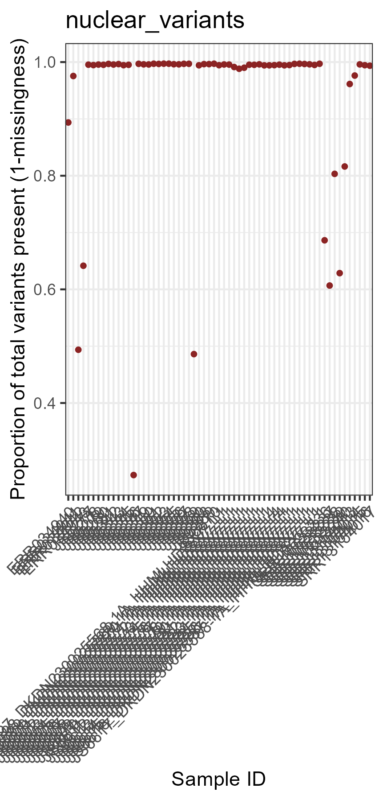
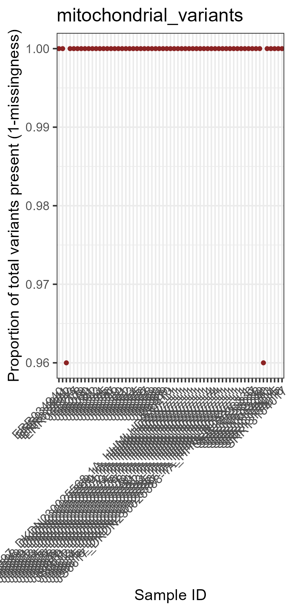
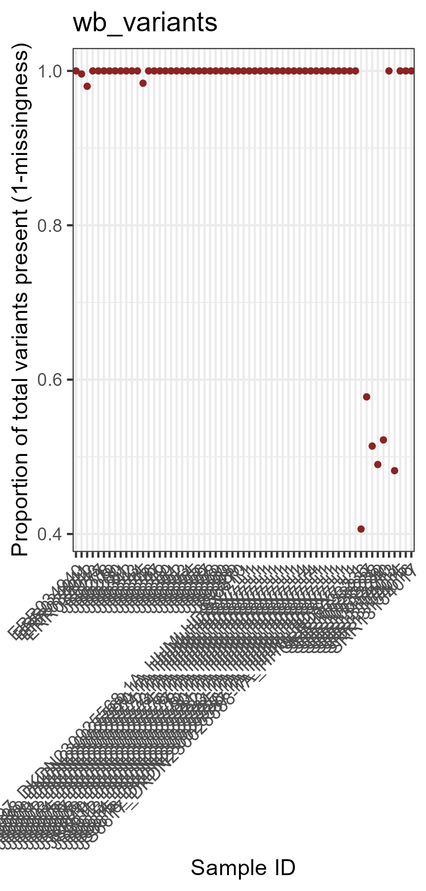

# Dirofilaria immitis WGS Lab Book - Extra Data

# Filter #2

Make some changes to the filtering parameters and compare results.

Changes to filtering parameters:
- More stringent in 'snps_qc2' filtering
- maf 0.05


### Attending to the quantiles, thresholds for specific parameters are established

```bash
#!/bin/bash

# PBS directives 
#PBS -P RDS-FSC-Heartworm_MLR-RW
#PBS -N snps_qc2
#PBS -l select=1:ncpus=1:mem=10GB
#PBS -l walltime=00:10:00
#PBS -m e
#PBS -q defaultQ
#PBS -o snps_qc2.txt

# qsub ../snps_qc2.pbs


# load gatk
module load gatk/4.1.4.1

WORKING_DIR=/scratch/RDS-FSC-Heartworm_MLR-RW/mapping/extra_data/analysis/mapping/filter/filter2

# set reference, vcf
REFERENCE=/project/RDS-FSC-Heartworm_MLR-RW/HW_WGS_ALL/data/analysis/mapping/dimmitis_WSI_2.2.fa

cd ${WORKING_DIR}

#Nuclear
gatk VariantFiltration \
--reference ${REFERENCE} \
--variant /scratch/RDS-FSC-Heartworm_MLR-RW/mapping/extra_data/analysis/mapping/filter/filter1/Dirofilaria_immitis_Sep2023.nuclearSNPs.vcf \
--filter-expression 'QUAL < 46 || DP < 1686 || DP > 11858 || MQ < 39.89 || SOR > 6.804 || QD < 0.960 || FS > 110.94 || MQRankSum < -2.567 || ReadPosRankSum < -6.453 || ReadPosRankSum > 1.940' \
--filter-name "SNP_filtered" \
--output Dirofilaria_immitis_Sep2023.nuclearSNPs.filtered.vcf

gatk VariantFiltration \
--reference ${REFERENCE} \
--variant /scratch/RDS-FSC-Heartworm_MLR-RW/mapping/extra_data/analysis/mapping/filter/filter1/Dirofilaria_immitis_Sep2023.nuclearINDELs.vcf \
--filter-expression 'QUAL < 99 || DP < 2322 || DP > 9146 || MQ < 55.54 || SOR > 6.803 || QD < 1.680 || FS > 100.295 || MQRankSum < -0.339 || ReadPosRankSum < -8.277 || ReadPosRankSum > 1.730' \
--filter-name "INDEL_filtered" \
--output Dirofilaria_immitis_Sep2023.nuclearINDELs.filtered.vcf

#Mitochondrial
gatk VariantFiltration \
--reference ${REFERENCE} \
--variant /scratch/RDS-FSC-Heartworm_MLR-RW/mapping/extra_data/analysis/mapping/filter/filter1/Dirofilaria_immitis_Sep2023.mitoSNPs.vcf \
--filter-expression ' QUAL < 156 || DP < 132510 || DP > 344706 || MQ < 47.93 || SOR > 8.198 || QD < 0.616 || FS > 118.826 || MQRankSum < -5.457 || ReadPosRankSum < -17.315 || ReadPosRankSum > 2.235' \
--filter-name "SNP_filtered" \
--output Dirofilaria_immitis_Sep2023.mitoSNPs.filtered.vcf

gatk VariantFiltration \
--reference ${REFERENCE} \
--variant /scratch/RDS-FSC-Heartworm_MLR-RW/mapping/extra_data/analysis/mapping/filter/filter1/Dirofilaria_immitis_Sep2023.mitoINDELs.vcf \
--filter-expression 'QUAL < 255 || DP < 100096 || DP > 302774 || MQ < 51.79 || SOR > 5.022 || QD < 0.081 || FS > 38.265 || MQRankSum < -6.263 || ReadPosRankSum < -9.004 || ReadPosRankSum > 4.703' \
--filter-name "INDEL_filtered" \
--output Dirofilaria_immitis_Sep2023.mitoINDELs.filtered.vcf

#Wolbachia
gatk VariantFiltration \
--reference ${REFERENCE} \
--variant /scratch/RDS-FSC-Heartworm_MLR-RW/mapping/extra_data/analysis/mapping/filter/filter1/Dirofilaria_immitis_Sep2023.WbSNPs.vcf \
--filter-expression ' QUAL < 32 || DP < 60576 || DP > 75065 || MQ < 52.01 || SOR > 7.427 || QD < 0.835 || FS > 140.016 || MQRankSum < -2.367 || ReadPosRankSum < -9.339 || ReadPosRankSum > 2.56' \
--filter-name "SNP_filtered" \
--output Dirofilaria_immitis_Sep2023.WbSNPs.filtered.vcf

gatk VariantFiltration \
--reference ${REFERENCE} \
--variant /scratch/RDS-FSC-Heartworm_MLR-RW/mapping/extra_data/analysis/mapping/filter/filter1/Dirofilaria_immitis_Sep2023.WbINDELs.vcf \
--filter-expression 'QUAL < 83 || DP < 62069 || DP > 76905 || MQ < 55.96 || SOR > 7.378 || QD < 1.225 || FS > 137.307 || MQRankSum < -0.693 || ReadPosRankSum < -9.709 || ReadPosRankSum > 1.300' \
--filter-name "INDEL_filtered" \
--output Dirofilaria_immitis_Sep2023.WbINDELs.filtered.vcf

# once done, count the filtered sites - funny use of "|" allows direct markdown table format
echo -e "| Filtered_VCF | Variants_PASS | Variants_FILTERED |\n| -- | -- | -- | " > filter.stats

for i in *filtered.vcf; do
     name=${i}; pass=$( grep -E 'PASS' ${i} | wc -l ); filter=$( grep -E 'filter' ${i} | wc -l );
     echo -e "| ${name} | ${pass} | ${filter} |" >> filter.stats
done
```
This is the summary of the filtered variants ('filter.stats'):


We have less SNPs than before.

Usually we would merge the SNP and INDEL files together to make a joined VCF. However, I want to disregard the indels moving forward and only focus on the SNPs. Some downstream tools don't like having indels in there.


### Filter genotypes based on x3 depth per genotype

```bash
#!/bin/bash

# PBS directives 
#PBS -P RDS-FSC-Heartworm_MLR-RW
#PBS -N snps_qc3
#PBS -l select=1:ncpus=1:mem=10GB
#PBS -l walltime=00:30:00
#PBS -m e
#PBS -q defaultQ
#PBS -o snps_qc3.txt

# qsub ../snps_qc3.pbs

# load gatk
module load gatk/4.1.4.1

WORKING_DIR=/scratch/RDS-FSC-Heartworm_MLR-RW/mapping/extra_data/analysis/mapping/filter/filter2

# set reference, vcf
REFERENCE=/project/RDS-FSC-Heartworm_MLR-RW/HW_WGS_ALL/data/analysis/mapping/dimmitis_WSI_2.2.fa
VCF=/scratch/RDS-FSC-Heartworm_MLR-RW/mapping/extra_data/analysis/mapping/filter/filter2/Dirofilaria_immitis_Sep2023.vcf.gz

cd ${WORKING_DIR}

#Nuclear 
gatk VariantFiltration \
--reference ${REFERENCE} \
--variant ${VCF%.vcf.gz}.nuclearSNPs.filtered.vcf \
--genotype-filter-expression ' DP < 3 '  \
--genotype-filter-name "DP_lt3" \
--output ${VCF%.vcf.gz}.nuclearSNPs.DPfiltered.vcf

gatk SelectVariants \
--reference ${REFERENCE} \
--variant ${VCF%.vcf.gz}.nuclearSNPs.DPfiltered.vcf \
--set-filtered-gt-to-nocall \
--output ${VCF%.vcf.gz}.nuclearSNPs.DPfilterNoCall.vcf

#Mito
gatk VariantFiltration \
--reference ${REFERENCE} \
--variant ${VCF%.vcf.gz}.mitoSNPs.filtered.vcf \
--genotype-filter-expression ' DP < 3 '  \
--genotype-filter-name "DP_lt3" \
--output ${VCF%.vcf.gz}.mitoSNPs.DPfiltered.vcf

gatk SelectVariants \
--reference ${REFERENCE} \
--variant ${VCF%.vcf.gz}.mitoSNPs.DPfiltered.vcf \
--set-filtered-gt-to-nocall \
--output ${VCF%.vcf.gz}.mitoSNPs.DPfilterNoCall.vcf

#wolbachia
gatk VariantFiltration \
--reference ${REFERENCE} \
--variant ${VCF%.vcf.gz}.WbSNPs.filtered.vcf \
--genotype-filter-expression ' DP < 3 '  \
--genotype-filter-name "DP_lt3" \
--output ${VCF%.vcf.gz}.WbSNPs.DPfiltered.vcf

gatk SelectVariants \
--reference ${REFERENCE} \
--variant ${VCF%.vcf.gz}.WbSNPs.DPfiltered.vcf \
--set-filtered-gt-to-nocall \
--output ${VCF%.vcf.gz}.WbSNPs.DPfilterNoCall.vcf
```

### Now we apply a set of standard filters for population genomics

```bash
#!/bin/bash

# PBS directives 
#PBS -P RDS-FSC-Heartworm_MLR-RW
#PBS -N snps_qc4
#PBS -l select=1:ncpus=1:mem=4GB
#PBS -l walltime=00:05:00
#PBS -m e
#PBS -q defaultQ
#PBS -o snps_qc4.txt

# qsub ../snps_qc4.pbs

# load gatk
module load gatk/4.1.4.1
module load vcftools/0.1.14

WORKING_DIR=/scratch/RDS-FSC-Heartworm_MLR-RW/mapping/extra_data/analysis/mapping/filter/filter2

# set vcf
VCF=/scratch/RDS-FSC-Heartworm_MLR-RW/mapping/extra_data/analysis/mapping/filter/filter2/Dirofilaria_immitis_Sep2023.vcf.gz


cd ${WORKING_DIR}

#Nuclear variants
vcftools \
--vcf ${VCF%.vcf.gz}.nuclearSNPs.DPfilterNoCall.vcf \
--remove-filtered-geno-all \
--remove-filtered-all \
--min-alleles 2 \
--max-alleles 2 \
--hwe 1e-06 \
--maf 0.05 \
--recode \
--recode-INFO-all \
--out ${VCF%.vcf.gz}.nuclear_SNPs.final
# After filtering, kept 61 out of 61 Individuals
#Outputting VCF file...
#After filtering, kept 179541 out of a possible 506734 Sites

#--- nuclear SNPs
vcftools --vcf Dirofilaria_immitis_Sep2023.nuclear_SNPs.final.recode.vcf --remove-indels
#After filtering, kept 61 out of 61 Individuals
#After filtering, kept 179541 out of a possible 179541 Sites

#--- nuclear  INDELs
vcftools --vcf Dirofilaria_immitis_Sep2023.nuclear_SNPs.final.recode.vcf --keep-only-indels
#After filtering, kept 61 out of 61 Individuals
#After filtering, kept 0 out of a possible 179541 Sites


#Mitochondrial variants
vcftools \
--vcf ${VCF%.vcf.gz}.mitoSNPs.DPfilterNoCall.vcf \
--remove-filtered-geno-all \
--remove-filtered-all \
--min-alleles 2 \
--max-alleles 2 \
--maf 0.05 \
--recode \
--recode-INFO-all \
--out ${VCF%.vcf.gz}.mito_SNPs.final
#After filtering, kept 61 out of 61 Individuals
#Outputting VCF file...
#After filtering, kept 25 out of a possible 99 Sites


#--- mito SNPs
vcftools --vcf Dirofilaria_immitis_Sep2023.mito_SNPs.final.recode.vcf --remove-indels
#After filtering, kept 61 out of 61 Individuals
#After filtering, kept 25 out of a possible 25 Sites

#--- mito INDELs
vcftools --vcf Dirofilaria_immitis_Sep2023.mito_SNPs.final.recode.vcf --keep-only-indels
#After filtering, kept 61 out of 61 Individuals
#After filtering, kept 0 out of a possible 25 Sites


#wolbachia variants
vcftools \
--vcf ${VCF%.vcf.gz}.WbSNPs.DPfilterNoCall.vcf \
--remove-filtered-geno-all \
--remove-filtered-all \
--min-alleles 2 \
--max-alleles 2 \
--maf 0.05 \
--recode \
--recode-INFO-all \
--out ${VCF%.vcf.gz}.Wb_SNPs.final
#After filtering, kept 61 out of 61 Individuals
#Outputting VCF file...
#After filtering, kept 251 out of a possible 3493 Sites


#--- Wb SNPs
vcftools --vcf Dirofilaria_immitis_Sep2023.Wb_SNPs.final.recode.vcf --remove-indels
# After filtering, kept 61 out of 61 Individuals
#After filtering, kept 251 out of a possible 251 Sites

#--- Wb INDELs
vcftools --vcf Dirofilaria_immitis_Sep2023.Wb_SNPs.final.recode.vcf --keep-only-indels
# After filtering, kept 61 out of 61 Individuals
#After filtering, kept 0 out of a possible 251 Sites
```

### Now, we are filtering by missingness

```bash
#!/bin/bash

# PBS directives 
#PBS -P RDS-FSC-Heartworm_MLR-RW
#PBS -N snps_qc5
#PBS -l select=1:ncpus=1:mem=10GB
#PBS -l walltime=00:10:00
#PBS -m e
#PBS -q defaultQ
#PBS -o snps_qc5.txt

# qsub ../snps_qc5.pbs

# load modules
module load gatk/4.1.4.1
module load vcftools/0.1.14

WORKING_DIR=/scratch/RDS-FSC-Heartworm_MLR-RW/mapping/extra_data/analysis/mapping/filter/filter2

# set vcf
VCF=/scratch/RDS-FSC-Heartworm_MLR-RW/mapping/extra_data/analysis/mapping/filter/filter2/Dirofilaria_immitis_Sep2023.vcf.gz

cd ${WORKING_DIR}

#determine missingness per individual
vcftools --vcf ${VCF%.vcf.gz}.nuclear_SNPs.final.recode.vcf --out nuclear --missing-indv
vcftools --vcf ${VCF%.vcf.gz}.mito_SNPs.final.recode.vcf --out mito --missing-indv
vcftools --vcf ${VCF%.vcf.gz}.Wb_SNPs.final.recode.vcf --out wb --missing-indv
```

### Check the missingess in R

```R
 # Check missingness
  data_nuclear <- read.delim("nuclear.imiss", header=T)
  data_mito <- read.delim("mito.imiss", header=T)
  data_wb <- read.delim("wb.imiss", header=T)
  
  #creating the function - per sample
  fun_plot_missingness <- function(data,title) {
    
    plot <- ggplot(data, aes(INDV, 1-F_MISS)) +
      geom_boxplot(color = 'brown') +
      geom_point(size = 1, color = 'brown4') +
      theme_bw() +
      labs(x="Sample ID", y="Proportion of total variants present (1-missingness)")+
      ggtitle(title) +
      theme(axis.text.x = element_text(angle = 45, hjust = 1))
    print(plot)
    ggsave(paste0("plot_missingness_figure",title,".png"))
  }
  
  # plotting for each dataset
  fun_plot_missingness(data_nuclear, "nuclear_variants")
```



```R
  fun_plot_missingness(data_mito,"mitochondrial_variants")
```


```R
  fun_plot_missingness(data_wb, "wb_variants")
```



In Javier's code, he generated a different sample list for each database and evaluated the max missingness. For now, I will just keep all the samples.

```bash
# For nuclear (n=31) - nuclear_samplelist.keep
ERR034940
ERR034941
ERR034942
ERR034943
JS6597_DKDN230025568-1A_HHMLHDSX7_L1
JS6598_DKDN230025569-1A_HHMLHDSX7_L1
JS6599_DKDN230025570-1A_HHMLHDSX7_L1
JS6600_DKDN230025571-1A_HHMLHDSX7_L1
JS6601_DKDN230025572-1A_HHMLHDSX7_L1
JS6602_DKDN230025573-1A_HHMLHDSX7_L1
JS6603_DKDN230025574-1A_HHMLHDSX7_L1
JS6604_DKDN230025575-1A_HHMLHDSX7_L1
JS6605_DKDN230025576-1A_HHMLHDSX7_L1
JS6606_DKDN230025577-1A_HHMLHDSX7_L1
JS6607_DKDN230025578-1A_HHMLHDSX7_L4
JS6608_DKDN230025579-1A_HHMLHDSX7_L4
JS6609_DKDN230025580-1A_HHMLHDSX7_L4
JS6610_DKDN230025581-1A_HHMLHDSX7_L1
JS6611_DKDN230025582-1A_HHMLHDSX7_L1
JS6612_DKDN230025583-1A_HHMLHDSX7_L1
JS6613_DKDN230025584-1A_HHMLHDSX7_L1
JS6614_DKDN230025585-1A_HHMLHDSX7_L1
JS6615_DKDN230025586-1A_HHMLHDSX7_L1
JS6616_DKDN230025587-1A_HHMLHDSX7_L1
JS6617_DKDN230025588-1A_HHMLHDSX7_L1
SRR10533236
SRR10533237
SRR10533238
SRR10533239
SRR10533240
JS6277
JS6278
JS6279
JS6280
JS6281
JS6342
JS6343
JS6344
JS6345
JS6346
JS6347
JS6349
JS6350
JS6351
JS6352
JS6353
JS6354
JS6355
JS6356
JS6357
JS6358
JS6359
JS6360
JS6368
JS6369
JS6370
SRR13154013
SRR13154014
SRR13154015
SRR13154016
SRR13154017

# For mithochondiral (n=31) - mito_samplelist.keep
#Same as above

# For wb (n=31) - wb_samplelist.keep
#same as above
```


### Let's check different thresholds for each dataset

```bash
#!/bin/bash

# PBS directives 
#PBS -P RDS-FSC-Heartworm_MLR-RW
#PBS -N snps_qc6
#PBS -l select=1:ncpus=1:mem=10GB
#PBS -l walltime=00:20:00
#PBS -m e
#PBS -q defaultQ
#PBS -o snps_qc6.txt

# qsub ../snps_qc6.pbs

# load gatk
module load gatk/4.1.4.1
module load vcftools/0.1.14

WORKING_DIR=/scratch/RDS-FSC-Heartworm_MLR-RW/mapping/extra_data/analysis/mapping/filter/filter2

# set vcf
VCF=/scratch/RDS-FSC-Heartworm_MLR-RW/mapping/extra_data/analysis/mapping/filter/filter2/Dirofilaria_immitis_Sep2023.vcf.gz

cd ${WORKING_DIR}

# For nuclear variants
for i in 0.7 0.8 0.9 1; do
     vcftools --vcf ${VCF%.vcf.gz}.nuclear_SNPs.final.recode.vcf --keep nuclear_samplelist.keep --max-missing ${i} ;
done

# max-missing = 0.7
# After filtering, kept 61 out of 61 Individuals
#After filtering, kept 178505 out of a possible 179541 Sites

# max-missing = 0.8
# After filtering, kept 61 out of 61 Individuals
#After filtering, kept 177133 out of a possible 179541 Sites

# max-missing = 0.9
# After filtering, kept 61 out of 61 Individuals
#After filtering, kept 154354 out of a possible 179541 Sites

# max-missing = 1
# After filtering, kept 61 out of 61 Individuals
#After filtering, kept 4895 out of a possible 179541 Sites


# For mito variants
for i in 0.7 0.8 0.9 1; do
     vcftools --vcf ${VCF%.vcf.gz}.mito_SNPs.final.recode.vcf --keep mito_samplelist.keep --max-missing ${i} ;
done

# max-missing = 0.7
# After filtering, kept 61 out of 61 Individuals
#After filtering, kept 25 out of a possible 25 Sites

# max-missing = 0.8
# After filtering, kept 61 out of 61 Individuals
#After filtering, kept 25 out of a possible 25 Sites

# max-missing = 0.9
# After filtering, kept 61 out of 61 Individuals
#After filtering, kept 25 out of a possible 25 Sites

# max-missing = 1
# After filtering, kept 61 out of 61 Individuals
#After filtering, kept 24 out of a possible 25 Sites


# For Wb variants
for i in 0.7 0.8 0.9 1; do
     vcftools --vcf ${VCF%.vcf.gz}.Wb_SNPs.final.recode.vcf --keep wb_samplelist.keep --max-missing ${i} ;
done

# max-missing = 0.7
# After filtering, kept 61 out of 61 Individuals
#After filtering, kept 251 out of a possible 251 Sites

# max-missing = 0.8
# After filtering, kept 61 out of 61 Individuals
#After filtering, kept 251 out of a possible 251 Sites

# max-missing = 0.9
# After filtering, kept 61 out of 61 Individuals
#After filtering, kept 250 out of a possible 251 Sites

# max-missing = 1
# After filtering, kept 61 out of 61 Individuals
#After filtering, kept 15 out of a possible 251 Sites
```

Selecting a max missingness of 1 for nuclear, 1 for mito and 1 for Wb is sensible.

```bash
#!/bin/bash

# PBS directives 
#PBS -P RDS-FSC-Heartworm_MLR-RW
#PBS -N snps_qc7
#PBS -l select=1:ncpus=1:mem=10GB
#PBS -l walltime=00:10:00
#PBS -m e
#PBS -q defaultQ
#PBS -o snps_qc7.txt

# qsub ../snps_qc7.pbs

# load gatk
module load gatk/4.1.4.1
module load vcftools/0.1.14

WORKING_DIR=/scratch/RDS-FSC-Heartworm_MLR-RW/mapping/extra_data/analysis/mapping/filter/filter2

# set vcf
VCF=/scratch/RDS-FSC-Heartworm_MLR-RW/mapping/extra_data/analysis/mapping/filter/filter2/Dirofilaria_immitis_Sep2023.vcf.gz

cd ${WORKING_DIR}

# For nuclear
vcftools --vcf ${VCF%.vcf.gz}.nuclear_SNPs.final.recode.vcf \
     --keep nuclear_samplelist.keep \
     --max-missing 1 \
     --recode --recode-INFO-all \
     --out FINAL_SETS/nuclear_samples3x_missing1

# For mito
vcftools --vcf ${VCF%.vcf.gz}.mito_SNPs.final.recode.vcf \
     --keep mito_samplelist.keep \
     --max-missing 1 \
     --recode --recode-INFO-all \
     --out FINAL_SETS/mito_samples3x_missing1

# For wb
vcftools --vcf ${VCF%.vcf.gz}.Wb_SNPs.final.recode.vcf \
     --keep wb_samplelist.keep \
     --max-missing 1 \
     --recode --recode-INFO-all \
     --out FINAL_SETS/wb_samples3x_missing1
```

### Also, we will select only the variants in the chr 1 to chr4, avoiding the chrX and the scaffolds

```bash
#!/bin/bash

# PBS directives 
#PBS -P RDS-FSC-Heartworm_MLR-RW
#PBS -N snps_qc8
#PBS -l select=1:ncpus=1:mem=4GB
#PBS -l walltime=00:10:00
#PBS -m e
#PBS -q defaultQ
#PBS -o snps_qc8.txt

# qsub ../snps_qc8.pbs

# load gatk
module load vcftools/0.1.14

cd /scratch/RDS-FSC-Heartworm_MLR-RW/mapping/extra_data/analysis/mapping/filter/filter2

vcftools --vcf FINAL_SETS/nuclear_samples3x_missing1.recode.vcf \
--chr dirofilaria_immitis_chr1 \
--chr dirofilaria_immitis_chr2 \
--chr dirofilaria_immitis_chr3 \
--chr dirofilaria_immitis_chr4 \
--recode --out FINAL_SETS/nuclear_samples3x_missing1.chr1to4
# After filtering, kept 61 out of 61 Individuals
#Outputting VCF file...
#After filtering, kept 3781 out of a possible 4895 Sites


vcftools --vcf FINAL_SETS/nuclear_samples3x_missing1.chr1to4.recode.vcf --remove-indels
# After filtering, kept 61 out of 61 Individuals
#After filtering, kept 3781 out of a possible 3781 Sites


vcftools --vcf FINAL_SETS/nuclear_samples3x_missing1.chr1to4.recode.vcf --keep-only-indels
# After filtering, kept 61 out of 61 Individuals
#After filtering, kept 0 out of a possible 3781 Sites- this makes sense because I removed the indels earlier and only focused on the SNPs.
```


Rename samples to more meaningful names:

```bash
#!/bin/bash

# PBS directives 
#PBS -P RDS-FSC-Heartworm_MLR-RW
#PBS -N vcf_rename
#PBS -l select=1:ncpus=2:mem=20GB
#PBS -l walltime=00:20:00
#PBS -m abe
#PBS -q defaultQ
#PBS -o vcf_rename.txt

# qsub ../vcf_rename.pbs

# load modules
module load bcftools/1.11

cd /scratch/RDS-FSC-Heartworm_MLR-RW/mapping/extra_data/analysis/mapping/filter/filter2/FINAL_SETS

bcftools reheader -s rename.txt nuclear_samples3x_missing1.chr1to4.recode.vcf -o nuclear_samples3x_missing1.chr1to4.recode.RENAMED.vcf
```


Check that it worked:

```bash
# List all sample names in the original VCF
bcftools query -l /scratch/RDS-FSC-Heartworm_MLR-RW/mapping/extra_data/analysis/mapping/filter/filter2/FINAL_SETS/nuclear_samples3x_missing1.chr1to4.recode.RENAMED.vcf
```

Yep all the sample names are changed.


## PCA

```R
######################################################################

# PCA for filt2

######################################################################

library(tidyverse)
library(gdsfmt)
library(SNPRelate)
library(ggsci)
library(ggpubr)
library(reshape2)
library(viridis)
library(vcfR)
library(factoextra)
library(ggrepel)
library(ggtree)
library(poppr)
library(adegenet)
library(ape)
library(ggimage)


# Set working directory
setwd("C:/Users/rpow2134/OneDrive - The University of Sydney (Staff)/Documents/HW_WGS/R_analysis/extra_data/filter2/vcf/input")

#Preparing the data for plotting
# Set colours for different cities
scale_colour_pop <- function(...){
  ggplot2:::manual_scale(
    'colour', 
    values = setNames(
      c('cadetblue1',
        'steelblue1',
        'royalblue4',
        'lightcyan3',
        'darkblue',
        'orchid3',
        'springgreen4',
        'mediumpurple2',
        'orangered3',
        'indianred1',
        'coral2',
        'chocolate1',
        'darkorange3'), 
      c('Lockhart River Cooktown', 'Cairns', 
        'Townsville', 'Rockhampton',
        'Brisbane',
        'Sydney', 'Bangkok', 'Pavia', 'USA', 'Mississippi', 'Illinois', 'Louisiana', 'Georgia')), 
    ...
  )
}


#PCA on nuclear variants using genotypes
snpgdsClose(genofile) # you need this line to close any previous file open, otherwise it won't work if you want to re-run
vcf.in <- "C:/Users/rpow2134/OneDrive - The University of Sydney (Staff)/Documents/HW_WGS/R_analysis/extra_data/filter2/vcf/input/nuclear_samples3x_missing1.chr1to4.recode.RENAMED.vcf"
gds<-snpgdsVCF2GDS(vcf.in, "nucDNA.gds", method="biallelic.only")
genofile <- snpgdsOpen(gds)


pca <-snpgdsPCA(genofile, num.thread=2, autosome.only = F)
samples <- as.data.frame(pca$sample.id)
colnames(samples) <- "name"

# Metadata file that describes where the samples come from
metadata_file <- "C:/Users/rpow2134/OneDrive - The University of Sydney (Staff)/Documents/HW_WGS/R_analysis/extra_data/location.csv"
metadata <- read.csv(metadata_file, header = TRUE)

data <- data.frame(sample.id = pca$sample.id,
                   EV1 = pca$eigenvect[,1],  
                   EV2 = pca$eigenvect[,2],
                   EV3 = pca$eigenvect[,3],
                   EV4 = pca$eigenvect[,4],
                   EV5 = pca$eigenvect[,5],
                   EV6 = pca$eigenvect[,6],
                   POPULATION = metadata$city,
                   SAMPLEID = metadata$sample_name,
                   stringsAsFactors = FALSE)

#Generating levels for population and super-population variables
data$POPULATION <- factor(data$POPULATION, 
                          levels = c('Lockhart River Cooktown', 'Cairns', 
                                     'Townsville', 'Rockhampton',
                                     'Brisbane',
                                     'Sydney', 'Bangkok', 'Pavia', 'USA', 'Mississippi', 'Illinois', 'Louisiana', 'Georgia'))


# Plot the eigenvectors
# Calculate the explained variance for non-NaN eigenvalues - some of the later eigenvectors are NaN.
## It is not unusual to have NaN (Not-a-Number) values among the eigenvalues in the context of Principal Component Analysis (PCA). NaN values in eigenvalues typically occur when there is missing or insufficient information in the data for certain principal components to be computed.

explained_variance <- 100 * pca$eigenval[!is.na(pca$eigenval)] / sum(pca$eigenval, na.rm = TRUE)

# Create a barplot
jpeg("C:/Users/rpow2134/OneDrive - The University of Sydney (Staff)/Documents/HW_WGS/R_analysis/extra_data/filter2/vcf/pca/barplot_eigenvalues.jpg", width = 800, height = 600)
barplot(explained_variance, col = "dark green", ylim = c(0, 20))
title(ylab = "Percent of variance explained") 
title(xlab = "Eigenvalues")
dev.off()


# Lets extract the variance associated with the top 4 PCs, so we can use them in our plots.
# Calculate the total variance (excluding NaN values)
eig.total <- sum(pca$eigenval, na.rm = TRUE)


PC1.variance <- formatC(head(pca$eigenval)[1]/eig.total * 100)
PC2.variance <- formatC(head(pca$eigenval)[2]/eig.total * 100)
PC3.variance <- formatC(head(pca$eigenval)[3]/eig.total * 100)
PC4.variance <- formatC(head(pca$eigenval)[4]/eig.total * 100)


PC1.variance
# 17.56
PC2.variance
# 13.07
PC3.variance
# 9.711
PC4.variance
# 8.583


# Make PCA plots

# PC1 vs PC2
PC1_PC2_plot <- ggplot(data, aes(x = EV1, y = EV2, color = POPULATION, label = SAMPLEID)) +
  theme_bw() +
  geom_point(alpha = 0.8, size = 2) +
  geom_text_repel(aes(label = SAMPLEID), box.padding = 0.05, point.padding = 0.01, segment.color = 'grey50', size = 3, hjust = 0, vjust = 0, max.overlaps = Inf, show.legend=FALSE) +
  labs(x = paste0("PC1 variance: ", round(pca$varprop[1] * 100, digits = 2), "%"),
       y = paste0("PC2 variance: ", round(pca$varprop[2] * 100, digits = 2), "%")) +
  scale_colour_pop() +
  theme(legend.position = "right") +  # Adjust legend position as needed
ggtitle("filter2: PC1 vs PC2")
  
PC1_PC2_plot

ggsave("C:/Users/rpow2134/OneDrive - The University of Sydney (Staff)/Documents/HW_WGS/R_analysis/extra_data/filter2/vcf/pca/PC1_PC2_plot.png", PC1_PC2_plot, height = 6, width = 8)

# PC1 vs PC3
PC1_PC3_plot <- ggplot(data, aes(x = EV1, y = EV3, color = POPULATION, label = SAMPLEID)) +
  theme_bw() +
  geom_point(alpha = 0.8, size = 2) +
  geom_text_repel(aes(label = SAMPLEID), box.padding = 0.05, point.padding = 0.01, segment.color = 'grey50', size = 3, hjust = 0, vjust = 0, max.overlaps = Inf, show.legend=FALSE) +
  labs(x = paste0("PC1 variance: ", round(pca$varprop[1] * 100, digits = 2), "%"),
       y = paste0("PC3 variance: ", round(pca$varprop[3] * 100, digits = 2), "%")) +
  scale_colour_pop() +
  theme(legend.position = "right") +  # Adjust legend position as needed
  ggtitle("filter2: PC1 vs PC3")

PC1_PC3_plot

ggsave("C:/Users/rpow2134/OneDrive - The University of Sydney (Staff)/Documents/HW_WGS/R_analysis/extra_data/filter2/vcf/pca/PC1_PC3_plot.png", PC1_PC3_plot, height = 6, width = 8)

# PC1 vs PC4
PC1_PC4_plot <- ggplot(data, aes(x = EV1, y = EV4, color = POPULATION, label = SAMPLEID)) +
  theme_bw() +
  geom_point(alpha = 0.8, size = 2) +
  geom_text_repel(aes(label = SAMPLEID), box.padding = 0.05, point.padding = 0.01, segment.color = 'grey50', size = 3, hjust = 0, vjust = 0, max.overlaps = Inf, show.legend=FALSE) +
  labs(x = paste0("PC1 variance: ", round(pca$varprop[1] * 100, digits = 2), "%"),
       y = paste0("PC4 variance: ", round(pca$varprop[4] * 100, digits = 2), "%")) +
  scale_colour_pop() +
  theme(legend.position = "right") +  # Adjust legend position as needed
  ggtitle("filter2: PC1 vs PC4")

PC1_PC4_plot

ggsave("C:/Users/rpow2134/OneDrive - The University of Sydney (Staff)/Documents/HW_WGS/R_analysis/extra_data/filter2/vcf/pca/PC1_PC4_plot.png", PC1_PC4_plot, height = 6, width = 8)

# PC1 vs PC5
PC1_PC5_plot <- ggplot(data, aes(x = EV1, y = EV5, color = POPULATION, label = SAMPLEID)) +
  theme_bw() +
  geom_point(alpha = 0.8, size = 2) +
  geom_text_repel(aes(label = SAMPLEID), box.padding = 0.05, point.padding = 0.01, segment.color = 'grey50', size = 3, hjust = 0, vjust = 0, max.overlaps = Inf, show.legend=FALSE) +
  labs(x = paste0("PC1 variance: ", round(pca$varprop[1] * 100, digits = 2), "%"),
       y = paste0("PC5 variance: ", round(pca$varprop[5] * 100, digits = 2), "%")) +
  scale_colour_pop() +
  theme(legend.position = "right") +  # Adjust legend position as needed
  ggtitle("filter2: PC1 vs PC5")

PC1_PC5_plot

ggsave("C:/Users/rpow2134/OneDrive - The University of Sydney (Staff)/Documents/HW_WGS/R_analysis/extra_data/filter2/vcf/pca/PC1_PC5_plot.png", PC1_PC5_plot, height = 6, width = 8)

# PC1 vs PC6
PC1_PC6_plot <- ggplot(data, aes(x = EV1, y = EV6, color = POPULATION, label = SAMPLEID)) +
  theme_bw() +
  geom_point(alpha = 0.8, size = 2) +
  geom_text_repel(aes(label = SAMPLEID), box.padding = 0.05, point.padding = 0.01, segment.color = 'grey50', size = 3, hjust = 0, vjust = 0, max.overlaps = Inf, show.legend=FALSE) +
  labs(x = paste0("PC1 variance: ", round(pca$varprop[1] * 100, digits = 2), "%"),
       y = paste0("PC6 variance: ", round(pca$varprop[6] * 100, digits = 2), "%")) +
  scale_colour_pop() +
  theme(legend.position = "right") +  # Adjust legend position as needed
  ggtitle("filter2: PC1 vs PC6")

PC1_PC6_plot

ggsave("C:/Users/rpow2134/OneDrive - The University of Sydney (Staff)/Documents/HW_WGS/R_analysis/extra_data/filter2/vcf/pca/PC1_PC6_plot.png", PC1_PC6_plot, height = 6, width = 8)

# PC2 vs PC3
PC2_PC3_plot <- ggplot(data, aes(x = EV2, y = EV3, color = POPULATION, label = SAMPLEID)) +
  theme_bw() +
  geom_point(alpha = 0.8, size = 2) +
  geom_text_repel(aes(label = SAMPLEID), box.padding = 0.05, point.padding = 0.01, segment.color = 'grey50', size = 3, hjust = 0, vjust = 0, max.overlaps = Inf, show.legend=FALSE) +
  labs(x = paste0("PC2 variance: ", round(pca$varprop[2] * 100, digits = 2), "%"),
       y = paste0("PC3 variance: ", round(pca$varprop[3] * 100, digits = 2), "%")) +
  scale_colour_pop() +
  theme(legend.position = "right") +  # Adjust legend position as needed
  ggtitle("filter2: PC2 vs PC3")

PC2_PC3_plot

ggsave("C:/Users/rpow2134/OneDrive - The University of Sydney (Staff)/Documents/HW_WGS/R_analysis/extra_data/filter2/vcf/pca/PC2_PC3_plot.png", PC2_PC3_plot, height = 6, width = 8)

# PC2 vs PC4
PC2_PC4_plot <- ggplot(data, aes(x = EV2, y = EV4, color = POPULATION, label = SAMPLEID)) +
  theme_bw() +
  geom_point(alpha = 0.8, size = 2) +
  geom_text_repel(aes(label = SAMPLEID), box.padding = 0.05, point.padding = 0.01, segment.color = 'grey50', size = 3, hjust = 0, vjust = 0, max.overlaps = Inf, show.legend=FALSE) +
  labs(x = paste0("PC2 variance: ", round(pca$varprop[2] * 100, digits = 2), "%"),
       y = paste0("PC4 variance: ", round(pca$varprop[4] * 100, digits = 2), "%")) +
  scale_colour_pop() +
  theme(legend.position = "right") +  # Adjust legend position as needed
  ggtitle("filter2: PC2 vs PC4")

PC2_PC4_plot

ggsave("C:/Users/rpow2134/OneDrive - The University of Sydney (Staff)/Documents/HW_WGS/R_analysis/extra_data/filter2/vcf/pca/PC2_PC4_plot.png", PC2_PC4_plot, height = 6, width = 8)

# PC3 vs PC4
PC3_PC4_plot <- ggplot(data, aes(x = EV3, y = EV4, color = POPULATION, label = SAMPLEID)) +
  theme_bw() +
  geom_point(alpha = 0.8, size = 2) +
  geom_text_repel(aes(label = SAMPLEID), box.padding = 0.05, point.padding = 0.01, segment.color = 'grey50', size = 3, hjust = 0, vjust = 0, max.overlaps = Inf, show.legend=FALSE) +
  labs(x = paste0("PC3 variance: ", round(pca$varprop[3] * 100, digits = 2), "%"),
       y = paste0("PC4 variance: ", round(pca$varprop[4] * 100, digits = 2), "%")) +
  scale_colour_pop() +
  theme(legend.position = "right") +  # Adjust legend position as needed
  ggtitle("filter2: PC3 vs PC4")

PC3_PC4_plot

ggsave("C:/Users/rpow2134/OneDrive - The University of Sydney (Staff)/Documents/HW_WGS/R_analysis/extra_data/filter2/vcf/pca/PC3_PC4_plot.png", PC3_PC4_plot, height = 6, width = 8)


######################################################################

# PCs on linear plane

######################################################################

# PC1
constant_y <- 0
pc1_line_data <- data.frame(PC1 = data$EV1, Y = constant_y)
PC1_line <- ggplot(pc1_line_data, aes(x = PC1, y = Y)) +
  geom_point(data = data, aes(x = EV1, y = rep(constant_y, nrow(data)), color = POPULATION), alpha = 0.8, size = 3) +
  geom_text_repel(data = data, aes(x = EV1, y = rep(constant_y, nrow(data)), label = SAMPLEID), box.padding = 0.05, point.padding = 0.01, segment.color = 'grey50', size = 2, hjust = 0, vjust = 0, max.overlaps = Inf, show.legend = FALSE) +
  theme_bw() +
  labs(x = "PC1", y = NULL) +
  scale_colour_pop() +
  theme(axis.text.y = element_blank(), axis.ticks.y = element_blank(), legend.position = "none") +
  theme(panel.grid = element_blank())

# Print the plot
print(PC1_line)
# Save plot
ggsave("C:/Users/rpow2134/OneDrive - The University of Sydney (Staff)/Documents/HW_WGS/R_analysis/extra_data/filter2/vcf/pca/PC1_line.png", height=2, width=8)

# PC2
constant_y <- 0
PC2_line_data <- data.frame(PC2 = data$EV2, Y = constant_y)
PC2_line <- ggplot(PC2_line_data, aes(x = PC2, y = Y)) +
  geom_point(data = data, aes(x = EV2, y = rep(constant_y, nrow(data)), color = POPULATION), alpha = 0.8, size = 3) +
  geom_text_repel(data = data, aes(x = EV2, y = rep(constant_y, nrow(data)), label = SAMPLEID), box.padding = 0.05, point.padding = 0.01, segment.color = 'grey50', size = 2, hjust = 0, vjust = 0, max.overlaps = Inf, show.legend = FALSE) +
  theme_bw() +
  labs(x = "PC2", y = NULL) +
  scale_colour_pop() +
  theme(axis.text.y = element_blank(), axis.ticks.y = element_blank(), legend.position = "none") +
  theme(panel.grid = element_blank())

# Print the plot
print(PC2_line)
# Save plot
ggsave("C:/Users/rpow2134/OneDrive - The University of Sydney (Staff)/Documents/HW_WGS/R_analysis/extra_data/filter2/vcf/pca/PC2_line.png", height=2, width=8)

# PC3
constant_y <- 0
PC3_line_data <- data.frame(PC3 = data$EV3, Y = constant_y)
PC3_line <- ggplot(PC3_line_data, aes(x = PC3, y = Y)) +
  geom_point(data = data, aes(x = EV3, y = rep(constant_y, nrow(data)), color = POPULATION), alpha = 0.8, size = 3) +
  geom_text_repel(data = data, aes(x = EV3, y = rep(constant_y, nrow(data)), label = SAMPLEID), box.padding = 0.05, point.padding = 0.01, segment.color = 'grey50', size = 2, hjust = 0, vjust = 0, max.overlaps = Inf, show.legend = FALSE) +
  theme_bw() +
  labs(x = "PC3", y = NULL) +
  scale_colour_pop() +
  theme(axis.text.y = element_blank(), axis.ticks.y = element_blank(), legend.position = "none") +
  theme(panel.grid = element_blank())

# Print the plot
print(PC3_line)
# Save plot
ggsave("C:/Users/rpow2134/OneDrive - The University of Sydney (Staff)/Documents/HW_WGS/R_analysis/extra_data/filter2/vcf/pca/PC3_line.png", height=2, width=8)

# PC4
constant_y <- 0
PC4_line_data <- data.frame(PC4 = data$EV4, Y = constant_y)
PC4_line <- ggplot(PC4_line_data, aes(x = PC4, y = Y)) +
  geom_point(data = data, aes(x = EV4, y = rep(constant_y, nrow(data)), color = POPULATION), alpha = 0.8, size = 3) +
  geom_text_repel(data = data, aes(x = EV4, y = rep(constant_y, nrow(data)), label = SAMPLEID), box.padding = 0.05, point.padding = 0.01, segment.color = 'grey50', size = 2, hjust = 0, vjust = 0, max.overlaps = Inf, show.legend = FALSE) +
  theme_bw() +
  labs(x = "PC4", y = NULL) +
  scale_colour_pop() +
  theme(axis.text.y = element_blank(), axis.ticks.y = element_blank(), legend.position = "none") +
  theme(panel.grid = element_blank())

# Print the plot
print(PC4_line)
# Save plot
ggsave("C:/Users/rpow2134/OneDrive - The University of Sydney (Staff)/Documents/HW_WGS/R_analysis/extra_data/filter2/vcf/pca/PC4_line.png", height=2, width=8)

# PC5
constant_y <- 0
PC5_line_data <- data.frame(PC5 = data$EV5, Y = constant_y)
PC5_line <- ggplot(PC5_line_data, aes(x = PC5, y = Y)) +
  geom_point(data = data, aes(x = EV5, y = rep(constant_y, nrow(data)), color = POPULATION), alpha = 0.8, size = 3) +
  geom_text_repel(data = data, aes(x = EV5, y = rep(constant_y, nrow(data)), label = SAMPLEID), box.padding = 0.05, point.padding = 0.01, segment.color = 'grey50', size = 2, hjust = 0, vjust = 0, max.overlaps = Inf, show.legend = FALSE) +
  theme_bw() +
  labs(x = "PC5", y = NULL) +
  scale_colour_pop() +
  theme(axis.text.y = element_blank(), axis.ticks.y = element_blank(), legend.position = "none") +
  theme(panel.grid = element_blank())

# Print the plot
print(PC5_line)
# Save plot
ggsave("C:/Users/rpow2134/OneDrive - The University of Sydney (Staff)/Documents/HW_WGS/R_analysis/extra_data/filter2/vcf/pca/PC5_line.png", height=2, width=8)

# PC6
constant_y <- 0
PC6_line_data <- data.frame(PC6 = data$EV6, Y = constant_y)
PC6_line <- ggplot(PC6_line_data, aes(x = PC6, y = Y)) +
  geom_point(data = data, aes(x = EV6, y = rep(constant_y, nrow(data)), color = POPULATION), alpha = 0.8, size = 3) +
  geom_text_repel(data = data, aes(x = EV6, y = rep(constant_y, nrow(data)), label = SAMPLEID), box.padding = 0.05, point.padding = 0.01, segment.color = 'grey50', size = 2, hjust = 0, vjust = 0, max.overlaps = Inf, show.legend = FALSE) +
  theme_bw() +
  labs(x = "PC6", y = NULL) +
  scale_colour_pop() +
  theme(axis.text.y = element_blank(), axis.ticks.y = element_blank(), legend.position = "none") +
  theme(panel.grid = element_blank())

# Print the plot
print(PC6_line)
# Save plot
ggsave("C:/Users/rpow2134/OneDrive - The University of Sydney (Staff)/Documents/HW_WGS/R_analysis/extra_data/filter2/vcf/pca/PC6_line.png", height=2, width=8)
```

## Select variants for chr1, chr2, chr3 and chr4 (SEPARATELY)

```bash
#!/bin/bash

# PBS directives 
#PBS -P RDS-FSC-Heartworm_MLR-RW
#PBS -N snps_chr1-4_separate
#PBS -l select=1:ncpus=1:mem=2GB
#PBS -l walltime=00:20:00
#PBS -m e
#PBS -q defaultQ
#PBS -o snps_chr1-4_separate.txt

# qsub ../snps_chr1-4_separate.pbs

# load gatk
module load vcftools/0.1.14

cd /scratch/RDS-FSC-Heartworm_MLR-RW/mapping/extra_data/analysis/mapping/filter/filter2/FINAL_SETS

# chr1
vcftools --vcf nuclear_samples3x_missing1.chr1to4.recode.RENAMED.vcf \
--chr dirofilaria_immitis_chr1 \
--recode --out nuclear_samples3x_missing1.chr1
# After filtering, kept 61 out of 61 Individuals
#Outputting VCF file...
#After filtering, kept 947 out of a possible 3781 Sites

# chr2
vcftools --vcf nuclear_samples3x_missing1.chr1to4.recode.RENAMED.vcf \
--chr dirofilaria_immitis_chr2 \
--recode --out nuclear_samples3x_missing1.chr2
# After filtering, kept 61 out of 61 Individuals
#Outputting VCF file...
#After filtering, kept 829 out of a possible 3781 Sites

# chr3
vcftools --vcf nuclear_samples3x_missing1.chr1to4.recode.RENAMED.vcf \
--chr dirofilaria_immitis_chr3 \
--recode --out nuclear_samples3x_missing1.chr3
# After filtering, kept 61 out of 61 Individuals
#Outputting VCF file...
#After filtering, kept 1081 out of a possible 3781 Sites

# chr4
vcftools --vcf nuclear_samples3x_missing1.chr1to4.recode.RENAMED.vcf \
--chr dirofilaria_immitis_chr4 \
--recode --out nuclear_samples3x_missing1.chr4
# After filtering, kept 61 out of 61 Individuals
#Outputting VCF file...
#After filtering, kept 924 out of a possible 3781 Sites
```

## PCA per chromosome

```R
######################################################################

# Per chromosome

######################################################################


# Chromosome 1

snpgdsClose(genofile_chr1)
vcf.in_chr1 <- "C:/Users/rpow2134/OneDrive - The University of Sydney (Staff)/Documents/HW_WGS/R_analysis/extra_data/filter2/vcf/input/nuclear_samples3x_missing1.chr1.recode.vcf"
gds_chr1<-snpgdsVCF2GDS(vcf.in_chr1, "nucDNA_chr1.gds", method="biallelic.only")
genofile_chr1 <- snpgdsOpen(gds_chr1)


pca_chr1 <-snpgdsPCA(genofile_chr1, num.thread=2, autosome.only = F)
samples_chr1 <- as.data.frame(pca_chr1$sample.id)
colnames(samples_chr1) <- "name"

data_chr1 <- data.frame(sample.id = pca_chr1$sample.id,
                        EV1_chr1 = pca_chr1$eigenvect[,1],  
                        EV2_chr1 = pca_chr1$eigenvect[,2],
                        EV3_chr1 = pca_chr1$eigenvect[,3],
                        EV4_chr1 = pca_chr1$eigenvect[,4],
                        EV5_chr1 = pca_chr1$eigenvect[,5],
                        EV6_chr1 = pca_chr1$eigenvect[,6],
                        POPULATION = metadata$city,
                        SAMPLEID = metadata$sample_name,
                        stringsAsFactors = FALSE)

#Generating levels for population and super-population variables
data_chr1$POPULATION <- factor(data_chr1$POPULATION, 
                               levels = c('Lockhart River Cooktown', 'Cairns', 
                                          'Townsville', 'Rockhampton',
                                          'Brisbane',
                                          'Sydney', 'Bangkok', 'Pavia', 'USA', 'Mississippi', 'Illinois', 'Louisiana', 'Georgia'))


# PC1 vs PC2
PC1_PC2_plot_chr1 <- ggplot(data_chr1, aes(x = EV1_chr1, y = EV2_chr1, color = POPULATION, label = SAMPLEID)) +
  theme_bw() +
  geom_point(alpha = 0.8, size = 2) +
  geom_text_repel(aes(label = SAMPLEID), box.padding = 0.05, point.padding = 0.01, segment.color = 'grey50', size = 3, hjust = 0, vjust = 0, max.overlaps = Inf, show.legend=FALSE) +
  labs(x = paste0("PC1 variance: ", round(pca_chr1$varprop[1] * 100, digits = 2), "%"),
       y = paste0("PC2 variance: ", round(pca_chr1$varprop[2] * 100, digits = 2), "%")) +
  scale_colour_pop() +
  theme(legend.position = "right") +  # Adjust legend position as needed
  ggtitle("filter2: PC1 vs PC2 - Chromosome 1")

PC1_PC2_plot_chr1

ggsave("C:/Users/rpow2134/OneDrive - The University of Sydney (Staff)/Documents/HW_WGS/R_analysis/extra_data/filter2/vcf/pca/PC1_PC2_plot_chr1.png", PC1_PC2_plot_chr1, height = 6, width = 8)


# Chromosome 2

snpgdsClose(genofile_chr2)
vcf.in_chr2 <- "C:/Users/rpow2134/OneDrive - The University of Sydney (Staff)/Documents/HW_WGS/R_analysis/extra_data/filter2/vcf/input/nuclear_samples3x_missing1.chr2.recode.vcf"
gds_chr2<-snpgdsVCF2GDS(vcf.in_chr2, "nucDNA_chr2.gds", method="biallelic.only")
genofile_chr2 <- snpgdsOpen(gds_chr2)


pca_chr2 <-snpgdsPCA(genofile_chr2, num.thread=2, autosome.only = F)
samples_chr2 <- as.data.frame(pca_chr2$sample.id)
colnames(samples_chr2) <- "name"

data_chr2 <- data.frame(sample.id = pca_chr2$sample.id,
                        EV1_chr2 = pca_chr2$eigenvect[,1],  
                        EV2_chr2 = pca_chr2$eigenvect[,2],
                        EV3_chr2 = pca_chr2$eigenvect[,3],
                        EV4_chr2 = pca_chr2$eigenvect[,4],
                        EV5_chr2 = pca_chr2$eigenvect[,5],
                        EV6_chr2 = pca_chr2$eigenvect[,6],
                        POPULATION = metadata$city,
                        SAMPLEID = metadata$sample_name,
                        stringsAsFactors = FALSE)

#Generating levels for population and super-population variables
data_chr2$POPULATION <- factor(data_chr2$POPULATION, 
                               levels = c('Lockhart River Cooktown', 'Cairns', 
                                          'Townsville', 'Rockhampton',
                                          'Brisbane',
                                          'Sydney', 'Bangkok', 'Pavia', 'USA', 'Mississippi', 'Illinois', 'Louisiana', 'Georgia'))


# PC1 vs PC2
PC1_PC2_plot_chr2 <- ggplot(data_chr2, aes(x = EV1_chr2, y = EV2_chr2, color = POPULATION, label = SAMPLEID)) +
  theme_bw() +
  geom_point(alpha = 0.8, size = 2) +
  geom_text_repel(aes(label = SAMPLEID), box.padding = 0.05, point.padding = 0.01, segment.color = 'grey50', size = 3, hjust = 0, vjust = 0, max.overlaps = Inf, show.legend=FALSE) +
  labs(x = paste0("PC1 variance: ", round(pca_chr2$varprop[1] * 100, digits = 2), "%"),
       y = paste0("PC2 variance: ", round(pca_chr2$varprop[2] * 100, digits = 2), "%")) +
  scale_colour_pop() +
  theme(legend.position = "right") +  # Adjust legend position as needed
  ggtitle("filter2: PC1 vs PC2 - Chromosome 2")

PC1_PC2_plot_chr2

ggsave("C:/Users/rpow2134/OneDrive - The University of Sydney (Staff)/Documents/HW_WGS/R_analysis/extra_data/filter2/vcf/pca/PC1_PC2_plot_chr2.png", PC1_PC2_plot_chr2, height = 6, width = 8)


# Chromosome 3

snpgdsClose(genofile_chr3)
vcf.in_chr3 <- "C:/Users/rpow2134/OneDrive - The University of Sydney (Staff)/Documents/HW_WGS/R_analysis/extra_data/filter2/vcf/input/nuclear_samples3x_missing1.chr3.recode.vcf"
gds_chr3<-snpgdsVCF2GDS(vcf.in_chr3, "nucDNA_chr3.gds", method="biallelic.only")
genofile_chr3 <- snpgdsOpen(gds_chr3)


pca_chr3 <-snpgdsPCA(genofile_chr3, num.thread=2, autosome.only = F)
samples_chr3 <- as.data.frame(pca_chr3$sample.id)
colnames(samples_chr3) <- "name"

data_chr3 <- data.frame(sample.id = pca_chr3$sample.id,
                        EV1_chr3 = pca_chr3$eigenvect[,1],  
                        EV2_chr3 = pca_chr3$eigenvect[,2],
                        EV3_chr3 = pca_chr3$eigenvect[,3],
                        EV4_chr3 = pca_chr3$eigenvect[,4],
                        EV5_chr3 = pca_chr3$eigenvect[,5],
                        EV6_chr3 = pca_chr3$eigenvect[,6],
                        POPULATION = metadata$city,
                        SAMPLEID = metadata$sample_name,
                        stringsAsFactors = FALSE)

#Generating levels for population and super-population variables
data_chr3$POPULATION <- factor(data_chr3$POPULATION, 
                               levels = c('Lockhart River Cooktown', 'Cairns', 
                                          'Townsville', 'Rockhampton',
                                          'Brisbane',
                                          'Sydney', 'Bangkok', 'Pavia', 'USA', 'Mississippi', 'Illinois', 'Louisiana', 'Georgia'))


# PC1 vs PC2
PC1_PC2_plot_chr3 <- ggplot(data_chr3, aes(x = EV1_chr3, y = EV2_chr3, color = POPULATION, label = SAMPLEID)) +
  theme_bw() +
  geom_point(alpha = 0.8, size = 2) +
  geom_text_repel(aes(label = SAMPLEID), box.padding = 0.05, point.padding = 0.01, segment.color = 'grey50', size = 3, hjust = 0, vjust = 0, max.overlaps = Inf, show.legend=FALSE) +
  labs(x = paste0("PC1 variance: ", round(pca_chr3$varprop[1] * 100, digits = 2), "%"),
       y = paste0("PC2 variance: ", round(pca_chr3$varprop[2] * 100, digits = 2), "%")) +
  scale_colour_pop() +
  theme(legend.position = "right") +  # Adjust legend position as needed
  ggtitle("filter2: PC1 vs PC2 - Chromosome 3")

PC1_PC2_plot_chr3

ggsave("C:/Users/rpow2134/OneDrive - The University of Sydney (Staff)/Documents/HW_WGS/R_analysis/extra_data/filter2/vcf/pca/PC1_PC2_plot_chr3.png", PC1_PC2_plot_chr3, height = 6, width = 8)


# Chromosome 4

snpgdsClose(genofile_chr4)

vcf.in_chr4 <- "C:/Users/rpow2134/OneDrive - The University of Sydney (Staff)/Documents/HW_WGS/R_analysis/extra_data/filter2/vcf/input/nuclear_samples3x_missing1.chr4.recode.vcf"
gds_chr4<-snpgdsVCF2GDS(vcf.in_chr4, "nucDNA_chr4.gds", method="biallelic.only")
genofile_chr4 <- snpgdsOpen(gds_chr4)


pca_chr4 <-snpgdsPCA(genofile_chr4, num.thread=2, autosome.only = F)
samples_chr4 <- as.data.frame(pca_chr4$sample.id)
colnames(samples_chr4) <- "name"

data_chr4 <- data.frame(sample.id = pca_chr4$sample.id,
                        EV1_chr4 = pca_chr4$eigenvect[,1],  
                        EV2_chr4 = pca_chr4$eigenvect[,2],
                        EV3_chr4 = pca_chr4$eigenvect[,3],
                        EV4_chr4 = pca_chr4$eigenvect[,4],
                        EV5_chr4 = pca_chr4$eigenvect[,5],
                        EV6_chr4 = pca_chr4$eigenvect[,6],
                        POPULATION = metadata$city,
                        SAMPLEID = metadata$sample_name,
                        stringsAsFactors = FALSE)

#Generating levels for population and super-population variables
data_chr4$POPULATION <- factor(data_chr4$POPULATION, 
                               levels = c('Lockhart River Cooktown', 'Cairns', 
                                          'Townsville', 'Rockhampton',
                                          'Brisbane',
                                          'Sydney', 'Bangkok', 'Pavia', 'USA', 'Mississippi', 'Illinois', 'Louisiana', 'Georgia'))


# PC1 vs PC2
PC1_PC2_plot_chr4 <- ggplot(data_chr4, aes(x = EV1_chr4, y = EV2_chr4, color = POPULATION, label = SAMPLEID)) +
  theme_bw() +
  geom_point(alpha = 0.8, size = 2) +
  geom_text_repel(aes(label = SAMPLEID), box.padding = 0.05, point.padding = 0.01, segment.color = 'grey50', size = 3, hjust = 0, vjust = 0, max.overlaps = Inf, show.legend=FALSE) +
  labs(x = paste0("PC1 variance: ", round(pca_chr4$varprop[1] * 100, digits = 2), "%"),
       y = paste0("PC2 variance: ", round(pca_chr4$varprop[2] * 100, digits = 2), "%")) +
  scale_colour_pop() +
  theme(legend.position = "right") +  # Adjust legend position as needed
  ggtitle("filter2: PC1 vs PC2 - Chromosome 4")

PC1_PC2_plot_chr4

ggsave("C:/Users/rpow2134/OneDrive - The University of Sydney (Staff)/Documents/HW_WGS/R_analysis/extra_data/filter2/vcf/pca/PC1_PC2_plot_chr4.png", PC1_PC2_plot_chr4, height = 6, width = 8)
```