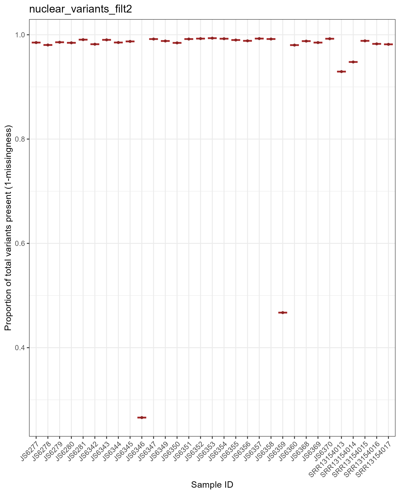
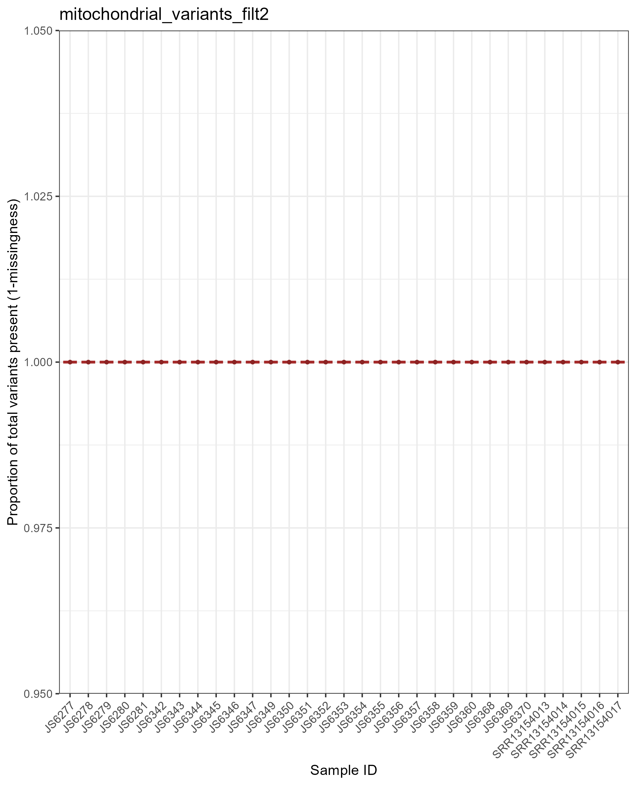
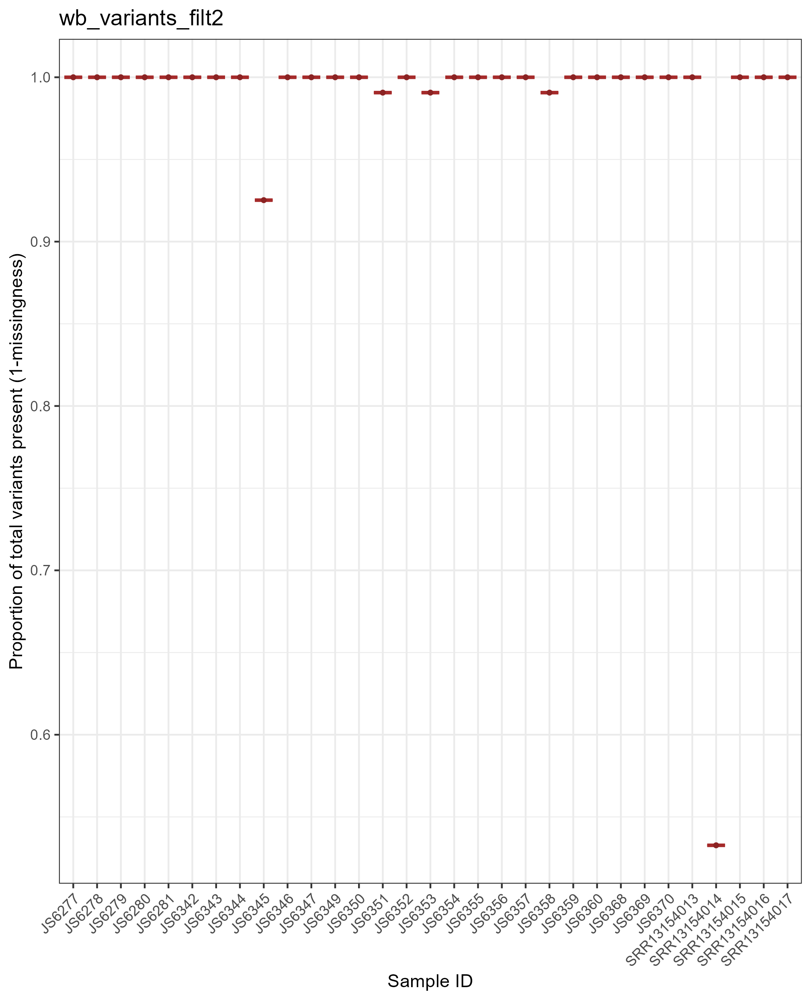
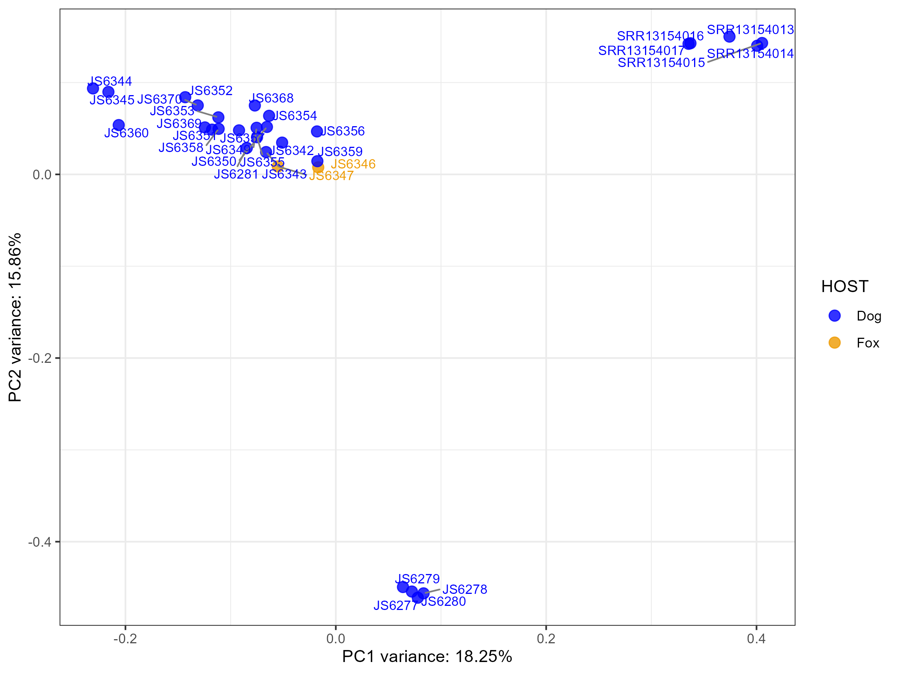
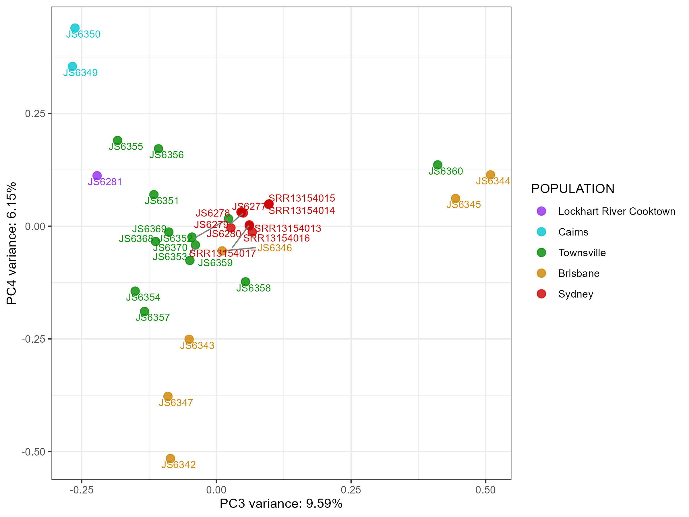
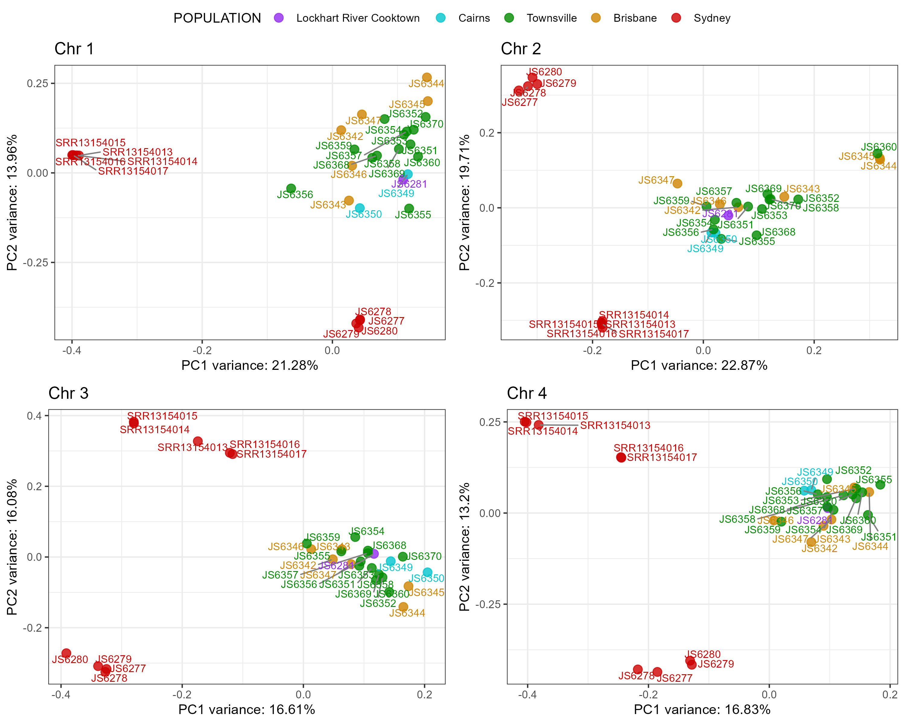

# Dirofilaria immitis WGS - FILTER TEST #2

### Rose Power USYD 2023

I will be testing out different filtering parameters on the original VCF file. We want to determine whether the first PCA plot we generated will look similar if we change the way we filter our variant data.

**FILTER TEST #2:**
- *snps_qc4 step:* change --maf to 0.02


## SNPs QC

What do the QC abbreviations mean?

- QUAL: quality score.
- DP: filtered depth, at the sample level.
- MQ: RMSMappingQuality. This is the root mean square mapping quality over all the reads at the site. 
- SOR: StrandOddsRatio. This is another way to estimate strand bias using a test similar to the symmetric odds ratio test. 
- QD: QualByDepth. This is the variant confidence (from the QUAL field) divided by the unfiltered depth of non-hom-ref samples.
- FS: FisherStrand. This is the Phred-scaled probability that there is strand bias at the site.
- MQRankSum: MappingQualityRankSumTest. This is the u-based z-approximation from the Rank Sum Test for mapping qualities. It compares the mapping qualities of the reads supporting the reference allele and the alternate allele.
- ReadPosRankSum: ReadPosRankSumTest. This is the u-based z-approximation from the Rank Sum Test for site position within reads. It compares whether the positions of the reference and alternate alleles are different within the reads.


### Attending to the quantiles, thresholds for specific parameters are established

```bash
#!/bin/bash

# PBS directives 
#PBS -P RDS-FSC-Heartworm_MLR-RW
#PBS -N snps_qc2
#PBS -l select=1:ncpus=1:mem=4GB
#PBS -l walltime=00:03:00
#PBS -m e
#PBS -q defaultQ
#PBS -o snps_qc2.txt

# qsub ../snps_qc2.pbs


# load gatk
module load gatk/4.1.4.1

WORKING_DIR=/scratch/RDS-FSC-Heartworm_MLR-RW/filter_test2

# set reference, vcf
REFERENCE=/project/RDS-FSC-Heartworm_MLR-RW/HW_WGS_ALL/data/analysis/mapping/dimmitis_WSI_2.2.fa
VCF=/scratch/RDS-FSC-Heartworm_MLR-RW/filter_test2/dirofilaria_australia.cohort.2023-05-16.vcf.gz

cd ${WORKING_DIR}

#Nuclear
gatk VariantFiltration \
--reference ${REFERENCE} \
--variant /scratch/RDS-FSC-Heartworm_MLR-RW/mapping/filter/dirofilaria_australia.cohort.2023-05-16.nuclearSNPs.vcf \
--filter-expression 'QUAL < 34 || DP < 119 || DP > 8569 || MQ < 28.76 || SOR > 8.592 || QD < 0.450 || FS > 63.394 || MQRankSum < -9.383 || ReadPosRankSum < -3.914 || ReadPosRankSum > 2.871' \
--filter-name "SNP_filtered" \
--output dirofilaria_australia.cohort.2023-05-16.nuclearSNPs.filtered2.vcf

gatk VariantFiltration \
--reference ${REFERENCE} \
--variant /scratch/RDS-FSC-Heartworm_MLR-RW/mapping/filter/dirofilaria_australia.cohort.2023-05-16.nuclearINDELs.vcf \
--filter-expression 'QUAL < 68 || DP < 344 || DP > 4444 || MQ < 36.50 || SOR > 5.282 || QD < 1.175 || FS > 5.159 || MQRankSum < -3.820 || ReadPosRankSum < -2.859 || ReadPosRankSum > 2.470' \
--filter-name "INDEL_filtered" \
--output dirofilaria_australia.cohort.2023-05-16.nuclearINDELs.filtered2.vcf

#Mitochondrial
gatk VariantFiltration \
--reference ${REFERENCE} \
--variant /scratch/RDS-FSC-Heartworm_MLR-RW/mapping/filter/dirofilaria_australia.cohort.2023-05-16.mitoSNPs.vcf \
--filter-expression ' QUAL < 281 || DP < 42483 || DP > 180573 || MQ < 43.74 || SOR > 8.817 || QD < 0.407 || FS > 78.730 || MQRankSum < -1.621 || ReadPosRankSum < -16.583 || ReadPosRankSum > 2.843 ' \
--filter-name "SNP_filtered" \
--output dirofilaria_australia.cohort.2023-05-16.mitoSNPs.filtered2.vcf

gatk VariantFiltration \
--reference ${REFERENCE} \
--variant /scratch/RDS-FSC-Heartworm_MLR-RW/mapping/filter/dirofilaria_australia.cohort.2023-05-16.mitoINDELs.vcf \
--filter-expression 'QUAL < 158 || DP < 48740 || DP > 150482 || MQ < 48.26 || SOR > 8.328 || QD < 0.039 || FS > 128.666 || MQRankSum < -7.096 || ReadPosRankSum < -12.517 || ReadPosRankSum > 4.800' \
--filter-name "INDEL_filtered" \
--output dirofilaria_australia.cohort.2023-05-16.mitoINDELs.filtered2.vcf

#Wolbachia
gatk VariantFiltration \
--reference ${REFERENCE} \
--variant /scratch/RDS-FSC-Heartworm_MLR-RW/mapping/filter/dirofilaria_australia.cohort.2023-05-16.WbSNPs.vcf \
--filter-expression ' QUAL < 31 || DP < 13753 || DP > 24876 || MQ < 49.33 || SOR > 8.162 || QD < 0.450 || FS > 24.869 || MQRankSum < -9.328 || ReadPosRankSum < -5.619 || ReadPosRankSum > 3.195 ' \
--filter-name "SNP_filtered" \
--output dirofilaria_australia.cohort.2023-05-16.WbSNPs.filtered2.vcf

gatk VariantFiltration \
--reference ${REFERENCE} \
--variant /scratch/RDS-FSC-Heartworm_MLR-RW/mapping/filter/dirofilaria_australia.cohort.2023-05-16.WbINDELs.vcf \
--filter-expression 'QUAL < 50 || DP < 16665 || DP > 25631 || MQ < 47.29 || SOR > 4.050 || QD < 1.600 || FS > 2.395 || MQRankSum < -1.834 || ReadPosRankSum < -2.799 || ReadPosRankSum > 1.930' \
--filter-name "INDEL_filtered" \
--output dirofilaria_australia.cohort.2023-05-16.WbINDELs.filtered2.vcf

# once done, count the filtered sites - funny use of "|" allows direct markdown table format
echo -e "| Filtered_VCF | Variants_PASS | Variants_FILTERED |\n| -- | -- | -- | " > filter2.stats

for i in *filtered2.vcf; do
     name=${i}; pass=$( grep -E 'PASS' ${i} | wc -l ); filter=$( grep -E 'filter' ${i} | wc -l );
     echo -e "| ${name} | ${pass} | ${filter} |" >> filter2.stats
done
```
This is the summary of the filtered variants ('filter2.stats'):


Filtering looks ok. Didn't lose too many SNPs.

Usually we would merge the SNP and INDEL files together to make a joined VCF. However, I want to disregard the indels moving forward and only focus on the SNPs. Some downstream tools don't like having indels in there.


### Filter genotypes based on x3 depth per genotype

```bash
#!/bin/bash

# PBS directives 
#PBS -P RDS-FSC-Heartworm_MLR-RW
#PBS -N snps_qc3
#PBS -l select=1:ncpus=1:mem=2GB
#PBS -l walltime=00:06:00
#PBS -m e
#PBS -q defaultQ
#PBS -o snps_qc3.txt

# qsub ../snps_qc3.pbs

# load gatk
module load gatk/4.1.4.1

WORKING_DIR=/scratch/RDS-FSC-Heartworm_MLR-RW/filter_test2

# set reference, vcf
REFERENCE=/project/RDS-FSC-Heartworm_MLR-RW/HW_WGS_ALL/data/analysis/mapping/dimmitis_WSI_2.2.fa
VCF=/scratch/RDS-FSC-Heartworm_MLR-RW/filter_test2/dirofilaria_australia.cohort.2023-05-16.vcf.gz

cd ${WORKING_DIR}

#Nuclear 
gatk VariantFiltration \
--reference ${REFERENCE} \
--variant ${VCF%.vcf.gz}.nuclearSNPs.filtered2.vcf \
--genotype-filter-expression ' DP < 3 '  \
--genotype-filter-name "DP_lt3" \
--output ${VCF%.vcf.gz}.nuclearSNPs.DPfiltered2.vcf

gatk SelectVariants \
--reference ${REFERENCE} \
--variant ${VCF%.vcf.gz}.nuclearSNPs.DPfiltered2.vcf \
--set-filtered-gt-to-nocall \
--output ${VCF%.vcf.gz}.nuclearSNPs.DPfilterNoCall2.vcf

#Mito
gatk VariantFiltration \
--reference ${REFERENCE} \
--variant ${VCF%.vcf.gz}.mitoSNPs.filtered2.vcf \
--genotype-filter-expression ' DP < 3 '  \
--genotype-filter-name "DP_lt3" \
--output ${VCF%.vcf.gz}.mitoSNPs.DPfiltered2.vcf

gatk SelectVariants \
--reference ${REFERENCE} \
--variant ${VCF%.vcf.gz}.mitoSNPs.DPfiltered2.vcf \
--set-filtered-gt-to-nocall \
--output ${VCF%.vcf.gz}.mitoSNPs.DPfilterNoCall2.vcf

#wolbachia
gatk VariantFiltration \
--reference ${REFERENCE} \
--variant ${VCF%.vcf.gz}.WbSNPs.filtered2.vcf \
--genotype-filter-expression ' DP < 3 '  \
--genotype-filter-name "DP_lt3" \
--output ${VCF%.vcf.gz}.WbSNPs.DPfiltered2.vcf

gatk SelectVariants \
--reference ${REFERENCE} \
--variant ${VCF%.vcf.gz}.WbSNPs.DPfiltered2.vcf \
--set-filtered-gt-to-nocall \
--output ${VCF%.vcf.gz}.WbSNPs.DPfilterNoCall2.vcf
```

### Now we apply a set of standard filters for population genomics

**CHANGED THESE FILTERING PARAMETERS!!**
Used maf 0.02 (what Javier used) instead of 0.05. 

```bash
#!/bin/bash

# PBS directives 
#PBS -P RDS-FSC-Heartworm_MLR-RW
#PBS -N snps_qc4
#PBS -l select=1:ncpus=1:mem=1GB
#PBS -l walltime=00:03:00
#PBS -m e
#PBS -q defaultQ
#PBS -o snps_qc4.txt

# qsub ../snps_qc4.pbs

# load gatk
module load gatk/4.1.4.1
module load vcftools/0.1.14

WORKING_DIR=/scratch/RDS-FSC-Heartworm_MLR-RW/filter_test2

# set vcf
VCF=/scratch/RDS-FSC-Heartworm_MLR-RW/filter_test2/dirofilaria_australia.cohort.2023-05-16.vcf.gz

cd ${WORKING_DIR}

#Nuclear variants
vcftools \
--vcf ${VCF%.vcf.gz}.nuclearSNPs.DPfilterNoCall2.vcf \
--remove-filtered-geno-all \
--remove-filtered-all \
--min-alleles 2 \
--max-alleles 2 \
--hwe 1e-06 \
--maf 0.02 \
--recode \
--recode-INFO-all \
--out ${VCF%.vcf.gz}.nuclear_SNPs.final2
# After filtering, kept 31 out of 31 Individuals
# After filtering, kept 191072 out of a possible 278838 Sites
#--- nuclear SNPs
vcftools --vcf dirofilaria_australia.cohort.2023-05-16.nuclear_SNPs.final2.recode.vcf --remove-indels
#After filtering, kept 31 out of 31 Individuals
#After filtering, kept 191072 out of a possible 191072 Sites
#--- nuclear  INDELs
vcftools --vcf dirofilaria_australia.cohort.2023-05-16.nuclear_SNPs.final2.recode.vcf --keep-only-indels
#After filtering, kept 31 out of 31 Individuals
#After filtering, kept 0 out of a possible 191072 Sites


#Mitochondrial variants
vcftools \
--vcf ${VCF%.vcf.gz}.mitoSNPs.DPfilterNoCall2.vcf \
--remove-filtered-geno-all \
--remove-filtered-all \
--min-alleles 2 \
--max-alleles 2 \
--maf 0.02 \
--recode \
--recode-INFO-all \
--out ${VCF%.vcf.gz}.mito_SNPs.final2
#After filtering, kept 31 out of 31 Individuals
#After filtering, kept 9 out of a possible 28 Sites
#--- mito SNPs
vcftools --vcf dirofilaria_australia.cohort.2023-05-16.mito_SNPs.final2.recode.vcf --remove-indels
#After filtering, kept 31 out of 31 Individuals
#After filtering, kept 9 out of a possible 9 Sites
#--- mito INDELs
vcftools --vcf dirofilaria_australia.cohort.2023-05-16.mito_SNPs.final2.recode.vcf --keep-only-indels
#After filtering, kept 31 out of 31 Individuals
#After filtering, kept 0 out of a possible 9 Sites


#wolbachia variants
vcftools \
--vcf ${VCF%.vcf.gz}.WbSNPs.DPfilterNoCall2.vcf \
--remove-filtered-geno-all \
--remove-filtered-all \
--min-alleles 2 \
--max-alleles 2 \
--maf 0.02 \
--recode \
--recode-INFO-all \
--out ${VCF%.vcf.gz}.Wb_SNPs.final2
#After filtering, kept 31 out of 31 Individuals
# After filtering, kept 107 out of a possible 1497 Sites
#--- Wb SNPs
vcftools --vcf dirofilaria_australia.cohort.2023-05-16.Wb_SNPs.final2.recode.vcf --remove-indels
# After filtering, kept 31 out of 31 Individuals
#After filtering, kept 107 out of a possible 107 Sites
#--- Wb INDELs
vcftools --vcf dirofilaria_australia.cohort.2023-05-16.Wb_SNPs.final2.recode.vcf --keep-only-indels
# After filtering, kept 31 out of 31 Individuals
#After filtering, kept 0 out of a possible 107 Sites
```

### Now, we are filtering by missingness

```bash
#!/bin/bash

# PBS directives 
#PBS -P RDS-FSC-Heartworm_MLR-RW
#PBS -N snps_qc5
#PBS -l select=1:ncpus=1:mem=1GB
#PBS -l walltime=00:02:00
#PBS -m e
#PBS -q defaultQ
#PBS -o snps_qc5.txt

# qsub ../snps_qc5.pbs

# load modules
module load gatk/4.1.4.1
module load vcftools/0.1.14

WORKING_DIR=/scratch/RDS-FSC-Heartworm_MLR-RW/filter_test2

# set vcf
VCF=/scratch/RDS-FSC-Heartworm_MLR-RW/filter_test2/dirofilaria_australia.cohort.2023-05-16.vcf.gz

cd ${WORKING_DIR}

#determine missingness per individual
vcftools --vcf ${VCF%.vcf.gz}.nuclear_SNPs.final2.recode.vcf --out nuclear --missing-indv
vcftools --vcf ${VCF%.vcf.gz}.mito_SNPs.final2.recode.vcf --out mito --missing-indv
vcftools --vcf ${VCF%.vcf.gz}.Wb_SNPs.final2.recode.vcf --out wb --missing-indv
```

### Check the missingess in R

```R
# load libraries
library(patchwork)
require(data.table)
library(tidyverse)
library(gridExtra)

setwd("C:/Users/rpow2134/OneDrive - The University of Sydney (Staff)/Documents/HW_WGS/R_analysis/filter_test2")

 # Check missingness
  data_nuclear <- read.delim("nuclear.imiss", header=T)
  data_mito <- read.delim("mito.imiss", header=T)
  data_wb <- read.delim("wb.imiss", header=T)
  
  #creating the function - per sample
  fun_plot_missingness <- function(data,title) {
    
    plot <- ggplot(data, aes(INDV, 1-F_MISS)) +
      geom_boxplot(color = 'brown') +
      geom_point(size = 1, color = 'brown4') +
      theme_bw() +
      labs(x="Sample ID", y="Proportion of total variants present (1-missingness)")+
      ggtitle(title) +
      theme(axis.text.x = element_text(angle = 45, hjust = 1))
    print(plot)
    ggsave(paste0("plot_missingness_figure",title,".png"))
  }
  
  # plotting for each dataset
  fun_plot_missingness(data_nuclear, "nuclear_variants_filt2")
```

JS6346 and JS6359 both only had ~1G of data sequences which might explain the missingness.

```R
  fun_plot_missingness(data_mito,"mitochondrial_variants_filt2")
```


```R
  fun_plot_missingness(data_wb, "wb_variants_filt2")
```

Not sure about the missingness here.

In Javier's code, he generated a different sample list for each database and evaluated the max missingness. For now, I will just keep all the samples.

```bash
# For nuclear (n=31) - nuclear_samplelist.keep
JS6277
JS6278
JS6279
JS6280
JS6281
JS6342
JS6343
JS6344
JS6345
JS6346
JS6347
JS6349
JS6350
JS6351
JS6352
JS6353
JS6354
JS6355
JS6356
JS6357
JS6358
JS6359
JS6360
JS6368
JS6369
JS6370
SRR13154013
SRR13154014
SRR13154015
SRR13154016
SRR13154017
# For mithochondiral (n=31) - mito_samplelist.keep
JS6277
JS6278
JS6279
JS6280
JS6281
JS6342
JS6343
JS6344
JS6345
JS6346
JS6347
JS6349
JS6350
JS6351
JS6352
JS6353
JS6354
JS6355
JS6356
JS6357
JS6358
JS6359
JS6360
JS6368
JS6369
JS6370
SRR13154013
SRR13154014
SRR13154015
SRR13154016
SRR13154017
# For wb (n=31) - wb_samplelist.keep
JS6277
JS6278
JS6279
JS6280
JS6281
JS6342
JS6343
JS6344
JS6345
JS6346
JS6347
JS6349
JS6350
JS6351
JS6352
JS6353
JS6354
JS6355
JS6356
JS6357
JS6358
JS6359
JS6360
JS6368
JS6369
JS6370
SRR13154013
SRR13154014
SRR13154015
SRR13154016
SRR13154017
```


### Let's check different thresholds for each dataset

```bash
#!/bin/bash

# PBS directives 
#PBS -P RDS-FSC-Heartworm_MLR-RW
#PBS -N snps_qc6
#PBS -l select=1:ncpus=1:mem=1GB
#PBS -l walltime=00:01:00
#PBS -m e
#PBS -q defaultQ
#PBS -o snps_qc6.txt

# qsub ../snps_qc6.pbs

# load gatk
module load gatk/4.1.4.1
module load vcftools/0.1.14

WORKING_DIR=/scratch/RDS-FSC-Heartworm_MLR-RW/filter_test2

# set vcf
VCF=/scratch/RDS-FSC-Heartworm_MLR-RW/filter_test2/dirofilaria_australia.cohort.2023-05-16.vcf.gz

cd ${WORKING_DIR}

# For nuclear variants
for i in 0.7 0.8 0.9 1; do
     vcftools --vcf ${VCF%.vcf.gz}.nuclear_SNPs.final2.recode.vcf --keep nuclear_samplelist.keep --max-missing ${i} ;
done

# max-missing = 0.7
#After filtering, kept 31 out of 31 Individuals
#After filtering, kept 187622 out of a possible 191072 Sites

# max-missing = 0.8
#After filtering, kept 31 out of 31 Individuals
#After filtering, kept 185273 out of a possible 191072 Sites

# max-missing = 0.9
#After filtering, kept 31 out of 31 Individuals
#After filtering, kept 180119 out of a possible 191072 Sites

# max-missing = 1
#After filtering, kept 31 out of 31 Individuals
#After filtering, kept 25251 out of a possible 191072 Sites

# For mito variants
for i in 0.7 0.8 0.9 1; do
     vcftools --vcf ${VCF%.vcf.gz}.mito_SNPs.final2.recode.vcf --keep mito_samplelist.keep --max-missing ${i} ;
done

# max-missing = 0.7
#After filtering, kept 31 out of 31 Individuals
#After filtering, kept 9 out of a possible 9 Sites

# max-missing = 0.8
#After filtering, kept 31 out of 31 Individuals
#After filtering, kept 9 out of a possible 9 Sites

# max-missing = 0.9
#After filtering, kept 31 out of 31 Individuals
#After filtering, kept 9 out of a possible 9 Sites

# max-missing = 1
#After filtering, kept 31 out of 31 Individuals
#After filtering, kept 9 out of a possible 9 Sites

# For Wb variants
for i in 0.7 0.8 0.9 1; do
     vcftools --vcf ${VCF%.vcf.gz}.Wb_SNPs.final2.recode.vcf --keep wb_samplelist.keep --max-missing ${i} ;
done

# max-missing = 0.7
#After filtering, kept 31 out of 31 Individuals
#After filtering, kept 107 out of a possible 107 Sites

# max-missing = 0.8
#After filtering, kept 31 out of 31 Individuals
#After filtering, kept 107 out of a possible 107 Sites

# max-missing = 0.9
#After filtering, kept 31 out of 31 Individuals
#After filtering, kept 106 out of a possible 107 Sites

# max-missing = 1
#After filtering, kept 31 out of 31 Individuals
#After filtering, kept 55 out of a possible 107 Sites

```

Selecting a max missingness of 0.8 for nuclear, 0.8 for mito and 0.9 for Wb is sensible.

```bash
#!/bin/bash

# PBS directives 
#PBS -P RDS-FSC-Heartworm_MLR-RW
#PBS -N snps_qc7
#PBS -l select=1:ncpus=1:mem=1GB
#PBS -l walltime=00:01:00
#PBS -m e
#PBS -q defaultQ
#PBS -o snps_qc7.txt

# qsub ../snps_qc7.pbs

# load gatk
module load gatk/4.1.4.1
module load vcftools/0.1.14

WORKING_DIR=/scratch/RDS-FSC-Heartworm_MLR-RW/filter_test2

# set vcf
VCF=/scratch/RDS-FSC-Heartworm_MLR-RW/filter_test2/dirofilaria_australia.cohort.2023-05-16.vcf.gz

cd ${WORKING_DIR}

# For nuclear
vcftools --vcf ${VCF%.vcf.gz}.nuclear_SNPs.final2.recode.vcf \
     --keep nuclear_samplelist.keep \
     --max-missing 0.8 \
     --recode --recode-INFO-all \
     --out FINAL_SETS/nuclear_samples3x_missing0.8_filt2

# For mito
vcftools --vcf ${VCF%.vcf.gz}.mito_SNPs.final2.recode.vcf \
     --keep mito_samplelist.keep \
     --max-missing 0.8 \
     --recode --recode-INFO-all \
     --out FINAL_SETS/mito_samples3x_missing0.8_filt2

# For wb
vcftools --vcf ${VCF%.vcf.gz}.Wb_SNPs.final2.recode.vcf \
     --keep wb_samplelist.keep \
     --max-missing 0.9 \
     --recode --recode-INFO-all \
     --out FINAL_SETS/wb_samples3x_missing0.9_filt2
```

### Also, we will select only the variants in the chr 1 to chr4, avoiding the chrX and the scaffolds

```bash
#!/bin/bash

# PBS directives 
#PBS -P RDS-FSC-Heartworm_MLR-RW
#PBS -N snps_qc8
#PBS -l select=1:ncpus=1:mem=1GB
#PBS -l walltime=00:01:00
#PBS -m e
#PBS -q defaultQ
#PBS -o snps_qc8.txt

# qsub ../snps_qc8.pbs

# load gatk
module load vcftools/0.1.14

cd /scratch/RDS-FSC-Heartworm_MLR-RW/filter_test2

vcftools --vcf FINAL_SETS/nuclear_samples3x_missing0.8_filt2.recode.vcf \
--chr dirofilaria_immitis_chr1 \
--chr dirofilaria_immitis_chr2 \
--chr dirofilaria_immitis_chr3 \
--chr dirofilaria_immitis_chr4 \
--recode --out FINAL_SETS/nuclear_samples3x_missing0.8_filt2.chr1to4
#After filtering, kept 31 out of 31 Individuals
# After filtering, kept 136638 out of a possible 185273 Sites

vcftools --vcf FINAL_SETS/nuclear_samples3x_missing0.8_filt2.chr1to4.recode.vcf --remove-indels
# After filtering, kept 31 out of 31 Individuals
#After filtering, kept 136638 out of a possible 136638 Sites

vcftools --vcf FINAL_SETS/nuclear_samples3x_missing0.8_filt2.chr1to4.recode.vcf --keep-only-indels
# After filtering, kept 31 out of 31 Individuals
#After filtering, kept 0 out of a possible 136638 Sites - this makes sense because I removed the indels earlier and only focused on the SNPs.
```

### Preliminary PCA plots for chr 1 to chr4 data

This analysis was conducted in the R file called 'filter_test2.R'.

```R
# PCA

library(tidyverse)
library(gdsfmt)
library(SNPRelate)
library(ggsci)
library(ggpubr)
library(reshape2)
library(viridis)
library(vcfR)
library(factoextra)
library(ggrepel)

# Set working directory
setwd("C:/Users/rpow2134/OneDrive - The University of Sydney (Staff)/Documents/HW_WGS/R_analysis/filter_test2")

#Preparing the data for plotting
# Set colours for different cities
scale_colour_pop <- function(...){
  ggplot2:::manual_scale(
    'colour', 
    values = setNames(
      c('purple2',
        'turquoise3',
        'green4',
        'orange3',
        'red3'), 
      c('Lockhart River Cooktown', 'Cairns', 
        'Townsville',
        'Brisbane',
        'Sydney')), 
    ...
  )
}

# Set colours for different hosts
scale_colour_host <- function(...){
  ggplot2:::manual_scale(
    'colour', 
    values = setNames(
      c('blue',
        'orange2'), 
      c('Dog', 'Fox')), 
    ...
  )
}


#PCA on nuclear variants using genotypes
snpgdsClose(genofile) # you need this line to close any previous file open, otherwise it won't work if you want to re-run
vcf.in <- "nuclear_samples3x_missing0.8_filt2.chr1to4.recode.vcf"
gds<-snpgdsVCF2GDS(vcf.in, "nucDNA.gds", method="biallelic.only")
genofile <- snpgdsOpen(gds)


pca <-snpgdsPCA(genofile, num.thread=2, autosome.only = F)
samples <- as.data.frame(pca$sample.id)
colnames(samples) <- "name"

# Metadata file that describes where the samples come from
metadata_file <- "../location.csv"
metadata <- read.csv(metadata_file, header = TRUE)

data <- data.frame(sample.id = pca$sample.id,
                   EV1 = pca$eigenvect[,1],  
                   EV2 = pca$eigenvect[,2],
                   EV3 = pca$eigenvect[,3],
                   EV4 = pca$eigenvect[,4],
                   EV5 = pca$eigenvect[,5],
                   EV6 = pca$eigenvect[,6],
                   POPULATION = metadata$city,
                   REGION = metadata$region,
                   SAMPLEID = metadata$sample_name,
                   HOST = metadata$host,
                   stringsAsFactors = FALSE)

#Generating levels for population and super-population variables
data$POPULATION <- factor(data$POPULATION, 
                          levels = c('Lockhart River Cooktown', 'Cairns', 
                                     'Townsville',
                                     'Brisbane',
                                     'Sydney'))
data$HOST <- factor(data$HOST, levels = c('Dog', 'Fox'))

# Plot PC1 vs PC2
## Colour based on population
nuc_PC1.1 <- ggplot(data,aes(EV1, EV2, col = POPULATION, label = POPULATION)) +
  geom_point(alpha = 0.8, size = 3) +
  geom_text_repel(aes(label = SAMPLEID), box.padding = 0.05, point.padding = 0.01, segment.color = 'grey50', size = 3, hjust = 0, vjust = 0, max.overlaps = Inf, show.legend=FALSE) +
  theme_bw() +
  scale_colour_pop () +
  labs(x = paste0("PC1 variance: ",round(pca$varprop[1]*100,digits=2),"%"),
       y = paste0("PC2 variance: ",round(pca$varprop[2]*100,digits=2),"%"))
nuc_PC1.1
ggsave("nuc_PC1.1_filt2.png", height=6, width=8)
```


This looks interesting. Why are all the QLD samples clustered together, but then the SYD samples are in 2 separate clusters? (Add more comments)

```R
## Colour based on host
nuc_PC1.2 <- ggplot(data,aes(EV1, EV2, col = HOST, label = HOST)) +
  geom_point(alpha = 0.8, size = 3) +
  geom_text_repel(aes(label = SAMPLEID), box.padding = 0.05, point.padding = 0.01, segment.color = 'grey50', size = 3, hjust = 0, vjust = 0, max.overlaps = Inf, show.legend=FALSE) +
  theme_bw() +
  scale_colour_host () +
  labs(x = paste0("PC1 variance: ",round(pca$varprop[1]*100,digits=2),"%"),
       y = paste0("PC2 variance: ",round(pca$varprop[2]*100,digits=2),"%"))
nuc_PC1.2
ggsave("nuc_PC1.2_filt2.png", height=6, width=8)
```


```R
# Plot PC3 vs PC4
## Colour based on population
nuc_PC3.1 <- ggplot(data,aes(EV3, EV4, col = POPULATION, label = POPULATION)) +
  geom_point(alpha = 0.8, size = 3) + 
  geom_text_repel(aes(label = SAMPLEID), box.padding = 0.05, point.padding = 0.01, segment.color = 'grey50', size = 3, hjust = 0, vjust = 0, max.overlaps = Inf, show.legend=FALSE) +
  theme_bw() +
  scale_colour_pop () +
  labs(x = paste0("PC3 variance: ",round(pca$varprop[3]*100,digits=2),"%"),
       y = paste0("PC4 variance: ",round(pca$varprop[4]*100,digits=2),"%"))
nuc_PC3.1
ggsave("nuc_PC3.1_filt2.png", height=6, width=8)
```


```R
## Colour based on host
nuc_PC3.2 <- ggplot(data,aes(EV3, EV4, col = HOST, label = HOST)) +
  geom_point(alpha = 0.8, size = 3) + 
  geom_text_repel(aes(label = SAMPLEID), box.padding = 0.05, point.padding = 0.01, segment.color = 'grey50', size = 3, hjust = 0, vjust = 0, max.overlaps = Inf, show.legend=FALSE) +
  theme_bw() +
  scale_colour_host () +
  labs(x = paste0("PC3 variance: ",round(pca$varprop[3]*100,digits=2),"%"),
       y = paste0("PC4 variance: ",round(pca$varprop[4]*100,digits=2),"%"))
nuc_PC3.2
ggsave("nuc_PC3.2_filt1.png", height=6, width=8)
```


### Make the PCA per chromosome to see if this pattern holds regardless of the data we restrict it to

Since the first PCA (with PC 1 and PC2) looks strange with SYD samples being in separate clusters, let's make PCAs for each chromosome. Will we see the same pattern?

#### Select variants for chr1, chr2, chr3 and chr4 (SEPARATELY)

```bash
#!/bin/bash

# PBS directives 
#PBS -P RDS-FSC-Heartworm_MLR-RW
#PBS -N snps_chr1-4_separate
#PBS -l select=1:ncpus=1:mem=1GB
#PBS -l walltime=00:02:00
#PBS -m e
#PBS -q defaultQ
#PBS -o snps_chr1-4_separate.txt

# qsub ../snps_chr1-4_separate.pbs

# load gatk
module load vcftools/0.1.14

cd /scratch/RDS-FSC-Heartworm_MLR-RW/filter_test2

# chr1
vcftools --vcf FINAL_SETS/nuclear_samples3x_missing0.8_filt2.recode.vcf \
--chr dirofilaria_immitis_chr1 \
--recode --out FINAL_SETS/nuclear_samples3x_missing0.8_filt2.chr1
# After filtering, kept 31 out of 31 Individuals
# After filtering, kept 37153 out of a possible 185273 Sites

# chr2
vcftools --vcf FINAL_SETS/nuclear_samples3x_missing0.8_filt2.recode.vcf \
--chr dirofilaria_immitis_chr2 \
--recode --out FINAL_SETS/nuclear_samples3x_missing0.8_filt2.chr2
# After filtering, kept 31 out of 31 Individuals
# After filtering, kept 31012 out of a possible 185273 Sites

# chr3
vcftools --vcf FINAL_SETS/nuclear_samples3x_missing0.8_filt2.recode.vcf \
--chr dirofilaria_immitis_chr3 \
--recode --out FINAL_SETS/nuclear_samples3x_missing0.8_filt2.chr3
# After filtering, kept 31 out of 31 Individuals
# After filtering, kept 35735 out of a possible 185273 Sites

# chr4
vcftools --vcf FINAL_SETS/nuclear_samples3x_missing0.8_filt2.recode.vcf \
--chr dirofilaria_immitis_chr4 \
--recode --out FINAL_SETS/nuclear_samples3x_missing0.8_filt2.chr4
# After filtering, kept 31 out of 31 Individuals
# After filtering, kept 32738 out of a possible 185273 Sites
```

#### Make separate PCAs for chr1, chr2, chr3 and chr4

```R
# Now let's look at the PCA when we restrict the data to each chromosome


# Chromosome 1
#PCA on chr1 variants using genotypes
snpgdsClose(genofile_chr1)
vcf.in_chr1 <- "nuclear_samples3x_missing0.8_filt2.chr1.recode.vcf"
gds_chr1<-snpgdsVCF2GDS(vcf.in_chr1, "nucDNA_chr1.gds", method="biallelic.only")
genofile_chr1 <- snpgdsOpen(gds_chr1)


pca_chr1 <-snpgdsPCA(genofile_chr1, num.thread=2, autosome.only = F)
samples_chr1 <- as.data.frame(pca_chr1$sample.id)
colnames(samples_chr1) <- "name"

data_chr1 <- data.frame(sample.id = pca_chr1$sample.id,
                        EV1_chr1 = pca_chr1$eigenvect[,1],  
                        EV2_chr1 = pca_chr1$eigenvect[,2],
                        EV3_chr1 = pca_chr1$eigenvect[,3],
                        EV4_chr1 = pca_chr1$eigenvect[,4],
                        EV5_chr1 = pca_chr1$eigenvect[,5],
                        EV6_chr1 = pca_chr1$eigenvect[,6],
                        POPULATION = metadata$city,
                        REGION = metadata$region,
                        SAMPLEID = metadata$sample_name,
                        HOST = metadata$host,
                        stringsAsFactors = FALSE)

#Generating levels for population and super-population variables
data_chr1$POPULATION <- factor(data_chr1$POPULATION, 
                               levels = c('Lockhart River Cooktown', 'Cairns', 
                                          'Townsville',
                                          'Brisbane',
                                          'Sydney'))
data_chr1$HOST <- factor(data_chr1$HOST, levels = c('Dog', 'Fox'))

# Plot PC1 vs PC2
## Colour based on population
chr1_PC1.1 <- ggplot(data_chr1,aes(EV1_chr1, EV2_chr1, col = POPULATION, label = POPULATION)) +
  geom_point(alpha = 0.8, size = 3) +
  geom_text_repel(aes(label = SAMPLEID), box.padding = 0.05, point.padding = 0.01, segment.color = 'grey50', size = 3, hjust = 0, vjust = 0, max.overlaps = Inf, show.legend=FALSE) +
  theme_bw() +
  scale_colour_pop () +
  ggtitle("Chr 1") +
  labs(x = paste0("PC1 variance: ",round(pca_chr1$varprop[1]*100,digits=2),"%"),
       y = paste0("PC2 variance: ",round(pca_chr1$varprop[2]*100,digits=2),"%"))
chr1_PC1.1


# Chromosome 2
#PCA on chr1 variants using genotypes
snpgdsClose(genofile_chr2)
vcf.in_chr2 <- "nuclear_samples3x_missing0.8_filt2.chr2.recode.vcf"
gds_chr2<-snpgdsVCF2GDS(vcf.in_chr2, "nucDNA_chr2.gds", method="biallelic.only")
genofile_chr2 <- snpgdsOpen(gds_chr2)


pca_chr2 <-snpgdsPCA(genofile_chr2, num.thread=2, autosome.only = F)
samples_chr2 <- as.data.frame(pca_chr2$sample.id)
colnames(samples_chr2) <- "name"

data_chr2 <- data.frame(sample.id = pca_chr2$sample.id,
                        EV1_chr2 = pca_chr2$eigenvect[,1],  
                        EV2_chr2 = pca_chr2$eigenvect[,2],
                        EV3_chr2 = pca_chr2$eigenvect[,3],
                        EV4_chr2 = pca_chr2$eigenvect[,4],
                        EV5_chr2 = pca_chr2$eigenvect[,5],
                        EV6_chr2 = pca_chr2$eigenvect[,6],
                        POPULATION = metadata$city,
                        REGION = metadata$region,
                        SAMPLEID = metadata$sample_name,
                        HOST = metadata$host,
                        stringsAsFactors = FALSE)

#Generating levels for population and super-population variables
data_chr2$POPULATION <- factor(data_chr2$POPULATION, 
                               levels = c('Lockhart River Cooktown', 'Cairns', 
                                          'Townsville',
                                          'Brisbane',
                                          'Sydney'))
data_chr2$HOST <- factor(data_chr2$HOST, levels = c('Dog', 'Fox'))

# Plot PC1 vs PC2
## Colour based on population
chr2_PC1.1 <- ggplot(data_chr2,aes(EV1_chr2, EV2_chr2, col = POPULATION, label = POPULATION)) +
  geom_point(alpha = 0.8, size = 3) +
  geom_text_repel(aes(label = SAMPLEID), box.padding = 0.05, point.padding = 0.01, segment.color = 'grey50', size = 3, hjust = 0, vjust = 0, max.overlaps = Inf, show.legend=FALSE) +
  theme_bw() +
  scale_colour_pop () +
  ggtitle("Chr 2") +
  labs(x = paste0("PC1 variance: ",round(pca_chr2$varprop[1]*100,digits=2),"%"),
       y = paste0("PC2 variance: ",round(pca_chr2$varprop[2]*100,digits=2),"%"))
chr2_PC1.1


# Chromosome 3
#PCA on chr1 variants using genotypes
snpgdsClose(genofile_chr3)
vcf.in_chr3 <- "nuclear_samples3x_missing0.8_filt2.chr3.recode.vcf"
gds_chr3<-snpgdsVCF2GDS(vcf.in_chr3, "nucDNA_chr3.gds", method="biallelic.only")
genofile_chr3 <- snpgdsOpen(gds_chr3)


pca_chr3 <-snpgdsPCA(genofile_chr3, num.thread=2, autosome.only = F)
samples_chr3 <- as.data.frame(pca_chr3$sample.id)
colnames(samples_chr3) <- "name"

data_chr3 <- data.frame(sample.id = pca_chr3$sample.id,
                        EV1_chr3 = pca_chr3$eigenvect[,1],  
                        EV2_chr3 = pca_chr3$eigenvect[,2],
                        EV3_chr3 = pca_chr3$eigenvect[,3],
                        EV4_chr3 = pca_chr3$eigenvect[,4],
                        EV5_chr3 = pca_chr3$eigenvect[,5],
                        EV6_chr3 = pca_chr3$eigenvect[,6],
                        POPULATION = metadata$city,
                        REGION = metadata$region,
                        SAMPLEID = metadata$sample_name,
                        HOST = metadata$host,
                        stringsAsFactors = FALSE)

#Generating levels for population and super-population variables
data_chr3$POPULATION <- factor(data_chr3$POPULATION, 
                               levels = c('Lockhart River Cooktown', 'Cairns', 
                                          'Townsville',
                                          'Brisbane',
                                          'Sydney'))
data_chr3$HOST <- factor(data_chr3$HOST, levels = c('Dog', 'Fox'))

# Plot PC1 vs PC2
## Colour based on population
chr3_PC1.1 <- ggplot(data_chr3,aes(EV1_chr3, EV2_chr3, col = POPULATION, label = POPULATION)) +
  geom_point(alpha = 0.8, size = 3) +
  geom_text_repel(aes(label = SAMPLEID), box.padding = 0.05, point.padding = 0.01, segment.color = 'grey50', size = 3, hjust = 0, vjust = 0, max.overlaps = Inf, show.legend=FALSE) +
  theme_bw() +
  scale_colour_pop () +
  ggtitle("Chr 3") +
  labs(x = paste0("PC1 variance: ",round(pca_chr3$varprop[1]*100,digits=2),"%"),
       y = paste0("PC2 variance: ",round(pca_chr3$varprop[2]*100,digits=2),"%"))
chr3_PC1.1


# Chromosome 4
#PCA on chr1 variants using genotypes
snpgdsClose(genofile_chr4)
vcf.in_chr4 <- "nuclear_samples3x_missing0.8_filt2.chr4.recode.vcf"
gds_chr4<-snpgdsVCF2GDS(vcf.in_chr4, "nucDNA_chr4.gds", method="biallelic.only")
genofile_chr4 <- snpgdsOpen(gds_chr4)


pca_chr4 <-snpgdsPCA(genofile_chr4, num.thread=2, autosome.only = F)
samples_chr4 <- as.data.frame(pca_chr4$sample.id)
colnames(samples_chr4) <- "name"

data_chr4 <- data.frame(sample.id = pca_chr4$sample.id,
                        EV1_chr4 = pca_chr4$eigenvect[,1],  
                        EV2_chr4 = pca_chr4$eigenvect[,2],
                        EV3_chr4 = pca_chr4$eigenvect[,3],
                        EV4_chr4 = pca_chr4$eigenvect[,4],
                        EV5_chr4 = pca_chr4$eigenvect[,5],
                        EV6_chr4 = pca_chr4$eigenvect[,6],
                        POPULATION = metadata$city,
                        REGION = metadata$region,
                        SAMPLEID = metadata$sample_name,
                        HOST = metadata$host,
                        stringsAsFactors = FALSE)

#Generating levels for population and super-population variables
data_chr4$POPULATION <- factor(data_chr4$POPULATION, 
                               levels = c('Lockhart River Cooktown', 'Cairns', 
                                          'Townsville',
                                          'Brisbane',
                                          'Sydney'))
data_chr4$HOST <- factor(data_chr4$HOST, levels = c('Dog', 'Fox'))

# Plot PC1 vs PC2
## Colour based on population
chr4_PC1.1 <- ggplot(data_chr4,aes(EV1_chr4, EV2_chr4, col = POPULATION, label = POPULATION)) +
  geom_point(alpha = 0.8, size = 3) +
  geom_text_repel(aes(label = SAMPLEID), box.padding = 0.05, point.padding = 0.01, segment.color = 'grey50', size = 3, hjust = 0, vjust = 0, max.overlaps = Inf, show.legend=FALSE) +
  theme_bw() +
  scale_colour_pop () +
  ggtitle("Chr 4") +
  labs(x = paste0("PC1 variance: ",round(pca_chr4$varprop[1]*100,digits=2),"%"),
       y = paste0("PC2 variance: ",round(pca_chr4$varprop[2]*100,digits=2),"%"))
chr4_PC1.1


# Combine the plots together for all chromosomes
ggarrange(chr1_PC1.1, chr2_PC1.1, chr3_PC1.1, chr4_PC1.1, common.legend = TRUE, ncol = 2, nrow=2)
ggsave("chr1-4_PC1.1_filt2.png", height=8, width=10)
```

