# Dirofilaria immitis WGS Lab Book - PCA

### Rose Power USYD 2023


### Preliminary PCA plots for chr 1 to chr4 data

This analysis was conducted in the R file called 'hw_wgs_vcf.R'.

```R
# PCA

library(tidyverse)
library(gdsfmt)
library(SNPRelate)
library(ggsci)
library(ggpubr)
library(reshape2)
library(viridis)
library(vcfR)
library(factoextra)
library(ggrepel)
library(ggtree)
library(poppr)
library(adegenet)
library(ape)


# Set working directory
setwd("C:/Users/rpow2134/OneDrive - The University of Sydney (Staff)/Documents/HW_WGS/R_analysis/vcf/input")

#Preparing the data for plotting
# Set colours for different cities
scale_colour_pop <- function(...){
  ggplot2:::manual_scale(
    'colour', 
    values = setNames(
      c('purple2',
        'turquoise3',
        'green4',
        'orange3',
        'red3'), 
      c('Lockhart River Cooktown', 'Cairns', 
        'Townsville',
        'Brisbane',
        'Sydney')), 
    ...
  )
}

# Set colours for different hosts
scale_colour_host <- function(...){
  ggplot2:::manual_scale(
    'colour', 
    values = setNames(
      c('blue',
        'orange2'), 
      c('Dog', 'Fox')), 
    ...
  )
}


#PCA on nuclear variants using genotypes
snpgdsClose(genofile) # you need this line to close any previous file open, otherwise it won't work if you want to re-run
vcf.in <- "nuclear_samples3x_missing0.8.chr1to4.recode.vcf"
gds<-snpgdsVCF2GDS(vcf.in, "nucDNA.gds", method="biallelic.only")
genofile <- snpgdsOpen(gds)


pca <-snpgdsPCA(genofile, num.thread=2, autosome.only = F)
samples <- as.data.frame(pca$sample.id)
colnames(samples) <- "name"

# Metadata file that describes where the samples come from
metadata_file <- "../../location.csv"
metadata <- read.csv(metadata_file, header = TRUE)

data <- data.frame(sample.id = pca$sample.id,
                   EV1 = pca$eigenvect[,1],  
                   EV2 = pca$eigenvect[,2],
                   EV3 = pca$eigenvect[,3],
                   EV4 = pca$eigenvect[,4],
                   EV5 = pca$eigenvect[,5],
                   EV6 = pca$eigenvect[,6],
                   POPULATION = metadata$city,
                   REGION = metadata$region,
                   SAMPLEID = metadata$sample_name,
                   HOST = metadata$host,
                   stringsAsFactors = FALSE)

#Generating levels for population and super-population variables
data$POPULATION <- factor(data$POPULATION, 
                          levels = c('Lockhart River Cooktown', 'Cairns', 
                                     'Townsville',
                                     'Brisbane',
                                     'Sydney'))
data$HOST <- factor(data$HOST, levels = c('Dog', 'Fox'))

# Plot the eigenvectors
barplot(100 * pca$eigenval / sum(pca$eigenval), col="dark green", ylim=c(0, 20))
title(ylab = "Percent of variance explained") 
title(xlab = "Eigenvalues")
ggsave("C:/Users/rpow2134/OneDrive - The University of Sydney (Staff)/Documents/HW_WGS/R_analysis/vcf/pca/barplot_eigenvalues.png", height=6, width=8)
```

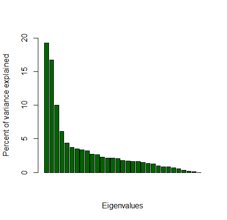

```R
# Lets extract the variance associated with the top 4 PCs, so we can use them in our plots.
eig.total <- sum(pca$eigenval)

PC1.variance <- formatC(head(pca$eigenval)[1]/eig.total * 100)
PC2.variance <- formatC(head(pca$eigenval)[2]/eig.total * 100)
PC3.variance <- formatC(head(pca$eigenval)[3]/eig.total * 100)
PC4.variance <- formatC(head(pca$eigenval)[4]/eig.total * 100)


PC1.variance
# 19.33
PC2.variance
# 16.77
PC3.variance
# 10.04
PC4.variance
# 6.144


# Plot PC1 vs PC2
## Colour based on population
nuc_PC1.1 <- ggplot(data,aes(EV1, EV2, col = POPULATION, label = POPULATION)) +
  geom_point(alpha = 0.8, size = 3) +
  stat_ellipse(level = 0.95, linewidth = 0.2) +
  geom_text_repel(aes(label = SAMPLEID), box.padding = 0.05, point.padding = 0.01, segment.color = 'grey50', size = 3, hjust = 0, vjust = 0, max.overlaps = Inf, show.legend=FALSE) +
  theme_bw() +
  scale_colour_pop () +
  labs(x = paste0("PC1 variance: ",round(pca$varprop[1]*100,digits=2),"%"),
       y = paste0("PC2 variance: ",round(pca$varprop[2]*100,digits=2),"%"))
nuc_PC1.1
ggsave("nuc_PC1.1.png", height=6, width=8)
```
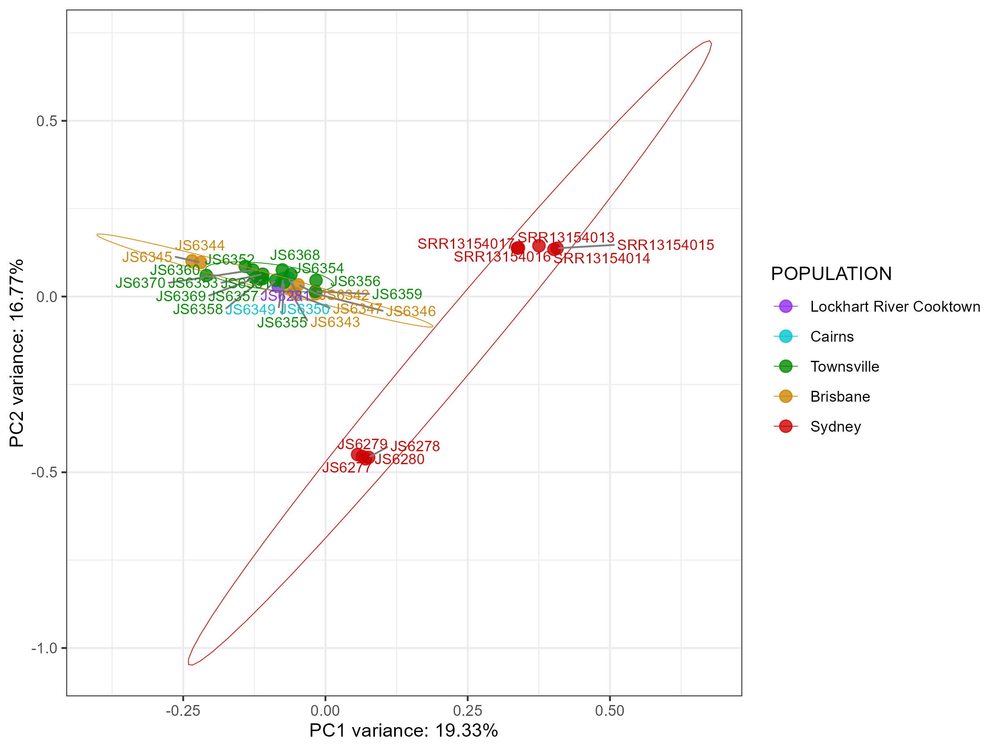

This looks interesting. Why are all the QLD samples clustered together, but then the SYD samples are in 2 separate clusters? (Add more comments)

```R
## Graph PCs on a linear plane


# Plot PC1 only

# Assign a constant y-value for all points
constant_y <- 0

# Create a new dataframe with PC1 values and a constant y-value
pc1_line_data <- data.frame(PC1 = data$EV1, Y = constant_y)
nuc_PC1_line_lab <- ggplot(pc1_line_data, aes(x = PC1, y = Y)) +
  geom_point(data = data, aes(x = EV1, y = rep(constant_y, nrow(data)), color = POPULATION), alpha = 0.8, size = 3) +
  geom_text_repel(data = data, aes(x = EV1, y = rep(constant_y, nrow(data)), label = SAMPLEID), box.padding = 0.05, point.padding = 0.01, segment.color = 'grey50', size = 3, hjust = 0, vjust = 0, max.overlaps = Inf, show.legend = FALSE) +
  theme_bw() +
  scale_color_manual(values = c('Lockhart River Cooktown' = 'purple2', 'Cairns' = 'turquoise3', 'Townsville' = 'green4', 'Brisbane' = 'orange3', 'Sydney' = 'red3')) +
  labs(x = "PC1", y = NULL) +
  theme(axis.text.y = element_blank(), axis.ticks.y = element_blank(), legend.position = "none") +
  theme(panel.grid = element_blank())

# Print the plot
print(nuc_PC1_line_lab)
# Save plot
ggsave("../pca/nuc_PC1_line_lab.png", height=2, width=8)
```

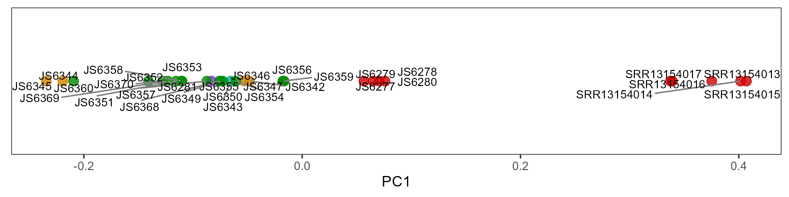

```R
# And now one without the sample ID labels
nuc_PC1_line_nolab <- ggplot(pc1_line_data, aes(x = PC1, y = Y)) +
  geom_point(data = data, aes(x = EV1, y = rep(constant_y, nrow(data)), color = POPULATION), alpha = 0.8, size = 3) +
  theme_bw() +
  scale_color_manual(values = c('Lockhart River Cooktown' = 'purple2', 'Cairns' = 'turquoise3', 'Townsville' = 'green4', 'Brisbane' = 'orange3', 'Sydney' = 'red3')) +
  labs(x = "PC1", y = NULL) +
  theme(axis.text.y = element_blank(), axis.ticks.y = element_blank(), legend.position = "none") +
  theme(panel.grid = element_blank())

# Print the plot
print(nuc_PC1_line_nolab)
# Save plot
ggsave("../pca/nuc_PC1_line_nolab.png", height=1, width=8)
```

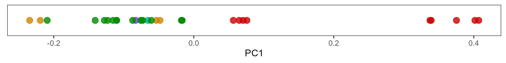


```R
# Plot PC2 only
# Assign a constant y-value for all points
constant_y <- 0

# Create a new dataframe with PC2 values and a constant y-value
pc2_line_data <- data.frame(PC2 = data$EV2, Y = constant_y)

# Plot PC2 only
nuc_PC2_line_lab <- ggplot(pc2_line_data, aes(x = PC2, y = Y)) +
  geom_point(data = data, aes(x = EV2, y = rep(constant_y, nrow(data)), color = POPULATION), alpha = 0.8, size = 3) +
  geom_text_repel(data = data, aes(x = EV2, y = rep(constant_y, nrow(data)), label = SAMPLEID), box.padding = 0.05, point.padding = 0.01, segment.color = 'grey50', size = 3, hjust = 0, vjust = 0, max.overlaps = Inf, show.legend = FALSE) +
  theme_bw() +
  scale_color_manual(values = c('Lockhart River Cooktown' = 'purple2', 'Cairns' = 'turquoise3', 'Townsville' = 'green4', 'Brisbane' = 'orange3', 'Sydney' = 'red3')) +
  labs(x = "PC2", y = NULL) +
  theme(axis.text.y = element_blank(), axis.ticks.y = element_blank(), legend.position = "none") +
  theme(panel.grid = element_blank())

# Print the plot
print(nuc_PC2_line_lab)
# Save plot
ggsave("../pca/nuc_PC2_line_lab.png", height=2, width=8)
```

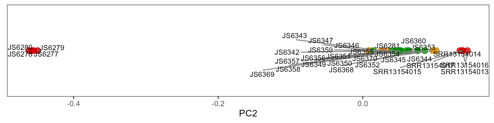

```R
# And now one without the sample ID labels
nuc_PC2_line_nolab <- ggplot(pc2_line_data, aes(x = PC2, y = Y)) +
  geom_point(data = data, aes(x = EV2, y = rep(constant_y, nrow(data)), color = POPULATION), alpha = 0.8, size = 3) +
  theme_bw() +
  scale_color_manual(values = c('Lockhart River Cooktown' = 'purple2', 'Cairns' = 'turquoise3', 'Townsville' = 'green4', 'Brisbane' = 'orange3', 'Sydney' = 'red3')) +
  labs(x = "PC2", y = NULL) +
  theme(axis.text.y = element_blank(), axis.ticks.y = element_blank(), legend.position = "none") +
  theme(panel.grid = element_blank())

# Print the plot
print(nuc_PC2_line_nolab)
# Save plot
ggsave("../pca/nuc_PC2_line_nolab.png", height=1, width=8)
```


```R
# Plot PC3 only
# Assign a constant y-value for all points
constant_y <- 0

# Create a new dataframe with PC3 values and a constant y-value
pc3_line_data <- data.frame(PC3 = data$EV3, Y = constant_y)

nuc_PC3_line_lab <- ggplot(pc3_line_data, aes(x = PC3, y = Y)) +
  geom_point(data = data, aes(x = EV3, y = rep(constant_y, nrow(data)), color = POPULATION), alpha = 0.8, size = 3) +
  geom_text_repel(data = data, aes(x = EV3, y = rep(constant_y, nrow(data)), label = SAMPLEID), box.padding = 0.05, point.padding = 0.01, segment.color = 'grey50', size = 3, hjust = 0, vjust = 0, max.overlaps = Inf, show.legend = FALSE) +
  theme_bw() +
  scale_color_manual(values = c('Lockhart River Cooktown' = 'purple2', 'Cairns' = 'turquoise3', 'Townsville' = 'green4', 'Brisbane' = 'orange3', 'Sydney' = 'red3')) +
  labs(x = "PC3", y = NULL) +
  theme(axis.text.y = element_blank(), axis.ticks.y = element_blank(), legend.position = "none") +
  theme(panel.grid = element_blank())

# Print the plot
print(nuc_PC3_line_lab)
# Save plot
ggsave("../pca/nuc_PC3_line_lab.png", height = 2, width = 8)
```

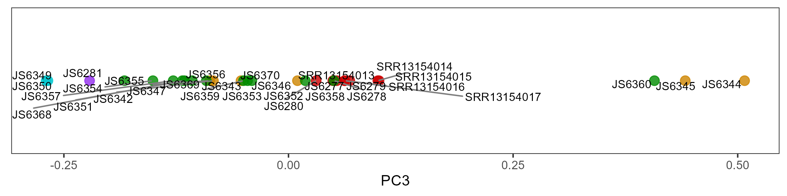


```R
# And now one without the sample ID labels
nuc_PC3_line_nolab <- ggplot(pc3_line_data, aes(x = PC3, y = Y)) +
  geom_point(data = data, aes(x = EV3, y = rep(constant_y, nrow(data)), color = POPULATION), alpha = 0.8, size = 3) +
  theme_bw() +
  scale_color_manual(values = c('Lockhart River Cooktown' = 'purple2', 'Cairns' = 'turquoise3', 'Townsville' = 'green4', 'Brisbane' = 'orange3', 'Sydney' = 'red3')) +
  labs(x = "PC3", y = NULL) +
  theme(axis.text.y = element_blank(), axis.ticks.y = element_blank(), legend.position = "none") +
  theme(panel.grid = element_blank())

# Print the plot
print(nuc_PC3_line_nolab)
# Save plot
ggsave("../pca/nuc_PC3_line_nolab.png", height=1, width=8)
```R

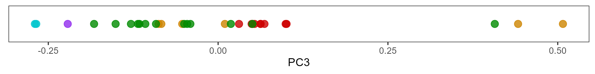


```R
# Plot PC4 only
# Assign a constant y-value for all points
constant_y <- 0

# Create a new dataframe with PC4 values and a constant y-value
pc4_line_data <- data.frame(PC4 = data$EV4, Y = constant_y)

# Plot PC4 only
nuc_PC4_line_lab <- ggplot(pc4_line_data, aes(x = PC4, y = Y)) +
  geom_point(data = data, aes(x = EV4, y = rep(constant_y, nrow(data)), color = POPULATION), alpha = 0.8, size = 3) +
  geom_text_repel(data = data, aes(x = EV4, y = rep(constant_y, nrow(data)), label = SAMPLEID), box.padding = 0.05, point.padding = 0.01, segment.color = 'grey50', size = 3, hjust = 0, vjust = 0, max.overlaps = Inf, show.legend = FALSE) +
  theme_bw() +
  scale_color_manual(values = c('Lockhart River Cooktown' = 'purple2', 'Cairns' = 'turquoise3', 'Townsville' = 'green4', 'Brisbane' = 'orange3', 'Sydney' = 'red3')) +
  labs(x = "PC4", y = NULL) +
  theme(axis.text.y = element_blank(), axis.ticks.y = element_blank(), legend.position = "none") +
  theme(panel.grid = element_blank())

# Print the plot
print(nuc_PC4_line_lab)
# Save plot
ggsave("../pca/nuc_PC4_line_lab.png", height = 2, width = 8)
```

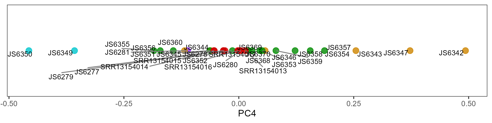


```R
# And now one without the sample ID labels
nuc_PC4_line_nolab <- ggplot(pc4_line_data, aes(x = PC4, y = Y)) +
  geom_point(data = data, aes(x = EV4, y = rep(constant_y, nrow(data)), color = POPULATION), alpha = 0.8, size = 3) +
  theme_bw() +
  scale_color_manual(values = c('Lockhart River Cooktown' = 'purple2', 'Cairns' = 'turquoise3', 'Townsville' = 'green4', 'Brisbane' = 'orange3', 'Sydney' = 'red3')) +
  labs(x = "PC4", y = NULL) +
  theme(axis.text.y = element_blank(), axis.ticks.y = element_blank(), legend.position = "none") +
  theme(panel.grid = element_blank())

# Print the plot
print(nuc_PC4_line_nolab)
# Save plot
ggsave("../pca/nuc_PC4_line_nolab.png", height = 2, width = 8)
```

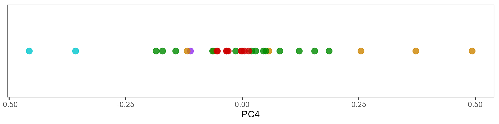


```R
## Colour based on host
nuc_PC1.2 <- ggplot(data,aes(EV1, EV2, col = HOST, label = HOST)) +
  geom_point(alpha = 0.8, size = 3) +
  geom_text_repel(aes(label = SAMPLEID), box.padding = 0.05, point.padding = 0.01, segment.color = 'grey50', size = 3, hjust = 0, vjust = 0, max.overlaps = Inf, show.legend=FALSE) +
  theme_bw() +
  scale_colour_host () +
  labs(x = paste0("PC1 variance: ",round(pca$varprop[1]*100,digits=2),"%"),
       y = paste0("PC2 variance: ",round(pca$varprop[2]*100,digits=2),"%"))
nuc_PC1.2
ggsave("nuc_PC1.2.png", height=6, width=8)
```
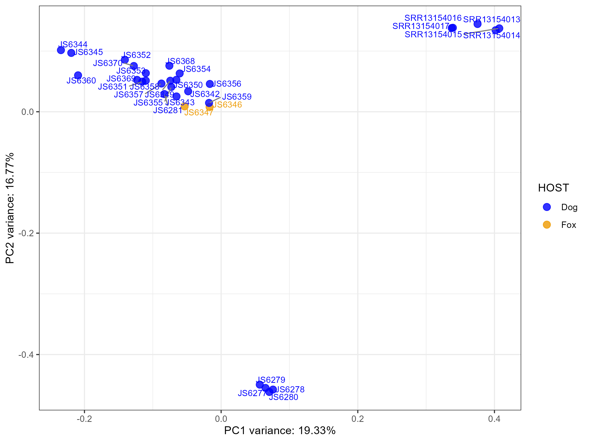

```R
# Plot PC3 vs PC4
## Colour based on population
nuc_PC3.1 <- ggplot(data,aes(EV3, EV4, col = POPULATION, label = POPULATION)) +
  geom_point(alpha = 0.8, size = 3) + 
  stat_ellipse(level = 0.95, linewidth = 0.2) +
  geom_text_repel(aes(label = SAMPLEID), box.padding = 0.05, point.padding = 0.01, segment.color = 'grey50', size = 3, hjust = 0, vjust = 0, max.overlaps = Inf, show.legend=FALSE) +
  theme_bw() +
  scale_colour_pop () +
  labs(x = paste0("PC3 variance: ",round(pca$varprop[3]*100,digits=2),"%"),
       y = paste0("PC4 variance: ",round(pca$varprop[4]*100,digits=2),"%"))
nuc_PC3.1
ggsave("nuc_PC3.1.png", height=6, width=8)
```
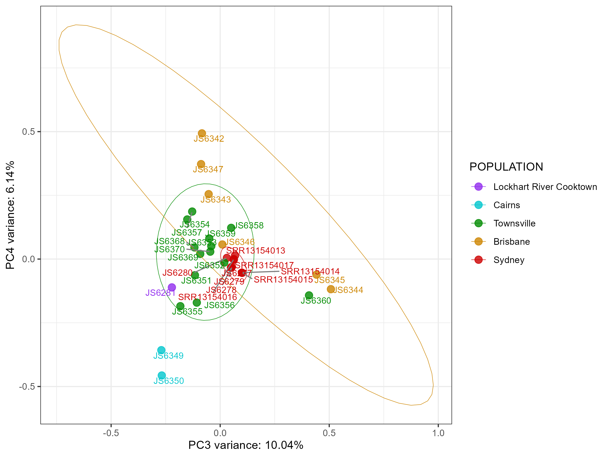

```R
## Colour based on host
nuc_PC3.2 <- ggplot(data,aes(EV3, EV4, col = HOST, label = HOST)) +
  geom_point(alpha = 0.8, size = 3) + 
  geom_text_repel(aes(label = SAMPLEID), box.padding = 0.05, point.padding = 0.01, segment.color = 'grey50', size = 3, hjust = 0, vjust = 0, max.overlaps = Inf, show.legend=FALSE) +
  theme_bw() +
  scale_colour_host () +
  labs(x = paste0("PC3 variance: ",round(pca$varprop[3]*100,digits=2),"%"),
       y = paste0("PC4 variance: ",round(pca$varprop[4]*100,digits=2),"%"))
nuc_PC3.2
ggsave("nuc_PC3.2.png", height=6, width=8)
```
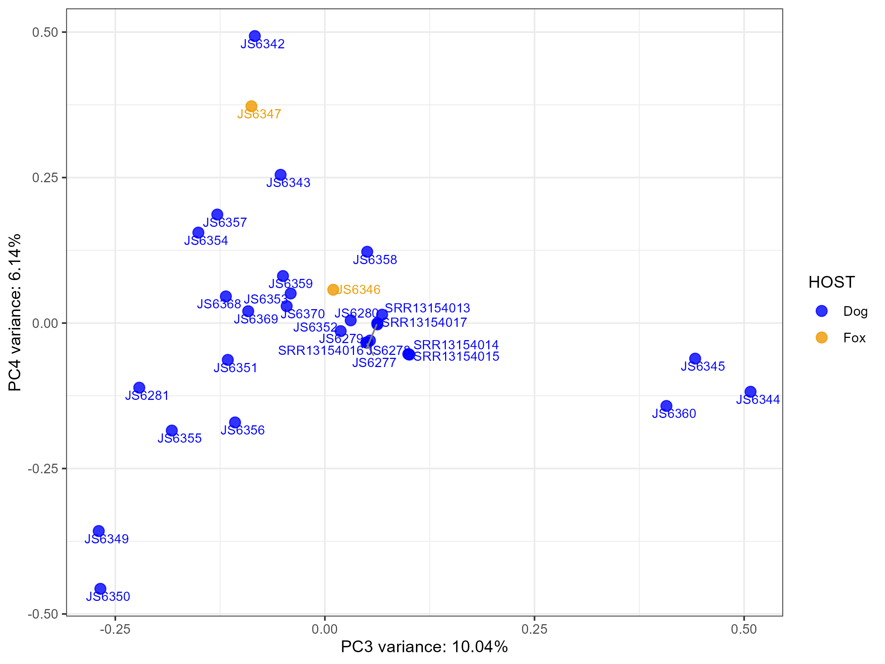


### Make the PCA per chromosome to see if this pattern holds regardless of the data we restrict it to

Since the first PCA (with PC 1 and PC2) looks strange with SYD samples being in separate clusters, let's make PCAs for each chromosome. Will we see the same pattern?

#### Select variants for chr1, chr2, chr3 and chr4 (SEPARATELY)

```bash
#!/bin/bash

# PBS directives 
#PBS -P RDS-FSC-Heartworm_MLR-RW
#PBS -N snps_chr1-4_separate
#PBS -l select=1:ncpus=1:mem=2GB
#PBS -l walltime=00:20:00
#PBS -m e
#PBS -q defaultQ
#PBS -o snps_chr1-4_separate.txt

# qsub ../snps_chr1-4_separate.pbs

# load gatk
module load vcftools/0.1.14

cd /scratch/RDS-FSC-Heartworm_MLR-RW/mapping/filter

# chr1
vcftools --vcf FINAL_SETS/nuclear_samples3x_missing0.8.recode.vcf \
--chr dirofilaria_immitis_chr1 \
--recode --out FINAL_SETS/nuclear_samples3x_missing0.8.chr1
# After filtering, kept 31 out of 31 Individuals
# After filtering, kept 34662 out of a possible 173103 Sites

# chr2
vcftools --vcf FINAL_SETS/nuclear_samples3x_missing0.8.recode.vcf \
--chr dirofilaria_immitis_chr2 \
--recode --out FINAL_SETS/nuclear_samples3x_missing0.8.chr2
# After filtering, kept 31 out of 31 Individuals
# After filtering, kept 29339 out of a possible 173103 Sites

# chr3
vcftools --vcf FINAL_SETS/nuclear_samples3x_missing0.8.recode.vcf \
--chr dirofilaria_immitis_chr3 \
--recode --out FINAL_SETS/nuclear_samples3x_missing0.8.chr3
# After filtering, kept 31 out of 31 Individuals
# After filtering, kept 33730 out of a possible 173103 Sites

# chr4
vcftools --vcf FINAL_SETS/nuclear_samples3x_missing0.8.recode.vcf \
--chr dirofilaria_immitis_chr4 \
--recode --out FINAL_SETS/nuclear_samples3x_missing0.8.chr4
# After filtering, kept 31 out of 31 Individuals
# After filtering, kept 30786 out of a possible 173103 Sites
```

#### Make separate PCAs for chr1, chr2, chr3 and chr4

```R
# Now let's look at the PCA when we restrict the data to each chromosome


# Chromosome 1
#PCA on chr1 variants using genotypes
snpgdsClose(genofile_chr1)
vcf.in_chr1 <- "nuclear_samples3x_missing0.8.chr1.recode.vcf"
gds_chr1<-snpgdsVCF2GDS(vcf.in_chr1, "nucDNA_chr1.gds", method="biallelic.only")
genofile_chr1 <- snpgdsOpen(gds_chr1)


pca_chr1 <-snpgdsPCA(genofile_chr1, num.thread=2, autosome.only = F)
samples_chr1 <- as.data.frame(pca_chr1$sample.id)
colnames(samples_chr1) <- "name"

data_chr1 <- data.frame(sample.id = pca_chr1$sample.id,
                   EV1_chr1 = pca_chr1$eigenvect[,1],  
                   EV2_chr1 = pca_chr1$eigenvect[,2],
                   EV3_chr1 = pca_chr1$eigenvect[,3],
                   EV4_chr1 = pca_chr1$eigenvect[,4],
                   EV5_chr1 = pca_chr1$eigenvect[,5],
                   EV6_chr1 = pca_chr1$eigenvect[,6],
                   POPULATION = metadata$city,
                   REGION = metadata$region,
                   SAMPLEID = metadata$sample_name,
                   HOST = metadata$host,
                   stringsAsFactors = FALSE)

#Generating levels for population and super-population variables
data_chr1$POPULATION <- factor(data_chr1$POPULATION, 
                          levels = c('Lockhart River Cooktown', 'Cairns', 
                                     'Townsville',
                                     'Brisbane',
                                     'Sydney'))
data_chr1$HOST <- factor(data_chr1$HOST, levels = c('Dog', 'Fox'))

# Plot PC1 vs PC2
## Colour based on population
chr1_PC1.1 <- ggplot(data_chr1,aes(EV1_chr1, EV2_chr1, col = POPULATION, label = POPULATION)) +
  geom_point(alpha = 0.8, size = 3) +
  geom_text_repel(aes(label = SAMPLEID), box.padding = 0.05, point.padding = 0.01, segment.color = 'grey50', size = 3, hjust = 0, vjust = 0, max.overlaps = Inf, show.legend=FALSE) +
  theme_bw() +
  scale_colour_pop () +
  ggtitle("Chr 1") +
  labs(x = paste0("PC1 variance: ",round(pca_chr1$varprop[1]*100,digits=2),"%"),
       y = paste0("PC2 variance: ",round(pca_chr1$varprop[2]*100,digits=2),"%"))
chr1_PC1.1


# Chromosome 2
#PCA on chr1 variants using genotypes
snpgdsClose(genofile_chr2)
vcf.in_chr2 <- "nuclear_samples3x_missing0.8.chr2.recode.vcf"
gds_chr2<-snpgdsVCF2GDS(vcf.in_chr2, "nucDNA_chr2.gds", method="biallelic.only")
genofile_chr2 <- snpgdsOpen(gds_chr2)


pca_chr2 <-snpgdsPCA(genofile_chr2, num.thread=2, autosome.only = F)
samples_chr2 <- as.data.frame(pca_chr2$sample.id)
colnames(samples_chr2) <- "name"

data_chr2 <- data.frame(sample.id = pca_chr2$sample.id,
                        EV1_chr2 = pca_chr2$eigenvect[,1],  
                        EV2_chr2 = pca_chr2$eigenvect[,2],
                        EV3_chr2 = pca_chr2$eigenvect[,3],
                        EV4_chr2 = pca_chr2$eigenvect[,4],
                        EV5_chr2 = pca_chr2$eigenvect[,5],
                        EV6_chr2 = pca_chr2$eigenvect[,6],
                        POPULATION = metadata$city,
                        REGION = metadata$region,
                        SAMPLEID = metadata$sample_name,
                        HOST = metadata$host,
                        stringsAsFactors = FALSE)

#Generating levels for population and super-population variables
data_chr2$POPULATION <- factor(data_chr2$POPULATION, 
                               levels = c('Lockhart River Cooktown', 'Cairns', 
                                          'Townsville',
                                          'Brisbane',
                                          'Sydney'))
data_chr2$HOST <- factor(data_chr2$HOST, levels = c('Dog', 'Fox'))

# Plot PC1 vs PC2
## Colour based on population
chr2_PC1.1 <- ggplot(data_chr2,aes(EV1_chr2, EV2_chr2, col = POPULATION, label = POPULATION)) +
  geom_point(alpha = 0.8, size = 3) +
  geom_text_repel(aes(label = SAMPLEID), box.padding = 0.05, point.padding = 0.01, segment.color = 'grey50', size = 3, hjust = 0, vjust = 0, max.overlaps = Inf, show.legend=FALSE) +
  theme_bw() +
  scale_colour_pop () +
  ggtitle("Chr 2") +
  labs(x = paste0("PC1 variance: ",round(pca_chr2$varprop[1]*100,digits=2),"%"),
       y = paste0("PC2 variance: ",round(pca_chr2$varprop[2]*100,digits=2),"%"))
chr2_PC1.1


# Chromosome 3
#PCA on chr1 variants using genotypes
snpgdsClose(genofile_chr3)
vcf.in_chr3 <- "nuclear_samples3x_missing0.8.chr3.recode.vcf"
gds_chr3<-snpgdsVCF2GDS(vcf.in_chr3, "nucDNA_chr3.gds", method="biallelic.only")
genofile_chr3 <- snpgdsOpen(gds_chr3)


pca_chr3 <-snpgdsPCA(genofile_chr3, num.thread=2, autosome.only = F)
samples_chr3 <- as.data.frame(pca_chr3$sample.id)
colnames(samples_chr3) <- "name"

data_chr3 <- data.frame(sample.id = pca_chr3$sample.id,
                        EV1_chr3 = pca_chr3$eigenvect[,1],  
                        EV2_chr3 = pca_chr3$eigenvect[,2],
                        EV3_chr3 = pca_chr3$eigenvect[,3],
                        EV4_chr3 = pca_chr3$eigenvect[,4],
                        EV5_chr3 = pca_chr3$eigenvect[,5],
                        EV6_chr3 = pca_chr3$eigenvect[,6],
                        POPULATION = metadata$city,
                        REGION = metadata$region,
                        SAMPLEID = metadata$sample_name,
                        HOST = metadata$host,
                        stringsAsFactors = FALSE)

#Generating levels for population and super-population variables
data_chr3$POPULATION <- factor(data_chr3$POPULATION, 
                               levels = c('Lockhart River Cooktown', 'Cairns', 
                                          'Townsville',
                                          'Brisbane',
                                          'Sydney'))
data_chr3$HOST <- factor(data_chr3$HOST, levels = c('Dog', 'Fox'))

# Plot PC1 vs PC2
## Colour based on population
chr3_PC1.1 <- ggplot(data_chr3,aes(EV1_chr3, EV2_chr3, col = POPULATION, label = POPULATION)) +
  geom_point(alpha = 0.8, size = 3) +
  geom_text_repel(aes(label = SAMPLEID), box.padding = 0.05, point.padding = 0.01, segment.color = 'grey50', size = 3, hjust = 0, vjust = 0, max.overlaps = Inf, show.legend=FALSE) +
  theme_bw() +
  scale_colour_pop () +
  ggtitle("Chr 3") +
  labs(x = paste0("PC1 variance: ",round(pca_chr3$varprop[1]*100,digits=2),"%"),
       y = paste0("PC2 variance: ",round(pca_chr3$varprop[2]*100,digits=2),"%"))
chr3_PC1.1


# Chromosome 4
#PCA on chr1 variants using genotypes
snpgdsClose(genofile_chr4)
vcf.in_chr4 <- "nuclear_samples3x_missing0.8.chr4.recode.vcf"
gds_chr4<-snpgdsVCF2GDS(vcf.in_chr4, "nucDNA_chr4.gds", method="biallelic.only")
genofile_chr4 <- snpgdsOpen(gds_chr4)


pca_chr4 <-snpgdsPCA(genofile_chr4, num.thread=2, autosome.only = F)
samples_chr4 <- as.data.frame(pca_chr4$sample.id)
colnames(samples_chr4) <- "name"

data_chr4 <- data.frame(sample.id = pca_chr4$sample.id,
                        EV1_chr4 = pca_chr4$eigenvect[,1],  
                        EV2_chr4 = pca_chr4$eigenvect[,2],
                        EV3_chr4 = pca_chr4$eigenvect[,3],
                        EV4_chr4 = pca_chr4$eigenvect[,4],
                        EV5_chr4 = pca_chr4$eigenvect[,5],
                        EV6_chr4 = pca_chr4$eigenvect[,6],
                        POPULATION = metadata$city,
                        REGION = metadata$region,
                        SAMPLEID = metadata$sample_name,
                        HOST = metadata$host,
                        stringsAsFactors = FALSE)

#Generating levels for population and super-population variables
data_chr4$POPULATION <- factor(data_chr4$POPULATION, 
                               levels = c('Lockhart River Cooktown', 'Cairns', 
                                          'Townsville',
                                          'Brisbane',
                                          'Sydney'))
data_chr4$HOST <- factor(data_chr4$HOST, levels = c('Dog', 'Fox'))

# Plot PC1 vs PC2
## Colour based on population
chr4_PC1.1 <- ggplot(data_chr4,aes(EV1_chr4, EV2_chr4, col = POPULATION, label = POPULATION)) +
  geom_point(alpha = 0.8, size = 3) +
  geom_text_repel(aes(label = SAMPLEID), box.padding = 0.05, point.padding = 0.01, segment.color = 'grey50', size = 3, hjust = 0, vjust = 0, max.overlaps = Inf, show.legend=FALSE) +
  theme_bw() +
  scale_colour_pop () +
  ggtitle("Chr 4") +
  labs(x = paste0("PC1 variance: ",round(pca_chr4$varprop[1]*100,digits=2),"%"),
       y = paste0("PC2 variance: ",round(pca_chr4$varprop[2]*100,digits=2),"%"))
chr4_PC1.1


# Combine the plots together for all chromosomes
ggarrange(chr1_PC1.1, chr2_PC1.1, chr3_PC1.1, chr4_PC1.1, common.legend = TRUE, ncol = 2, nrow=2)
ggsave("chr1-4_PC1.1.png", height=8, width=10)
```

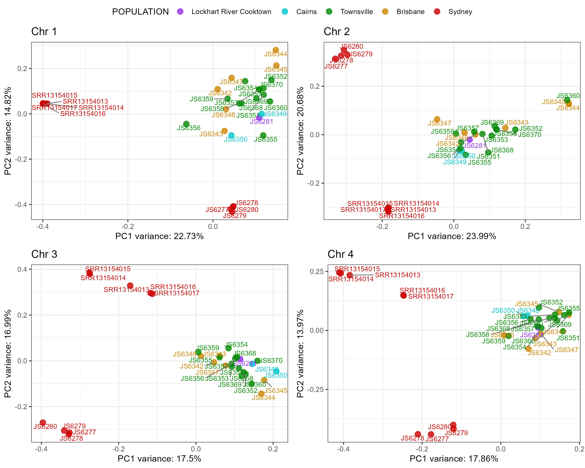