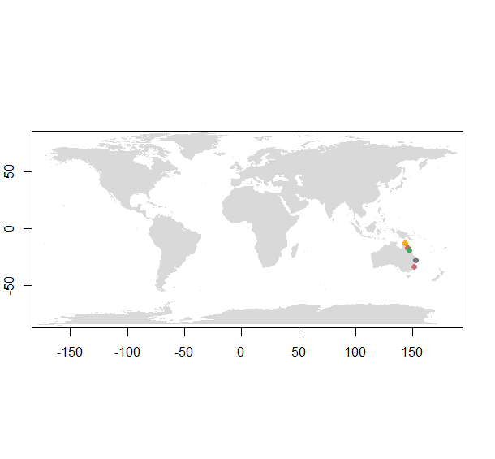
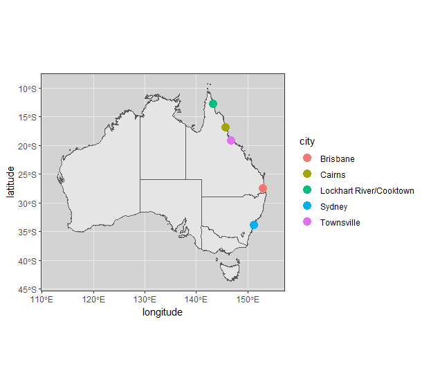

# Dirofilaria immitis WGS Lab Book

### Rose Power USYD 2023

## Get Daisy's fastq files

Get Daisy's fastq files so that I can include them with my own data. Download from SRA database.

Link to paper: https://doi.org/10.1016/j.crpvbd.2021.100007

```bash
# To get a list of the SRR (run ID), go to the BioProject on NCBI SRA database -> Send to -> File -> Format 'RunInfo' -> Download and gives you excel sheet.

cd /project/RDS-FSC-Heartworm_MLR-RW/HW_WGS_ALL/data/fastq/daisy

module load sratoolkit/3.0.3

fastq-dump --split-files --origfmt --gzip SRR13154017
fastq-dump --split-files --origfmt --gzip SRR13154016
fastq-dump --split-files --origfmt --gzip SRR13154015
fastq-dump --split-files --origfmt --gzip SRR13154014
fastq-dump --split-files --origfmt --gzip SRR13154013

```


## Map samples (world map)

Map of where samples were collected from in Australia. Size of dots can correspond to number of samples collected in that area.

```R
# Load packages
library(ggplot2)
library(dplyr)
library(purrr)
library(stats)
library(graphics)
library(grDevices)
library(utils)
library(datasets)
library(methods)
library(base)
require(maps)
library(tidyverse)
library(readxl)
library(ozmaps) 
library(grid)

# Set working directory
setwd("C:/Users/rpow2134/OneDrive - The University of Sydney (Staff)/Documents/HW_WGS")

#-- metadata that describes information about the samples, such as country of origin, and GPS coordinates
location_file <- "location.csv"

# Read the actual data into R
location <- read.csv(location_file, header = TRUE)

# Make world map
cols <- colorRampPalette(brewer.pal(8, "Set1"))(17)
par(fg = "black")
map("world", col = "grey85", fill = TRUE, border = FALSE)
map.axes()
# Plot coordinates
points(location$longitude, location$latitude, cex = 1.5, pch = 20, col = cols)
```



## Map samples (Australia)

```R
# Get map
aus <- ozmap("states")

# Plot sampling sites
location %>% 
  ggplot() + 
  geom_sf(data = aus) +
  geom_point(aes(x = longitude, y = latitude, color = city), size = 4) +
  xlim(112, 155) +
  labs() +
  theme_bw() +
  theme(panel.background = element_rect(fill = "lightgray"))
```




## FastQC & Multi-QC

We want to get some stats on the raw data.

```bash
# Load modules
module load fastqc/0.11.8

# FastQC
cd /project/RDS-FSC-Heartworm_MLR-RW/HW_WGS_ALL/Dirofilaria_immitis

INPUTDIR="/project/RDS-FSC-Heartworm_MLR-RW/HW_WGS_ALL/Raw_fastq"
NCPU=24
OUTDIR="/project/RDS-FSC-Heartworm_MLR-RW/HW_WGS_ALL/Dirofilaria_immitis/FastQC"

fastqc -t $NCPU -o $OUTDIR $INPUTDIR/*.fq.gz

cd /project/RDS-FSC-Heartworm_MLR-RW/MultiQC

module load git
module load python/3.9.15

# Run MultiQC to combine all of the FastQC reports for the raw fastq files
multiqc /project/RDS-FSC-Heartworm_MLR-RW/HW_WGS_ALL/Dirofilaria_immitis/FastQC/Raw_fastq -o /project/RDS-FSC-Heartworm_MLR-RW/HW_WGS_ALL/Dirofilaria_immitis/FastQC/Raw_fastq
```


## Merging files for the same sample

If files come from different sequencing runs, then it could be worth looking at one sample and comparing them. However, if it simply a split fastq from the same library, you can merge them together. Using ‘cat’ is a good way to do this. You must make sure the merge the read 1 files together, and the read 2 files together, and that they are in the same order. - Steve

I will merge together all files for the same sample (keeping forward and reverse reads separate). I can just use cat for fastq files. However, since mine are gzipped I need to use zcat to open the gz file. 

When I tried running the code for all samples at once, it gave the error 'disk quota exceeded'. I'll need to sort this out before running any further analyses.
After asking Steve, I have added the piping and I will first run only sample JS6277 as a test to see how much time, memory etc it takes to merge the files for 1 sample.

If merging files at the start doesn't work, I can alternatively map them first and then merge afterwards.

### Testing one sample (JS6277)

```bash

#!/bin/bash

# PBS directives 
#PBS -P RDS-FSC-Heartworm_MLR-RW
#PBS -N merge_test
#PBS -l select=2:ncpus=24:mem=30GB
#PBS -l walltime=01:00:00
#PBS -m e
#PBS -q defaultQ
#PBS -o merge_test.txt

# Submit job
## qsub merge_test.pbs

# Set working directory
cd /project/RDS-FSC-Heartworm_MLR-RW/HW_WGS_ALL/data/fastq/merged

# JS6277
zcat JS6277*_1.fq.gz | gzip > JS6277_merged_1.fq.gz

zcat JS6277*_2.fq.gz | gzip > JS6277_merged_2.fq.gz

rm JS6277_FSFP220054790-1r_HV3C5DSX2_L4_1.fq.gz JS6277_FSFP220054790-1r_HWTNHDSX2_L1_1.fq.gz JS6277_FSFP220054790-1r_HWTT7DSX2_L2_1.fq.gz JS6277_FSFP220054790-1r_HV3C5DSX2_L4_2.fq.gz JS6277_FSFP220054790-1r_HWTNHDSX2_L1_2.fq.gz JS6277_FSFP220054790-1r_HWTT7DSX2_L2_2.fq.gz
```
The time cut off (1h wasn't enough walltime). Used ~1 CPU, 9GB memory.

The F reads were done but the R reads weren't. Delete these files and try again. Maybe just run straight on the command line one by one.

### Merging samples one at a time on command line

```bash

# Set working directory
cd /project/RDS-FSC-Heartworm_MLR-RW/HW_WGS_ALL/data/fastq/merged

# JS6277
zcat JS6277*_1.fq.gz | gzip > JS6277_merged_1.fq.gz
# done

zcat JS6277*_2.fq.gz | gzip > JS6277_merged_2.fq.gz
# done

rm JS6277_FSFP220054790-1r_HV3C5DSX2_L4_1.fq.gz JS6277_FSFP220054790-1r_HWTNHDSX2_L1_1.fq.gz JS6277_FSFP220054790-1r_HWTT7DSX2_L2_1.fq.gz JS6277_FSFP220054790-1r_HV3C5DSX2_L4_2.fq.gz JS6277_FSFP220054790-1r_HWTNHDSX2_L1_2.fq.gz JS6277_FSFP220054790-1r_HWTT7DSX2_L2_2.fq.gz

# JS6278
zcat JS6278*_1.fq.gz | gzip > JS6278_merged_1.fq.gz
# done

zcat JS6278*_2.fq.gz | gzip > JS6278_merged_2.fq.gz
# done

rm JS6278_FSFP220054791-1r_HTY2GDSX2_L1_1.fq.gz JS6278_FSFP220054791-1r_HWTNHDSX2_L1_1.fq.gz JS6278_FSFP220054791-1r_HWTNJDSX2_L3_1.fq.gz JS6278_FSFP220054791-1r_HTY2GDSX2_L1_2.fq.gz JS6278_FSFP220054791-1r_HWTNHDSX2_L1_2.fq.gz JS6278_FSFP220054791-1r_HWTNJDSX2_L3_2.fq.gz

# JS6279
zcat JS6279*_1.fq.gz | gzip > JS6279_merged_1.fq.gz
# done

zcat JS6279*_2.fq.gz | gzip > JS6279_merged_2.fq.gz
# done

rm JS6279_FSFP220054792-1r_HTY2GDSX2_L1_1.fq.gz JS6279_FSFP220054792-1r_HWTNHDSX2_L1_1.fq.gz JS6279_FSFP220054792-1r_HWTT7DSX2_L2_1.fq.gz JS6279_FSFP220054792-1r_HTY2GDSX2_L1_2.fq.gz JS6279_FSFP220054792-1r_HWTNHDSX2_L1_2.fq.gz JS6279_FSFP220054792-1r_HWTT7DSX2_L2_2.fq.gz

# JS6280
zcat JS6280*_1.fq.gz | gzip > JS6280_merged_1.fq.gz
# done

zcat JS6280*_2.fq.gz | gzip > JS6280_merged_2.fq.gz
# done

rm JS6280_FSFP220054793-1r_H22KNDSX3_L2_1.fq.gz JS6280_FSFP220054793-1r_HTY2GDSX2_L1_1.fq.gz JS6280_FSFP220054793-1r_HWTNHDSX2_L1_1.fq.gz JS6280_FSFP220054793-1r_HWTNJDSX2_L3_1.fq.gz JS6280_FSFP220054793-1r_H22KNDSX3_L2_2.fq.gz JS6280_FSFP220054793-1r_HTY2GDSX2_L1_2.fq.gz JS6280_FSFP220054793-1r_HWTNHDSX2_L1_2.fq.gz JS6280_FSFP220054793-1r_HWTNJDSX2_L3_2.fq.gz

# JS6281
zcat JS6281*_1.fq.gz | gzip > JS6281_merged_1.fq.gz
# done

zcat JS6281*_2.fq.gz | gzip > JS6281_merged_2.fq.gz
# done

rm JS6281_FSFP220054794-1r_HTY2GDSX2_L1_1.fq.gz JS6281_FSFP220054794-1r_HWTNHDSX2_L1_1.fq.gz JS6281_FSFP220054794-1r_HWTT7DSX2_L2_1.fq.gz JS6281_FSFP220054794-1r_HTY2GDSX2_L1_2.fq.gz JS6281_FSFP220054794-1r_HWTNHDSX2_L1_2.fq.gz JS6281_FSFP220054794-1r_HWTT7DSX2_L2_2.fq.gz

# JS6342
zcat JS6342*_1.fq.gz | gzip > JS6342_merged_1.fq.gz
# done

zcat JS6342*_2.fq.gz | gzip > JS6342_merged_2.fq.gz
# done

rm JS6342_DKDN220004094-1A_HKNF7DSX3_L1_1.fq.gz JS6342_DKDN220004094-1A_HKNFLDSX3_L1_1.fq.gz JS6342_DSFP220004094-1a_HLGLMDSX3_L1_1.fq.gz JS6342_DSFP220004094-1a_HLGNNDSX3_L1_1.fq.gz JS6342_DKDN220004094-1A_HKNF7DSX3_L1_2.fq.gz JS6342_DKDN220004094-1A_HKNFLDSX3_L1_2.fq.gz JS6342_DSFP220004094-1a_HLGLMDSX3_L1_2.fq.gz JS6342_DSFP220004094-1a_HLGNNDSX3_L1_2.fq.gz

# JS6343
zcat JS6343*_1.fq.gz | gzip > JS6343_merged_1.fq.gz
# done

zcat JS6343*_2.fq.gz | gzip > JS6343_merged_2.fq.gz
# done

rm JS6343_DKDN220004095-1A_HJTWTDSX3_L1_1.fq.gz JS6343_DKDN220004095-1A_HKNF7DSX3_L3_1.fq.gz JS6343_DSFP220004095-1a_HJJFMDSX3_L2_1.fq.gz JS6343_DKDN220004095-1A_HJTWTDSX3_L1_2.fq.gz JS6343_DKDN220004095-1A_HKNF7DSX3_L3_2.fq.gz JS6343_DSFP220004095-1a_HJJFMDSX3_L2_2.fq.gz

# JS6344
zcat JS6344*_1.fq.gz | gzip > JS6344_merged_1.fq.gz
# done

zcat JS6344*_2.fq.gz | gzip > JS6344_merged_2.fq.gz
# done

rm JS6344_DKDN220004096-1A_HJTWTDSX3_L2_1.fq.gz JS6344_DKDN220004096-1A_HKNF7DSX3_L1_1.fq.gz JS6344_DSFP220004096-1a_HJJFMDSX3_L2_1.fq.gz JS6344_DKDN220004096-1A_HJTWTDSX3_L2_2.fq.gz JS6344_DKDN220004096-1A_HKNF7DSX3_L1_2.fq.gz JS6344_DSFP220004096-1a_HJJFMDSX3_L2_2.fq.gz

# JS6345
zcat JS6345*_1.fq.gz | gzip > JS6345_merged_1.fq.gz
# done

zcat JS6345*_2.fq.gz | gzip > JS6345_merged_2.fq.gz
# done

rm JS6345_DKDN220004097-1A_HKNF7DSX3_L1_1.fq.gz JS6345_DSFP220004097-1a_HJJFMDSX3_L2_1.fq.gz JS6345_DKDN220004097-1A_HKNF7DSX3_L1_2.fq.gz JS6345_DSFP220004097-1a_HJJFMDSX3_L2_2.fq.gz

# JS6346
# Don't need to merge this sample.

# JS6347
zcat JS6347*_1.fq.gz | gzip > JS6347_merged_1.fq.gz
# done

zcat JS6347*_2.fq.gz | gzip > JS6347_merged_2.fq.gz
# done

rm JS6347_DKDN220004099-1A_HKNF7DSX3_L1_1.fq.gz JS6347_DSFP220004099-1a_HJJFMDSX3_L2_1.fq.gz JS6347_DKDN220004099-1A_HKNF7DSX3_L1_2.fq.gz JS6347_DSFP220004099-1a_HJJFMDSX3_L2_2.fq.gz

# JS6348
# Don't need to merge this sample

# JS6349
zcat JS6349*_1.fq.gz | gzip > JS6349_merged_1.fq.gz
# done

zcat JS6349*_2.fq.gz | gzip > JS6349_merged_2.fq.gz
# done

rm JS6349_DKDN220004101-1A_HKNF7DSX3_L2_1.fq.gz JS6349_DSFP220004101-1a_HJJFMDSX3_L2_1.fq.gz JS6349_DKDN220004101-1A_HKNF7DSX3_L2_2.fq.gz JS6349_DSFP220004101-1a_HJJFMDSX3_L2_2.fq.gz

#JS6350
zcat JS6350*_1.fq.gz | gzip > JS6350_merged_1.fq.gz
# done

zcat JS6350*_2.fq.gz | gzip > JS6350_merged_2.fq.gz
# done

rm JS6350_DKDN220004102-1A_HKNF7DSX3_L1_1.fq.gz JS6350_DSFP220004102-1a_HJJFMDSX3_L2_1.fq.gz JS6350_DKDN220004102-1A_HKNF7DSX3_L1_2.fq.gz JS6350_DSFP220004102-1a_HJJFMDSX3_L2_2.fq.gz

# JS6351
zcat JS6351*_1.fq.gz | gzip > JS6351_merged_1.fq.gz
# done

zcat JS6351*_2.fq.gz | gzip > JS6351_merged_2.fq.gz
# done

rm JS6351_DKDN220004103-1A_HKNF7DSX3_L1_1.fq.gz JS6351_DSFP220004103-1a_HJJFMDSX3_L2_1.fq.gz JS6351_DKDN220004103-1A_HKNF7DSX3_L1_2.fq.gz JS6351_DSFP220004103-1a_HJJFMDSX3_L2_2.fq.gz

# JS6352
zcat JS6352*_1.fq.gz | gzip > JS6352_merged_1.fq.gz
# done

zcat JS6352*_2.fq.gz | gzip > JS6352_merged_2.fq.gz
# done

rm JS6352_DKDN220004104-1A_HJTWTDSX3_L1_1.fq.gz JS6352_DKDN220004104-1A_HKNF7DSX3_L1_1.fq.gz JS6352_DSFP220004104-1a_HJJFMDSX3_L2_1.fq.gz JS6352_DKDN220004104-1A_HJTWTDSX3_L1_2.fq.gz JS6352_DKDN220004104-1A_HKNF7DSX3_L1_2.fq.gz JS6352_DSFP220004104-1a_HJJFMDSX3_L2_2.fq.gz

# JS6353
zcat JS6353*_1.fq.gz | gzip > JS6353_merged_1.fq.gz
# done

zcat JS6353*_2.fq.gz | gzip > JS6353_merged_2.fq.gz
# done

rm JS6353_DKDN220004105-1A_HJTWTDSX3_L1_1.fq.gz JS6353_DKDN220004105-1A_HKNF7DSX3_L1_1.fq.gz JS6353_DSFP220004105-1a_HJJFMDSX3_L2_1.fq.gz JS6353_DKDN220004105-1A_HJTWTDSX3_L1_2.fq.gz JS6353_DKDN220004105-1A_HKNF7DSX3_L1_2.fq.gz JS6353_DSFP220004105-1a_HJJFMDSX3_L2_2.fq.gz

# JS6354
zcat JS6354*_1.fq.gz | gzip > JS6354_merged_1.fq.gz
# done

zcat JS6354*_2.fq.gz | gzip > JS6354_merged_2.fq.gz
# done

rm JS6354_DKDN220004106-1A_HJTWTDSX3_L1_1.fq.gz JS6354_DKDN220004106-1A_HKNF7DSX3_L2_1.fq.gz JS6354_DSFP220004106-1a_HJJFMDSX3_L2_1.fq.gz JS6354_DKDN220004106-1A_HJTWTDSX3_L1_2.fq.gz JS6354_DKDN220004106-1A_HKNF7DSX3_L2_2.fq.gz JS6354_DSFP220004106-1a_HJJFMDSX3_L2_2.fq.gz

# JS6355
zcat JS6355*_1.fq.gz | gzip > JS6355_merged_1.fq.gz
# done

zcat JS6355*_2.fq.gz | gzip > JS6355_merged_2.fq.gz
# done

rm JS6355_DKDN220004107-1A_HKNF7DSX3_L3_1.fq.gz JS6355_DSFP220004107-1a_HJJFMDSX3_L2_1.fq.gz JS6355_DKDN220004107-1A_HKNF7DSX3_L3_2.fq.gz JS6355_DSFP220004107-1a_HJJFMDSX3_L2_2.fq.gz

# JS6356
zcat JS6356*_1.fq.gz | gzip > JS6356_merged_1.fq.gz
# done

zcat JS6356*_2.fq.gz | gzip > JS6356_merged_2.fq.gz
# done

rm JS6356_DKDN220004108-1A_HJTWTDSX3_L1_1.fq.gz JS6356_DKDN220004108-1A_HKNF7DSX3_L1_1.fq.gz JS6356_DSFP220004108-1a_HJJFMDSX3_L2_1.fq.gz JS6356_DKDN220004108-1A_HJTWTDSX3_L1_2.fq.gz JS6356_DKDN220004108-1A_HKNF7DSX3_L1_2.fq.gz JS6356_DSFP220004108-1a_HJJFMDSX3_L2_2.fq.gz

# JS6357
zcat JS6357*_1.fq.gz | gzip > JS6357_merged_1.fq.gz
# done

zcat JS6357*_2.fq.gz | gzip > JS6357_merged_2.fq.gz
# done

rm JS6357_DKDN220004109-1A_HKNF7DSX3_L1_1.fq.gz JS6357_DSFP220004109-1a_HJJFMDSX3_L2_1.fq.gz JS6357_DKDN220004109-1A_HKNF7DSX3_L1_2.fq.gz JS6357_DSFP220004109-1a_HJJFMDSX3_L2_2.fq.gz

# JS6358
zcat JS6358*_1.fq.gz | gzip > JS6358_merged_1.fq.gz
# done

zcat JS6358*_2.fq.gz | gzip > JS6358_merged_2.fq.gz
# done

rm JS6358_DKDN220004110-1A_HKNF7DSX3_L1_1.fq.gz JS6358_DSFP220004110-1a_HJJFMDSX3_L2_1.fq.gz JS6358_DKDN220004110-1A_HKNF7DSX3_L1_2.fq.gz JS6358_DSFP220004110-1a_HJJFMDSX3_L2_2.fq.gz

# JS6359
# Don't need to merge this sample

# JS6360
zcat JS6360*_1.fq.gz | gzip > JS6360_merged_1.fq.gz
# done

zcat JS6360*_2.fq.gz | gzip > JS6360_merged_2.fq.gz
# done

rm JS6360_DKDN220004112-1A_HKNF7DSX3_L1_1.fq.gz JS6360_DSFP220004112-1a_HLGNNDSX3_L1_1.fq.gz JS6360_DKDN220004112-1A_HKNF7DSX3_L1_2.fq.gz JS6360_DSFP220004112-1a_HLGNNDSX3_L1_2.fq.gz

# JS6368
zcat JS6368*_1.fq.gz | gzip > JS6368_merged_1.fq.gz
# done

zcat JS6368*_2.fq.gz | gzip > JS6368_merged_2.fq.gz
# done

rm JS6368_DKDN220008346-1A_HKWGTDSX3_L3_1.fq.gz JS6368_DKDN220008346-1A_HVJMNDSX3_L1_1.fq.gz JS6368_DKDN220008346-1A_HKWGTDSX3_L3_2.fq.gz JS6368_DKDN220008346-1A_HVJMNDSX3_L1_2.fq.gz

# JS6369
zcat JS6369*_1.fq.gz | gzip > JS6369_merged_1.fq.gz
# done

zcat JS6369*_2.fq.gz | gzip > JS6369_merged_2.fq.gz
# done

rm JS6369_DKDN220008347-1A_HKWGTDSX3_L3_1.fq.gz JS6369_DKDN220008347-1A_HVJMNDSX3_L1_1.fq.gz JS6369_DKDN220008347-1A_HKWGTDSX3_L3_2.fq.gz JS6369_DKDN220008347-1A_HVJMNDSX3_L1_2.fq.gz

# JS6370
zcat JS6370*_1.fq.gz | gzip > JS6370_merged_1.fq.gz
# done

zcat JS6370*_2.fq.gz | gzip > JS6370_merged_2.fq.gz
# done

rm JS6370_DKDN220008348-1A_HKWGTDSX3_L3_1.fq.gz JS6370_DKDN220008348-1A_HVJMNDSX3_L1_1.fq.gz JS6370_DKDN220008348-1A_HKWGTDSX3_L3_2.fq.gz JS6370_DKDN220008348-1A_HVJMNDSX3_L1_2.fq.gz

```

### Check that files merged correctly

I can check that I have the same number of reads before & after merging. I can do this by counting the number of lines. Collect info into Excel sheet.

**Forward reads**

```bash
module load parallel/20160222

# Count Forward reads
cd /project/RDS-FSC-Heartworm_MLR-RW/HW_WGS_ALL/data/fastq/raw

# Raw data files
for f in *_1.fq.gz; do echo $f;zcat $f|wc -l ; done > /project/RDS-FSC-Heartworm_MLR-RW/HW_WGS_ALL/data/analysis/count/count_raw_1.txt

cd /project/RDS-FSC-Heartworm_MLR-RW/HW_WGS_ALL/data/analysis/count

# Every 2nd line moved to new column
sed 'N;s/\n/ /g' count_raw_1.txt | column -t > raw_1.txt

# Get list of unique sample name. Make sample list file.
awk '{print $1}' OFS="\t" raw_1.txt | cut -c1-6 | uniq > samples_1.txt

# Finds all files for each individual sample. Saves to new file for each sample.
parallel --colsep "\t" 'grep {1} raw_1.txt > {1}_raw_1.txt' :::: samples_1.txt

# prints sample ID and total at the bottom. Extract last line.
for f in JS*_raw_1.txt; do awk '{sum+=$2;print $1" "$2} END {print "'$f'", sum}' $f | tail -1 > total_$f; done

# combine files
cat total_JS*_raw_1.txt > total_raw_1.txt

# remove files I don't need anymore
rm JS*.txt
rm *JS*.txt


# Merged data files
cd /project/RDS-FSC-Heartworm_MLR-RW/HW_WGS_ALL/data/fastq/merged

# Forward reads
for f in *_1.fq.gz; do echo $f;zcat $f|wc -l ; done > /project/RDS-FSC-Heartworm_MLR-RW/HW_WGS_ALL/data/analysis/count/merged_1.txt

cd /project/RDS-FSC-Heartworm_MLR-RW/HW_WGS_ALL/data/analysis/count

# Every 2nd line moved to new column
sed 'N;s/\n/ /g' count_merged_1.txt | column -t > merged_1.txt


# Join the raw & merged stats for FORWARD reads
paste total_raw_1.txt merged_1.txt | column -s $'\t' -t > total_both_1.txt

# Make txt file into csv file
mv total_both_1.txt total_both_1.csv
```


**Reverse reads**

```bash
# Count Reverse reads
cd /project/RDS-FSC-Heartworm_MLR-RW/HW_WGS_ALL/data/fastq/raw

# Raw data files
for f in *_2.fq.gz; do echo $f;zcat $f|wc -l ; done > /project/RDS-FSC-Heartworm_MLR-RW/HW_WGS_ALL/data/analysis/count/count_raw_2.txt

cd /project/RDS-FSC-Heartworm_MLR-RW/HW_WGS_ALL/data/analysis/count

# Every 2nd line moved to new column
sed 'N;s/\n/ /g' count_raw_2.txt | column -t > raw_2.txt

# Get list of unique sample name. Make sample list file.
awk '{print $1}' OFS="\t" raw_2.txt | cut -c1-6 | uniq > samples_2.txt

# Finds all files for each individual sample. Saves to new file for each sample.
parallel --colsep "\t" 'grep {1} raw_2.txt > {1}_raw_2.txt' :::: samples_2.txt

# prints sample ID and total at the bottom. Extract last line.
for f in JS*_raw_2.txt; do awk '{sum+=$2;print $1" "$2} END {print "'$f'", sum}' $f | tail -1 > total_$f; done

# combine files
cat total_JS*_raw_2.txt > total_raw_2.txt

# remove files I don't need anymore
rm JS*.txt
rm *JS*.txt


# Merged data files
cd /project/RDS-FSC-Heartworm_MLR-RW/HW_WGS_ALL/data/fastq/merged

# Forward reads
for f in *_2.fq.gz; do echo $f;zcat $f|wc -l ; done > /project/RDS-FSC-Heartworm_MLR-RW/HW_WGS_ALL/data/analysis/count/count_merged_2.txt

cd /project/RDS-FSC-Heartworm_MLR-RW/HW_WGS_ALL/data/analysis/count

# Every 2nd line moved to new column
sed 'N;s/\n/ /g' count_merged_2.txt | column -t > merged_2.txt


# Join the raw & merged stats for FORWARD reads
paste total_raw_2.txt merged_2.txt | column -s $'\t' -t > total_both_2.txt

# Make txt file into csv file
mv total_both_2.txt total_both_2.csv
```
Now we have 2 excel files: 1. Raw vs merged FORWARD reads and 2. Raw vs merged REVERSE reads. Compare the total numbers and ensure that they match up so we didn't lose any data in the merging process.

After inspecting the tables, everything matches up. We have the same number of lines in the raw and merged fastq files. We can continue with the analysis using the merged files.


## FastQC & Multi-QC on the merged files

```bash
#!/bin/bash

# PBS directives 
#PBS -P RDS-FSC-Heartworm_MLR-RW
#PBS -N fastQC_merged
#PBS -l select=2:ncpus=4:mem=30GB
#PBS -l walltime=02:30:00
#PBS -m e
#PBS -q defaultQ
#PBS -o fastQC_merged.txt

# Submit job
## qsub fastQC_merged.pbs

# Load modules
module load fastqc/0.11.8

# FastQC
cd /project/RDS-FSC-Heartworm_MLR-RW/HW_WGS_ALL/data/analysis/fastqc/merged

INPUTDIR="/project/RDS-FSC-Heartworm_MLR-RW/HW_WGS_ALL/data/fastq/merged"
NCPU=24
OUTDIR="/project/RDS-FSC-Heartworm_MLR-RW/HW_WGS_ALL/data/analysis/fastqc/merged"

fastqc -t $NCPU -o $OUTDIR $INPUTDIR/*.fq.gz

# Run MultiQC to combine all of the FastQC reports for the fastq files (fastq files of samples with same library were merged)

cd /project/RDS-FSC-Heartworm_MLR-RW/MultiQC

# Load modules
module load git/2.25.0
module load python/3.10.8

multiqc /project/RDS-FSC-Heartworm_MLR-RW/HW_WGS_ALL/data/analysis/fastqc/merged -o /project/RDS-FSC-Heartworm_MLR-RW/HW_WGS_ALL/data/processed/fastqc/merged
```


## Contamination

- Kraken2 to assess the degree of contamination in the raw reads. 
- Minikraken2 8Gb database for contamination with bacteria/viruses
- Custom database with D. immitis, dog & Wolbachia genomes
- Use MultiQC to summarise Kraken2 output.

### Kraken

Kraken is a system for assigning taxonomic labels to short DNA sequences. It uses k-mers to identify the taxonomy of the microbes in your sample.

```bash
# Load modules
module load kraken2/2.0.8-beta

# Build a custom database
WORKING_DIR=/project/RDS-FSC-Heartworm_MLR-RW/HW_WGS_ALL/data/analysis
mkdir ${WORKING_DIR}/kraken
cd kraken

DBNAME='location_of_database.db'

# Load taxonomy
kraken2-build --download-taxonomy --db $DBNAME

# Download the reference genome for dog, upload to hawk and gunzip it

cd /project/RDS-FSC-Heartworm_MLR-RW/HW_WGS_ALL/data/reference
wget https://ftp.ncbi.nlm.nih.gov/genomes/genbank/vertebrate_mammalian/Canis_lupus/latest_assembly_versions/GCA_014441545.1_ROS_Cfam_1.0/GCA_014441545.1_ROS_Cfam_1.0_genomic.fna.gz


# Add it to the kraken database
kraken2-build --add-to-library /project/RDS-FSC-Heartworm_MLR-RW/HW_WGS_ALL/data/reference/GCA_014441545.1_ROS_Cfam_1.0_genomic.fna --no-masking --db $DBNAME

# unzip the reference sequence beforehand
gunzip GCA_014441545.1_ROS_Cfam_1.0_genomic.fna.gz

# kraken2-build creates the standard kraken 2 database. 
# --add-to-library option is used to add each sequence to your database's genomic library (as long as they are in the required format).
# kraken2 uses 2 programs to perform low-complexity sequence masking (dustmasker and segmasker). In Javier's paper the --no-masking flag was used because dustmasker wasn't available. It will skip masking low-complexity sequences while building the database.

# Download D. immitis/Wolbachia genome
wget ftp://ngs.sanger.ac.uk/production/pathogens/sd21/dimmitis_genome/dimmitis_WSI_2.2.fa

# Add Dirofilaria immitis genome to the kraken database
# I will get the genome from Steve (it will be the one from Javier's paper)
kraken2-build --add-to-library GCA_001077395.1_ASM107739v1_genomic.fna --no-masking --db $DBNAME

# Build the database
kraken2-build --build --db $DBNAME

# Create a while loop to kraken everything
while read line; do
	kraken2 --db $DBNAME --report $line\.kraken --paired ../$line\/$line\_1.fq.gz ../$line\/$line\_2.fq.gz;
	done < $sample_names

# --report for sample report functionality
# --paired indicates to kraken2 that the input files are paired read data. Data will be read from the pairs concurrently.
# sample_names is a list of all the input fastq files.

# Organise working directory and rename samples
mkdir kraken_report
cp *.kraken kraken_report #copy kraken files to report folder
cd kraken_report

# Recode the samples. This will rename the 1st file to be the 2nd file.
mv (old name.kraken) (new name.kraken) # This step may not be necessary for me if I'm happy to leave it as the JS names.

# Multi-QC the kraken files to view them all together

cd /project/RDS-FSC-Heartworm_MLR-RW/MultiQC

# Load modules
module load git
module load python/3.9.15

multiqc /project/RDS-FSC-Heartworm_MLR-RW/HW_WGS_ALL/data/analysis/kraken/*.kraken --title kraken
cd /project/RDS-FSC-Heartworm_MLR-RW/HW_WGS_ALL/data/analysis/kraken

# Multi-QC isn't available on Artemis. I needed to download it myself and have it in my own directory. Make sure I have changed my working directory to be in the MultiQC folder.


# Minikraken
# Use 'MiniKraken2_v1_8GB' database from kraken website

while read line; do
kraken2 --db minikraken2_v1_8GB --report $line\.minikraken --paired ../$line\/$line\_1.fq.gz ../$line\/$line\_2.fq.gz ;
done < $sample_names

# Organise the directory as before
mkdir minikraken_report
cp *.minikraken minikraken_report #copy minikraken files into minikraken report folder
cd minikraken_report

# Recode the samples.
mv (old name.minikraken) (new name.minikraken) # This step may not be necessary for me if I'm happy to leave it as the JS names.

# Multi-QC the minikraken files

cd /project/RDS-FSC-Heartworm_MLR-RW/MultiQC

# Load modules
module load git
module load python/3.9.15

multiqc /project/RDS-FSC-Heartworm_MLR-RW/HW_WGS_ALL/data/analysis/kraken/*.minikraken --title minikraken
cd /project/RDS-FSC-Heartworm_MLR-RW/HW_WGS_ALL/data/analysis/kraken

# Multi-QC isn't available on Artemis. I needed to download it myself and have it in my own directory. Make sure I have changed my working directory to be in the MultiQC folder.

```


## Trimming

We may want to trim the raw reads. To do this, we can use the trim_galore and trimmomatic tools.

### Trim galore

```bash
# qsub trimgalore.pbs

cd /project/RDS-FSC-Heartworm_MLR-RW/HW_WGS_ALL/data/analysis
mkdir trimgalore
cd trimgalore

# Load modules
module load trimgalore/0.6.1

# Run Trim galore
parallel --colsep "\t" 'trim_galore --paired --fastqc --length 50 --output_dir {3}_trimdata /project/RDS-FSC-Heartworm_MLR-RW/HW_WGS_ALL/data/fastq/merged/{1} /project/RDS-FSC-Heartworm_MLR-RW/HW_WGS_ALL/data/fastq/merged/{2}' :::: ../../sample_list.txt
```

### Trimmomatic

```bash
# qsub trimmomatic.pbs

cd /project/RDS-FSC-Heartworm_MLR-RW/HW_WGS_ALL/data/analysis
mkdir trimmomatic
cd trimmomatic

# Load modules
module load trimmomatic/0.38
module load parallel/20160222

# Run Trimmomatic
parallel --colsep "\t" 'java -jar /usr/local/trimmomatic/0.38/trimmomatic-0.38.jar PE \
-threads 10 -phred33 \
/project/RDS-FSC-Heartworm_MLR-RW/HW_WGS_ALL/data/fastq/{1} \
/project/RDS-FSC-Heartworm_MLR-RW/HW_WGS_ALL/data/fastq/{2} \
{3}_1_trimpaired.fq.gz {3}_1_trimunpaired.fq.gz \
{3}_2_trimpaired.fq.gz {3}_2_trimunpaired.fq.gz \
SLIDINGWINDOW:10:20 MINLEN:50' :::: ../../sample_list.txt

# SLIDINGWINDOW:10:20 means it will scan the read with a 10-base wide sliding window, cutting when the average quality per base drops below 20.

# Instead of SLIDINGWINDOW, in my previous practice code I used 'AVGQUAL:30 MINLEN:150'.
```


## Including/excluding samples

Some samples have high/some low amounts of data. Which samples do we want to include/exclude from further analysis?


## Mapping

We want to map the reads to 3/4 different genomes: 
1. Nuclear HW
2. mt DNA HW
3. Wolbachia
4. Domestic dog *Canis lupus familiaris* (GenBank accession: GCA_014441545) # This is the one Steve used in his recent paper

The code below uses bwa mem for mapping, but I could also use minimap2 -> Sambamba to mark duplicate reads -> Samtools merge to combine mapped reads (when there are multiple read sets).

### Map trimmed reads to combined D. immitis & Wol & dog genome

- cat the 2 references together
- map reads to the combined reference
- samtools to pull out DI scaffolds I want
- do stats before filtering, so I can see how many were mapped, then how many after filtering etc. Do before samtools view -q 15.

```bash
# qsub ../mapping_di_wol_dog.pbs

# Set working directory
cd /project/RDS-FSC-Heartworm_MLR-RW/HW_WGS_ALL/data/analysis/mapping

# Combine the 2 references
cat dimmitis_WSI_2.2.fa GCA_014441545.1_ROS_Cfam_1.0_genomic.fna > reference_di_wol_dog.fa

# Load modules
module load bwa/0.7.17
module load samtools/1.9
module load parallel/20160222

# index reference sequence
bwa index reference_di_wol_dog.fa

# Perform mapping, sam-to-bam conversion, filtering, and indexing. Need to have separate table with the relevant sample names I want. Then need to use variables to replace the sample names. This will reduce time/effort and minimise typos. I could make a loop, but since I will be running it on the Artemis server as a job, it may be best to write out a script.

# map the reads
parallel --colsep "\t" 'bwa mem reference_di_wol_dog.fa ../trimmomatic/{3}_1_trimpaired.fq.gz ../trimmomatic/{3}_2_trimpaired.fq.gz > {3}_di_wol_dog.tmp.sam' :::: ../../sample_list.txt
# The {1}, {2} and {3} are the variables pointing towards the names in columns 1, 2 and 3 in the sample list file.

# Mapping stats
parallel --colsep "\t" 'samtools flagstat {3}_di_wol_dog.tmp.sam > {3}_di_wol_dog_flagstat1.txt' :::: ../../sample_list.txt
	
# convert the sam to bam format
parallel --colsep "\t" 'samtools view -q 15 -b -o {3}_di_wol_dog.tmp.bam {3}_di_wol_dog.tmp.sam' :::: ../../sample_list.txt

# sort the mapped reads in the bam file
parallel --colsep "\t" 'samtools sort {3}_di_wol_dog.tmp.bam -o {3}_di_wol_dog.sorted.bam' :::: ../../sample_list.txt
 
# index the sorted bam
parallel --colsep "\t" 'samtools index {3}_di_wol_dog.sorted.bam' :::: ../../sample_list.txt

# lets clean up and remove files we don’t need
rm *tmp*

# Mapping stats after filtering
parallel --colsep "\t" 'samtools flagstat {3}_di_wol_dog.sorted.bam > {3}_di_wol_dog_flagstat2.txt' :::: ../../sample_list.txt
```


## QC, coverage, sex
- Samtools faidx to compare the D. immitis assemblies.
- Minimap2 for more large-scale comparisons between the assemblies -> paf outputs -> visualise in R.
- Bamtools, bedtools makewindows, samtools bedcov to assess genome coverage.
- Infer sample sex using coverage of X chromosome:autosome


## SNPs (raw)

The code below uses bcftools for SNP calling. I could also use GATK -> variants identified -> HaplotypeCaller to generate GVCF files for each BAM file -> consolidate variants -> CombineGVCFs to merge GVCF files -> GATK GenotypeGVCFs for joint-call cohort genotyping -> generate single multisample VCF file (contains all initial variants and samples).


## QC

## SNPs (filter)

- SNP callers tend to call too many variants, so some filtering is required. The code below uses vcftools. I could also use GATK SelectVariants & VariantFiltration. Nuclear, mitochondrial & Wolbachia variants filtered separately. 
- Quality metrics I can look at: QUAL, DP, MQ, SOR, FS, QD, MQRankSum, ReadPosRankSum. Also min/max alleles, minor allele frequency, Hary Weinberg Equilibrium, per genotype depth.
- Missingness: per-sample & per-site
- Are there SNPs in certain chromosomes I want to keep/exclude?

```bash
# Filter SNPs in the vcf to select variants with:
# 1. a minor allele frequence (maf) greater than 0.05, and
# 2. minimum and maximum allele count of 2 

cd /project/RDS-FSC-Heartworm_MLR-RW/HW_WGS_ALL/data/analysis/mapping

# Load modules
module load vcftools/0.1.14

vcftools --gzvcf all_samples.vcf.gz --maf 0.05 --min-alleles 2 --max-alleles 2 --recode --out all_samples.filtered
```

## VCF

We want to now look at Fst, PCA, genome-wide, dog vs fox. We will mostly use R for this because it has good population genetic tools and makes good graphs/plots.

```bash
# We have mapped the reads and called SNPs in all of them. Now we want to identify any patterns in the genetic variation of the parasite.

# Prepare the data
cd ~/Module_6_Genetic_Variation/R_analysis
cp ../multi_sample_analysis/all_samples.filtered.recode.vcf .
cp ../sample_metadata.txt .

# Open Rstudio. Alternatively, you can load R on the command line simply by typing:
R
```

```R
# Load packages
library(ggplot2)
library(dplyr)
library(session) # need to load a bunch of other packages. Check what's needed on the VM.
```

## Import and prepare data

## Principal component analysis (PCA) of genetic diversity

Will I perform PCA on allele frequencies or genotypes? For allele frequencies: extract allele freq using vcfR (in R) -> prcomp() to perform PCA -> SNPRelate to perform PCA of mitochondrial & Wolbachia variants.

```R
# Perform PCA
vcf.pca <- glPca(vcf.gl, nf = 10)
vcf.pca

# We will extract the scores for each PC in preparation for making some figures, and add the country information to allow us to explore the data a little better

vcf.pca.scores <- as.data.frame(vcf.pca$scores)

vcf.pca.scores$country <- metadata$country 

# We will also determine the variance each PC contributes the data, which will help us understand potential drivers of patterns in our dataset. 
Lets plot the eigenvectors to try an understand this a bit more.

barplot(100 * vcf.pca$eig / sum(vcf.pca$eig), col="green")
title(ylab = "Percent of variance explained") 
title(xlab = "Eigenvalues")

# Lets extract the variance associated with the top 4 PCs, so we can use them in our plots.

eig.total <- sum(vcf.pca$eig)

PC1.variance <- formatC(head(vcf.pca$eig)[1]/eig.total * 100)
PC2.variance <- formatC(head(vcf.pca$eig)[2]/eig.total * 100)
PC3.variance <- formatC(head(vcf.pca$eig)[3]/eig.total * 100)
PC4.variance <- formatC(head(vcf.pca$eig)[4]/eig.total * 100)

# Lets check that this has worked

PC1.variance 
# [1] "36.96”
# This suggests that PC1 describes 36.96% of the variance in the data, which is consistent with our previous plot.


# OK, time to visualize our data and make some plots! 
# Lets build a plot of your data using ggplot, and explore how to incorporate additional information into the plot to make it more 
informative. Ggplot works by adding layers of information (hence the “+”) to build the plot.

plot12 <- ggplot(vcf.pca.scores, aes(PC1, PC2)) + geom_point()
plot12


# We’ll add some axis labels, and incorporate the variance information to describe the relative importance of the spread of the data

plot12 <- plot12 + labs(x = paste0("PC1 variance = ",PC1.variance,"%"), y = paste0("PC2 variance = ", PC2.variance, "%"))
plot12


# We need some labels to describe the country of origin. We will also set some colours 

cols <- colorRampPalette(brewer.pal(8, "Set1"))(17)

plot12 <- plot12 + geom_point(aes(col = country)) + scale_colour_manual(values=cols) 
plot12

# Lets quickly look at PC3/PC4, and compare to the first plot.

plot34 <- ggplot(vcf.pca.scores, aes(PC3, PC4)) + 
	geom_point(aes(col = country)) + 
	labs(x = paste0("PC3 variance = ", PC3.variance,"%"), y = paste0("PC4 variance = ", PC4.variance, "%")) + 
	scale_colour_manual(values = cols) 

plot12 + plot34
# Note: You may have to change the plot dimension size by dragging the window size to make it wider.

# Calculate the mean value of the principal components for each country. We can use this to make some labels for our plots

means <- vcf.pca.scores %>% group_by(country) %>% summarize(meanPC1 = mean(PC1), meanPC2 = mean(PC2),meanPC3 = mean(PC3), meanPC4 = mean(PC4))

# Lets make a slightly different plot that our first comparison of PC1 and PC2, 

plot12.2 <- ggplot(vcf.pca.scores, aes(PC1, PC2, col = 	country)) + 
  	labs(x = paste0("PC1 variance = ", PC1.variance, "%"), y = paste0("PC2 variance = ", PC2.variance, "%")) + 
  	scale_colour_manual(values = cols) +
	stat_ellipse(level = 0.95, size = 1) +
	geom_label_repel(data = means,
	aes(means$meanPC1, means$meanPC2, col = means$country, label = means$country))

plot12 + plot12.2
```

## Explore genetic data using phylogenetic trees

```R
# Generated pairwise distances between samples that we will plot in a tree format

tree_data <- aboot(vcf.gl, tree = "upgma", distance = bitwise.dist, sample = 100, showtree = F, cutoff = 50) 

#--- make and plot the tree 
tree_plot <- ggtree(tree_data) + 
	geom_tiplab(size = 2, color = cols[pop(vcf.gl)]) + 
  	xlim(-0.1, 0.3) + 
	geom_nodelab(size = 2, nudge_x = -0.006, nudge_y = 1) + 
	theme_tree2(legend.position = 'centre')

tree_plot
```

## Illustrate genetic data on maps

```R
# Calculate allele frequencies per country

myDiff_pops <- genetic_diff(vcf,pops = vcf.gl@pop)
AF_data <- myDiff_pops[,c(1:19)]
AF_data <- melt(AF_data)
colnames(AF_data) <- c("CHROM","POS","country","allele_frequency")
AF_data$country <- gsub("Hs_","", AF_data$country)


# extract the latitude and longitude for each country from the metadata file
coords <- data.frame(metadata$country, metadata$latitude, metadata$longitude)
coords <- unique(coords)
colnames(coords) <- c("country","latitude","longitude")


# join the allele frequency data and the latitude/longitude data together
AF_data_coords <- dplyr::left_join(AF_data, coords, by = "country")


# lets have a look at the new data.
head(AF_data_coords)

# Lets make a map, and plot the sampling locations on it. 

par(fg = "black")
map("world", col = "grey85", fill = TRUE, border = FALSE)
map.axes()
points(metadata$longitude, metadata$latitude, cex = 1.5, pch = 20, col = cols[pop(vcf.gl)])
legend( x = "left", legend = unique(pop(vcf.gl)), col = cols[unique(pop(vcf.gl))], lwd = "1", lty = 0, 	pch = 20, box.lwd = 0, cex = 1)

# We will make a new data frame, containing the SNP names and the loadings for the first two PCs

snp_loadings <- data.frame(vcf.gl@loc.names, vcf.pca$loadings[,1:2])


# sort the SNP loadings by the Axis 1 using the following:

head(snp_loadings[order(snp_loadings$Axis1, decreasing = T),])

# select a SNP of interest based on its position 
AF_SNP_coords <- AF_data_coords[AF_data_coords$POS == "7859",]


# Remake your map, but this time, we’ll add a pie chart describing the population allele frequency per country. 

par(fg = "black")

map("world", col = "grey85", fill = TRUE, border = FALSE)

map.axes()

points(metadata$longitude, metadata$latitude, cex = 1.5, pch = 20, col = cols[pop(vcf.gl)])

for (i in 1:nrow(AF_SNP_coords)){ 
	add.pie(z = c(AF_SNP_coords$allele_frequency[i], 
	1-AF_SNP_coords$allele_frequency[i]), 
	x = AF_SNP_coords$longitude[i]+10, 
	y = AF_SNP_coords$latitude[i], 
	radius = 5, col = c(alpha("orange", 0.5), alpha("blue", 0.5)), labels = "") 
	}

legend(title="Country", x = "topleft", 
	legend = unique(pop(vcf.gl)), 
	col = cols[unique(pop(vcf.gl))], pch = 20, 
	box.lwd = 0, cex = 0.9)
  
legend(title="Allele frequency", x = "bottomleft", 
	legend = c("reference","variant"), 
	col = c(alpha("blue", 0.5), alpha("orange", 0.5)), pch = 15, box.lwd = 0, cex = 0.9)
```


## Genetic diversity

Pixy to look at genome-wide nucleotide diversity (Pi) & absolute nucleotide divergence (Dxy) -> GenotypeGVCFs to genotype GVCF files -> GATK SelectVariants to select invariant sites -> GATK MergeVcfs to merge with previously filtered set -> samtools to index.


## SNP markers associated with ML resistance in D. immitis
Extract the 42 (or more) SNPs in all samples and compare. Can use grep? Artemis?


