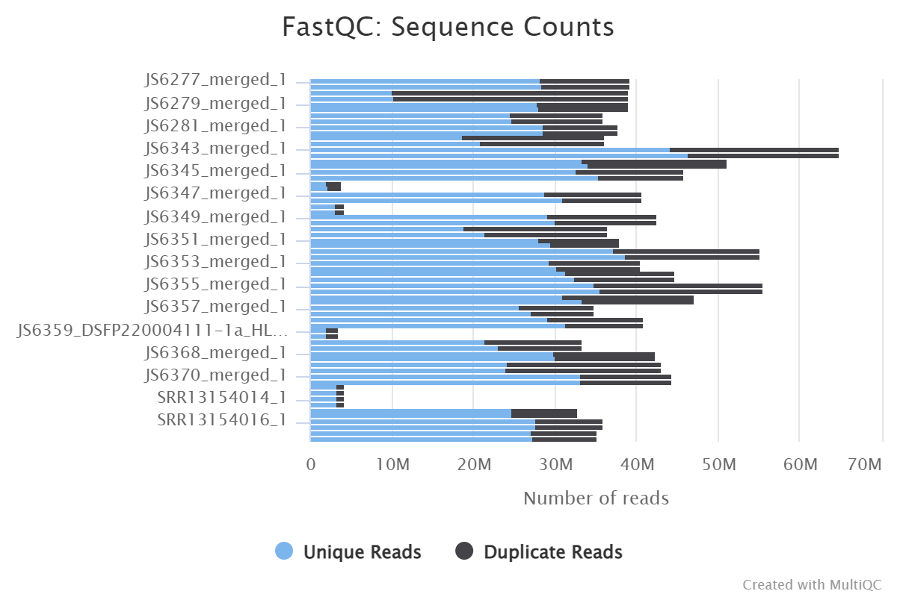
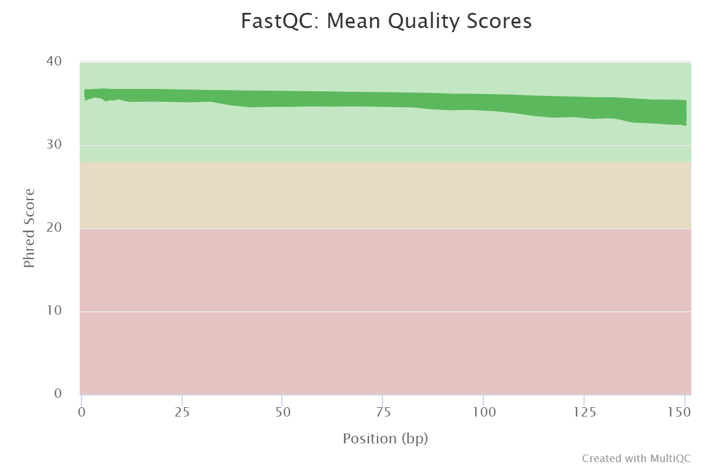
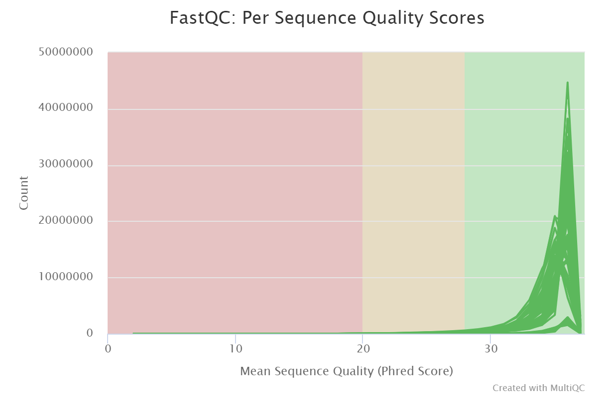
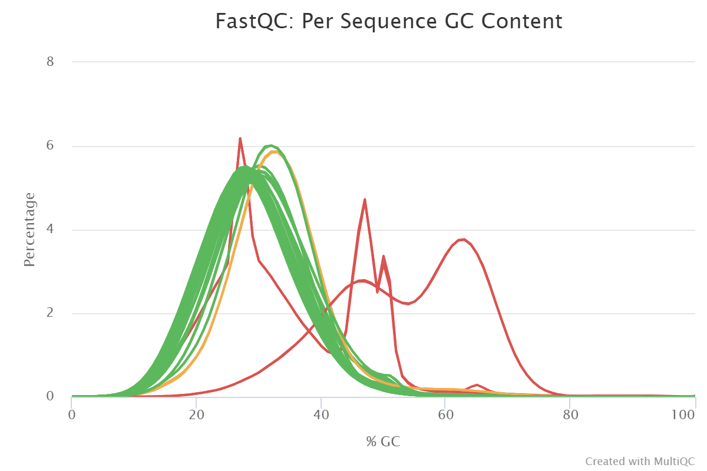
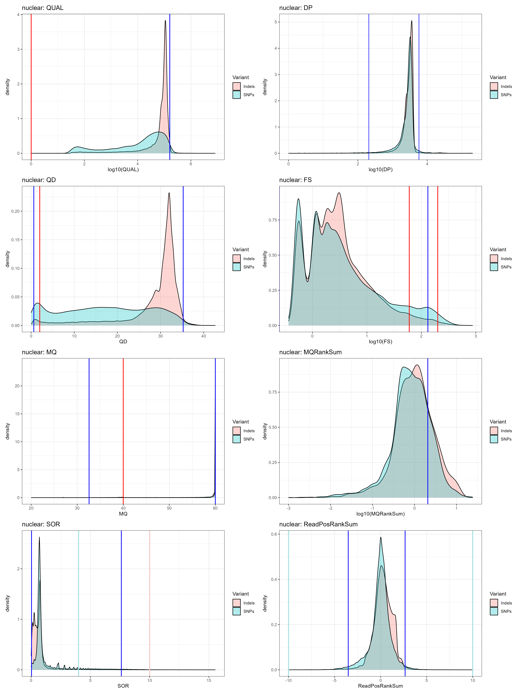
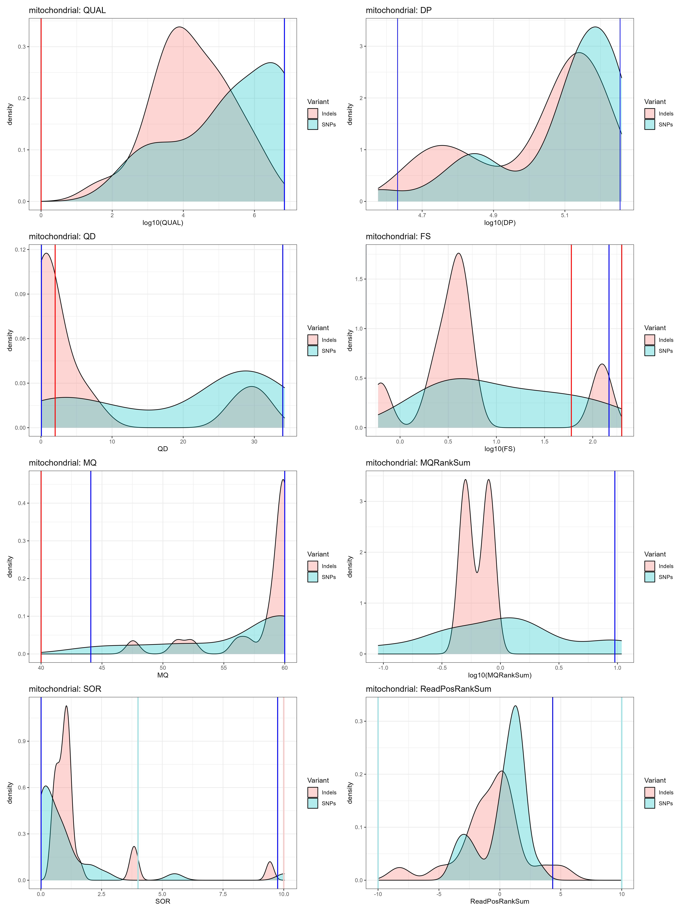
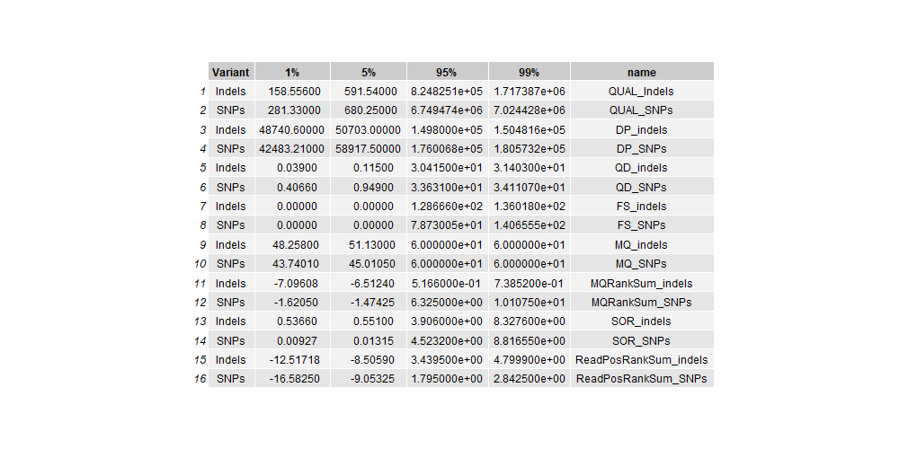
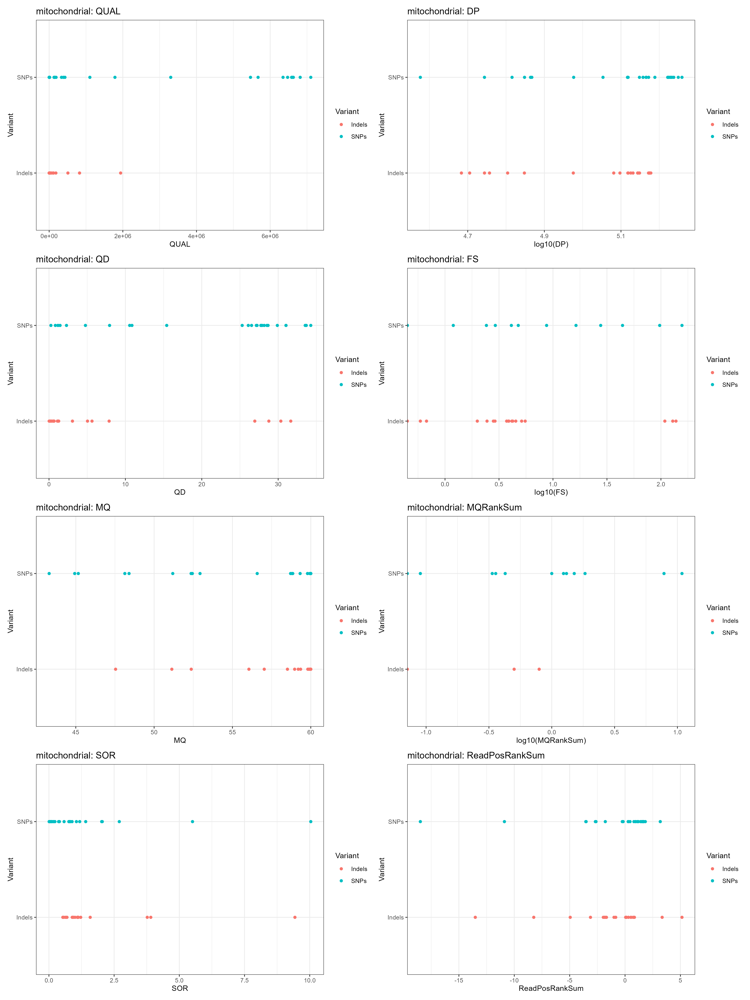
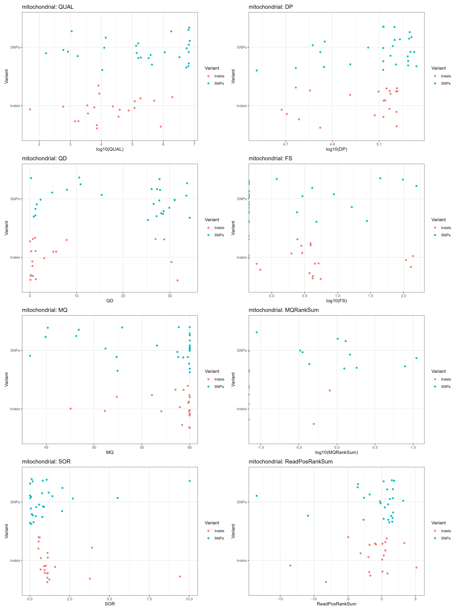
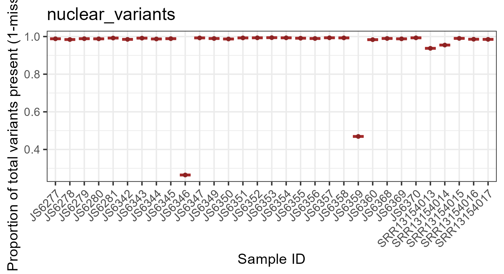

# Dirofilaria immitis WGS Lab Book

### Rose Power USYD 2023

## Get Daisy's fastq files

Get Daisy's fastq files so that I can include them with my own data. Download from SRA database.

Link to paper: https://doi.org/10.1016/j.crpvbd.2021.100007

```bash
# To get a list of the SRR (run ID), go to the BioProject on NCBI SRA database -> Send to -> File -> Format 'RunInfo' -> Download and gives you excel sheet.

cd /project/RDS-FSC-Heartworm_MLR-RW/HW_WGS_ALL/data/fastq/daisy

module load sratoolkit/3.0.3

fastq-dump --split-files --origfmt --gzip SRR13154017
fastq-dump --split-files --origfmt --gzip SRR13154016
fastq-dump --split-files --origfmt --gzip SRR13154015
fastq-dump --split-files --origfmt --gzip SRR13154014
fastq-dump --split-files --origfmt --gzip SRR13154013

```


## Map samples (world map)

Map of where samples were collected from in Australia. Size of dots can correspond to number of samples collected in that area.

```R
# Load packages
library(ggplot2)
library(dplyr)
library(purrr)
library(stats)
library(graphics)
library(grDevices)
library(utils)
library(datasets)
library(methods)
library(base)
require(maps)
library(tidyverse)
library(readxl)
library(ozmaps) 
library(grid)

# Set working directory
setwd("C:/Users/rpow2134/OneDrive - The University of Sydney (Staff)/Documents/HW_WGS")

#-- metadata that describes information about the samples, such as country of origin, and GPS coordinates
location_file <- "location.csv"

# Read the actual data into R
location <- read.csv(location_file, header = TRUE)

# Make world map
cols <- colorRampPalette(brewer.pal(8, "Set1"))(17)
par(fg = "black")
map("world", col = "grey85", fill = TRUE, border = FALSE)
map.axes()
# Plot coordinates
points(location$longitude, location$latitude, cex = 1.5, pch = 20, col = cols)
```


## FastQC & Multi-QC

We want to get some stats on the raw data.

```bash
# Load modules
module load fastqc/0.11.8

# FastQC
cd /project/RDS-FSC-Heartworm_MLR-RW/HW_WGS_ALL/Dirofilaria_immitis

INPUTDIR="/project/RDS-FSC-Heartworm_MLR-RW/HW_WGS_ALL/Raw_fastq"
NCPU=24
OUTDIR="/project/RDS-FSC-Heartworm_MLR-RW/HW_WGS_ALL/Dirofilaria_immitis/FastQC"

fastqc -t $NCPU -o $OUTDIR $INPUTDIR/*.fq.gz

cd /project/RDS-FSC-Heartworm_MLR-RW/MultiQC

module load git
module load python/3.9.15

# Run MultiQC to combine all of the FastQC reports for the raw fastq files
multiqc /project/RDS-FSC-Heartworm_MLR-RW/HW_WGS_ALL/Dirofilaria_immitis/FastQC/Raw_fastq -o /project/RDS-FSC-Heartworm_MLR-RW/HW_WGS_ALL/Dirofilaria_immitis/FastQC/Raw_fastq
```


## Merging files for the same sample

If files come from different sequencing runs, then it could be worth looking at one sample and comparing them. However, if it simply a split fastq from the same library, you can merge them together. Using ‘cat’ is a good way to do this. You must make sure the merge the read 1 files together, and the read 2 files together, and that they are in the same order. - Steve

I will merge together all files for the same sample (keeping forward and reverse reads separate). I can just use cat for fastq files. However, since mine are gzipped I need to use zcat to open the gz file. 

When I tried running the code for all samples at once, it gave the error 'disk quota exceeded'. I'll need to sort this out before running any further analyses.
After asking Steve, I have added the piping and I will first run only sample JS6277 as a test to see how much time, memory etc it takes to merge the files for 1 sample.

If merging files at the start doesn't work, I can alternatively map them first and then merge afterwards.

### Testing one sample (JS6277)

```bash

#!/bin/bash

# PBS directives 
#PBS -P RDS-FSC-Heartworm_MLR-RW
#PBS -N merge_test
#PBS -l select=2:ncpus=24:mem=30GB
#PBS -l walltime=01:00:00
#PBS -m e
#PBS -q defaultQ
#PBS -o merge_test.txt

# Submit job
## qsub merge_test.pbs

# Set working directory
cd /project/RDS-FSC-Heartworm_MLR-RW/HW_WGS_ALL/data/fastq/merged

# JS6277
zcat JS6277*_1.fq.gz | gzip > JS6277_merged_1.fq.gz

zcat JS6277*_2.fq.gz | gzip > JS6277_merged_2.fq.gz

rm JS6277_FSFP220054790-1r_HV3C5DSX2_L4_1.fq.gz JS6277_FSFP220054790-1r_HWTNHDSX2_L1_1.fq.gz JS6277_FSFP220054790-1r_HWTT7DSX2_L2_1.fq.gz JS6277_FSFP220054790-1r_HV3C5DSX2_L4_2.fq.gz JS6277_FSFP220054790-1r_HWTNHDSX2_L1_2.fq.gz JS6277_FSFP220054790-1r_HWTT7DSX2_L2_2.fq.gz
```
The time cut off (1h wasn't enough walltime). Used ~1 CPU, 9GB memory.

The F reads were done but the R reads weren't. Delete these files and try again. Maybe just run straight on the command line one by one.

### Merging samples one at a time on command line

```bash

# Set working directory
cd /project/RDS-FSC-Heartworm_MLR-RW/HW_WGS_ALL/data/fastq/merged

# JS6277
zcat JS6277*_1.fq.gz | gzip > JS6277_merged_1.fq.gz
# done

zcat JS6277*_2.fq.gz | gzip > JS6277_merged_2.fq.gz
# done

rm JS6277_FSFP220054790-1r_HV3C5DSX2_L4_1.fq.gz JS6277_FSFP220054790-1r_HWTNHDSX2_L1_1.fq.gz JS6277_FSFP220054790-1r_HWTT7DSX2_L2_1.fq.gz JS6277_FSFP220054790-1r_HV3C5DSX2_L4_2.fq.gz JS6277_FSFP220054790-1r_HWTNHDSX2_L1_2.fq.gz JS6277_FSFP220054790-1r_HWTT7DSX2_L2_2.fq.gz

# JS6278
zcat JS6278*_1.fq.gz | gzip > JS6278_merged_1.fq.gz
# done

zcat JS6278*_2.fq.gz | gzip > JS6278_merged_2.fq.gz
# done

rm JS6278_FSFP220054791-1r_HTY2GDSX2_L1_1.fq.gz JS6278_FSFP220054791-1r_HWTNHDSX2_L1_1.fq.gz JS6278_FSFP220054791-1r_HWTNJDSX2_L3_1.fq.gz JS6278_FSFP220054791-1r_HTY2GDSX2_L1_2.fq.gz JS6278_FSFP220054791-1r_HWTNHDSX2_L1_2.fq.gz JS6278_FSFP220054791-1r_HWTNJDSX2_L3_2.fq.gz

# JS6279
zcat JS6279*_1.fq.gz | gzip > JS6279_merged_1.fq.gz
# done

zcat JS6279*_2.fq.gz | gzip > JS6279_merged_2.fq.gz
# done

rm JS6279_FSFP220054792-1r_HTY2GDSX2_L1_1.fq.gz JS6279_FSFP220054792-1r_HWTNHDSX2_L1_1.fq.gz JS6279_FSFP220054792-1r_HWTT7DSX2_L2_1.fq.gz JS6279_FSFP220054792-1r_HTY2GDSX2_L1_2.fq.gz JS6279_FSFP220054792-1r_HWTNHDSX2_L1_2.fq.gz JS6279_FSFP220054792-1r_HWTT7DSX2_L2_2.fq.gz

# JS6280
zcat JS6280*_1.fq.gz | gzip > JS6280_merged_1.fq.gz
# done

zcat JS6280*_2.fq.gz | gzip > JS6280_merged_2.fq.gz
# done

rm JS6280_FSFP220054793-1r_H22KNDSX3_L2_1.fq.gz JS6280_FSFP220054793-1r_HTY2GDSX2_L1_1.fq.gz JS6280_FSFP220054793-1r_HWTNHDSX2_L1_1.fq.gz JS6280_FSFP220054793-1r_HWTNJDSX2_L3_1.fq.gz JS6280_FSFP220054793-1r_H22KNDSX3_L2_2.fq.gz JS6280_FSFP220054793-1r_HTY2GDSX2_L1_2.fq.gz JS6280_FSFP220054793-1r_HWTNHDSX2_L1_2.fq.gz JS6280_FSFP220054793-1r_HWTNJDSX2_L3_2.fq.gz

# JS6281
zcat JS6281*_1.fq.gz | gzip > JS6281_merged_1.fq.gz
# done

zcat JS6281*_2.fq.gz | gzip > JS6281_merged_2.fq.gz
# done

rm JS6281_FSFP220054794-1r_HTY2GDSX2_L1_1.fq.gz JS6281_FSFP220054794-1r_HWTNHDSX2_L1_1.fq.gz JS6281_FSFP220054794-1r_HWTT7DSX2_L2_1.fq.gz JS6281_FSFP220054794-1r_HTY2GDSX2_L1_2.fq.gz JS6281_FSFP220054794-1r_HWTNHDSX2_L1_2.fq.gz JS6281_FSFP220054794-1r_HWTT7DSX2_L2_2.fq.gz

# JS6342
zcat JS6342*_1.fq.gz | gzip > JS6342_merged_1.fq.gz
# done

zcat JS6342*_2.fq.gz | gzip > JS6342_merged_2.fq.gz
# done

rm JS6342_DKDN220004094-1A_HKNF7DSX3_L1_1.fq.gz JS6342_DKDN220004094-1A_HKNFLDSX3_L1_1.fq.gz JS6342_DSFP220004094-1a_HLGLMDSX3_L1_1.fq.gz JS6342_DSFP220004094-1a_HLGNNDSX3_L1_1.fq.gz JS6342_DKDN220004094-1A_HKNF7DSX3_L1_2.fq.gz JS6342_DKDN220004094-1A_HKNFLDSX3_L1_2.fq.gz JS6342_DSFP220004094-1a_HLGLMDSX3_L1_2.fq.gz JS6342_DSFP220004094-1a_HLGNNDSX3_L1_2.fq.gz

# JS6343
zcat JS6343*_1.fq.gz | gzip > JS6343_merged_1.fq.gz
# done

zcat JS6343*_2.fq.gz | gzip > JS6343_merged_2.fq.gz
# done

rm JS6343_DKDN220004095-1A_HJTWTDSX3_L1_1.fq.gz JS6343_DKDN220004095-1A_HKNF7DSX3_L3_1.fq.gz JS6343_DSFP220004095-1a_HJJFMDSX3_L2_1.fq.gz JS6343_DKDN220004095-1A_HJTWTDSX3_L1_2.fq.gz JS6343_DKDN220004095-1A_HKNF7DSX3_L3_2.fq.gz JS6343_DSFP220004095-1a_HJJFMDSX3_L2_2.fq.gz

# JS6344
zcat JS6344*_1.fq.gz | gzip > JS6344_merged_1.fq.gz
# done

zcat JS6344*_2.fq.gz | gzip > JS6344_merged_2.fq.gz
# done

rm JS6344_DKDN220004096-1A_HJTWTDSX3_L2_1.fq.gz JS6344_DKDN220004096-1A_HKNF7DSX3_L1_1.fq.gz JS6344_DSFP220004096-1a_HJJFMDSX3_L2_1.fq.gz JS6344_DKDN220004096-1A_HJTWTDSX3_L2_2.fq.gz JS6344_DKDN220004096-1A_HKNF7DSX3_L1_2.fq.gz JS6344_DSFP220004096-1a_HJJFMDSX3_L2_2.fq.gz

# JS6345
zcat JS6345*_1.fq.gz | gzip > JS6345_merged_1.fq.gz
# done

zcat JS6345*_2.fq.gz | gzip > JS6345_merged_2.fq.gz
# done

rm JS6345_DKDN220004097-1A_HKNF7DSX3_L1_1.fq.gz JS6345_DSFP220004097-1a_HJJFMDSX3_L2_1.fq.gz JS6345_DKDN220004097-1A_HKNF7DSX3_L1_2.fq.gz JS6345_DSFP220004097-1a_HJJFMDSX3_L2_2.fq.gz

# JS6346
# Don't need to merge this sample.

# JS6347
zcat JS6347*_1.fq.gz | gzip > JS6347_merged_1.fq.gz
# done

zcat JS6347*_2.fq.gz | gzip > JS6347_merged_2.fq.gz
# done

rm JS6347_DKDN220004099-1A_HKNF7DSX3_L1_1.fq.gz JS6347_DSFP220004099-1a_HJJFMDSX3_L2_1.fq.gz JS6347_DKDN220004099-1A_HKNF7DSX3_L1_2.fq.gz JS6347_DSFP220004099-1a_HJJFMDSX3_L2_2.fq.gz

# JS6348
# Don't need to merge this sample

# JS6349
zcat JS6349*_1.fq.gz | gzip > JS6349_merged_1.fq.gz
# done

zcat JS6349*_2.fq.gz | gzip > JS6349_merged_2.fq.gz
# done

rm JS6349_DKDN220004101-1A_HKNF7DSX3_L2_1.fq.gz JS6349_DSFP220004101-1a_HJJFMDSX3_L2_1.fq.gz JS6349_DKDN220004101-1A_HKNF7DSX3_L2_2.fq.gz JS6349_DSFP220004101-1a_HJJFMDSX3_L2_2.fq.gz

#JS6350
zcat JS6350*_1.fq.gz | gzip > JS6350_merged_1.fq.gz
# done

zcat JS6350*_2.fq.gz | gzip > JS6350_merged_2.fq.gz
# done

rm JS6350_DKDN220004102-1A_HKNF7DSX3_L1_1.fq.gz JS6350_DSFP220004102-1a_HJJFMDSX3_L2_1.fq.gz JS6350_DKDN220004102-1A_HKNF7DSX3_L1_2.fq.gz JS6350_DSFP220004102-1a_HJJFMDSX3_L2_2.fq.gz

# JS6351
zcat JS6351*_1.fq.gz | gzip > JS6351_merged_1.fq.gz
# done

zcat JS6351*_2.fq.gz | gzip > JS6351_merged_2.fq.gz
# done

rm JS6351_DKDN220004103-1A_HKNF7DSX3_L1_1.fq.gz JS6351_DSFP220004103-1a_HJJFMDSX3_L2_1.fq.gz JS6351_DKDN220004103-1A_HKNF7DSX3_L1_2.fq.gz JS6351_DSFP220004103-1a_HJJFMDSX3_L2_2.fq.gz

# JS6352
zcat JS6352*_1.fq.gz | gzip > JS6352_merged_1.fq.gz
# done

zcat JS6352*_2.fq.gz | gzip > JS6352_merged_2.fq.gz
# done

rm JS6352_DKDN220004104-1A_HJTWTDSX3_L1_1.fq.gz JS6352_DKDN220004104-1A_HKNF7DSX3_L1_1.fq.gz JS6352_DSFP220004104-1a_HJJFMDSX3_L2_1.fq.gz JS6352_DKDN220004104-1A_HJTWTDSX3_L1_2.fq.gz JS6352_DKDN220004104-1A_HKNF7DSX3_L1_2.fq.gz JS6352_DSFP220004104-1a_HJJFMDSX3_L2_2.fq.gz

# JS6353
zcat JS6353*_1.fq.gz | gzip > JS6353_merged_1.fq.gz
# done

zcat JS6353*_2.fq.gz | gzip > JS6353_merged_2.fq.gz
# done

rm JS6353_DKDN220004105-1A_HJTWTDSX3_L1_1.fq.gz JS6353_DKDN220004105-1A_HKNF7DSX3_L1_1.fq.gz JS6353_DSFP220004105-1a_HJJFMDSX3_L2_1.fq.gz JS6353_DKDN220004105-1A_HJTWTDSX3_L1_2.fq.gz JS6353_DKDN220004105-1A_HKNF7DSX3_L1_2.fq.gz JS6353_DSFP220004105-1a_HJJFMDSX3_L2_2.fq.gz

# JS6354
zcat JS6354*_1.fq.gz | gzip > JS6354_merged_1.fq.gz
# done

zcat JS6354*_2.fq.gz | gzip > JS6354_merged_2.fq.gz
# done

rm JS6354_DKDN220004106-1A_HJTWTDSX3_L1_1.fq.gz JS6354_DKDN220004106-1A_HKNF7DSX3_L2_1.fq.gz JS6354_DSFP220004106-1a_HJJFMDSX3_L2_1.fq.gz JS6354_DKDN220004106-1A_HJTWTDSX3_L1_2.fq.gz JS6354_DKDN220004106-1A_HKNF7DSX3_L2_2.fq.gz JS6354_DSFP220004106-1a_HJJFMDSX3_L2_2.fq.gz

# JS6355
zcat JS6355*_1.fq.gz | gzip > JS6355_merged_1.fq.gz
# done

zcat JS6355*_2.fq.gz | gzip > JS6355_merged_2.fq.gz
# done

rm JS6355_DKDN220004107-1A_HKNF7DSX3_L3_1.fq.gz JS6355_DSFP220004107-1a_HJJFMDSX3_L2_1.fq.gz JS6355_DKDN220004107-1A_HKNF7DSX3_L3_2.fq.gz JS6355_DSFP220004107-1a_HJJFMDSX3_L2_2.fq.gz

# JS6356
zcat JS6356*_1.fq.gz | gzip > JS6356_merged_1.fq.gz
# done

zcat JS6356*_2.fq.gz | gzip > JS6356_merged_2.fq.gz
# done

rm JS6356_DKDN220004108-1A_HJTWTDSX3_L1_1.fq.gz JS6356_DKDN220004108-1A_HKNF7DSX3_L1_1.fq.gz JS6356_DSFP220004108-1a_HJJFMDSX3_L2_1.fq.gz JS6356_DKDN220004108-1A_HJTWTDSX3_L1_2.fq.gz JS6356_DKDN220004108-1A_HKNF7DSX3_L1_2.fq.gz JS6356_DSFP220004108-1a_HJJFMDSX3_L2_2.fq.gz

# JS6357
zcat JS6357*_1.fq.gz | gzip > JS6357_merged_1.fq.gz
# done

zcat JS6357*_2.fq.gz | gzip > JS6357_merged_2.fq.gz
# done

rm JS6357_DKDN220004109-1A_HKNF7DSX3_L1_1.fq.gz JS6357_DSFP220004109-1a_HJJFMDSX3_L2_1.fq.gz JS6357_DKDN220004109-1A_HKNF7DSX3_L1_2.fq.gz JS6357_DSFP220004109-1a_HJJFMDSX3_L2_2.fq.gz

# JS6358
zcat JS6358*_1.fq.gz | gzip > JS6358_merged_1.fq.gz
# done

zcat JS6358*_2.fq.gz | gzip > JS6358_merged_2.fq.gz
# done

rm JS6358_DKDN220004110-1A_HKNF7DSX3_L1_1.fq.gz JS6358_DSFP220004110-1a_HJJFMDSX3_L2_1.fq.gz JS6358_DKDN220004110-1A_HKNF7DSX3_L1_2.fq.gz JS6358_DSFP220004110-1a_HJJFMDSX3_L2_2.fq.gz

# JS6359
# Don't need to merge this sample

# JS6360
zcat JS6360*_1.fq.gz | gzip > JS6360_merged_1.fq.gz
# done

zcat JS6360*_2.fq.gz | gzip > JS6360_merged_2.fq.gz
# done

rm JS6360_DKDN220004112-1A_HKNF7DSX3_L1_1.fq.gz JS6360_DSFP220004112-1a_HLGNNDSX3_L1_1.fq.gz JS6360_DKDN220004112-1A_HKNF7DSX3_L1_2.fq.gz JS6360_DSFP220004112-1a_HLGNNDSX3_L1_2.fq.gz

# JS6368
zcat JS6368*_1.fq.gz | gzip > JS6368_merged_1.fq.gz
# done

zcat JS6368*_2.fq.gz | gzip > JS6368_merged_2.fq.gz
# done

rm JS6368_DKDN220008346-1A_HKWGTDSX3_L3_1.fq.gz JS6368_DKDN220008346-1A_HVJMNDSX3_L1_1.fq.gz JS6368_DKDN220008346-1A_HKWGTDSX3_L3_2.fq.gz JS6368_DKDN220008346-1A_HVJMNDSX3_L1_2.fq.gz

# JS6369
zcat JS6369*_1.fq.gz | gzip > JS6369_merged_1.fq.gz
# done

zcat JS6369*_2.fq.gz | gzip > JS6369_merged_2.fq.gz
# done

rm JS6369_DKDN220008347-1A_HKWGTDSX3_L3_1.fq.gz JS6369_DKDN220008347-1A_HVJMNDSX3_L1_1.fq.gz JS6369_DKDN220008347-1A_HKWGTDSX3_L3_2.fq.gz JS6369_DKDN220008347-1A_HVJMNDSX3_L1_2.fq.gz

# JS6370
zcat JS6370*_1.fq.gz | gzip > JS6370_merged_1.fq.gz
# done

zcat JS6370*_2.fq.gz | gzip > JS6370_merged_2.fq.gz
# done

rm JS6370_DKDN220008348-1A_HKWGTDSX3_L3_1.fq.gz JS6370_DKDN220008348-1A_HVJMNDSX3_L1_1.fq.gz JS6370_DKDN220008348-1A_HKWGTDSX3_L3_2.fq.gz JS6370_DKDN220008348-1A_HVJMNDSX3_L1_2.fq.gz

```

### Check that files merged correctly

I can check that I have the same number of reads before & after merging. I can do this by counting the number of lines. Collect info into Excel sheet.

**Forward reads**

```bash
module load parallel/20160222

# Count Forward reads
cd /project/RDS-FSC-Heartworm_MLR-RW/HW_WGS_ALL/data/fastq/raw

# Raw data files
for f in *_1.fq.gz; do echo $f;zcat $f|wc -l ; done > /project/RDS-FSC-Heartworm_MLR-RW/HW_WGS_ALL/data/analysis/count/count_raw_1.txt

cd /project/RDS-FSC-Heartworm_MLR-RW/HW_WGS_ALL/data/analysis/count

# Every 2nd line moved to new column
sed 'N;s/\n/ /g' count_raw_1.txt | column -t > raw_1.txt

# Get list of unique sample name. Make sample list file.
awk '{print $1}' OFS="\t" raw_1.txt | cut -c1-6 | uniq > samples_1.txt

# Finds all files for each individual sample. Saves to new file for each sample.
parallel --colsep "\t" 'grep {1} raw_1.txt > {1}_raw_1.txt' :::: samples_1.txt

# prints sample ID and total at the bottom. Extract last line.
for f in JS*_raw_1.txt; do awk '{sum+=$2;print $1" "$2} END {print "'$f'", sum}' $f | tail -1 > total_$f; done

# combine files
cat total_JS*_raw_1.txt > total_raw_1.txt

# remove files I don't need anymore
rm JS*.txt
rm *JS*.txt


# Merged data files
cd /project/RDS-FSC-Heartworm_MLR-RW/HW_WGS_ALL/data/fastq/merged

# Forward reads
for f in *_1.fq.gz; do echo $f;zcat $f|wc -l ; done > /project/RDS-FSC-Heartworm_MLR-RW/HW_WGS_ALL/data/analysis/count/merged_1.txt

cd /project/RDS-FSC-Heartworm_MLR-RW/HW_WGS_ALL/data/analysis/count

# Every 2nd line moved to new column
sed 'N;s/\n/ /g' count_merged_1.txt | column -t > merged_1.txt


# Join the raw & merged stats for FORWARD reads
paste total_raw_1.txt merged_1.txt | column -s $'\t' -t > total_both_1.txt

# Make txt file into csv file
mv total_both_1.txt total_both_1.csv
```


**Reverse reads**

```bash
# Count Reverse reads
cd /project/RDS-FSC-Heartworm_MLR-RW/HW_WGS_ALL/data/fastq/raw

# Raw data files
for f in *_2.fq.gz; do echo $f;zcat $f|wc -l ; done > /project/RDS-FSC-Heartworm_MLR-RW/HW_WGS_ALL/data/analysis/count/count_raw_2.txt

cd /project/RDS-FSC-Heartworm_MLR-RW/HW_WGS_ALL/data/analysis/count

# Every 2nd line moved to new column
sed 'N;s/\n/ /g' count_raw_2.txt | column -t > raw_2.txt

# Get list of unique sample name. Make sample list file.
awk '{print $1}' OFS="\t" raw_2.txt | cut -c1-6 | uniq > samples_2.txt

# Finds all files for each individual sample. Saves to new file for each sample.
parallel --colsep "\t" 'grep {1} raw_2.txt > {1}_raw_2.txt' :::: samples_2.txt

# prints sample ID and total at the bottom. Extract last line.
for f in JS*_raw_2.txt; do awk '{sum+=$2;print $1" "$2} END {print "'$f'", sum}' $f | tail -1 > total_$f; done

# combine files
cat total_JS*_raw_2.txt > total_raw_2.txt

# remove files I don't need anymore
rm JS*.txt
rm *JS*.txt


# Merged data files
cd /project/RDS-FSC-Heartworm_MLR-RW/HW_WGS_ALL/data/fastq/merged

# Forward reads
for f in *_2.fq.gz; do echo $f;zcat $f|wc -l ; done > /project/RDS-FSC-Heartworm_MLR-RW/HW_WGS_ALL/data/analysis/count/count_merged_2.txt

cd /project/RDS-FSC-Heartworm_MLR-RW/HW_WGS_ALL/data/analysis/count

# Every 2nd line moved to new column
sed 'N;s/\n/ /g' count_merged_2.txt | column -t > merged_2.txt


# Join the raw & merged stats for FORWARD reads
paste total_raw_2.txt merged_2.txt | column -s $'\t' -t > total_both_2.txt

# Make txt file into csv file
mv total_both_2.txt total_both_2.csv
```
Now we have 2 excel files: 1. Raw vs merged FORWARD reads and 2. Raw vs merged REVERSE reads. Compare the total numbers and ensure that they match up so we didn't lose any data in the merging process.

After inspecting the tables, everything matches up. We have the same number of lines in the raw and merged fastq files. We can continue with the analysis using the merged files.


## FastQC & Multi-QC on the merged files (including Daisy's Sydney samples)

```bash
#!/bin/bash

# PBS directives 
#PBS -P RDS-FSC-Heartworm_MLR-RW
#PBS -N fastqc_merged
#PBS -l select=2:ncpus=2:mem=30GB
#PBS -l walltime=05:00:00
#PBS -m e
#PBS -q defaultQ
#PBS -o fastqc_merged.txt

# Submit job
## qsub fastqc_merged.pbs

# Load modules
module load fastqc/0.11.8

# FastQC
cd /project/RDS-FSC-Heartworm_MLR-RW/HW_WGS_ALL/data/analysis/fastqc/merged

INPUTDIR="/project/RDS-FSC-Heartworm_MLR-RW/HW_WGS_ALL/data/fastq/merged"
NCPU=24
OUTDIR="/project/RDS-FSC-Heartworm_MLR-RW/HW_WGS_ALL/data/analysis/fastqc/merged"

fastqc -t $NCPU -o $OUTDIR $INPUTDIR/*.fq.gz
```

```bash
#!/bin/bash

# PBS directives 
#PBS -P RDS-FSC-Heartworm_MLR-RW
#PBS -N fastqc_daisy
#PBS -l select=1:ncpus=24:mem=40GB
#PBS -l walltime=01:00:00
#PBS -m e
#PBS -q defaultQ
#PBS -o fastqc_daisy.txt

# Submit job
## qsub fastqc_daisy.pbs

# Load modules
module load fastqc/0.11.8

# FastQC
cd /project/RDS-FSC-Heartworm_MLR-RW/HW_WGS_ALL/data/analysis/fastqc/merged

INPUTDIR="/project/RDS-FSC-Heartworm_MLR-RW/HW_WGS_ALL/data/fastq/merged"
NCPU=24
OUTDIR="/project/RDS-FSC-Heartworm_MLR-RW/HW_WGS_ALL/data/analysis/fastqc/merged"

fastqc -t $NCPU -o $OUTDIR $INPUTDIR/*.fastq.gz
```

```bash
#!/bin/bash

# PBS directives 
#PBS -P RDS-FSC-Heartworm_MLR-RW
#PBS -N multiqc_merged
#PBS -l select=1:ncpus=1:mem=2GB
#PBS -l walltime=00:03:00
#PBS -m e
#PBS -q defaultQ
#PBS -o multiqc_merged.txt

# Submit job
# qsub ../multiqc_merged.pbs

# Run MultiQC to combine all of the FastQC reports for the fastq files (fastq files of samples with same library were merged)

cd /project/RDS-FSC-Heartworm_MLR-RW/MultiQC

# Load modules
module load git/2.25.0
module load python/3.9.15

multiqc /project/RDS-FSC-Heartworm_MLR-RW/HW_WGS_ALL/data/analysis/fastqc/merged -o /project/RDS-FSC-Heartworm_MLR-RW/HW_WGS_ALL/data/analysis/fastqc/merged
```



Some samples have much fewer reads. This makes sense because some samples were only sequenced for 1GB due to low quality.





Quality looks pretty good.




JS6278 (this was one of Wilson's HWs) and JS6348 (this was the D. roemeri sample) failed the GC content check. 


## Contamination

- Kraken2 to assess the degree of contamination in the raw reads. 
- Minikraken2 8Gb database for contamination with bacteria/viruses
- Custom database with D. immitis, dog & Wolbachia genomes
- Use MultiQC to summarise Kraken2 output.

### Kraken

Kraken is a system for assigning taxonomic labels to short DNA sequences. It uses k-mers to identify the taxonomy of the microbes in your sample.

```bash
# Load modules
module load kraken2/2.0.8-beta

# Build a custom database
WORKING_DIR=/project/RDS-FSC-Heartworm_MLR-RW/HW_WGS_ALL/data/analysis
mkdir ${WORKING_DIR}/kraken
cd kraken

DBNAME='location_of_database.db'

# Load taxonomy
kraken2-build --download-taxonomy --db $DBNAME

# Download the reference genome for dog, upload to hawk and gunzip it

cd /project/RDS-FSC-Heartworm_MLR-RW/HW_WGS_ALL/data/reference
wget https://ftp.ncbi.nlm.nih.gov/genomes/genbank/vertebrate_mammalian/Canis_lupus/latest_assembly_versions/GCA_014441545.1_ROS_Cfam_1.0/GCA_014441545.1_ROS_Cfam_1.0_genomic.fna.gz


# Add it to the kraken database
kraken2-build --add-to-library /project/RDS-FSC-Heartworm_MLR-RW/HW_WGS_ALL/data/reference/GCA_014441545.1_ROS_Cfam_1.0_genomic.fna --no-masking --db $DBNAME

# unzip the reference sequence beforehand
gunzip GCA_014441545.1_ROS_Cfam_1.0_genomic.fna.gz

# kraken2-build creates the standard kraken 2 database. 
# --add-to-library option is used to add each sequence to your database's genomic library (as long as they are in the required format).
# kraken2 uses 2 programs to perform low-complexity sequence masking (dustmasker and segmasker). In Javier's paper the --no-masking flag was used because dustmasker wasn't available. It will skip masking low-complexity sequences while building the database.

# Download D. immitis/Wolbachia genome
wget ftp://ngs.sanger.ac.uk/production/pathogens/sd21/dimmitis_genome/dimmitis_WSI_2.2.fa

# Add Dirofilaria immitis genome to the kraken database
# I will get the genome from Steve (it will be the one from Javier's paper)
kraken2-build --add-to-library GCA_001077395.1_ASM107739v1_genomic.fna --no-masking --db $DBNAME

# Build the database
kraken2-build --build --db $DBNAME

# Create a while loop to kraken everything
while read line; do
	kraken2 --db $DBNAME --report $line\.kraken --paired ../$line\/$line\_1.fq.gz ../$line\/$line\_2.fq.gz;
	done < $sample_names

# --report for sample report functionality
# --paired indicates to kraken2 that the input files are paired read data. Data will be read from the pairs concurrently.
# sample_names is a list of all the input fastq files.

# Organise working directory and rename samples
mkdir kraken_report
cp *.kraken kraken_report #copy kraken files to report folder
cd kraken_report

# Recode the samples. This will rename the 1st file to be the 2nd file.
mv (old name.kraken) (new name.kraken) # This step may not be necessary for me if I'm happy to leave it as the JS names.

# Multi-QC the kraken files to view them all together

cd /project/RDS-FSC-Heartworm_MLR-RW/MultiQC

# Load modules
module load git
module load python/3.9.15

multiqc /project/RDS-FSC-Heartworm_MLR-RW/HW_WGS_ALL/data/analysis/kraken/*.kraken --title kraken
cd /project/RDS-FSC-Heartworm_MLR-RW/HW_WGS_ALL/data/analysis/kraken

# Multi-QC isn't available on Artemis. I needed to download it myself and have it in my own directory. Make sure I have changed my working directory to be in the MultiQC folder.


# Minikraken
# Use 'MiniKraken2_v1_8GB' database from kraken website

while read line; do
kraken2 --db minikraken2_v1_8GB --report $line\.minikraken --paired ../$line\/$line\_1.fq.gz ../$line\/$line\_2.fq.gz ;
done < $sample_names

# Organise the directory as before
mkdir minikraken_report
cp *.minikraken minikraken_report #copy minikraken files into minikraken report folder
cd minikraken_report

# Recode the samples.
mv (old name.minikraken) (new name.minikraken) # This step may not be necessary for me if I'm happy to leave it as the JS names.

# Multi-QC the minikraken files

cd /project/RDS-FSC-Heartworm_MLR-RW/MultiQC

# Load modules
module load git
module load python/3.9.15

multiqc /project/RDS-FSC-Heartworm_MLR-RW/HW_WGS_ALL/data/analysis/kraken/*.minikraken --title minikraken
cd /project/RDS-FSC-Heartworm_MLR-RW/HW_WGS_ALL/data/analysis/kraken

# Multi-QC isn't available on Artemis. I needed to download it myself and have it in my own directory. Make sure I have changed my working directory to be in the MultiQC folder.

```


# Get list of sample names

```bash
cd /project/RDS-FSC-Heartworm_MLR-RW/HW_WGS_ALL/data/fastq/merged

# Get list of JS samples and SRR samples
ls -1 | grep "JS*" | cut -c1-6 | uniq > ../../analysis/JS_list
ls -1 | grep "SRR*" | cut -c1-11 | uniq > ../../analysis/SRR_list

# combine them
cd /project/RDS-FSC-Heartworm_MLR-RW/HW_WGS_ALL/data/analysis
cat JS_list SRR_list > sample_list

# delete the JS and SRR files I don't need anymore
rm JS_list
rm SRR_list

# How many files are in sample_list?
cat sample_list | wc -l | tr -d ' '
```
There are 32 samples (so 32 jobs).


## Trimming

We may want to trim the merged reads. To do this, we can use the trimmomatic tool.

### Trimmomatic

```bash
#!/bin/bash

# PBS directives 
#PBS -P RDS-FSC-Heartworm_MLR-RW
#PBS -N trimmomatic
#PBS -l select=1:ncpus=24:mem=25GB
#PBS -l walltime=01:00:00
#PBS -m e
#PBS -q defaultQ
#PBS -o trimmomatic.txt
#PBS -J 1-32

# qsub ../trimmomatic.pbs

cd /project/RDS-FSC-Heartworm_MLR-RW/HW_WGS_ALL/data/analysis/trimmomatic

# Load modules
module load trimmomatic/0.38

#Set the filename based on the PBS Array Index
sample_name=`sed -n "${PBS_ARRAY_INDEX}{p;q}" ../sample_list`

# Run Trimmomatic
java -jar /usr/local/trimmomatic/0.38/trimmomatic-0.38.jar PE \
-threads $NCPUS \
/project/RDS-FSC-Heartworm_MLR-RW/HW_WGS_ALL/data/fastq/merged/${sample_name}*1.f*.gz \
/project/RDS-FSC-Heartworm_MLR-RW/HW_WGS_ALL/data/fastq/merged/${sample_name}*2.f*.gz \
${sample_name}_1_trimpaired.fq.gz ${sample_name}_1_trimunpaired.fq.gz \
${sample_name}_2_trimpaired.fq.gz ${sample_name}_2_trimunpaired.fq.gz \
SLIDINGWINDOW:10:20 MINLEN:50

# SLIDINGWINDOW:10:20 means it will scan the read with a 10-base wide sliding window, cutting when the average quality per base drops below 20.

# Instead of SLIDINGWINDOW, in my previous practice code I used 'AVGQUAL:30 MINLEN:150'.
```
## FastQC & Multi-QC on the merged files AFTER TRIMMING

Check to see how the data looks after trimming.

```bash
#!/bin/bash

# PBS directives 
#PBS -P RDS-FSC-Heartworm_MLR-RW
#PBS -N fastQC_trimmed
#PBS -l select=2:ncpus=2:mem=30GB
#PBS -l walltime=05:00:00
#PBS -m e
#PBS -q defaultQ
#PBS -o fastQC_trimmed.txt

# Submit job
## qsub fastQC_trimmed.pbs

# Load modules
module load fastqc/0.11.8

# FastQC
cd /project/RDS-FSC-Heartworm_MLR-RW/HW_WGS_ALL/data/analysis/fastqc
mkdir trimmed
cd trimmed

INPUTDIR="/project/RDS-FSC-Heartworm_MLR-RW/HW_WGS_ALL/data/analysis/trimmomatic"
NCPU=24
OUTDIR="/project/RDS-FSC-Heartworm_MLR-RW/HW_WGS_ALL/data/analysis/fastqc/trimmed"

fastqc -t $NCPU -o $OUTDIR $INPUTDIR/*.fq.gz
```

```bash
#!/bin/bash

# PBS directives 
#PBS -P RDS-FSC-Heartworm_MLR-RW
#PBS -N multiqc_trimmed
#PBS -l select=1:ncpus=1:mem=2GB
#PBS -l walltime=00:02:30
#PBS -m e
#PBS -q defaultQ
#PBS -o multiqc_trimmed.txt

# Submit job
# qsub ../multiqc_trimmed.pbs

# Run MultiQC to combine all of the FastQC reports for the trimmed fastq files

cd /project/RDS-FSC-Heartworm_MLR-RW/MultiQC

# Load modules
module load git/2.25.0
module load python/3.9.15

multiqc /project/RDS-FSC-Heartworm_MLR-RW/HW_WGS_ALL/data/analysis/fastqc/trimmed -o /project/RDS-FSC-Heartworm_MLR-RW/HW_WGS_ALL/data/analysis/fastqc/trimmed
```


## Including/excluding samples

Some samples have high/some low amounts of data. Which samples do we want to include/exclude from further analysis?


## Mapping

We want to map the reads to 3/4 different genomes: 
1. Nuclear HW
2. mt DNA HW
3. Wolbachia
4. Domestic dog *Canis lupus familiaris* (GenBank accession: GCA_014441545) # This is the one Steve used in his recent paper

The code below uses bwa mem for mapping, but I could also use minimap2 -> Sambamba to mark duplicate reads -> Samtools merge to combine mapped reads (when there are multiple read sets).

### Map trimmed reads to combined D. immitis & Wol & dog genome

- cat the 2 references together
- map reads to the combined reference
- samtools to pull out DI scaffolds I want
- do stats before filtering, so I can see how many were mapped, then how many after filtering etc. Do before samtools view -q 15.

Prepare everything for mapping:

```bash
#!/bin/bash

# PBS directives 
#PBS -P RDS-FSC-Heartworm_MLR-RW
#PBS -N mapping_prep
#PBS -l select=1:ncpus=1:mem=15GB
#PBS -l walltime=01:30:00
#PBS -m e
#PBS -q defaultQ
#PBS -o mapping_prep.txt

# qsub ../mapping_prep.pbs

# Set working directory
cd /project/RDS-FSC-Heartworm_MLR-RW/HW_WGS_ALL/data/analysis/mapping

# Load modules
module load bwa/0.7.17

# Combine the 2 references
# cat dimmitis_WSI_2.2.fa GCA_014441545.1_ROS_Cfam_1.0_genomic.fna > reference_di_wol_dog.fa 
# Already did this step in the test run. Can just copy over the joined reference file.
# cp /project/RDS-FSC-Heartworm_MLR-RW/HW_WGS_test/data/analysis/mapping/reference_di_wol_dog.fa .

# Also copy over the D. immitis/Wol reference
# cp /project/RDS-FSC-Heartworm_MLR-RW/HW_WGS_test/data/analysis/mapping/dimmitis_WSI_2.2.fa .
# Already did these steps prior.

# index reference sequence
bwa index reference_di_wol_dog.fa

# Perform mapping, sam-to-bam conversion, filtering, and indexing. Need to have separate table with the relevant sample names I want. Then need to use variables to replace the sample names. This will reduce time/effort and minimise typos. I could make a loop, but since I will be running it on the Artemis server as a job, it may be best to write out a script.
```

Map the reads:

```bash
#!/bin/bash

# PBS directives 
#PBS -P RDS-FSC-Heartworm_MLR-RW
#PBS -N mapping
#PBS -l select=1:ncpus=24:mem=50GB
#PBS -l walltime=01:00:00
#PBS -m abe
#PBS -q defaultQ
#PBS -o mapping.txt
#PBS -J 1-32

# qsub ../mapping.pbs

# Set working directory
cd /project/RDS-FSC-Heartworm_MLR-RW/HW_WGS_ALL/data/analysis/mapping

# Load modules
module load bwa/0.7.17

#Set the filename based on the PBS Array Index
sample_name=`sed -n "${PBS_ARRAY_INDEX}{p;q}" ../sample_list`

# Tried using /mapping in /project directory but the sam files took up lots of space (disk quota exceeded). Put output files into /scratch instead.

# map the reads, with a separate mapping job for each sample
bwa mem reference_di_wol_dog.fa \
-t $NCPUS \
../trimmomatic/${sample_name}_1_trimpaired.fq.gz \
../trimmomatic/${sample_name}_2_trimpaired.fq.gz \
> /scratch/RDS-FSC-Heartworm_MLR-RW/mapping/${sample_name}.tmp.sam

# Set the num_threads param to directly scale with the number of cpus using the PBS environment variable "${NCPUS}).

```


Convert to bam & sort the mapped reads:

```bash
#!/bin/bash

# PBS directives 
#PBS -P RDS-FSC-Heartworm_MLR-RW
#PBS -N mapping_sort
#PBS -l select=1:ncpus=2:mem=50GB
#PBS -l walltime=02:00:00
#PBS -m e
#PBS -q defaultQ
#PBS -o mapping_sort.txt
#PBS -J 1-32

# qsub ../mapping_sort.pbs

# Set working directory
cd /scratch/RDS-FSC-Heartworm_MLR-RW/mapping/

# Load modules
module load samtools/1.9

#Set the filename based on the PBS Array Index
sample_name=`sed -n "${PBS_ARRAY_INDEX}{p;q}" /project/RDS-FSC-Heartworm_MLR-RW/HW_WGS_ALL/data/analysis/sample_list`

# Mapping stats
samtools flagstat ${sample_name}.tmp.sam > flagstat1/${sample_name}_flagstat1.txt
	
# convert the sam to bam format
samtools view -q 15 -b -o ${sample_name}.tmp.bam ${sample_name}.tmp.sam

# sort the mapped reads in the bam file
samtools sort ${sample_name}.tmp.bam -o ${sample_name}.sorted.bam
 
# index the sorted bam
samtools index ${sample_name}.sorted.bam

# Mapping stats after filtering
samtools flagstat ${sample_name}.sorted.bam > flagstat2/${sample_name}_flagstat2.txt
```


Combine flagstat files for all samples so it's easier to read.

```bash
#!/bin/bash

# PBS directives 
#PBS -P RDS-FSC-Heartworm_MLR-RW
#PBS -N multiqc_flagstat1
#PBS -l select=1:ncpus=1:mem=1GB
#PBS -l walltime=00:02:30
#PBS -m e
#PBS -q defaultQ
#PBS -o multiqc_flagstat1.txt

# Submit job
# qsub ../multiqc_flagstat1.pbs

cd /project/RDS-FSC-Heartworm_MLR-RW/MultiQC

# Load modules
module load git/2.25.0
module load python/3.9.15

multiqc /scratch/RDS-FSC-Heartworm_MLR-RW/mapping/flagstat1/*_flagstat1.txt -o /scratch/RDS-FSC-Heartworm_MLR-RW/mapping/flagstat1
```

```bash
#!/bin/bash

# PBS directives 
#PBS -P RDS-FSC-Heartworm_MLR-RW
#PBS -N multiqc_flagstat2
#PBS -l select=1:ncpus=1:mem=1GB
#PBS -l walltime=00:03:00
#PBS -m e
#PBS -q defaultQ
#PBS -o multiqc_flagstat2.txt

# Submit job
# qsub ../multiqc_flagstat2.pbs

cd /project/RDS-FSC-Heartworm_MLR-RW/MultiQC

# Load modules
module load git/2.25.0
module load python/3.9.15

multiqc /scratch/RDS-FSC-Heartworm_MLR-RW/mapping/flagstat2/*_flagstat2.txt -o /scratch/RDS-FSC-Heartworm_MLR-RW/mapping/flagstat2
```

## Extract reads that mapped to the *D. immitis* genome

If I mapped to the *D. immitis* and dog genomes separately, there could be reads that mapped to both genomes. To avoid this, I mapped to the combined D. immitis/dog genome. I can now extract the reads that mapped to only the *D. immitis* genome and use this for downstream analyses.

```bash
#!/bin/bash

# PBS directives 
#PBS -P RDS-FSC-Heartworm_MLR-RW
#PBS -N mapping_bed
#PBS -l select=1:ncpus=1:mem=1GB
#PBS -l walltime=00:01:30
#PBS -m e
#PBS -q defaultQ
#PBS -o mapping_bed.txt

# qsub ../mapping_bed.pbs

# Set working directory
cd /project/RDS-FSC-Heartworm_MLR-RW/HW_WGS_ALL/data/analysis/mapping

# Load modules
module load samtools/1.9

# Index the reference file (from Steve's paper) using samtools faidx
samtools faidx dimmitis_WSI_2.2.fa

# Get the scaffolds/positions.
head dimmitis_WSI_2.2.fa.fai
# Column 1 is the chromosome/scaffold, column 2 is how long it is, then there's some other info.

# Get chromosome, then start and end positions
awk '{print $1, "1", $2}' OFS="\t" dimmitis_WSI_2.2.fa.fai | head

# Save this info as a bed file
awk '{print $1, "1", $2}' OFS="\t" dimmitis_WSI_2.2.fa.fai > dimmitis_WSI_2.2.bed
# Now we have a nice bed file that has info telling us where things are
```

```bash
#!/bin/bash

# PBS directives 
#PBS -P RDS-FSC-Heartworm_MLR-RW
#PBS -N mapping_extract
#PBS -l select=1:ncpus=1:mem=15GB
#PBS -l walltime=00:45:00
#PBS -m e
#PBS -q defaultQ
#PBS -o mapping_extract.txt
#PBS -J 1-32

# qsub ../mapping_extract.pbs

# Set working directory
cd /project/RDS-FSC-Heartworm_MLR-RW/HW_WGS_ALL/data/analysis/mapping

# Load modules
module load samtools/1.9

#Set the filename based on the PBS Array Index
sample_name=`sed -n "${PBS_ARRAY_INDEX}{p;q}" ../sample_list`

# Extract reads that only mapped to D. immitis.
samtools view -b -h -L dimmitis_WSI_2.2.bed /scratch/RDS-FSC-Heartworm_MLR-RW/mapping/${sample_name}.sorted.bam > /scratch/RDS-FSC-Heartworm_MLR-RW/mapping/${sample_name}_extract.bam
# Should still be in sorted form
# -b flag makes sure the output is bam
# -h flag includes the header in SAM output

samtools view /scratch/RDS-FSC-Heartworm_MLR-RW/mapping/${sample_name}_extract.bam | head

# I do not have to sort the bam file again, it should still be sorted.

## QC
# How many D. immitis reads were extracted?

samtools flagstat /scratch/RDS-FSC-Heartworm_MLR-RW/mapping/${sample_name}_extract.bam > /scratch/RDS-FSC-Heartworm_MLR-RW/mapping/extract_flagstat/${sample_name}_extract_flagstat.txt
```

Combine flagstat files for all samples so it's easier to read.

```bash
#!/bin/bash

# PBS directives 
#PBS -P RDS-FSC-Heartworm_MLR-RW
#PBS -N multiqc_extract_flagstat
#PBS -l select=1:ncpus=1:mem=1GB
#PBS -l walltime=00:02:30
#PBS -m e
#PBS -q defaultQ
#PBS -o multiqc_extract_flagstat.txt

# Submit job
# qsub ../multiqc_extract_flagstat.pbs

cd /project/RDS-FSC-Heartworm_MLR-RW/MultiQC

# Load modules
module load git/2.25.0
module load python/3.9.15

multiqc /scratch/RDS-FSC-Heartworm_MLR-RW/mapping/extract_flagstat/*_extract_flagstat.txt -o /scratch/RDS-FSC-Heartworm_MLR-RW/mapping/extract_flagstat
```


***
## QC, coverage, sex
- Samtools faidx to compare the D. immitis assemblies.
- Minimap2 for more large-scale comparisons between the assemblies -> paf outputs -> visualise in R.
- Bamtools, bedtools makewindows, samtools bedcov to assess genome coverage.
- Infer sample sex using coverage of X chromosome:autosome
***

## Remove D. roemeri sample from analysis

Moved JS6348 sample into D. roemeri folder because I don't want to include it in subsequent analyses.

## Index the extracted bam files

```bash
#!/bin/bash

# PBS directives 
#PBS -P RDS-FSC-Heartworm_MLR-RW
#PBS -N mapping_extract_index
#PBS -l select=1:ncpus=8:mem=10GB
#PBS -l walltime=01:00:00
#PBS -m e
#PBS -q defaultQ
#PBS -o mapping_extract_index.txt
#PBS -J 1-31

#qsub ../mapping_extract_index.pbs

cd /scratch/RDS-FSC-Heartworm_MLR-RW/mapping

# Load modules
module load samtools/1.9

#Set the filename based on the PBS Array Index
sample_name=`sed -n "${PBS_ARRAY_INDEX}{p;q}" /project/RDS-FSC-Heartworm_MLR-RW/HW_WGS_ALL/data/analysis/sample_list_v2`
# Sample_list_v2 basically is the same thing but minus the D. roemeri sample.

samtools index ${sample_name}_extract.bam
```


## Re-map and re-extract samples that had errors with the EOF marker.

Samples JS6360, 68, 69 & 70 bam files had the EOF marker absent. Re-run these 4 samples (generate the sam, bam files again and extract the D. immitis reads again). After this, I can re-submit the SNP calling and re-do the coverage analysis.

```bash
#!/bin/bash

# PBS directives 
#PBS -P RDS-FSC-Heartworm_MLR-RW
#PBS -N re-mapping
#PBS -l select=2:ncpus=12:mem=25GB
#PBS -l walltime=01:00:00
#PBS -m abe
#PBS -q defaultQ
#PBS -o re-mapping.txt
#PBS -J 1-4
#PBS -M rosemonde.power@sydney.edu.au

# qsub ../re-mapping.pbs

# Some sorted bam files had no EOF header. Re-map these samples so I can analyse coverage.

# Set working directory
cd /project/RDS-FSC-Heartworm_MLR-RW/HW_WGS_ALL/data/analysis/mapping

# Load modules
module load bwa/0.7.17

#Set the filename based on the PBS Array Index
sample_name=`sed -n "${PBS_ARRAY_INDEX}{p;q}" ../re-sample_list`

# Tried using /mapping in /project directory but the sam files took up lots of space (disk quota exceeded). Put output files into /scratch instead.

# map the reads, with a separate mapping job for each sample
bwa mem reference_di_wol_dog.fa \
-t $NCPUS \
../trimmomatic/${sample_name}_1_trimpaired.fq.gz \
../trimmomatic/${sample_name}_2_trimpaired.fq.gz \
> /scratch/RDS-FSC-Heartworm_MLR-RW/mapping/${sample_name}.tmp.sam

# Set the num_threads param to directly scale with the number of cpus using the PBS environment variable "${NCPUS}).
```

```bash
#!/bin/bash

# PBS directives 
#PBS -P RDS-FSC-Heartworm_MLR-RW
#PBS -N re-mapping_sort
#PBS -l select=1:ncpus=2:mem=20GB
#PBS -l walltime=00:30:00
#PBS -m e
#PBS -q defaultQ
#PBS -o re-mapping_sort.txt
#PBS -J 1-4
#PBS -M rosemonde.power@sydney.edu.au

# qsub ../re-mapping_sort.pbs

# Set working directory
cd /scratch/RDS-FSC-Heartworm_MLR-RW/mapping/

# Load modules
module load samtools/1.9

#Set the filename based on the PBS Array Index
sample_name=`sed -n "${PBS_ARRAY_INDEX}{p;q}" /project/RDS-FSC-Heartworm_MLR-RW/HW_WGS_ALL/data/analysis/re-sample_list`

# Mapping stats
samtools flagstat ${sample_name}.tmp.sam > flagstat1/${sample_name}_flagstat1.txt
	
# convert the sam to bam format
samtools view -q 15 -b -o ${sample_name}.tmp.bam ${sample_name}.tmp.sam

# sort the mapped reads in the bam file
samtools sort ${sample_name}.tmp.bam -o ${sample_name}.sorted.bam
 
# index the sorted bam
samtools index ${sample_name}.sorted.bam

# Mapping stats after filtering
samtools flagstat ${sample_name}.sorted.bam > flagstat2/${sample_name}_flagstat2.txt
```


Sample JS6360 still didn't work. Run this sample again.

```bash
#!/bin/bash

# PBS directives 
#PBS -P RDS-FSC-Heartworm_MLR-RW
#PBS -N re-mapping_sort_JS6360
#PBS -l select=3:ncpus=1:mem=35GB
#PBS -l walltime=02:00:00
#PBS -m abe
#PBS -q defaultQ
#PBS -o re-mapping_sort_JS6360.txt
#PBS -M rosemonde.power@sydney.edu.au

# qsub ../re-mapping_sort_JS6360.pbs

# Set working directory
cd /scratch/RDS-FSC-Heartworm_MLR-RW/mapping/

# Load modules
module load samtools/1.9

# Mapping stats
samtools flagstat JS6360.tmp.sam > flagstat1/JS6360_flagstat1.txt
	
# convert the sam to bam format
samtools view -q 15 -b -o JS6360.tmp.bam JS6360.tmp.sam

# sort the mapped reads in the bam file
samtools sort JS6360.tmp.bam -o JS6360.sorted.bam
 
# index the sorted bam
samtools index JS6360.sorted.bam

# Mapping stats after filtering
samtools flagstat JS6360.sorted.bam > flagstat2/JS6360_flagstat2.txt
```

```bash
#!/bin/bash

# PBS directives 
#PBS -P RDS-FSC-Heartworm_MLR-RW
#PBS -N re-mapping_extract
#PBS -l select=1:ncpus=2:mem=15GB
#PBS -l walltime=01:00:00
#PBS -m e
#PBS -q defaultQ
#PBS -o re-mapping_extract.txt
#PBS -J 1-4

# qsub ../re-mapping_extract.pbs

# Set working directory
cd /project/RDS-FSC-Heartworm_MLR-RW/HW_WGS_ALL/data/analysis/mapping

# Load modules
module load samtools/1.9

#Set the filename based on the PBS Array Index
sample_name=`sed -n "${PBS_ARRAY_INDEX}{p;q}" ../re-sample_list`

# Extract reads that only mapped to D. immitis.
samtools view -b -h -L dimmitis_WSI_2.2.bed /scratch/RDS-FSC-Heartworm_MLR-RW/mapping/${sample_name}.sorted.bam > /scratch/RDS-FSC-Heartworm_MLR-RW/mapping/${sample_name}_extract.bam
# Should still be in sorted form
# -b flag makes sure the output is bam
# -h flag includes the header in SAM output

samtools view /scratch/RDS-FSC-Heartworm_MLR-RW/mapping/${sample_name}_extract.bam | head

# I do not have to sort the bam file again, it should still be sorted.

## QC
# How many D. immitis reads were extracted?

samtools flagstat /scratch/RDS-FSC-Heartworm_MLR-RW/mapping/${sample_name}_extract.bam > /scratch/RDS-FSC-Heartworm_MLR-RW/mapping/extract_flagstat/${sample_name}_extract_flagstat.txt
```

```bash
#!/bin/bash

# PBS directives 
#PBS -P RDS-FSC-Heartworm_MLR-RW
#PBS -N re-mapping_extract_index
#PBS -l select=1:ncpus=1:mem=1GB
#PBS -l walltime=00:10:00
#PBS -m e
#PBS -q defaultQ
#PBS -o re-mapping_extract_index.txt
#PBS -J 1-4

#qsub ../re-mapping_extract_index.pbs

cd /scratch/RDS-FSC-Heartworm_MLR-RW/mapping

# Load modules
module load samtools/1.9

#Set the filename based on the PBS Array Index
sample_name=`sed -n "${PBS_ARRAY_INDEX}{p;q}" /project/RDS-FSC-Heartworm_MLR-RW/HW_WGS_ALL/data/analysis/re-sample_list`

samtools index ${sample_name}_extract.bam
```
Re-ran multiqc_flagstat1, multiqc_flagstat2 & multiqc_extract_flagstat scripts to obtain updated mapping statistics.


## SNPs (raw)

Now that I've extracted the reads for D. immitis, I can continue to call SNPs.
The code below uses bcftools for SNP calling. I could also use GATK -> variants identified -> HaplotypeCaller to generate GVCF files for each BAM file -> consolidate variants -> CombineGVCFs to merge GVCF files -> GATK GenotypeGVCFs for joint-call cohort genotyping -> generate single multisample VCF file (contains all initial variants and samples).


```bash
#!/bin/bash

# PBS directives 
#PBS -P RDS-FSC-Heartworm_MLR-RW
#PBS -N snps_raw
#PBS -l select=14:ncpus=4:mem=20GB
#PBS -l walltime=350:00:00
#PBS -m abe
#PBS -q defaultQ
#PBS -o snps_raw.txt
#PBS -M rosemonde.power@sydney.edu.au

# qsub ../snps_raw.pbs

cd /scratch/RDS-FSC-Heartworm_MLR-RW/mapping/

# Load modules
module load samtools/1.9
module load bcftools/1.11
module load tabix/0.2.6

# List all of the extracted files and write them to a new file-of-file-names - "bam.fofn".
# This will contain the names of all the bam files
ls -1 *_extract.bam > bam.fofn

# call SNPs in the bam files using bam.fofn to generate a multi-sample bcf
bcftools mpileup --threads 24 -Ou --annotate FORMAT/DP --fasta-ref /project/RDS-FSC-Heartworm_MLR-RW/HW_WGS_ALL/data/analysis/mapping/dimmitis_WSI_2.2.fa --bam-list bam.fofn | bcftools call --threads 24 -v -c -Ob --skip-variants indels > all_samples.bcf
# Can just use DI reference genome now
# can i multithread it? It can really help.

# index the multi-sample bcf
bcftools index all_samples.bcf

# convert the bcf to a compressed vcf
bcftools view all_samples.bcf -Oz > all_samples.vcf.gz

# index the compressed vcf
tabix -p vcf all_samples.vcf.gz

## QC
# Get stats for bcf and vcf files we just created
# bcftools stats all_samples.bcf > all_samples_bcf_stats.txt
bcftools stats all_samples.vcf.gz > all_samples_vcf_stats.txt
```

Both of these outputs seem to be the same. Can just get stats on the compressed vcf file.
The above script is taking a really long time to run. Steve had his own script (which was a lot faster, however it needed to be run on the Sanger system). He ran his script with my sorted bam files and I can now download the VCF produced.

```bash
# Download VCF and index from Steve
wget ftp://ngs.sanger.ac.uk//production/pathogens/sd21/dimmitis_australia/*
```

I need to figure out a way to run this myself on the Artemis HPC in a shorter timeframe.


## Adding read groups to bam files

I didn't add read groups during the mapping step, but luckily I can use samtools addreplacerg to add them in after mapping.

```bash
#!/bin/bash

# PBS directives 
#PBS -P RDS-FSC-Heartworm_MLR-RW
#PBS -N read_groups
#PBS -l select=1:ncpus=2:mem=20GB
#PBS -l walltime=02:00:00
#PBS -m e
#PBS -q defaultQ
#PBS -o read_groups.txt
#PBS -J 1-31

# qsub ../read_groups.pbs

WORKING_DIR=/scratch/RDS-FSC-Heartworm_MLR-RW/mapping
cd "${WORKING_DIR}"

config=/project/RDS-FSC-Heartworm_MLR-RW/HW_WGS_ALL/data/analysis/info.txt
SAMPLE_NAME=$(awk -v taskID=$PBS_ARRAY_INDEX '$1==taskID {print $2}' $config)

# Load modules
module load samtools/1.9

samtools addreplacerg -r "@RG\tRG:${SAMPLE_NAME}\tID:${SAMPLE_NAME}\tSM:${SAMPLE_NAME}" -o /scratch/RDS-FSC-Heartworm_MLR-RW/mapping/bams/${SAMPLE_NAME}_rg.bam  /scratch/RDS-FSC-Heartworm_MLR-RW/mapping/bams/${SAMPLE_NAME}_extract.bam
```


## Index the read group bam files

```bash
#!/bin/bash

# PBS directives 
#PBS -P RDS-FSC-Heartworm_MLR-RW
#PBS -N rg_index
#PBS -l select=1:ncpus=2:mem=10GB
#PBS -l walltime=00:10:00
#PBS -m e
#PBS -q defaultQ
#PBS -o rg_index.txt
#PBS -J 1-31

# qsub ../rg_index.pbs


WORKING_DIR=/scratch/RDS-FSC-Heartworm_MLR-RW/mapping/bams
cd "${WORKING_DIR}"

config=/project/RDS-FSC-Heartworm_MLR-RW/HW_WGS_ALL/data/analysis/info.txt

sample=$(awk -v taskID=$PBS_ARRAY_INDEX '$1==taskID {print $2}' $config) 
bam=/scratch/RDS-FSC-Heartworm_MLR-RW/mapping/bams/${sample}_rg.bam

echo "sample is: $sample"
echo "bam is: $bam"

# Load modules
module load samtools/1.9

# index bam files
samtools index ${bam}
```


## Calling variants in a faster way using arrays

- The format for the GVCF file is similar to a VCF file. The key difference is that the GVCF file contains records for each sequenced genomic coordinate. 
- The key difference between a regular VCF and a GVCF is that the GVCF has records for all sites, whether there is a variant call there or not. The goal is to have every site represented in the file in order to do joint analysis of a cohort in subsequent steps.
- The --emit-ref-confidence or -ERC parameter lets you select a method to summarise confidence in the genomic site being homozygous-reference. The option -ERC GVCF is more efficient and recommended for large samples and therefore more scalable.

Test using 1 sample:

```bash
#!/bin/bash

# PBS directives 
#PBS -P RDS-FSC-Heartworm_MLR-RW
#PBS -N variant_calling3
#PBS -l select=1:ncpus=24:mem=80GB
#PBS -l walltime=72:00:00
#PBS -m abe
#PBS -q defaultQ
#PBS -o variant_calling3.txt
#PBS -M rosemonde.power@sydney.edu.au

# qsub ../variant_calling3.pbs


WORKING_DIR=/scratch/RDS-FSC-Heartworm_MLR-RW/mapping/vcf
cd "${WORKING_DIR}"


# Load modules
module load gatk/4.2.1.0
module load samtools/1.17

# index reference file
samtools faidx /project/RDS-FSC-Heartworm_MLR-RW/HW_WGS_ALL/data/analysis/mapping/reference_di_wol_dog.fa

# make gvcf per sample
gatk --java-options "-Xmx4g" HaplotypeCaller \
-R /project/RDS-FSC-Heartworm_MLR-RW/HW_WGS_ALL/data/analysis/mapping/reference_di_wol_dog.fa \
-I /scratch/RDS-FSC-Heartworm_MLR-RW/mapping/bams/SRR13154013_rg.bam \
-O /scratch/RDS-FSC-Heartworm_MLR-RW/mapping/vcf/SRR13154013_v3.g.vcf.gz \
-ERC GVCF

## Got error mapping to dimmitis_WSI_2.2 reference (it was saying a dog scaffold was missing and that I needed to check if I had the correct reference). So I will use the merged  “dimmitis_WSI_2.2 + dog” reference genome instead.
```
This had exit status=0 and seemed to work! 

Now run on all samples:

```bash
#!/bin/bash

# PBS directives 
#PBS -P RDS-FSC-Heartworm_MLR-RW
#PBS -N variant_calling
#PBS -l select=1:ncpus=24:mem=80GB
#PBS -l walltime=72:00:00
#PBS -m e
#PBS -q defaultQ
#PBS -o variant_calling.txt
#PBS -J 1-31

# qsub ../variant_calling.pbs


WORKING_DIR=/scratch/RDS-FSC-Heartworm_MLR-RW/mapping/bams
cd "${WORKING_DIR}"

config=/project/RDS-FSC-Heartworm_MLR-RW/HW_WGS_ALL/data/analysis/info.txt
ref=/project/RDS-FSC-Heartworm_MLR-RW/HW_WGS_ALL/data/analysis/mapping/reference_di_wol_dog.fa

sample=$(awk -v taskID=$PBS_ARRAY_INDEX '$1==taskID {print $2}' $config) 
bam=/scratch/RDS-FSC-Heartworm_MLR-RW/mapping/bams/${sample}_rg.bam
vcf=/scratch/RDS-FSC-Heartworm_MLR-RW/mapping/vcf/${sample}.g.vcf.gz

echo "sample is: $sample"
echo "bam is: $bam"

# Load modules
#module load gatk/4.2.1.0
module load gatk/4.1.4.1
module load samtools/1.9

# index bam files
samtools index ${bam}

# make gvcf per sample
gatk --java-options "-Xmx8g -DGATK_STACKTRACE_ON_USER_EXCEPTION=true" \
HaplotypeCaller \
-R ${ref} \
-I ${bam} \
-O ${vcf} \
-ERC GVCF
#--native-pair-hmm-threads ${NCPUS} # can maybe try using this to multithread and speed things up
```

Having problems with this - it's taking a super long time to run.


## Joint call variants

Merge the GVCF files we generated with HaplotypeCaller into a single GVCF file.

Test using 2 samples:

```bash
#!/bin/bash

# PBS directives 
#PBS -P RDS-FSC-Heartworm_MLR-RW
#PBS -N jointcall_variants.pbs
#PBS -l select=1:ncpus=1:mem=10GB
#PBS -l walltime=01:00:00
#PBS -m abe
#PBS -q defaultQ
#PBS -o jointcall_variants.txt
#PBS -M rosemonde.power@sydney.edu.au

# qsub ../jointcall_variants.pbs

# Perform joint genotyping on one or more samples pre-called with HaplotypeCaller

WORKING_DIR=/project/RDS-FSC-Heartworm_MLR-RW/HW_WGS_ALL/data/analysis
cd "${WORKING_DIR}"

cohort=Dirofilaria_immitis_test
ref=/project/RDS-FSC-Heartworm_MLR-RW/HW_WGS_ALL/data/analysis/mapping/reference_di_wol_dog.fa

gvcf=/scratch/RDS-FSC-Heartworm_MLR-RW/mapping/vcf/${cohort}.g.vcf.gz
vcf=/scratch/RDS-FSC-Heartworm_MLR-RW/mapping/vcf/${cohort}.vcf.gz

# Load modules
module load gatk/4.2.1.0

# create cohort gvcf
gatk --java-options "-Xmx28g -DGATK_STACKTRACE_ON_USER_EXCEPTION=true" \
        CombineGVCFs \
        -R ${ref} \
        -V /scratch/RDS-FSC-Heartworm_MLR-RW/mapping/vcf/JS6277.g.vcf.gz \
        -V /scratch/RDS-FSC-Heartworm_MLR-RW/mapping/vcf/JS6278.g.vcf.gz \
        -O ${gvcf}


# Genotype cohort vcf
gatk --java-options "-Xmx28g -DGATK_STACKTRACE_ON_USER_EXCEPTION=true" \
        GenotypeGVCFs \
        -R ${ref} \
        -V ${gvcf} \
        -O ${vcf}
```

This worked super quick and produced a cohort 'g.vcf.gz' and 'vcf.gz'.


Now run on all samples:
```bash
#!/bin/bash

# PBS directives 
#PBS -P RDS-FSC-Heartworm_MLR-RW
#PBS -N jointcall_variants.pbs
#PBS -l select=1:ncpus=24:mem=80GB
#PBS -l walltime=72:00:00
#PBS -m abe
#PBS -q defaultQ
#PBS -o jointcall_variants.txt
#PBS -M rosemonde.power@sydney.edu.au

# qsub ../jointcall_variants.pbs

# Perform joint genotyping on one or more samples pre-called with HaplotypeCaller

WORKING_DIR=/project/RDS-FSC-Heartworm_MLR-RW/HW_WGS_ALL/data/analysis
cd "${WORKING_DIR}"

cohort=Dirofilaria_immitis_June2023
config=/project/RDS-FSC-Heartworm_MLR-RW/HW_WGS_ALL/data/analysis/info.txt
ref=/project/RDS-FSC-Heartworm_MLR-RW/HW_WGS_ALL/data/analysis/mapping/reference_di_wol_dog.fa

gvcf=/scratch/RDS-FSC-Heartworm_MLR-RW/mapping/vcf/${cohort}.g.vcf.gz
vcf=/scratch/RDS-FSC-Heartworm_MLR-RW/mapping/vcf/${cohort}.vcf.gz

# Load modules
module load gatk/4.2.1.0

# collect all sample g.vcfs in /scratch/<project>/mapping/vcf to make input for CombineGVCFs
ls /scratch/RDS-FSC-Heartworm_MLR-RW/mapping/vcf/*.g.vcf.gz > /project/RDS-FSC-Heartworm_MLR-RW/HW_WGS_ALL/data/analysis/gvcf.list

args=$(while read line; do
  echo "-V ${line}"
done < /project/RDS-FSC-Heartworm_MLR-RW/HW_WGS_ALL/data/analysis/gvcf.list)

echo $args

# create cohort gvcf
gatk --java-options "-Xmx28g -DGATK_STACKTRACE_ON_USER_EXCEPTION=true" \
        CombineGVCFs \
        -R ${ref} \
        ${args} \
        -O ${gvcf}


# Genotype cohort vcf
gatk --java-options "-Xmx28g -DGATK_STACKTRACE_ON_USER_EXCEPTION=true" \
        GenotypeGVCFs \
        -R ${ref} \
        -V ${gvcf} \
        -O ${vcf}
```


## SNPs QC

### Querying SNP and INDEL QC profiles to determine thresholds for filters

Adopted from Javier's paper.

```bash
#!/bin/bash

# PBS directives 
#PBS -P RDS-FSC-Heartworm_MLR-RW
#PBS -N snps_qc
#PBS -l select=1:ncpus=1:mem=2GB
#PBS -l walltime=00:05:00
#PBS -m e
#PBS -q defaultQ
#PBS -o snps_qc.txt

# qsub ../snps_qc.pbs


# load gatk
module load gatk/4.1.4.1

WORKING_DIR=/scratch/RDS-FSC-Heartworm_MLR-RW/mapping/filter

# set reference, vcf, and mitochondrial and Wb contig
REFERENCE=/project/RDS-FSC-Heartworm_MLR-RW/HW_WGS_ALL/data/analysis/mapping/dimmitis_WSI_2.2.fa
VCF=/scratch/RDS-FSC-Heartworm_MLR-RW/mapping/filter/dirofilaria_australia.cohort.2023-05-16.vcf.gz
MIT_CONTIG=dirofilaria_immitis_chrMtDNA
WB_CONTIG=dirofilaria_immitis_chrWb

cd /project/RDS-FSC-Heartworm_MLR-RW/HW_WGS_ALL/data/analysis/mapping

# Make .dict file for reference sequence
gatk CreateSequenceDictionary -R ${REFERENCE} -O /project/RDS-FSC-Heartworm_MLR-RW/HW_WGS_ALL/data/analysis/mapping/dimmitis_WSI_2.2.dict

cd ${WORKING_DIR}

# select nuclear SNPs
gatk SelectVariants \
--reference ${REFERENCE} \
--variant ${VCF} \
--select-type-to-include SNP \
--exclude-intervals ${MIT_CONTIG} \
--exclude-intervals ${WB_CONTIG} \
--output ${VCF%.vcf.gz}.nuclearSNPs.vcf

# select nuclear INDELs
gatk SelectVariants \
--reference ${REFERENCE} \
--variant ${VCF} \
--select-type-to-include INDEL \
--exclude-intervals ${MIT_CONTIG} \
--exclude-intervals ${WB_CONTIG} \
--output ${VCF%.vcf.gz}.nuclearINDELs.vcf

# select mitochondrial SNPs
gatk SelectVariants \
--reference ${REFERENCE} \
--variant ${VCF} \
--select-type-to-include SNP \
--intervals ${MIT_CONTIG} \
--output ${VCF%.vcf.gz}.mitoSNPs.vcf

# select mitochondrial INDELs
gatk SelectVariants \
--reference ${REFERENCE} \
--variant ${VCF} \
--select-type-to-include INDEL \
--intervals ${MIT_CONTIG} \
--output ${VCF%.vcf.gz}.mitoINDELs.vcf

# select WB SNPs
gatk SelectVariants \
--reference ${REFERENCE} \
--variant ${VCF} \
--select-type-to-include SNP \
--intervals ${WB_CONTIG} \
--output ${VCF%.vcf.gz}.WbSNPs.vcf

# select WB INDELs
gatk SelectVariants \
--reference ${REFERENCE} \
--variant ${VCF} \
--select-type-to-include INDEL \
--intervals ${WB_CONTIG} \
--output ${VCF%.vcf.gz}.WbINDELs.vcf

# make a table of nuclear SNP data
gatk VariantsToTable \
--reference ${REFERENCE} \
--variant dirofilaria_australia.cohort.2023-05-16.nuclearSNPs.vcf \
--fields CHROM --fields POS --fields QUAL --fields QD --fields DP --fields MQ --fields MQRankSum --fields FS --fields ReadPosRankSum --fields SOR \
--output GVCFall_nuclearSNPs.table

# make a table of nuclear INDEL data
gatk VariantsToTable \
--reference ${REFERENCE} \
--variant dirofilaria_australia.cohort.2023-05-16.nuclearINDELs.vcf \
--fields CHROM --fields POS --fields QUAL --fields QD --fields DP --fields MQ --fields MQRankSum --fields FS --fields ReadPosRankSum --fields SOR \
--output GVCFall_nuclearINDELs.table

# make a table of mito SNP data
gatk VariantsToTable \
--reference ${REFERENCE} \
--variant dirofilaria_australia.cohort.2023-05-16.mitoSNPs.vcf \
--fields CHROM --fields POS --fields QUAL --fields QD --fields DP --fields MQ --fields MQRankSum --fields FS --fields ReadPosRankSum --fields SOR \
--output GVCFall_mitoSNPs.table

# make a table of mito INDEL data
gatk VariantsToTable \
--reference ${REFERENCE} \
--variant dirofilaria_australia.cohort.2023-05-16.mitoINDELs.vcf \
--fields CHROM --fields POS --fields QUAL --fields QD --fields DP --fields MQ --fields MQRankSum --fields FS --fields ReadPosRankSum --fields SOR \
--output GVCFall_mitoINDELs.table

# make a table of Wb SNP data
gatk VariantsToTable \
--reference ${REFERENCE} \
--variant dirofilaria_australia.cohort.2023-05-16.WbSNPs.vcf \
--fields CHROM --fields POS --fields QUAL --fields QD --fields DP --fields MQ --fields MQRankSum --fields FS --fields ReadPosRankSum --fields SOR \
--output GVCFall_WbSNPs.table

# make a table of Wb INDEL data
gatk VariantsToTable \
--reference ${REFERENCE} \
--variant dirofilaria_australia.cohort.2023-05-16.WbINDELs.vcf \
--fields CHROM --fields POS --fields QUAL --fields QD --fields DP --fields MQ --fields MQRankSum --fields FS --fields ReadPosRankSum --fields SOR \
--output GVCFall_WbINDELs.table
```

### Make some density plots of the data and get quantiles in R

```R
# load libraries
library(patchwork)
require(data.table)
library(tidyverse)
library(gridExtra)

setwd("C:/Users/rpow2134/OneDrive - The University of Sydney (Staff)/Documents/HW_WGS/R_analysis/snps_qc")

# Import data
## Nuclear SNPs & indels
VCF_nuclear_snps <- fread('GVCFall_nuclearSNPs.table', header = TRUE, fill=TRUE, na.strings=c("","NA"), sep = "\t")
VCF_nuclear_snps <- sample_frac(VCF_nuclear_snps, 0.2) # select fraction of rows
VCF_nuclear_indels <- fread('GVCFall_nuclearINDELs.table', header = TRUE, fill=TRUE, na.strings=c("","NA"), sep = "\t")
VCF_nuclear_indels <- sample_frac(VCF_nuclear_indels, 0.2)
dim(VCF_nuclear_snps) # returns the dimensions of the data frame
dim(VCF_nuclear_indels)
VCF_nuclear <- rbind(VCF_nuclear_snps, VCF_nuclear_indels) # joins multiple rows to form a single batch
VCF_nuclear$Variant <- factor(c(rep("SNPs", dim(VCF_nuclear_snps)[1]), rep("Indels", dim(VCF_nuclear_indels)[1]))) # make a new column saying whether it's a SNP or indel

## Mitochondrial SNPs & indels
VCF_mito_snps <- fread('GVCFall_mitoSNPs.table', header = TRUE, fill=TRUE, na.strings=c("","NA"), sep = "\t")
VCF_mito_indels <- fread('GVCFall_mitoINDELs.table', header = TRUE, fill=TRUE, na.strings=c("","NA"), sep = "\t")
dim(VCF_mito_snps)
dim(VCF_mito_indels)
VCF_mito <- rbind(VCF_mito_snps, VCF_mito_indels)
VCF_mito$Variant <- factor(c(rep("SNPs", dim(VCF_mito_snps)[1]), rep("Indels", dim(VCF_mito_indels)[1])))

## Wolbachia SNPs & indels
VCF_wb_snps <- fread('GVCFall_WbSNPs.table', header = TRUE, fill=TRUE, na.strings=c("","NA"), sep = "\t")
VCF_wb_indels <- fread('GVCFall_WbINDELs.table', header = TRUE, fill=TRUE, na.strings=c("","NA"), sep = "\t")
dim(VCF_wb_snps)
dim(VCF_wb_indels)
VCF_wb <- rbind(VCF_wb_snps, VCF_wb_indels)
VCF_wb$Variant <- factor(c(rep("SNPs", dim(VCF_wb_snps)[1]), rep("Indels", dim(VCF_wb_indels)[1])))

# Set colours for the plots
snps <- '#A9E2E4'
indels <- '#F4CCCA'

# make function which makes plots
fun_variant_summaries <- function(data, title){
  # gatk hardfilter: SNP & INDEL QUAL < 0
  QUAL_quant <- quantile(data$QUAL, c(.01,.99), na.rm=T)
  
  QUAL <-
    ggplot(data, aes(x=log10(QUAL), fill=Variant)) +
    geom_density(alpha=.3) +
    geom_vline(xintercept=0, size=0.7, col="red") +
    geom_vline(xintercept=c(log10(QUAL_quant[2]), log10(QUAL_quant[3])), size=0.7, col="blue") +
    #xlim(0,10000) +
    theme_bw() +
    labs(title=paste0(title,": QUAL"))
  
  
  # DP doesnt have a hardfilter
  DP_quant <- quantile(data$DP, c(.01,.99), na.rm=T)
  
  DP <-
    ggplot(data, aes(x=log10(DP), fill=Variant)) +
    geom_density(alpha=0.3) +
    geom_vline(xintercept=log10(DP_quant), col="blue") +
    theme_bw() +
    labs(title=paste0(title,": DP"))
  
  # gatk hardfilter: SNP & INDEL QD < 2
  QD_quant <- quantile(data$QD, c(.01,.99), na.rm=T)
  
  QD <-
    ggplot(data, aes(x=QD, fill=Variant)) +
    geom_density(alpha=.3) +
    geom_vline(xintercept=2, size=0.7, col="red") +
    geom_vline(xintercept=QD_quant, size=0.7, col="blue") +
    theme_bw() +
    labs(title=paste0(title,": QD"))
  
  # gatk hardfilter: SNP FS > 60, INDEL FS > 200
  FS_quant <- quantile(data$FS, c(.01,.99), na.rm=T)
  
  FS <-
    ggplot(data, aes(x=log10(FS), fill=Variant)) +
    geom_density(alpha=.3) +
    geom_vline(xintercept=c(log10(60), log10(200)), size=0.7, col="red") +
    geom_vline(xintercept=log10(FS_quant), size=0.7, col="blue") +
    #xlim(0,250) +
    theme_bw() +
    labs(title=paste0(title,": FS"))
  
  # gatk hardfilter: SNP & INDEL MQ < 30
  MQ_quant <- quantile(data$MQ, c(.01,.99), na.rm=T)
  
  MQ <-
    ggplot(data, aes(x=MQ, fill=Variant)) + geom_density(alpha=.3) +
    geom_vline(xintercept=40, size=0.7, col="red") +
    geom_vline(xintercept=MQ_quant, size=0.7, col="blue") +
    theme_bw() +
    labs(title=paste0(title,": MQ"))
  
  # gatk hardfilter: SNP MQRankSum < -20
  MQRankSum_quant <- quantile(data$MQRankSum, c(.01,.99), na.rm=T)
  
  MQRankSum <-
    ggplot(data, aes(x=log10(MQRankSum), fill=Variant)) + geom_density(alpha=.3) +
    geom_vline(xintercept=log10(-20), size=0.7, col="red") +
    geom_vline(xintercept=log10(MQRankSum_quant), size=0.7, col="blue") +
    theme_bw() +
    labs(title=paste0(title,": MQRankSum"))
  
  
  # gatk hardfilter: SNP SOR < 4 , INDEL SOR > 10
  SOR_quant <- quantile(data$SOR, c(.01, .99), na.rm=T)
  
  SOR <-
    ggplot(data, aes(x=SOR, fill=Variant)) +
    geom_density(alpha=.3) +
    geom_vline(xintercept=c(4, 10), size=1, colour = c(snps,indels)) +
    geom_vline(xintercept=SOR_quant, size=0.7, col="blue") +
    theme_bw() +
    labs(title=paste0(title,": SOR"))
  
  # gatk hardfilter: SNP ReadPosRankSum <-10 , INDEL ReadPosRankSum < -20
  ReadPosRankSum_quant <- quantile(data$ReadPosRankSum, c(.01,.99), na.rm=T)
  
  ReadPosRankSum <-
    ggplot(data, aes(x=ReadPosRankSum, fill=Variant)) +
    geom_density(alpha=.3) +
    geom_vline(xintercept=c(-10,10,-20,20), size=1, colour = c(snps,snps,indels,indels)) +
    xlim(-10, 10) +
    geom_vline(xintercept=ReadPosRankSum_quant, size=0.7, col="blue") +
    theme_bw() +
    labs(title=paste0(title,": ReadPosRankSum"))
  
  
  plot <- QUAL + DP + QD + FS + MQ + MQRankSum + SOR + ReadPosRankSum + plot_layout(ncol=2)
  
  print(plot)
  
  ggsave(paste0("plot_",title,"_variant_summaries.png"), height=20, width=15, type="cairo")
  
  
  # generate a table of quantiles for each variant feature
  QUAL_quant <- data %>% group_by(Variant) %>% summarise(quants = list(quantile(QUAL, probs = c(0.01,0.05,0.95,0.99),na.rm=T))) %>% unnest_wider(quants)
  QUAL_quant$name <- "QUAL"
  DP_quant <- data %>% group_by(Variant) %>% summarise(quants = list(quantile(DP, probs = c(0.01,0.05,0.95,0.99),na.rm=T))) %>% unnest_wider(quants)
  DP_quant$name <- "DP"
  QD_quant <- data %>% group_by(Variant) %>% summarise(quants = list(quantile(QD, probs = c(0.01,0.05,0.95,0.99),na.rm=T))) %>% unnest_wider(quants)
  QD_quant$name <- "QD"
  FS_quant <- data %>% group_by(Variant) %>% summarise(quants = list(quantile(FS, probs = c(0.01,0.05,0.95,0.99),na.rm=T))) %>% unnest_wider(quants)
  FS_quant$name <- "FS"
  MQ_quant <- data %>% group_by(Variant) %>% summarise(quants = list(quantile(MQ, probs = c(0.01,0.05,0.95,0.99),na.rm=T))) %>% unnest_wider(quants)
  MQ_quant$name <- "MQ"
  MQRankSum_quant <- data %>% group_by(Variant) %>% summarise(quants = list(quantile(MQRankSum, probs = c(0.01,0.05,0.95,0.99),na.rm=T))) %>% unnest_wider(quants)
  MQRankSum_quant$name <- "MQRankSum"
  SOR_quant <- data %>% group_by(Variant) %>% summarise(quants = list(quantile(SOR, probs = c(0.01,0.05,0.95,0.99),na.rm=T))) %>% unnest_wider(quants)
  SOR_quant$name <- "SOR"
  ReadPosRankSum_quant <- data %>% group_by(Variant) %>% summarise(quants = list(quantile(ReadPosRankSum, probs = c(0.01,0.05,0.95,0.99),na.rm=T))) %>% unnest_wider(quants)
  ReadPosRankSum_quant$name <- "ReadPosRankSum"
  
  quantiles <- bind_rows(QUAL_quant,DP_quant, QD_quant, FS_quant, MQ_quant, MQRankSum_quant, SOR_quant, ReadPosRankSum_quant)
  quantiles$name <- c("QUAL_Indels","QUAL_SNPs","DP_indels","DP_SNPs", "QD_indels","QD_SNPs", "FS_indels","FS_SNPs", "MQ_indels","MQ_SNPs", "MQRankSum_indels","MQRankSum_SNPs", "SOR_indels","SOR_SNPs","ReadPosRankSum_indels","ReadPosRankSum_SNPs")
  
  png(paste0("table_",title,"_variant_quantiles.png"), width=1000,height=500,bg = "white")
  print(quantiles)
  grid.table(quantiles)
  dev.off()
  
}
```
```R
# run nuclear variants
fun_variant_summaries(VCF_nuclear,"nuclear")
```



```R
# run mitochondrial variants
fun_variant_summaries(VCF_mito,"mitochondrial")
```



```R
# run wolbachia variants
fun_variant_summaries(VCF_wb,"wolbachia")
```


```R
# Plot for mtDNA
##The mitochondrial genome has fewer SNPs so we might want to plot the individual points instead of density. This will give us a better idea of how to filter this data.

  # gatk hardfilter: SNP & INDEL QUAL < 0
  QUAL <-
    ggplot(VCF_mito) +
    geom_point( aes(x=log10(QUAL), y=Variant, colour=Variant)) +
    #xlim(0,10000) +
    theme_bw() +
    labs(title=paste0("mitochondrial",": QUAL"))
  QUAL
  
  # DP doesnt have a hardfilter
  DP <-
    ggplot(VCF_mito) +
    geom_point( aes(x=log10(DP), y=Variant, colour=Variant)) +
    theme_bw() +
    labs(title=paste0("mitochondrial",": DP"))
  DP
  
  # gatk hardfilter: SNP & INDEL QD < 2
  QD <-
    ggplot(VCF_mito) +
    geom_point( aes(x=QD, y=Variant, colour=Variant)) +
    theme_bw() +
    labs(title=paste0("mitochondrial",": QD"))
  QD
  # Removed 1 rows containing missing values (`geom_point()`). 
  
  # gatk hardfilter: SNP FS > 60, INDEL FS > 200
  FS <-
    ggplot(VCF_mito) +
    geom_point( aes(x=log10(FS), y=Variant, colour=Variant)) +
    #xlim(0,250) +
    theme_bw() +
    labs(title=paste0("mitochondrial",": FS"))
  FS
  
  # gatk hardfilter: SNP & INDEL MQ < 30
  MQ <-
    ggplot(VCF_mito) +
    geom_point( aes(x=MQ, y=Variant, colour=Variant)) +
    theme_bw() +
    labs(title=paste0("mitochondrial",": MQ"))
  MQ
  
  # gatk hardfilter: SNP MQRankSum < -20
  MQRankSum <-
    ggplot(VCF_mito) +
    geom_point( aes(x=log10(MQRankSum), y=Variant, colour=Variant)) +
    theme_bw() +
    labs(title=paste0("mitochondrial",": MQRankSum"))
  MQRankSum
  # Removed 28 rows containing missing values (`geom_point()`). 
  
  
  # gatk hardfilter: SNP SOR < 4 , INDEL SOR > 10
  SOR <-
    ggplot(VCF_mito) +
    geom_point( aes(x=SOR, y=Variant, colour=Variant)) +
    theme_bw() +
    labs(title=paste0("mitochondrial",": SOR"))
  SOR
  
  # gatk hardfilter: SNP ReadPosRankSum <-10 , INDEL ReadPosRankSum < -20
  ReadPosRankSum <-
    ggplot(VCF_mito) +
    geom_point( aes(x=ReadPosRankSum, y=Variant, colour=Variant)) +
    theme_bw() +
    labs(title=paste0("mitochondrial",": ReadPosRankSum"))
  ReadPosRankSum
  # Removed 3 rows containing missing values (`geom_point()`). 
  
  
  plot <- QUAL + DP + QD + FS + MQ + MQRankSum + SOR + ReadPosRankSum + plot_layout(ncol=2)
  
  print(plot)
  
  ggsave(paste0("plot_mitochondrial_indiv_variant_summaries.png"), height=20, width=15, type="cairo")
```

Notice how everything is in 1 line on the y-axis because I used geom_point(). What if there are thousands of points voerlapping one another and I just can't see them? To combat this, I can use geom_jitter() which spreads things out so I can see them properly (but the y-axis doesn't really mean anything, it is simply to help visualise things).


Using geom_jitter():

```R
 # Repeat the same thing as above but use geom_jitter instead of geom_point.
  # gatk hardfilter: SNP & INDEL QUAL < 0
  QUAL <-
    ggplot(VCF_mito) +
    geom_jitter( aes(x=log10(QUAL), y=Variant, colour=Variant)) +
    #xlim(0,10000) +
    theme_bw() +
    labs(title=paste0("mitochondrial",": QUAL"))
  QUAL
  
  # DP doesnt have a hardfilter
  DP <-
    ggplot(VCF_mito) +
    geom_jitter( aes(x=log10(DP), y=Variant, colour=Variant)) +
    theme_bw() +
    labs(title=paste0("mitochondrial",": DP"))
  DP
  
  # gatk hardfilter: SNP & INDEL QD < 2
  QD <-
    ggplot(VCF_mito) +
    geom_jitter( aes(x=QD, y=Variant, colour=Variant)) +
    theme_bw() +
    labs(title=paste0("mitochondrial",": QD"))
  QD
  # Removed 1 rows containing missing values (`geom_point()`). 
  
  # gatk hardfilter: SNP FS > 60, INDEL FS > 200
  FS <-
    ggplot(VCF_mito) +
    geom_jitter( aes(x=log10(FS), y=Variant, colour=Variant)) +
    #xlim(0,250) +
    theme_bw() +
    labs(title=paste0("mitochondrial",": FS"))
  FS
  
  # gatk hardfilter: SNP & INDEL MQ < 30
  MQ <-
    ggplot(VCF_mito) +
    geom_jitter( aes(x=MQ, y=Variant, colour=Variant)) +
    theme_bw() +
    labs(title=paste0("mitochondrial",": MQ"))
  MQ
  
  # gatk hardfilter: SNP MQRankSum < -20
  MQRankSum <-
    ggplot(VCF_mito) +
    geom_jitter( aes(x=log10(MQRankSum), y=Variant, colour=Variant)) +
    theme_bw() +
    labs(title=paste0("mitochondrial",": MQRankSum"))
  MQRankSum
  # Removed 28 rows containing missing values (`geom_point()`). 
  
  
  # gatk hardfilter: SNP SOR < 4 , INDEL SOR > 10
  SOR <-
    ggplot(VCF_mito) +
    geom_jitter( aes(x=SOR, y=Variant, colour=Variant)) +
    theme_bw() +
    labs(title=paste0("mitochondrial",": SOR"))
  SOR
  
  # gatk hardfilter: SNP ReadPosRankSum <-10 , INDEL ReadPosRankSum < -20
  ReadPosRankSum <-
    ggplot(VCF_mito) +
    geom_jitter( aes(x=ReadPosRankSum, y=Variant, colour=Variant)) +
    theme_bw() +
    labs(title=paste0("mitochondrial",": ReadPosRankSum"))
  ReadPosRankSum
  # Removed 3 rows containing missing values (`geom_point()`). 
  
  
  plot <- QUAL + DP + QD + FS + MQ + MQRankSum + SOR + ReadPosRankSum + plot_layout(ncol=2)
  
  print(plot)
  
  ggsave(paste0("plot_mitochondrial_indiv_variant_summaries_jitter.png"), height=20, width=15, type="cairo")
```

You can now visualise the points much better.


What do the QC abbreviations mean?

- QUAL: quality score.
- DP: filtered depth, at the sample level.
- MQ: RMSMappingQuality. This is the root mean square mapping quality over all the reads at the site. 
- SOR: StrandOddsRatio. This is another way to estimate strand bias using a test similar to the symmetric odds ratio test. 
- QD: QualByDepth. This is the variant confidence (from the QUAL field) divided by the unfiltered depth of non-hom-ref samples.
- FS: FisherStrand. This is the Phred-scaled probability that there is strand bias at the site.
- MQRankSum: MappingQualityRankSumTest. This is the u-based z-approximation from the Rank Sum Test for mapping qualities. It compares the mapping qualities of the reads supporting the reference allele and the alternate allele.
- ReadPosRankSum: ReadPosRankSumTest. This is the u-based z-approximation from the Rank Sum Test for site position within reads. It compares whether the positions of the reference and alternate alleles are different within the reads.


### Attending to the quantiles, thresholds for specific parameters are established

```bash
#!/bin/bash

# PBS directives 
#PBS -P RDS-FSC-Heartworm_MLR-RW
#PBS -N snps_qc2
#PBS -l select=1:ncpus=1:mem=1GB
#PBS -l walltime=00:03:00
#PBS -m e
#PBS -q defaultQ
#PBS -o snps_qc2.txt

# qsub ../snps_qc2.pbs


# load gatk
module load gatk/4.1.4.1

WORKING_DIR=/scratch/RDS-FSC-Heartworm_MLR-RW/mapping/filter

# set reference, vcf
REFERENCE=/project/RDS-FSC-Heartworm_MLR-RW/HW_WGS_ALL/data/analysis/mapping/dimmitis_WSI_2.2.fa
VCF=/scratch/RDS-FSC-Heartworm_MLR-RW/mapping/filter/dirofilaria_australia.cohort.2023-05-16.vcf.gz

cd ${WORKING_DIR}

#Nuclear
gatk VariantFiltration \
--reference ${REFERENCE} \
--variant dirofilaria_australia.cohort.2023-05-16.nuclearSNPs.vcf \
--filter-expression 'QUAL < 34 || DP < 119 || DP > 8569 || MQ < 28.76 || SOR > 8.592 || QD < 0.450 || FS > 63.394 || MQRankSum < -9.383 || ReadPosRankSum < -3.914 || ReadPosRankSum > 2.871' \
--filter-name "SNP_filtered" \
--output dirofilaria_australia.cohort.2023-05-16.nuclearSNPs.filtered.vcf

gatk VariantFiltration \
--reference ${REFERENCE} \
--variant dirofilaria_australia.cohort.2023-05-16.nuclearINDELs.vcf \
--filter-expression 'QUAL < 68 || DP < 344 || DP > 4444 || MQ < 36.50 || SOR > 5.282 || QD < 1.175 || FS > 5.159 || MQRankSum < -3.820 || ReadPosRankSum < -2.859 || ReadPosRankSum > 2.470' \
--filter-name "INDEL_filtered" \
--output dirofilaria_australia.cohort.2023-05-16.nuclearINDELs.filtered.vcf

#Mitochondrial
gatk VariantFiltration \
--reference ${REFERENCE} \
--variant dirofilaria_australia.cohort.2023-05-16.mitoSNPs.vcf \
--filter-expression ' QUAL < 281 || DP < 42483 || DP > 180573 || MQ < 43.74 || SOR > 8.817 || QD < 0.407 || FS > 78.730 || MQRankSum < -1.621 || ReadPosRankSum < -16.583 || ReadPosRankSum > 2.843 ' \
--filter-name "SNP_filtered" \
--output dirofilaria_australia.cohort.2023-05-16.mitoSNPs.filtered.vcf

gatk VariantFiltration \
--reference ${REFERENCE} \
--variant dirofilaria_australia.cohort.2023-05-16.mitoINDELs.vcf \
--filter-expression 'QUAL < 158 || DP < 48740 || DP > 150482 || MQ < 48.26 || SOR > 8.328 || QD < 0.039 || FS > 128.666 || MQRankSum < -7.096 || ReadPosRankSum < -12.517 || ReadPosRankSum > 4.800' \
--filter-name "INDEL_filtered" \
--output dirofilaria_australia.cohort.2023-05-16.mitoINDELs.filtered.vcf

#Wolbachia
gatk VariantFiltration \
--reference ${REFERENCE} \
--variant dirofilaria_australia.cohort.2023-05-16.WbSNPs.vcf \
--filter-expression ' QUAL < 31 || DP < 13753 || DP > 24876 || MQ < 49.33 || SOR > 8.162 || QD < 0.450 || FS > 24.869 || MQRankSum < -9.328 || ReadPosRankSum < -5.619 || ReadPosRankSum > 3.195 ' \
--filter-name "SNP_filtered" \
--output dirofilaria_australia.cohort.2023-05-16.WbSNPs.filtered.vcf

gatk VariantFiltration \
--reference ${REFERENCE} \
--variant dirofilaria_australia.cohort.2023-05-16.WbINDELs.vcf \
--filter-expression 'QUAL < 50 || DP < 16665 || DP > 25631 || MQ < 47.29 || SOR > 4.050 || QD < 1.600 || FS > 2.395 || MQRankSum < -1.834 || ReadPosRankSum < -2.799 || ReadPosRankSum > 1.930' \
--filter-name "INDEL_filtered" \
--output dirofilaria_australia.cohort.2023-05-16.WbINDELs.filtered.vcf

# once done, count the filtered sites - funny use of "|" allows direct markdown table format
echo -e "| Filtered_VCF | Variants_PASS | Variants_FILTERED |\n| -- | -- | -- | " > filter.stats

for i in *filtered.vcf; do
     name=${i}; pass=$( grep -E 'PASS' ${i} | wc -l ); filter=$( grep -E 'filter' ${i} | wc -l );
     echo -e "| ${name} | ${pass} | ${filter} |" >> filter.stats
done
```
This is the summary of the filtered variants ('filter.stats'):


Filtering looks ok. Didn't lose too many SNPs.

Usually we would merge the SNP and INDEL files together to make a joined VCF. However, I want to disregard the indels moving forward and only focus on the SNPs. Some downstream tools don't like having indels in there.


### Filter genotypes based on x3 depth per genotype

```bash
#!/bin/bash

# PBS directives 
#PBS -P RDS-FSC-Heartworm_MLR-RW
#PBS -N snps_qc3
#PBS -l select=1:ncpus=1:mem=10GB
#PBS -l walltime=00:10:00
#PBS -m e
#PBS -q defaultQ
#PBS -o snps_qc3.txt

# qsub ../snps_qc3.pbs

# load gatk
module load gatk/4.1.4.1

WORKING_DIR=/scratch/RDS-FSC-Heartworm_MLR-RW/mapping/filter

# set reference, vcf
REFERENCE=/project/RDS-FSC-Heartworm_MLR-RW/HW_WGS_ALL/data/analysis/mapping/dimmitis_WSI_2.2.fa
VCF=/scratch/RDS-FSC-Heartworm_MLR-RW/mapping/filter/dirofilaria_australia.cohort.2023-05-16.vcf.gz

cd ${WORKING_DIR}

#Nuclear 
gatk VariantFiltration \
--reference ${REFERENCE} \
--variant ${VCF%.vcf.gz}.nuclearSNPs.filtered.vcf \
--genotype-filter-expression ' DP < 3 '  \
--genotype-filter-name "DP_lt3" \
--output ${VCF%.vcf.gz}.nuclearSNPs.DPfiltered.vcf

gatk SelectVariants \
--reference ${REFERENCE} \
--variant ${VCF%.vcf.gz}.nuclearSNPs.DPfiltered.vcf \
--set-filtered-gt-to-nocall \
--output ${VCF%.vcf.gz}.nuclearSNPs.DPfilterNoCall.vcf

#Mito
gatk VariantFiltration \
--reference ${REFERENCE} \
--variant ${VCF%.vcf.gz}.mitoSNPs.filtered.vcf \
--genotype-filter-expression ' DP < 3 '  \
--genotype-filter-name "DP_lt3" \
--output ${VCF%.vcf.gz}.mitoSNPs.DPfiltered.vcf

gatk SelectVariants \
--reference ${REFERENCE} \
--variant ${VCF%.vcf.gz}.mitoSNPs.DPfiltered.vcf \
--set-filtered-gt-to-nocall \
--output ${VCF%.vcf.gz}.mitoSNPs.DPfilterNoCall.vcf

#wolbachia
gatk VariantFiltration \
--reference ${REFERENCE} \
--variant ${VCF%.vcf.gz}.WbSNPs.filtered.vcf \
--genotype-filter-expression ' DP < 3 '  \
--genotype-filter-name "DP_lt3" \
--output ${VCF%.vcf.gz}.WbSNPs.DPfiltered.vcf

gatk SelectVariants \
--reference ${REFERENCE} \
--variant ${VCF%.vcf.gz}.WbSNPs.DPfiltered.vcf \
--set-filtered-gt-to-nocall \
--output ${VCF%.vcf.gz}.WbSNPs.DPfilterNoCall.vcf
```

### Now we apply a set of standard filters for population genomics

```bash
#!/bin/bash

# PBS directives 
#PBS -P RDS-FSC-Heartworm_MLR-RW
#PBS -N snps_qc4
#PBS -l select=1:ncpus=1:mem=1GB
#PBS -l walltime=00:03:00
#PBS -m e
#PBS -q defaultQ
#PBS -o snps_qc4.txt

# qsub ../snps_qc4.pbs

# load gatk
module load gatk/4.1.4.1
module load vcftools/0.1.14

WORKING_DIR=/scratch/RDS-FSC-Heartworm_MLR-RW/mapping/filter

# set vcf
VCF=/scratch/RDS-FSC-Heartworm_MLR-RW/mapping/filter/dirofilaria_australia.cohort.2023-05-16.vcf.gz

cd ${WORKING_DIR}

#Nuclear variants
vcftools \
--vcf ${VCF%.vcf.gz}.nuclearSNPs.DPfilterNoCall.vcf \
--remove-filtered-geno-all \
--remove-filtered-all \
--min-alleles 2 \
--max-alleles 2 \
--hwe 1e-06 \
--maf 0.05 \
--recode \
--recode-INFO-all \
--out ${VCF%.vcf.gz}.nuclear_SNPs.final
# After filtering, kept 31 out of 31 Individuals
# After filtering, kept 177288 out of a possible 278838 Sites
#--- nuclear SNPs
vcftools --vcf dirofilaria_australia.cohort.2023-05-16.nuclear_SNPs.final.recode.vcf --remove-indels
#> After filtering, kept 31 out of 31 Individuals
# After filtering, kept 177288 out of a possible 177288 Sites
#--- nuclear  INDELs
vcftools --vcf dirofilaria_australia.cohort.2023-05-16.nuclear_SNPs.final.recode.vcf --keep-only-indels
#> After filtering, kept 31 out of 31 Individuals
# After filtering, kept 0 out of a possible 177288 Sites


#Mitochondrial variants
vcftools \
--vcf ${VCF%.vcf.gz}.mitoSNPs.DPfilterNoCall.vcf \
--remove-filtered-geno-all \
--remove-filtered-all \
--min-alleles 2 \
--max-alleles 2 \
--maf 0.05 \
--recode \
--recode-INFO-all \
--out ${VCF%.vcf.gz}.mito_SNPs.final
#> After filtering, kept 31 out of 31 Individuals
#> After filtering, kept 6 out of a possible 28 Sites
#--- mito SNPs
vcftools --vcf dirofilaria_australia.cohort.2023-05-16.mito_SNPs.final.recode.vcf --remove-indels
#> After filtering, kept 31 out of 31 Individuals
# After filtering, kept 6 out of a possible 6 Sites
#--- mito INDELs
vcftools --vcf dirofilaria_australia.cohort.2023-05-16.mito_SNPs.final.recode.vcf --keep-only-indels
#> After filtering, kept 31 out of 31 Individuals
# After filtering, kept 0 out of a possible 6 Sites


#wolbachia variants
vcftools \
--vcf ${VCF%.vcf.gz}.WbSNPs.DPfilterNoCall.vcf \
--remove-filtered-geno-all \
--remove-filtered-all \
--min-alleles 2 \
--max-alleles 2 \
--maf 0.05 \
--recode \
--recode-INFO-all \
--out ${VCF%.vcf.gz}.Wb_SNPs.final
#> After filtering, kept 31 out of 31 Individuals
# After filtering, kept 18 out of a possible 1497 Sites
#--- Wb SNPs
vcftools --vcf dirofilaria_australia.cohort.2023-05-16.Wb_SNPs.final.recode.vcf --remove-indels
# After filtering, kept 31 out of 31 Individuals
# After filtering, kept 18 out of a possible 18 Sites
#--- Wb INDELs
vcftools --vcf dirofilaria_australia.cohort.2023-05-16.Wb_SNPs.final.recode.vcf --keep-only-indels
# After filtering, kept 31 out of 31 Individuals
# After filtering, kept 0 out of a possible 18 Sites

```

### Now, we are filtering by missingness

```bash
#!/bin/bash

# PBS directives 
#PBS -P RDS-FSC-Heartworm_MLR-RW
#PBS -N snps_qc5
#PBS -l select=1:ncpus=1:mem=1GB
#PBS -l walltime=00:10:00
#PBS -m e
#PBS -q defaultQ
#PBS -o snps_qc5.txt

# qsub ../snps_qc5.pbs

# load modules
module load gatk/4.1.4.1
module load vcftools/0.1.14

WORKING_DIR=/scratch/RDS-FSC-Heartworm_MLR-RW/mapping/filter

# set vcf
VCF=/scratch/RDS-FSC-Heartworm_MLR-RW/mapping/filter/dirofilaria_australia.cohort.2023-05-16.vcf.gz

cd ${WORKING_DIR}

#determine missingness per individual
vcftools --vcf ${VCF%.vcf.gz}.nuclear_SNPs.final.recode.vcf --out nuclear --missing-indv
vcftools --vcf ${VCF%.vcf.gz}.mito_SNPs.final.recode.vcf --out mito --missing-indv
vcftools --vcf ${VCF%.vcf.gz}.Wb_SNPs.final.recode.vcf --out wb --missing-indv
```

### Check the missingess in R

```R
 # Check missingness
  data_nuclear <- read.delim("nuclear.imiss", header=T)
  data_mito <- read.delim("mito.imiss", header=T)
  data_wb <- read.delim("wb.imiss", header=T)
  
  #creating the function - per sample
  fun_plot_missingness <- function(data,title) {
    
    plot <- ggplot(data, aes(INDV, 1-F_MISS)) +
      geom_boxplot(color = 'brown') +
      geom_point(size = 1, color = 'brown4') +
      theme_bw() +
      labs(x="Sample ID", y="Proportion of total variants present (1-missingness)")+
      ggtitle(title) +
      theme(axis.text.x = element_text(angle = 45, hjust = 1))
    print(plot)
    ggsave(paste0("plot_missingness_figure",title,".png"))
  }
  
  # plotting for each dataset
  fun_plot_missingness(data_nuclear, "nuclear_variants")
```

JS6346 and JS6359 both only had ~1G of data sequences which might explain the missingness.

```R
  fun_plot_missingness(data_mito,"mitochondrial_variants")
```


```R
  fun_plot_missingness(data_wb, "wb_variants")
```

Not sure about the missingness here.

In Javier's code, he generated a different sample list for each database and evaluated the max missingness. For now, I will just keep all the samples.

```bash
# For nuclear (n=31) - nuclear_samplelist.keep
JS6277
JS6278
JS6279
JS6280
JS6281
JS6342
JS6343
JS6344
JS6345
JS6346
JS6347
JS6349
JS6350
JS6351
JS6352
JS6353
JS6354
JS6355
JS6356
JS6357
JS6358
JS6359
JS6360
JS6368
JS6369
JS6370
SRR13154013
SRR13154014
SRR13154015
SRR13154016
SRR13154017
# For mithochondiral (n=31) - mito_samplelist.keep
JS6277
JS6278
JS6279
JS6280
JS6281
JS6342
JS6343
JS6344
JS6345
JS6346
JS6347
JS6349
JS6350
JS6351
JS6352
JS6353
JS6354
JS6355
JS6356
JS6357
JS6358
JS6359
JS6360
JS6368
JS6369
JS6370
SRR13154013
SRR13154014
SRR13154015
SRR13154016
SRR13154017
# For wb (n=31) - wb_samplelist.keep
JS6277
JS6278
JS6279
JS6280
JS6281
JS6342
JS6343
JS6344
JS6345
JS6346
JS6347
JS6349
JS6350
JS6351
JS6352
JS6353
JS6354
JS6355
JS6356
JS6357
JS6358
JS6359
JS6360
JS6368
JS6369
JS6370
SRR13154013
SRR13154014
SRR13154015
SRR13154016
SRR13154017
```


### Let's check different thresholds for each dataset

```bash
#!/bin/bash

# PBS directives 
#PBS -P RDS-FSC-Heartworm_MLR-RW
#PBS -N snps_qc6
#PBS -l select=1:ncpus=1:mem=1GB
#PBS -l walltime=00:10:00
#PBS -m e
#PBS -q defaultQ
#PBS -o snps_qc6.txt

# qsub ../snps_qc6.pbs

# load gatk
module load gatk/4.1.4.1
module load vcftools/0.1.14

WORKING_DIR=/scratch/RDS-FSC-Heartworm_MLR-RW/mapping/filter

# set vcf
VCF=/scratch/RDS-FSC-Heartworm_MLR-RW/mapping/filter/dirofilaria_australia.cohort.2023-05-16.vcf.gz

cd ${WORKING_DIR}

# For nuclear variants
for i in 0.7 0.8 0.9 1; do
     vcftools --vcf ${VCF%.vcf.gz}.nuclear_SNPs.final.recode.vcf --keep nuclear_samplelist.keep --max-missing ${i} ;
done

# max-missing = 0.7
# After filtering, kept 31 out of 31 Individuals
# After filtering, kept 174594 out of a possible 177288 Sites

# max-missing = 0.8
# After filtering, kept 31 out of 31 Individuals
# After filtering, kept 173103 out of a possible 177288 Sites

# max-missing = 0.9
# After filtering, kept 31 out of 31 Individuals
# After filtering, kept 168978 out of a possible 177288 Sites

# max-missing = 1
# After filtering, kept 31 out of 31 Individuals
# After filtering, kept 22953 out of a possible 177288 Sites

# For mito variants
for i in 0.7 0.8 0.9 1; do
     vcftools --vcf ${VCF%.vcf.gz}.mito_SNPs.final.recode.vcf --keep mito_samplelist.keep --max-missing ${i} ;
done

# max-missing = 0.7
# After filtering, kept 31 out of 31 Individuals
# After filtering, kept 6 out of a possible 6 Sites

# max-missing = 0.8
# After filtering, kept 31 out of 31 Individuals
# After filtering, kept 6 out of a possible 6 Sites

# max-missing = 0.9
# After filtering, kept 31 out of 31 Individuals
# After filtering, kept 6 out of a possible 6 Sites

# max-missing = 1
# After filtering, kept 31 out of 31 Individuals
# After filtering, kept 6 out of a possible 6 Sites

# For Wb variants
for i in 0.7 0.8 0.9 1; do
     vcftools --vcf ${VCF%.vcf.gz}.Wb_SNPs.final.recode.vcf --keep wb_samplelist.keep --max-missing ${i} ;
done

# max-missing = 0.7
# After filtering, kept 31 out of 31 Individuals
# After filtering, kept 18 out of a possible 18 Sites

# max-missing = 0.8
# After filtering, kept 31 out of 31 Individuals
# After filtering, kept 18 out of a possible 18 Sites

# max-missing = 0.9
# After filtering, kept 31 out of 31 Individuals
# After filtering, kept 18 out of a possible 18 Sites

# max-missing = 1
# After filtering, kept 31 out of 31 Individuals
# After filtering, kept 9 out of a possible 18 Sites
```

Selecting a max missingness of 0.8 for nuclear, 0.8 for mito and 0.9 for Wb is sensible.

```bash
#!/bin/bash

# PBS directives 
#PBS -P RDS-FSC-Heartworm_MLR-RW
#PBS -N snps_qc7
#PBS -l select=1:ncpus=1:mem=1GB
#PBS -l walltime=00:10:00
#PBS -m e
#PBS -q defaultQ
#PBS -o snps_qc7.txt

# qsub ../snps_qc7.pbs

# load gatk
module load gatk/4.1.4.1
module load vcftools/0.1.14

WORKING_DIR=/scratch/RDS-FSC-Heartworm_MLR-RW/mapping/filter

# set vcf
VCF=/scratch/RDS-FSC-Heartworm_MLR-RW/mapping/filter/dirofilaria_australia.cohort.2023-05-16.vcf.gz

cd ${WORKING_DIR}

# For nuclear
vcftools --vcf ${VCF%.vcf.gz}.nuclear_SNPs.final.recode.vcf \
     --keep nuclear_samplelist.keep \
     --max-missing 0.8 \
     --recode --recode-INFO-all \
     --out FINAL_SETS/nuclear_samples3x_missing0.8

# For mito
vcftools --vcf ${VCF%.vcf.gz}.mito_SNPs.final.recode.vcf \
     --keep mito_samplelist.keep \
     --max-missing 0.8 \
     --recode --recode-INFO-all \
     --out FINAL_SETS/mito_samples3x_missing0.8

# For wb
vcftools --vcf ${VCF%.vcf.gz}.Wb_SNPs.final.recode.vcf \
     --keep wb_samplelist.keep \
     --max-missing 0.9 \
     --recode --recode-INFO-all \
     --out FINAL_SETS/wb_samples3x_missing0.9
```

### Also, we will select only the variants in the chr 1 to chr4, avoiding the chrX and the scaffolds

```bash
#!/bin/bash

# PBS directives 
#PBS -P RDS-FSC-Heartworm_MLR-RW
#PBS -N snps_qc8
#PBS -l select=1:ncpus=1:mem=1GB
#PBS -l walltime=00:10:00
#PBS -m e
#PBS -q defaultQ
#PBS -o snps_qc8.txt

# qsub ../snps_qc8.pbs

# load gatk
module load vcftools/0.1.14

cd /scratch/RDS-FSC-Heartworm_MLR-RW/mapping/filter

vcftools --vcf FINAL_SETS/nuclear_samples3x_missing0.8.recode.vcf \
--chr dirofilaria_immitis_chr1 \
--chr dirofilaria_immitis_chr2 \
--chr dirofilaria_immitis_chr3 \
--chr dirofilaria_immitis_chr4 \
--recode --out FINAL_SETS/nuclear_samples3x_missing0.8.chr1to4
# After filtering, kept 31 out of 31 Individuals
# After filtering, kept 128517 out of a possible 173103 Sites

vcftools --vcf FINAL_SETS/nuclear_samples3x_missing0.8.chr1to4.recode.vcf --remove-indels
# After filtering, kept 31 out of 31 Individuals
# After filtering, kept 128517 out of a possible 128517 Sites

vcftools --vcf FINAL_SETS/nuclear_samples3x_missing0.8.chr1to4.recode.vcf --keep-only-indels
# After filtering, kept 31 out of 31 Individuals
# After filtering, kept 0 out of a possible 128517 Sites - this makes sense because I removed the indels earlier and only focused on the SNPs.
```


#####################################################################################################################################################################################################


# Scratch stuff

## SNPs (filter)

- SNP callers tend to call too many variants, so some filtering is required. The code below uses vcftools. I could also use GATK SelectVariants & VariantFiltration. Nuclear, mitochondrial & Wolbachia variants filtered separately. 
- Quality metrics I can look at: QUAL, DP, MQ, SOR, FS, QD, MQRankSum, ReadPosRankSum. Also min/max alleles, minor allele frequency, Hary Weinberg Equilibrium, per genotype depth.
- Missingness: per-sample & per-site
- Are there SNPs in certain chromosomes I want to keep/exclude?

```bash
#!/bin/bash

# PBS directives 
#PBS -P RDS-FSC-Heartworm_MLR-RW
#PBS -N snps_filter
#PBS -l select=1:ncpus=4:mem=20GB
#PBS -l walltime=03:00:00
#PBS -m e
#PBS -q defaultQ
#PBS -o snps_filter.txt

# qsub ../snps_filter.pbs

# Filter SNPs in the vcf to select variants with:
# 1. a minor allele frequence (maf) greater than 0.05, and
# 2. minimum and maximum allele count of 2 

cd /scratch/RDS-FSC-Heartworm_MLR-RW/mapping

# Load modules
module load vcftools/0.1.14

vcftools --gzvcf dirofilaria_australia.cohort.2023-05-16.vcf.gz --maf 0.05 --min-alleles 2 --max-alleles 2 --recode --out dirofilaria_australia.cohort.2023-05-16.filtered

# --gzvcf options reads compressed VCF files directly
# --maf 0.05 includes only sites with a minor allele frequency greater than or equal to 0.05. Allele frequency is the number of times an allele appears over all individuals at that site, divided by the total number of non-missing alleles at that site.
# --min-alleles 2 and --max-alleles 2 includes only sites with a number of alleles greater than or equal to 2 and less than or equal to 2.
# --recode is used to generate a new file in either vcf/bcf from the input vcf/bcf after applying the filtering options.
# --out defines the output filename prefix

## QC

# Load modules
module load bcftools/1.11

# How many SNPs remain after this filtering step?
bcftools stats dirofilaria_australia.cohort.2023-05-16.filtered.recode.vcf > dirofilaria_australia.cohort.2023-05-16_filtered_stats.txt
```

## SNPs: nuclear, mtDNA and Wolbachia subsets

Count the nuclear, mtDNA and Wolbachia SNPs and make subset VCFs of each for PCA.

```bash
#!/bin/bash

# PBS directives 
#PBS -P RDS-FSC-Heartworm_MLR-RW
#PBS -N snps_filter_subsets
#PBS -l select=1:ncpus=2:mem=2GB
#PBS -l walltime=00:15:00
#PBS -m e
#PBS -q defaultQ
#PBS -o snps_filter_subsets.txt

# qsub ../snps_filter_subsets.pbs

cd /scratch/RDS-FSC-Heartworm_MLR-RW/mapping

# Extract autosomal variants

# Load modules
module load vcftools/0.1.14
module load bcftools/1.11

vcftools --gzvcf dirofilaria_australia.cohort.2023-05-16.vcf.gz --chr dirofilaria_immitis_chr1 --chr dirofilaria_immitis_chr2 --chr dirofilaria_immitis_chr3 --chr dirofilaria_immitis_chr4 --maf 0.05 --min-alleles 2 --max-alleles 2 --recode --out dirofilaria_australia.cohort.2023-05-16.filtered_nuclear

# How many SNPs remain after this filtering step?
bcftools stats dirofilaria_australia.cohort.2023-05-16.filtered_nuclear.recode.vcf > dirofilaria_australia.cohort.2023-05-16_filtered_nuclear_stats.txt


# Extract mtDNA variants
vcftools --gzvcf dirofilaria_australia.cohort.2023-05-16.vcf.gz --chr dirofilaria_immitis_chrMtDNA --maf 0.05 --min-alleles 2 --max-alleles 2 --recode --out dirofilaria_australia.cohort.2023-05-16.filtered_mtDNA

# How many SNPs remain after this filtering step?
bcftools stats dirofilaria_australia.cohort.2023-05-16.filtered_mtDNA.recode.vcf > dirofilaria_australia.cohort.2023-05-16_filtered_mtDNA_stats.txt


# Extract Wolbachia variants
vcftools --gzvcf dirofilaria_australia.cohort.2023-05-16.vcf.gz --chr dirofilaria_immitis_chrWb --maf 0.05 --min-alleles 2 --max-alleles 2 --recode --out dirofilaria_australia.cohort.2023-05-16.filtered_Wb

# How many SNPs remain after this filtering step?
bcftools stats dirofilaria_australia.cohort.2023-05-16.filtered_Wb.recode.vcf > dirofilaria_australia.cohort.2023-05-16_filtered_Wb_stats.txt
```


## VCF

We want to now look at Fst, PCA, genome-wide, dog vs fox. We will mostly use R for this because it has good population genetic tools and makes good graphs/plots.


We have mapped the reads and called SNPs in all of them. Now we want to identify any patterns in the genetic variation of the parasite.

```R
# Load packages
library(ggplot2)
library(dplyr)
library(session) # need to load a bunch of other packages. Check what's needed on the VM.
```

## Import and prepare data for analysis

```R
# Input file
vcf_file <- "all_samples.filtered.recode.vcf"

# Metadata file that describes where the samples come from
metadata_file <- "location.csv"

# Read data into R
vcf <- read.vcfR(vcf_file, verbose = FALSE)
metadata <- read.csv(metadata_file, header = TRUE)

# Convert into data drame that the packages can understand. use "genlight" format as it is good for storing variant call data.
vcf.gl <- vcfR2genlight(vcf)
pop(vcf.gl) <- metadata$city
ploidy(vcf.gl) <- 1

# How does the data look in the genlight format?
vcf.gl

# How is the data stored in this object?
vcf.gl@ind.names # might need to change this?
vcf.gl@pop # might need to change this?

```

## Principal component analysis (PCA) of genetic diversity

Will I perform PCA on allele frequencies or genotypes? For allele frequencies: extract allele freq using vcfR (in R) -> prcomp() to perform PCA -> SNPRelate to perform PCA of mitochondrial & Wolbachia variants.

```R
# Perform PCA
vcf.pca <- glPca(vcf.gl, nf = 10)
vcf.pca

# We will extract the scores for each PC in preparation for making some figures, and add the country information to allow us to explore the data a little better

vcf.pca.scores <- as.data.frame(vcf.pca$scores)

vcf.pca.scores$city <- metadata$city

# We will also determine the variance each PC contributes the data, which will help us understand potential drivers of patterns in our dataset. 
# Lets plot the eigenvectors to try and understand this a bit more.

barplot(100 * vcf.pca$eig / sum(vcf.pca$eig), col="green")
title(ylab = "Percent of variance explained") 
title(xlab = "Eigenvalues")

# Lets extract the variance associated with the top 4 PCs, so we can use them in our plots.

eig.total <- sum(vcf.pca$eig)

PC1.variance <- formatC(head(vcf.pca$eig)[1]/eig.total * 100)
PC2.variance <- formatC(head(vcf.pca$eig)[2]/eig.total * 100)
PC3.variance <- formatC(head(vcf.pca$eig)[3]/eig.total * 100)
PC4.variance <- formatC(head(vcf.pca$eig)[4]/eig.total * 100)

# Lets check that this has worked

PC1.variance 
# [1] "___%"
# This suggests that PC1 describes ___% of the variance in the data, which is consistent with our previous plot.
```


```R
# OK, time to visualize our data and make some plots! 
# Lets build a plot of your data using ggplot, and explore how to incorporate additional information into the plot to make it more informative. Ggplot works by adding layers of information (hence the “+”) to build the plot.

plot12 <- ggplot(vcf.pca.scores, aes(PC1, PC2)) + geom_point()
plot12


# We’ll add some axis labels, and incorporate the variance information to describe the relative importance of the spread of the data

plot12 <- plot12 + labs(x = paste0("PC1 variance = ",PC1.variance,"%"), y = paste0("PC2 variance = ", PC2.variance, "%"))
plot12


# We need some labels to describe the country of origin. We will also set some colours 

cols <- colorRampPalette(brewer.pal(8, "Set1"))(17)

plot12 <- plot12 + geom_point(aes(col = city)) + scale_colour_manual(values=cols) 
plot12

# Lets quickly look at PC3/PC4, and compare to the first plot.

plot34 <- ggplot(vcf.pca.scores, aes(PC3, PC4)) + 
	geom_point(aes(col = city)) + 
	labs(x = paste0("PC3 variance = ", PC3.variance,"%"), y = paste0("PC4 variance = ", PC4.variance, "%")) + 
	scale_colour_manual(values = cols) 

plot12 + plot34
# Note: You may have to change the plot dimension size by dragging the window size to make it wider.

# Calculate the mean value of the principal components for each country. We can use this to make some labels for our plots

means <- vcf.pca.scores %>% group_by(city) %>% summarize(meanPC1 = mean(PC1), meanPC2 = mean(PC2),meanPC3 = mean(PC3), meanPC4 = mean(PC4))

# Lets make a slightly different plot that our first comparison of PC1 and PC2, 

plot12.2 <- ggplot(vcf.pca.scores, aes(PC1, PC2, col = 	city)) + 
  	labs(x = paste0("PC1 variance = ", PC1.variance, "%"), y = paste0("PC2 variance = ", PC2.variance, "%")) + 
  	scale_colour_manual(values = cols) +
	stat_ellipse(level = 0.95, size = 1) +
	geom_label_repel(data = means,
	aes(means$meanPC1, means$meanPC2, col = means$city, label = means$city))

plot12 + plot12.2
```

## Explore genetic data using phylogenetic trees

```R
# Generated pairwise distances between samples that we will plot in a tree format

tree_data <- aboot(vcf.gl, tree = "upgma", distance = bitwise.dist, sample = 100, showtree = F, cutoff = 50) 

#--- make and plot the tree 
tree_plot <- ggtree(tree_data) + 
	geom_tiplab(size = 2, color = cols[pop(vcf.gl)]) + 
  	xlim(-0.1, 0.3) + 
	geom_nodelab(size = 2, nudge_x = -0.006, nudge_y = 1) + 
	theme_tree2(legend.position = 'centre')

tree_plot
```


*********************************************


## Illustrate genetic data on maps

```R
# Calculate allele frequencies per country

myDiff_pops <- genetic_diff(vcf,pops = vcf.gl@pop)
AF_data <- myDiff_pops[,c(1:19)]
AF_data <- melt(AF_data)
colnames(AF_data) <- c("CHROM","POS","country","allele_frequency")
AF_data$country <- gsub("Hs_","", AF_data$country)


# extract the latitude and longitude for each country from the metadata file
coords <- data.frame(metadata$country, metadata$latitude, metadata$longitude)
coords <- unique(coords)
colnames(coords) <- c("country","latitude","longitude")


# join the allele frequency data and the latitude/longitude data together
AF_data_coords <- dplyr::left_join(AF_data, coords, by = "country")


# lets have a look at the new data.
head(AF_data_coords)

# Lets make a map, and plot the sampling locations on it. 

par(fg = "black")
map("world", col = "grey85", fill = TRUE, border = FALSE)
map.axes()
points(metadata$longitude, metadata$latitude, cex = 1.5, pch = 20, col = cols[pop(vcf.gl)])
legend( x = "left", legend = unique(pop(vcf.gl)), col = cols[unique(pop(vcf.gl))], lwd = "1", lty = 0, 	pch = 20, box.lwd = 0, cex = 1)

# We will make a new data frame, containing the SNP names and the loadings for the first two PCs

snp_loadings <- data.frame(vcf.gl@loc.names, vcf.pca$loadings[,1:2])


# sort the SNP loadings by the Axis 1 using the following:

head(snp_loadings[order(snp_loadings$Axis1, decreasing = T),])

# select a SNP of interest based on its position 
AF_SNP_coords <- AF_data_coords[AF_data_coords$POS == "7859",]


# Remake your map, but this time, we’ll add a pie chart describing the population allele frequency per country. 

par(fg = "black")

map("world", col = "grey85", fill = TRUE, border = FALSE)

map.axes()

points(metadata$longitude, metadata$latitude, cex = 1.5, pch = 20, col = cols[pop(vcf.gl)])

for (i in 1:nrow(AF_SNP_coords)){ 
	add.pie(z = c(AF_SNP_coords$allele_frequency[i], 
	1-AF_SNP_coords$allele_frequency[i]), 
	x = AF_SNP_coords$longitude[i]+10, 
	y = AF_SNP_coords$latitude[i], 
	radius = 5, col = c(alpha("orange", 0.5), alpha("blue", 0.5)), labels = "") 
	}

legend(title="Country", x = "topleft", 
	legend = unique(pop(vcf.gl)), 
	col = cols[unique(pop(vcf.gl))], pch = 20, 
	box.lwd = 0, cex = 0.9)
  
legend(title="Allele frequency", x = "bottomleft", 
	legend = c("reference","variant"), 
	col = c(alpha("blue", 0.5), alpha("orange", 0.5)), pch = 15, box.lwd = 0, cex = 0.9)
```


## Genetic diversity

Pixy to look at genome-wide nucleotide diversity (Pi) & absolute nucleotide divergence (Dxy) -> GenotypeGVCFs to genotype GVCF files -> GATK SelectVariants to select invariant sites -> GATK MergeVcfs to merge with previously filtered set -> samtools to index.


## SNP markers associated with ML resistance in D. immitis
Extract the 42 (or more) SNPs in all samples and compare. Can use grep? Artemis?


# Back up Artemis folders onto my RDS

```bash
dt-script -P RDS-FSC-Heartworm_MLR-RW \
--from /scratch/RDS-FSC-Heartworm_MLR-RW \
--to /rds/PRJ-Heartworm_MLR/scratch

dt-script -P RDS-FSC-Heartworm_MLR-RW \
--from /project/RDS-FSC-Heartworm_MLR-RW \
--to /rds/PRJ-Heartworm_MLR/project

dt-script -P RDS-FSC-Heartworm_MLR-RW \
--from /scratch/RDS-FSC-Heartworm_MLR-RW/filter_test3 \
--to /rds/PRJ-Heartworm_MLR/scratch/RDS-FSC-Heartworm_MLR-RW/filter_test3

dt-script -P RDS-FSC-Heartworm_MLR-RW \
--from /rds/PRJ-Heartworm_MLR/scratch/RDS-FSC-Heartworm_MLR-RW/mapping/move \
--to /scratch/RDS-FSC-Heartworm_MLR-RW/mapping
```


