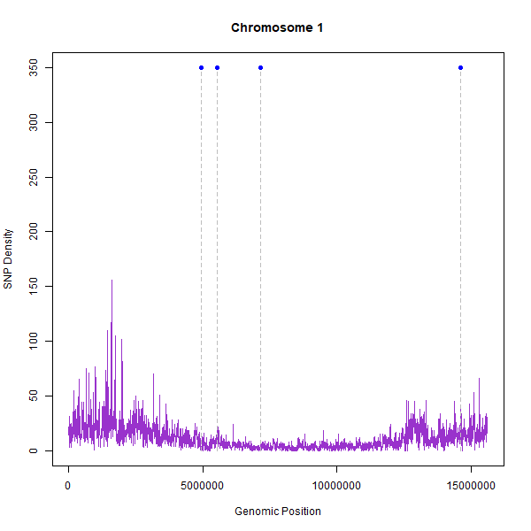
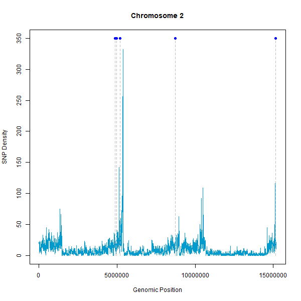
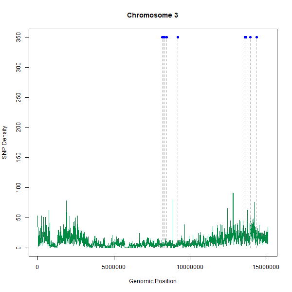
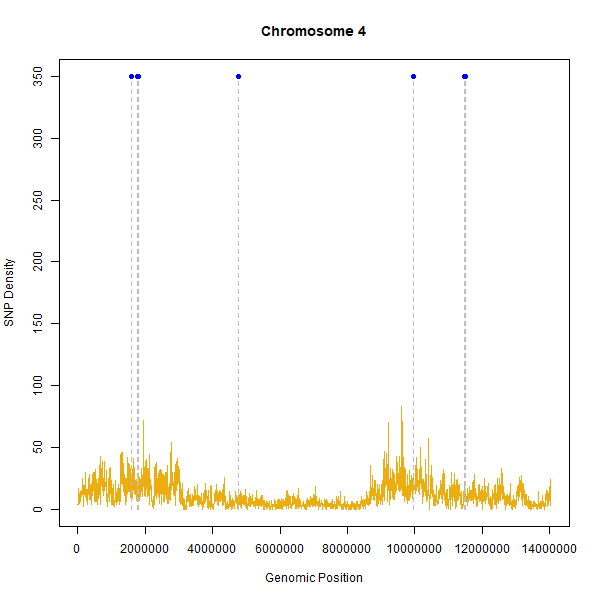
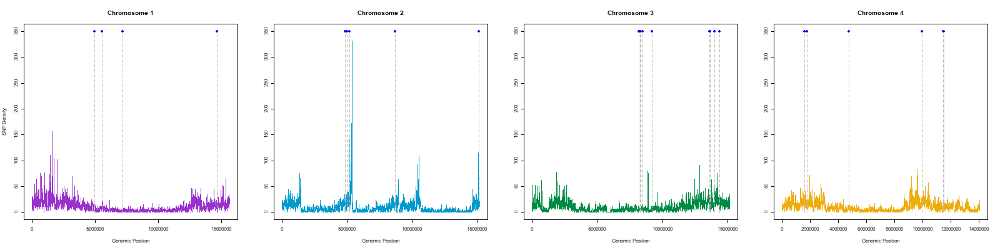

## All samples

```R
library(vcfR)
library(GenomicRanges)
library(VariantAnnotation)


######################################################################################


# How many SNPs per 100kb window for each chromosome?

# Set options to display numbers without scientific notation
options(scipen = 10)


# CHROM 1

## Read in vcf file
vcf_file_chr1  <-  "nuclear_samples3x_missing0.8.chr1.recode.vcf"
vcf_chr1 <- read.vcfR(vcf_file_chr1, verbose = FALSE)
# Extract SNP positions
snp_positions_chr1 <- getPOS(vcf_chr1)
# Define the window size
window_size <- 5000  # 100 kb
# Calculate the SNP density per 100 kb window
snp_density_chr1 <- tabulate(cut(snp_positions_chr1, breaks = seq(0, max(snp_positions_chr1), by = window_size)))
## seq(0, max(snp_positions), by = window_size): This creates a sequence of breakpoints for defining the windows. We start from 0 and increment by the window_size value. This sequence represents the start positions of each window.
## cut(snp_positions, breaks = seq(0, max(snp_positions), by = window_size)): The cut() function is used to bin the snp_positions into the defined windows. It assigns each position to the corresponding window based on its value. This creates a factor object with labels indicating the window to which each SNP position belongs.
## tabulate(): This function counts the occurrences of each factor level. In this case, it counts the number of SNP positions within each window.
## snp_density <-: Assigns the resulting counts to the variable snp_density, representing the SNP density per 100 kb window.


# Create the x-axis values for plotting
x_values_chr1 <- seq(0, max(snp_positions_chr1), by = window_size)[1:length(snp_density_chr1)] + window_size / 2
## seq(0, max(snp_positions), by = window_size): This creates a sequence of values representing the start positions of each window. The sequence starts from 0 and increments by the window_size value.
## [1:length(snp_density)]: This subset operation selects a subset of the sequence generated in the previous step. It ensures that the length of the subset matches the length of the snp_density vector.
## + window_size / 2: This adds half of the window_size value to each element in the subsetted sequence. This ensures that the x-values used for plotting represent the midpoint of each window rather than the start position.
## x_values <-: Assigns the resulting values to the variable x_values.
## By using the subset operation [1:length(snp_density)] on the sequence of window start positions, we ensure that the length of the subset matches the length of the snp_density vector. This ensures that the x-values align with the corresponding SNP density values for proper plotting.

# Define the MLR SNP positions
MLR_chr1 <- c(4935110,
              5521915,
              7142460,
              14630736) # NODE_12925, NODE_55751_B, NODE_42291, NODE_13063

# Plot the SNP density
png(file="C:/Users/rpow2134/OneDrive - The University of Sydney (Staff)/Documents/HW_WGS/R_analysis/vcf/snp_density/all_samples/snp_density_chr1.png", width=600, height=600)

plot(x_values_chr1, snp_density_chr1, type = "l", main = "Chromosome 1", xlab = "Genomic Position", ylab = "SNP Density", ylim = c(0, 350), col = "darkorchid")

# Add dotted lines from SNP positions of interest
for (i in seq_along(MLR_chr1)) {
  lines(c(MLR_chr1[i], MLR_chr1[i]), c(0, 350), col = "grey", lty = 2)
}

# Add points for the resistance SNPs
points(MLR_chr1, rep(350, length(MLR_chr1)), pch = 16, col = "blue", cex = 1)

dev.off()
#Comments from Jan: we can see that there are some peaks at the beginning and end. want to investigate these peaks further. Want to find out where they are (what region in the genome etc) and what's around it, and blast that region to see what genes come up. Do they have some importance? It's normal for SNPs to be in a U shape (more SNPs near the telomeres). Can put this plot into ggplot to make it look fancier.
```




```R
# CHROM 2

## Read in vcf file
vcf_file_chr2  <-  "nuclear_samples3x_missing0.8.chr2.recode.vcf"
vcf_chr2 <- read.vcfR(vcf_file_chr2, verbose = FALSE)
# Extract SNP positions
snp_positions_chr2 <- getPOS(vcf_chr2)
# Calculate the SNP density per 100 kb window
snp_density_chr2 <- tabulate(cut(snp_positions_chr2, breaks = seq(0, max(snp_positions_chr2), by = window_size)))
# Create the x-axis values for plotting
x_values_chr2 <- seq(0, max(snp_positions_chr2), by = window_size)[1:length(snp_density_chr2)] + window_size / 2

# Define the MLR SNP positions
MLR_chr2 <- c(4869624,
              4978210,
              5195103,
              8719077,
              15137317) # NODE_5667, NODE_29168, NODE_17333, NODE_39492, NODE_58864


# Plot the SNP density
png(file="C:/Users/rpow2134/OneDrive - The University of Sydney (Staff)/Documents/HW_WGS/R_analysis/vcf/snp_density/all_samples/snp_density_chr2.png", width=600, height=600)
plot(x_values_chr2, snp_density_chr2, type = "l", main = "Chromosome 2", xlab = "Genomic Position", ylab = "SNP Density", ylim = c(0, 350), col = "deepskyblue3")

# Add dotted lines from SNP positions of interest
for (i in seq_along(MLR_chr2)) {
  lines(c(MLR_chr2[i], MLR_chr2[i]), c(0, 350), col = "grey", lty = 2)
}

# Add points for the resistance SNPs
points(MLR_chr2, rep(350, length(MLR_chr2)), pch = 16, col = "blue", cex = 1)
dev.off()
```



```R
# CHROM 3

## Read in vcf file
vcf_file_chr3  <-  "nuclear_samples3x_missing0.8.chr3.recode.vcf"
vcf_chr3 <- read.vcfR(vcf_file_chr3, verbose = FALSE)
# Extract SNP positions
snp_positions_chr3 <- getPOS(vcf_chr3)
# Calculate the SNP density per 100 kb window
snp_density_chr3 <- tabulate(cut(snp_positions_chr3, breaks = seq(0, max(snp_positions_chr3), by = window_size)))
# Create the x-axis values for plotting
x_values_chr3 <- seq(0, max(snp_positions_chr3), by = window_size)[1:length(snp_density_chr3)] + window_size / 2

# Define the MLR SNP positions
MLR_chr3 <- c(8166538,
              8167140,
              8273382,
              8326593,
              8471903,
              9197509,
              13617703,
              13669081,
              13966406,
              14388742) # NODE_48992_B, NODE_48992_A, NODE_30575, NODE_15709_A, NODE_21554, NODE_27461, NODE_45689, NODE_20587, NODE_29455, NODE_58162_B


# Plot the SNP density
png(file="C:/Users/rpow2134/OneDrive - The University of Sydney (Staff)/Documents/HW_WGS/R_analysis/vcf/snp_density/all_samples/snp_density_chr3.png", width=600, height=600)
plot(x_values_chr3, snp_density_chr3, type = "l", main = "Chromosome 3", xlab = "Genomic Position", ylab = "SNP Density", ylim = c(0, 350), col = "springgreen4")

# Add dotted lines from SNP positions of interest
for (i in seq_along(MLR_chr3)) {
  lines(c(MLR_chr3[i], MLR_chr3[i]), c(0, 350), col = "grey", lty = 2)
}

# Add points for the resistance SNPs
points(MLR_chr3, rep(350, length(MLR_chr3)), pch = 16, col = "blue", cex = 1)
dev.off()
```



```R
# CHROM 4

## Read in vcf file
vcf_file_chr4  <-  "nuclear_samples3x_missing0.8.chr4.recode.vcf"
vcf_chr4 <- read.vcfR(vcf_file_chr4, verbose = FALSE)
# Extract SNP positions
snp_positions_chr4 <- getPOS(vcf_chr4)
# Calculate the SNP density per 100 kb window
snp_density_chr4 <- tabulate(cut(snp_positions_chr4, breaks = seq(0, max(snp_positions_chr4), by = window_size)))
# Create the x-axis values for plotting
x_values_chr4 <- seq(0, max(snp_positions_chr4), by = window_size)[1:length(snp_density_chr4)] + window_size / 2

# Define the MLR SNP positions
MLR_chr4 <- c(1580345,
              1776502,
              1785791,
              4760324,
              9971192,
              11479915,
              11498385) # NODE_5266, NODE_46063, NODE_42003, NODE_4553, NODE_51661, NODE_48750_B, NODE_48750_C


# Plot the SNP density
png(file="C:/Users/rpow2134/OneDrive - The University of Sydney (Staff)/Documents/HW_WGS/R_analysis/vcf/snp_density/all_samples/snp_density_chr4.png", width=600, height=600)
plot(x_values_chr4, snp_density_chr4, type = "l", main = "Chromosome 4", xlab = "Genomic Position", ylab = "SNP Density", ylim = c(0, 350), col = "darkgoldenrod2")

# Add dotted lines from SNP positions of interest
for (i in seq_along(MLR_chr4)) {
  lines(c(MLR_chr4[i], MLR_chr4[i]), c(0, 350), col = "grey", lty = 2)
}

# Add points for the resistance SNPs
points(MLR_chr4, rep(350, length(MLR_chr4)), pch = 16, col = "blue", cex = 1)
dev.off()


##########################################################################################
```




```R
# Combine all 4 plots

#Layout graphs

png(file="C:/Users/rpow2134/OneDrive - The University of Sydney (Staff)/Documents/HW_WGS/R_analysis/vcf/snp_density/all_samples/snp_density.png", width=1600, height=400)

par(mfrow = c(1, 4))

plot(x_values_chr1, snp_density_chr1, type = "l", main = "Chromosome 1", xlab = "Genomic Position", ylab = "SNP Density", ylim = c(0, 350), col = "darkorchid")
for (i in seq_along(MLR_chr1)) {
  lines(c(MLR_chr1[i], MLR_chr1[i]), c(0, 350), col = "grey", lty = 2)
}
points(MLR_chr1, rep(350, length(MLR_chr1)), pch = 16, col = "blue", cex = 1)

plot(x_values_chr2, snp_density_chr2, type = "l", main = "Chromosome 2", xlab = "Genomic Position", ylab = "", ylim = c(0, 350), col = "deepskyblue3")
for (i in seq_along(MLR_chr2)) {
  lines(c(MLR_chr2[i], MLR_chr2[i]), c(0, 350), col = "grey", lty = 2)
}
points(MLR_chr2, rep(350, length(MLR_chr2)), pch = 16, col = "blue", cex = 1)

plot(x_values_chr3, snp_density_chr3, type = "l", main = "Chromosome 3", xlab = "Genomic Position", ylab = "", ylim = c(0, 350), col = "springgreen4")
for (i in seq_along(MLR_chr3)) {
  lines(c(MLR_chr3[i], MLR_chr3[i]), c(0, 350), col = "grey", lty = 2)
}
points(MLR_chr3, rep(350, length(MLR_chr3)), pch = 16, col = "blue", cex = 1)

plot(x_values_chr4, snp_density_chr4, type = "l", main = "Chromosome 4", xlab = "Genomic Position", ylab = "", ylim = c(0, 350), col = "darkgoldenrod2")
for (i in seq_along(MLR_chr4)) {
  lines(c(MLR_chr4[i], MLR_chr4[i]), c(0, 350), col = "grey", lty = 2)
}
points(MLR_chr4, rep(350, length(MLR_chr4)), pch = 16, col = "blue", cex = 1)

dev.off()


#########################################################################################
```




```R
# Investigate peaks in the snp density plots

# CHROM 1

# Find the peak regions with the top 4 peak densities
top_peaks_indices_chr1 <- rev(order(snp_density_chr1))[1:10]  # Get indices of top 4 peaks (sorted in descending order)
top_peaks_regions_chr1 <- data.frame(
  Start = x_values_chr1[top_peaks_indices_chr1] - window_size / 2,
  End = x_values_chr1[top_peaks_indices_chr1] + window_size / 2,
  Height = snp_density_chr1[top_peaks_indices_chr1]
)

# Print the regions with the top 4 peaks
print(top_peaks_regions_chr1)


# CHROM 2

# Find the peak regions with the top 4 peak densities
top_peaks_indices_chr2 <- rev(order(snp_density_chr2))[1:10]  # Get indices of top 4 peaks (sorted in descending order)
top_peaks_regions_chr2 <- data.frame(
  Start = x_values_chr2[top_peaks_indices_chr2] - window_size / 2,
  End = x_values_chr2[top_peaks_indices_chr2] + window_size / 2,
  Height = snp_density_chr2[top_peaks_indices_chr2]
)

# Print the regions with the top 4 peaks
print(top_peaks_regions_chr2)


# CHROM 3

# Find the peak regions with the top 4 peak densities
top_peaks_indices_chr3 <- rev(order(snp_density_chr3))[1:10]  # Get indices of top 4 peaks (sorted in descending order)
top_peaks_regions_chr3 <- data.frame(
  Start = x_values_chr3[top_peaks_indices_chr3] - window_size / 2,
  End = x_values_chr3[top_peaks_indices_chr3] + window_size / 2,
  Height = snp_density_chr3[top_peaks_indices_chr3]
)

# Print the regions with the top 4 peaks
print(top_peaks_regions_chr3)


# CHROM 4

# Find the peak regions with the top 4 peak densities
top_peaks_indices_chr4 <- rev(order(snp_density_chr4))[1:10]  # Get indices of top 4 peaks (sorted in descending order)
top_peaks_regions_chr4 <- data.frame(
  Start = x_values_chr4[top_peaks_indices_chr4] - window_size / 2,
  End = x_values_chr4[top_peaks_indices_chr4] + window_size / 2,
  Height = snp_density_chr4[top_peaks_indices_chr4]
)

# Print the regions with the top 4 peaks
print(top_peaks_regions_chr4)

```