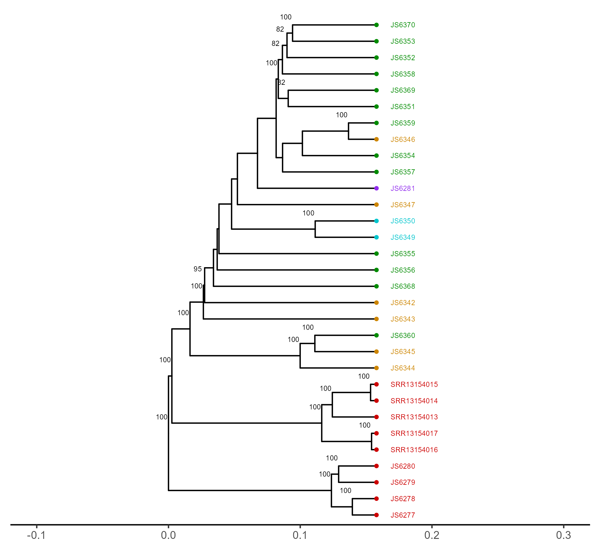

```R
library(tidyverse)
library(gdsfmt)
library(SNPRelate)
library(ggsci)
library(ggpubr)
library(reshape2)
library(viridis)
library(vcfR)
library(factoextra)
library(ggrepel)
library(ggtree)
library(poppr)
library(adegenet)
library(ape)

# Generate pairwise distances between samples that we will plot in a tree format
vcf_file  <-  "nuclear_samples3x_missing0.8.chr1to4.recode.vcf"
metadata_file <- "../location.csv"
vcf <- read.vcfR(vcf_file, verbose = FALSE)
metadata <- read.csv(metadata_file, header = TRUE)

vcf.gl <- vcfR2genlight(vcf)
pop(vcf.gl) <- metadata$city
ploidy(vcf.gl) <- 2
vcf.gl

vcf.gl@pop
vcf.gl@ind.names

vcf.pca <- glPca(vcf.gl, nf = 10)

vcf.pca

population_colors <- c("Brisbane" = "orange3", "Cairns" = "turquoise3",  "Lockhart River Cooktown" = "purple2", "Sydney" = "red3", "Townsville" = "green4")


tree_data <- aboot(vcf.gl, tree = "upgma", distance = bitwise.dist, sample = 100, showtree = F, cutoff = 50)

#--- make and plot the tree 
tree_plot <- ggtree(tree_data) + 
  geom_tiplab(size = 2, color = population_colors[pop(vcf.gl)], nudge_x = 0.01) + 
  geom_tippoint(color = population_colors[pop(vcf.gl)], shape = 19, size = 1) +
  xlim(-0.1, 0.3) + 
  geom_nodelab(size = 2, nudge_x = -0.006, nudge_y = 1) + 
  theme_tree2(legend.position = 'centre')


tree_plot
ggsave("tree.png")


# Calculate allele frequencies per country

myDiff_pops <- genetic_diff(vcf,pops = vcf.gl@pop)
AF_data <- myDiff_pops[,c(1:17)]
AF_data <- melt(AF_data)
colnames(AF_data) <- c("CHROM","POS","city","allele_frequency")
AF_data$city <- gsub("Hs_","", AF_data$city)

# extract the latitude and longitude for each country from the metadata file
coords <- data.frame(metadata$city, metadata$latitude, metadata$longitude)
coords <- unique(coords)
colnames(coords) <- c("city","latitude","longitude")

# join the allele frequency data and the latitude/longitude data together
AF_data_coords <- dplyr::left_join(AF_data, coords, by = "city")

# lets have a look at the new data.
head(AF_data_coords)

# Lets make a map, and plot the sampling locations on it. 
cols <- colorRampPalette(brewer.pal(8, "Set1"))(17)
par(fg = "black")
map("world", col = "grey85", fill = TRUE, border = FALSE)
map.axes()
points(metadata$longitude, metadata$latitude, cex = 1.5, pch = 20, col = cols[pop(vcf.gl)])
legend( x = "left", legend = unique(pop(vcf.gl)), col = cols[unique(pop(vcf.gl))], lwd = "1", lty = 0, 	pch = 20, box.lwd = 0, cex = 0.5)

cols <- colorRampPalette(brewer.pal(8, "Set1"))(17)
aus <- ozmap("states", border = "grey")
points(metadata$longitude, metadata$latitude, cex = 2, pch = 20, col = cols[pop(vcf.gl)])
legend( x = "right", legend = unique(pop(vcf.gl)), col = cols[unique(pop(vcf.gl))], lwd = "1", lty = 0, 	pch = 20, box.lwd = 0, cex = 0.5)


# We will make a new data frame, containing the SNP names and the loadings for the first two PCs

snp_loadings <- data.frame(vcf.gl@loc.names, vcf.pca$loadings[,1:2])

# sort the SNP loadings by the Axis 1 using the following:

head(snp_loadings[order(snp_loadings$Axis1, decreasing = T),])

# select a SNP of interest based on its position 
AF_SNP_coords <- AF_data_coords[AF_data_coords$POS == "2462738",]

# Remake your map, but this time, we’ll add a pie chart describing the population allele frequency per country. 
aus <- ozmap("states", border = "grey")
points(metadata$longitude, metadata$latitude, cex = 2, pch = 20, col = cols[pop(vcf.gl)])

for (i in 1:nrow(AF_SNP_coords)){ 
  add.pie(z = c(AF_SNP_coords$allele_frequency[i], 
                1-AF_SNP_coords$allele_frequency[i]), 
          x = AF_SNP_coords$longitude[i]+10, 
          y = AF_SNP_coords$latitude[i], 
          radius = 2, col = c(alpha("orange", 0.5), alpha("blue", 0.5)), labels = "") 
}


legend(title="City", x = "topleft", 
       legend = unique(pop(vcf.gl)), 
       col = cols[unique(pop(vcf.gl))], pch = 20, 
       box.lwd = 0, cex = 0.5)

legend(title="Allele frequency", x = "bottomleft", 
       legend = c("reference","variant"), 
       col = c(alpha("blue", 0.5), alpha("orange", 0.5)), pch = 15, box.lwd = 0, cex = 0.5)

```

