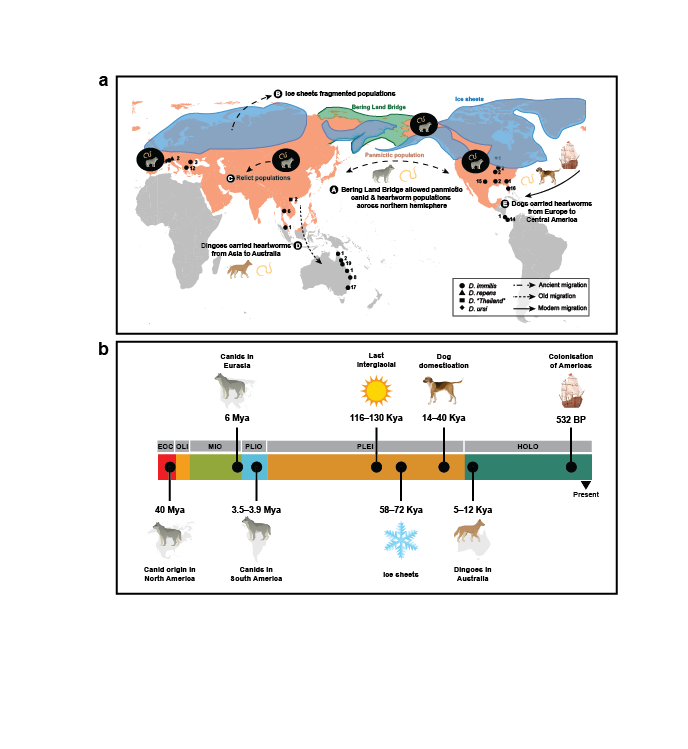

# heartworm_genome

This GitHub repository contains the code used for the manuscript "Population genomics reveals an ancient origin of the heartworm, *Dirofilaria immitis*, in canids".

A **preprint** of the manuscript is available at [bioRxiv](https://doi.org/10.1101/2024.12.26.630432). 

**Raw sequencing data** generated in this study is available at SRA NCBI BioProject PRJNA1104412.

**Abstract**

Heartworms (*Dirofilaria immitis*) are parasitic nematodes causing significant cardiopulmonary-associated morbidity and mortality in canids worldwide. The global spread of heartworms is believed to have occurred alongside the dispersal of domesticated dogs. To test this theory, we analysed the genomes of 127 specimens collected from mammalian carnivore hosts across four continents. Here we show distinct genetic differences between heartworms from different continents, indicating a more ancient dispersal in canid hosts than previously recognised. Using admixture analyses, we find an Asian origin for Australian heartworms, consistent with the arrival of dingoes thousands of years ago. Finally, the genetic relatedness between European and Central American heartworms suggest that modern dispersal, likely associated with human colonisation of the Americas by Europeans, occurred with domesticated dogs. This work sheds light on the population dynamics and deep evolutionary history of a globally widespread parasite of veterinary significance.

**Workbooks:**

* [Sampling](02_code/01_sampling_maps.md)
* [Genome mapping](02_code/02_mapping_workbook.md)
* [Coverage](02_code/03_coverage.md)
* [Variant calling](02_code/04_variant_calling_workbook.md)
* [Variant filtering](05_filtered/filter1_filtering.md)
* [SNP concordance](02_code/05_filtered/snp_concordance.md)
* [SNP density](02_code/05_filtered/snp_density.md)
* PCAs
    - [Nuclear](02_code/05_filtered/filter1_pca_nuc.md)
    - [Mitochondrial](02_code/05_filtered/filter1_pca_mito.md)
    - [*Wolbachia*](02_code/05_filtered/filter1_pca_wb.md)
* [Pixy (Pi, Dxy, Fst)](02_code/05_filtered/pixy.md)
* [SMC++](02_code/05_filtered/smcpp_v2.md)
* [Linkage disequilibrium](02_code/05_filtered/LD.md)
* [NGSadmix](02_code/05_filtered/NGSadmix.md)
* [Treemix](02_code/05_filtered/treemix.md)
* [D-statistics](02_code/05_filtered/admixtools.md)

**Other** analyses not included in the manuscript:
* Alternative variant filtering parameters
    - [Filter2(more stringent)](02_code/05_filtered_2/batch4_filter2.md)
    - [Filter3 (less stringent)](02_code/05_filtered_3/batch4_filter3.md)
* [Mitochondrial genome assembly](02_code/get_organelle.md)
* MEGA (alignments, variable sites)
* IQ-TREE
* [BEAST2](02_code/BEAST2_v2.md)
* PopART
* SplitsTree

**Results** can be found [here](03_results).

This work is licensed under <a href="https://creativecommons.org/licenses/by/4.0/">Creative Commons Attribution 4.0 International</a>
