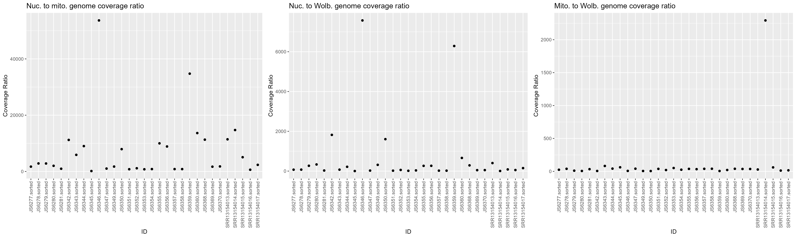
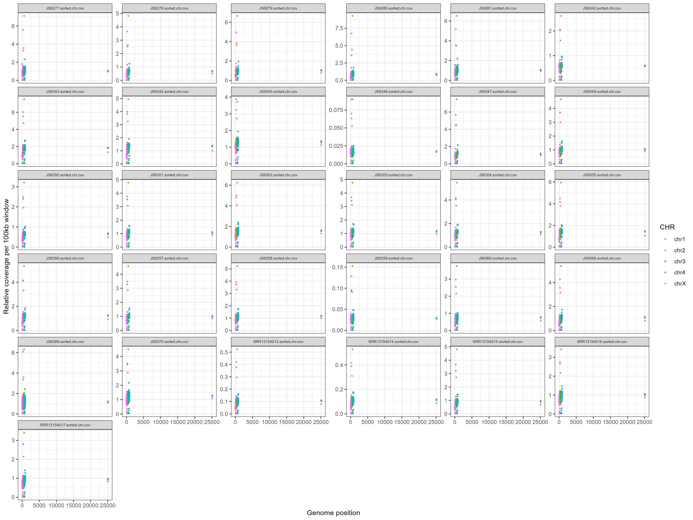
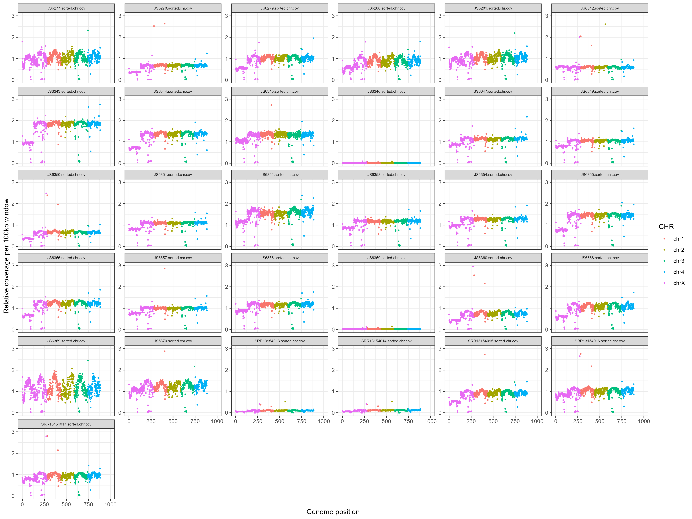
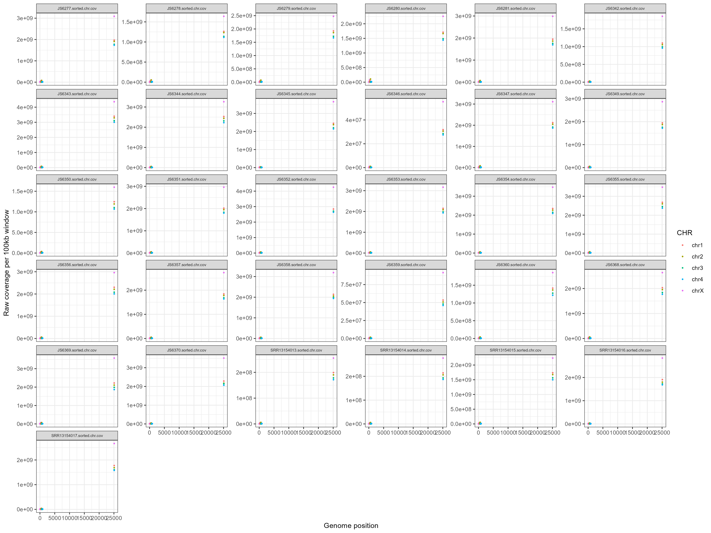
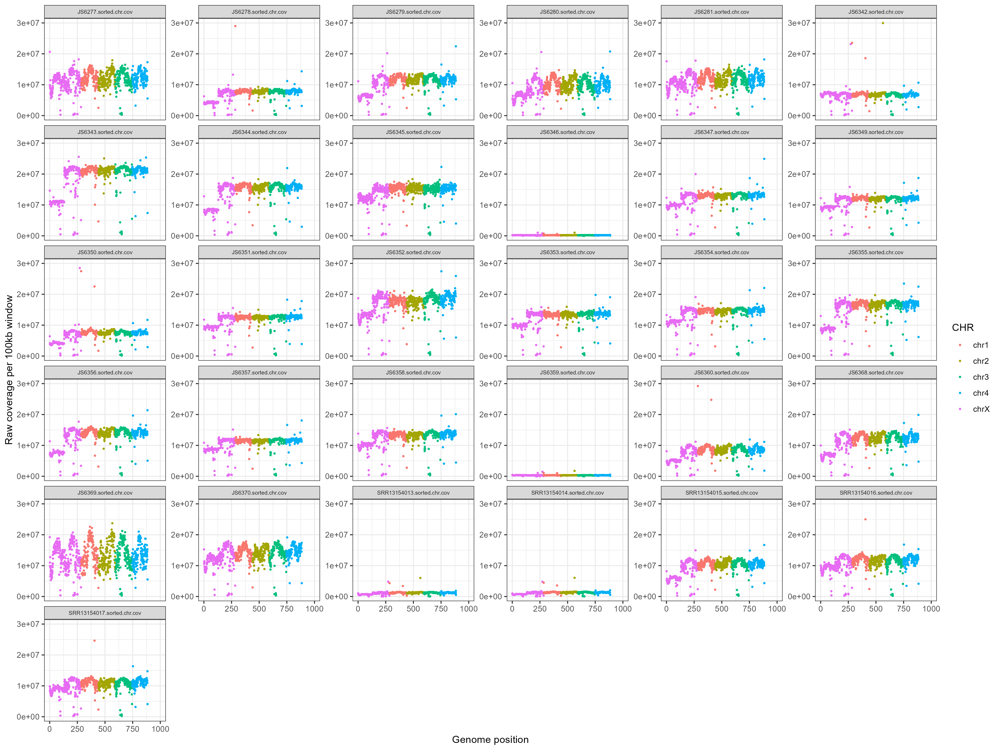
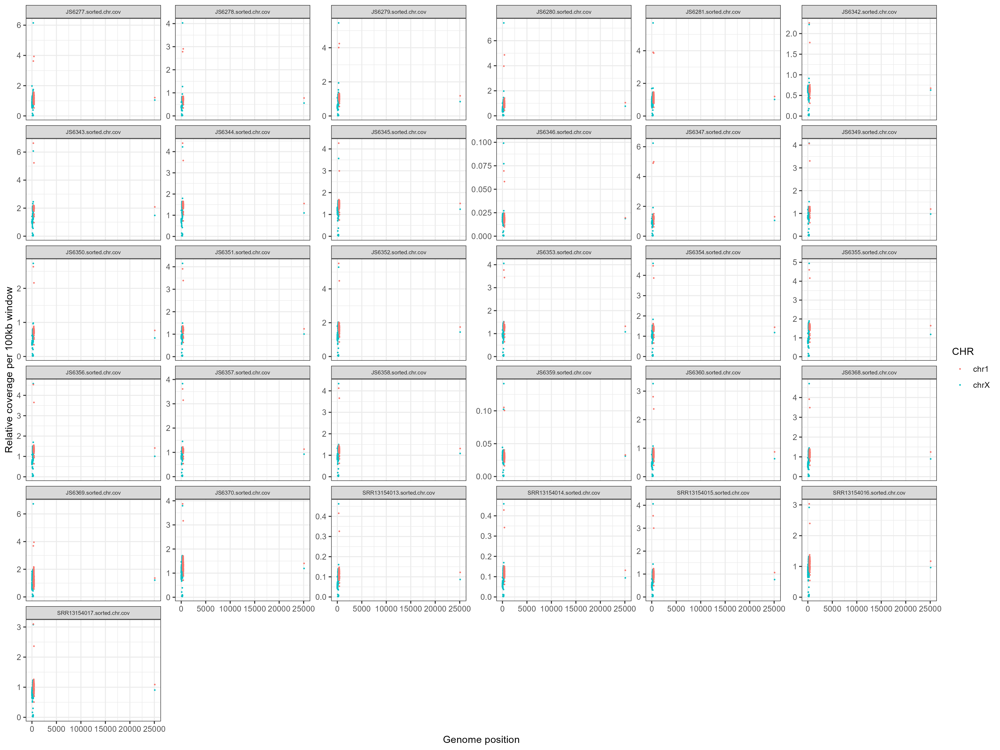
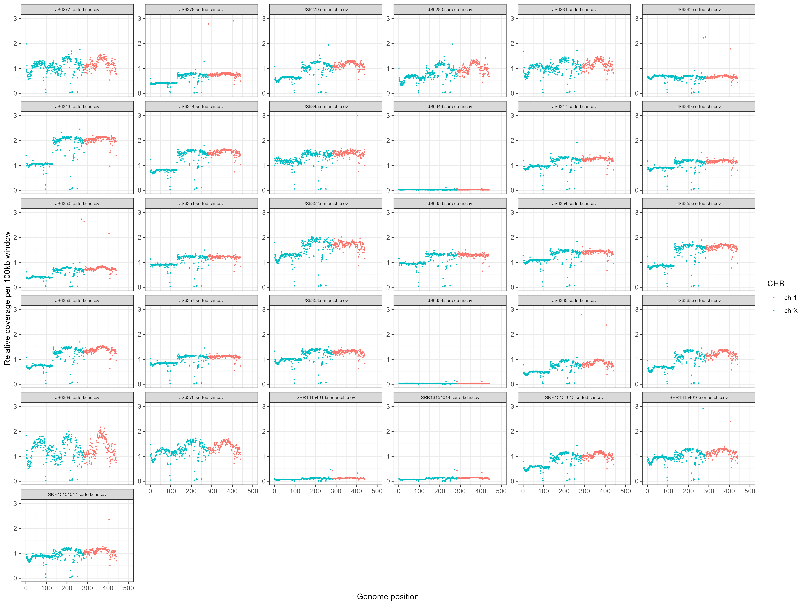
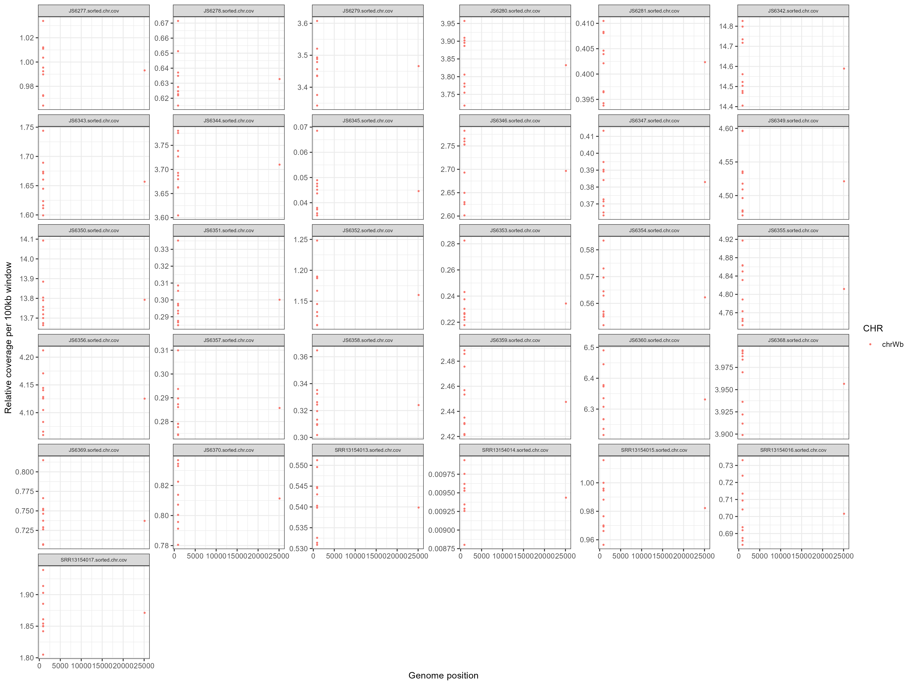
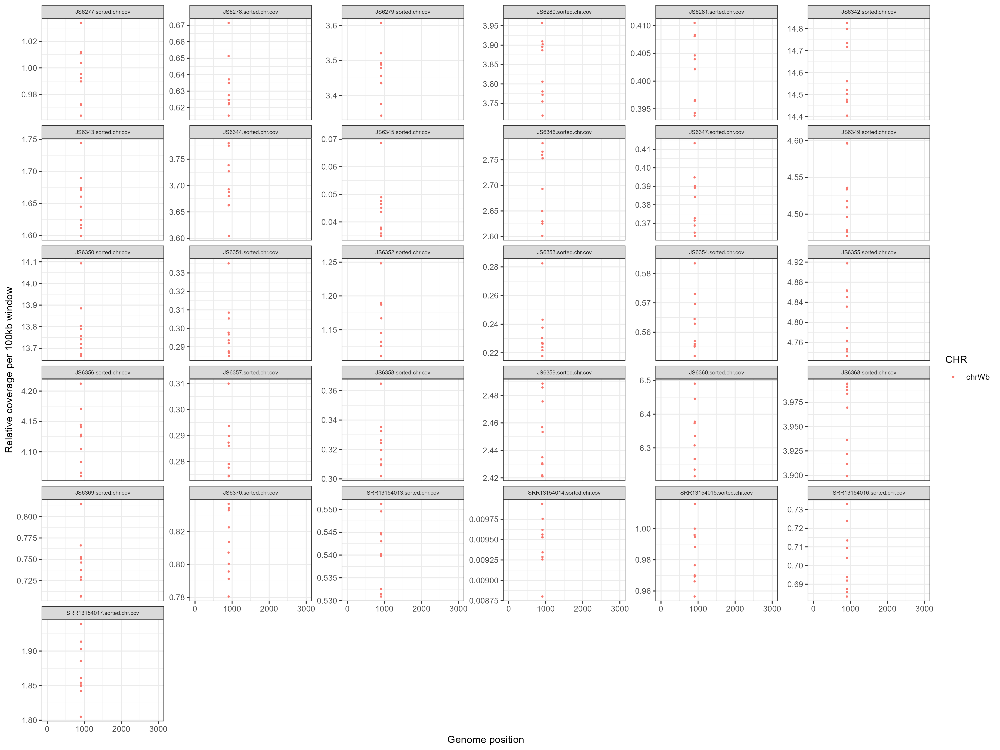

# Dirofilaria immitis WGS Lab Book - Coverage

### Rose Power USYD 2023

## Coverage on original sorted bam files (D. immitis, Wolbachia and dog)
Adopted the code from Javier's paper.

```bash
#!/bin/bash

# PBS directives 
#PBS -P RDS-FSC-Heartworm_MLR-RW
#PBS -N coverage_di_wol_dog
#PBS -l select=3:ncpus=1:mem=50GB
#PBS -l walltime=24:00:00
#PBS -m abe
#PBS -q defaultQ
#PBS -o coverage_di_wol_dog.txt
#PBS -M rosemonde.power@sydney.edu.au

# qsub ../coverage_di_wol_dog.pbs

WORKING_DIR=/scratch/RDS-FSC-Heartworm_MLR-RW/mapping/coverage_di_wol_dog
cd ${WORKING_DIR}

WINDOW='100000'

module load bamtools/2.5.1
module load bedtools/2.29.2
module load samtools/1.9

for i in /scratch/RDS-FSC-Heartworm_MLR-RW/mapping/*sorted.bam; do

bamtools header -in ${i} | grep "^@SQ" | awk -F'[:\t]' '{printf $3"\t"1"\t"$5"\n"}' OFS="\t" > ${i%.bam}.chr.bed
bamtools header -in ${i} | grep "^@SQ" | awk -F'[:\t]' '{printf $3"\t"$5"\n"}' OFS="\t" > ${i%.bam}.chr.genome

bedtools makewindows -g ${i%.bam}.chr.genome -w ${WINDOW} > ${i%.bam}.${WINDOW}_window.bed

samtools bedcov -Q 20 ${i%.bam}.chr.bed ${i} | awk -F'\t' '{printf $1"\t"$2"\t"$3"\t"$4"\t"$4/($3-$2)"\n"}' OFS="\t" > ${i%.bam}.chr.cov
samtools bedcov -Q 20 ${i%.bam}.${WINDOW}_window.bed ${i} | awk -F'\t' '{printf $1"\t"$2"\t"$3"\t"$4"\t"$4/($3-$2)"\n"}' OFS="\t" > ${i%.bam}.${WINDOW}_window.cov

rm ${i%.bam}.chr.bed ${i%.bam}.${WINDOW}_window.bed ${i%.bam}.chr.genome;

done

for i in *.chr.cov; do 

printf "${i}\n" > ${i}.tmp | awk '{print $5}' OFS="\t" ${i} >> ${i}.tmp;

done

paste *.tmp > coverage_stats.summary
rm *.tmp

mkdir COV_STATS
mv *.chr.cov *_window.cov *.cov coverage_stats.summary /COV_STATS/
cd COV_STATS
```
Some errors popped up towards the end (because it was in the wrong directory). The .cov files seemed to generate so I did the last few lines of code in the command line afterwards.


### Generate quantitative stats on coverage for supplementary tables etc
Extract mtDNA, Wb and nuclear (mean & stddev) data

For nuclear, we will select only the defined Chr (chrX and chr1 to chr4)

```bash
#!/bin/bash

# PBS directives 
#PBS -P RDS-FSC-Heartworm_MLR-RW
#PBS -N mtDNA_nuclear
#PBS -l select=1:ncpus=1:mem=4GB
#PBS -l walltime=00:10:00
#PBS -m e
#PBS -q defaultQ
#PBS -o mtDNA_nuclear.txt

# qsub ../mtDNA_nuclear.pbs

cd /project/RDS-FSC-Heartworm_MLR-RW/HW_WGS_ALL/batch1/analysis/mapping/coverage_di_wol_dog/COV_STATS
# Load modules
module load datamash/1.7

# extract mtDNA and nuclear (mean & stddev) data
for i in *.chr.cov; do
	name=${i%.sorted.chr.cov};
	nuc=$(grep -v "scaffold\|Wb\|Mt\|CM025\|JAA" ${i%.sorted.chr.cov}.sorted.100000_window.cov | datamash mean 5 sstdev 5 );
	mtDNA=$(grep "chrMtDNA" ${i} | cut -f5 );
	Wb=$(grep 'chrWb' ${i} | cut -f5 ); 
	echo -e "${name}\t${nuc}\t${mtDNA}\t${Wb}";
done > 'mito_wolb_cov.stats'
```
Transferred all the relevant files into the R_analysis folder on my computer for further analysis in R. Now we'll generate some plots and stats.


### Coverage in R

```R
# HW WGS Coverage

# load libraries
library(tidyverse)
library(ggpubr)
library(ggsci)
library(stringr)

setwd("C:/Users/rpow2134/OneDrive - The University of Sydney (Staff)/Documents/HW_WGS/R_analysis")

#first, I have to read the nuclear cov stat and estimate the mean and sd
#then, to add it to 'mito_wolb_cov.stats

nuc_mito_wb_cov <- read.table('mito_wolb_cov.stats', header = F) %>% as_tibble()

colnames(nuc_mito_wb_cov) <- c('ID', 'nuc_cov', 'sd_nuc_cov', 'mito_cov', 'wb_cov')
nuc_mito_wb_cov$ID <- str_replace(nuc_mito_wb_cov$ID, '.merged', '')

write_csv(nuc_mito_wb_cov, 'nuc_mit_wb_cov.csv')

# nuclear, mitochondrial and Wb DNA coverage ratio

n_m <- ggplot(nuc_mito_wb_cov, aes(x=ID, y=mito_cov/nuc_cov)) +
  geom_point() +
  theme(axis.text.x = element_text(angle = 90, vjust = 0.5, hjust=1)) +
  labs(title = "Nuc. to mito. genome coverage ratio", y = "Coverage Ratio")
n_m

n_wb <- ggplot(nuc_mito_wb_cov, aes(x=ID, y=wb_cov/nuc_cov)) +
  geom_point() +
  theme(axis.text.x = element_text(angle = 90, vjust = 0.5, hjust=1)) +
  labs(title = "Nuc. to Wolb. genome coverage ratio", y = "Coverage Ratio")
n_wb

m_wb <- ggplot(nuc_mito_wb_cov, aes(x=ID, y=mito_cov/wb_cov)) +
  geom_point() +
  theme(axis.text.x = element_text(angle = 90, vjust = 0.5, hjust=1)) +
  labs(title = "Mito. to Wolb. genome coverage ratio", y = "Coverage Ratio")
m_wb

ggarrange(n_m, n_wb, m_wb, ncol = 3)
ggsave("cov_ratios.png", height=6, width=20)
```


```R
# list file names
file_names.window <- list.files(path = "C:/Users/rpow2134/OneDrive - The University of Sydney (Staff)/Documents/HW_WGS/R_analysis",pattern = ".merged.100000_window.cov")

# load data using file names, and make a formatted data frame
setwd("C:/Users/rpow2134/OneDrive - The University of Sydney (Staff)/Documents/HW_WGS/R_analysis")

data <- purrr::map_df(file_names.window, function(x) {
  data <- read.delim(x, header = F, sep="\t")
  data$V1 <- str_replace(data$V1, 'dirofilaria_immitis_', '')
  data <- tibble::rowid_to_column(data, "NUM")
  cbind(sample_name = gsub(".merged.100000_window.cov","",x), data)
})
colnames(data) <- c("ID", "NUM", "CHR", "START", "END", 
                    "RAW_COVERAGE", "PROPORTION_COVERAGE")
```

D. immitis coverage:

```R
# remove scaffolds, mitochondrial and wolbachia genome
data_nuc <- dplyr::filter(data, !grepl("scaffold|MtDNA|Wb|JAAUVH|CM025",CHR))
# Also remove chromosomes called JAAUVH010000344 and CM025130.1 etc. - they are part of the dog genome. Removing them here is totally fine.

# data$SEX <- str_detect(data$SCAF,"Trichuris_trichiura_1_")


# plot the general cov for each sample
ggplot(data_nuc, aes(NUM, PROPORTION_COVERAGE/(median(PROPORTION_COVERAGE)), group = ID, col = CHR)) +
  geom_point(size=0.5) +
  labs( x = "Genome position" , y = "Relative coverage per 100kb window") +
  theme_bw() + theme(strip.text.x = element_text(size = 6)) +
  facet_wrap(~ID, scales = "free_y")

ggsave("ALL_genomewide_coverage_allsamples.png", height=11.25, width=15)
```


```R
# Let's set some x and y limits to see the data a bit better.
ggplot(data_nuc, aes(NUM, PROPORTION_COVERAGE/(median(PROPORTION_COVERAGE)), group = ID, col = CHR)) +
  geom_point(size=0.5) +
  labs( x = "Genome position" , y = "Relative coverage per 100kb window") +
  theme_bw() + theme(strip.text.x = element_text(size = 6)) +
  facet_wrap(~ID, scales = "free_y") +
  xlim(0,1000) +
  ylim(0,3)

ggsave("ALL_genomewide_coverage_allsamples_v2.png", height=11.25, width=15)
```


```R
# this shows the proportion of coverage relative to the median coverage of all samples. Let's also just look at the raw coverage by itself (not in relation to anything else).
ggplot(data_nuc, aes(NUM, RAW_COVERAGE, group = ID, col = CHR)) +
  geom_point(size=0.5) +
  labs( x = "Genome position" , y = "Raw coverage per 100kb window") +
  theme_bw() + theme(strip.text.x = element_text(size = 6)) +
  facet_wrap(~ID, scales = "free_y")

ggsave("ALL_genomewide_rawcoverage_allsamples.png", height=11.25, width=15)
```


```R
# Let's set some x and y limits to see the data a bit better.
ggplot(data_nuc, aes(NUM, RAW_COVERAGE, group = ID, col = CHR)) +
  geom_point(size=0.5) +
  labs( x = "Genome position" , y = "Raw coverage per 100kb window") +
  theme_bw() + theme(strip.text.x = element_text(size = 6)) +
  facet_wrap(~ID, scales = "free_y") +
  xlim(0,5000) +
  ylim(0,30000000)

ggsave("ALL_genomewide_rawcoverage_allsamples_v2.png", height=11.25, width=15)
```


Naming system of Daisy's samples:
- SRR13154013 = JS5877 # sequenced at 1G
- SRR13154014	= JS5876 # sequenced at 1G
- SRR13154015	= JS5875
- SRR13154016	= JS5874
- SRR13154017	= JS5873

SRR13154013 and SRR13154014 were sequenced at only 1G which explains the low coverage. The other samples were sampled at 10G so their coverage is comparable to my samples.


```R
# Let's see only the chrX to explore the sex of the sample
#Plotting with the chr1 helps to see differences
data_nuc %>%
  filter(., grepl("chrX|chr1",CHR)) %>%
  ggplot(aes(NUM, PROPORTION_COVERAGE/(median(PROPORTION_COVERAGE)), group = ID, col = CHR)) +
  geom_point(size=0.2) +
  labs( x = "Genome position" , y = "Relative coverage per 100kb window") +
  theme_bw() + theme(strip.text.x = element_text(size = 6)) +
  facet_wrap(~ID, scales = "free_y")

ggsave("chrXtochr1_genomewide_coverage_allsamples.png", height=11.25, width=15)
```


```R
# Restrict the x and y axes to see the plotting better. There seems to be some outliers to the far right - it's ok to remove those since we just want to focus on sex.
data_nuc %>%
  filter(., grepl("chrX|chr1",CHR)) %>%
  ggplot(aes(NUM, PROPORTION_COVERAGE/(median(PROPORTION_COVERAGE)), group = ID, col = CHR)) +
  geom_point(size=0.2) +
  labs( x = "Genome position" , y = "Relative coverage per 100kb window") +
  theme_bw() + theme(strip.text.x = element_text(size = 6)) +
  facet_wrap(~ID, scales = "free_y") +
  xlim(0,500) +
  ylim(0,3)
ggsave("chrXtochr1_genomewide_coverage_allsamples_v2.png", height=11.25, width=15)
 # There are some samples which look a bit strange. The relative coverage per 100kb window should be ~1. Check if these samples had poor data from the beginning, which could explain the poor coverage.
```



Wolbachia coverage:

```R
###### Wolbachia coverage

# remove D. immitis and dog genome
data_wb <- dplyr::filter(data, !grepl("scaffold|MtDNA|chrX|chr1|chr2|chr3|chr4|JAAUVH|CM025",CHR))

# plot cov for each sample
ggplot(data_wb, aes(NUM, PROPORTION_COVERAGE/(median(PROPORTION_COVERAGE)), group = ID, col = CHR)) +
  geom_point(size=0.5) +
  labs( x = "Genome position" , y = "Relative coverage per 100kb window") +
  theme_bw() + theme(strip.text.x = element_text(size = 6)) +
  facet_wrap(~ID, scales = "free_y")

ggsave("wb_coverage_allsamples.png", height=11.25, width=15)
```


```R
# Let's set some x and y limits to see the data a bit better.
ggplot(data_wb, aes(NUM, PROPORTION_COVERAGE/(median(PROPORTION_COVERAGE)), group = ID, col = CHR)) +
  geom_point(size=0.5) +
  labs( x = "Genome position" , y = "Relative coverage per 100kb window") +
  theme_bw() + theme(strip.text.x = element_text(size = 6)) +
  facet_wrap(~ID, scales = "free_y") +
  xlim(0,3000)

ggsave("wb_coverage_allsamples_v2.png", height=11.25, width=15)
```



Dog coverage:

```R
######## Dog coverage
# remove D. immitis and Wolbachia
data_dog <- dplyr::filter(data, !grepl("scaffold|MtDNA|Wb|chrX|chr1|chr2|chr3|chr4",CHR))

# plot cov for each sample
ggplot(data_dog, aes(NUM, PROPORTION_COVERAGE/(median(PROPORTION_COVERAGE)), group = ID, col = CHR)) +
  geom_point(size=0.5) +
  labs( x = "Genome position" , y = "Relative coverage per 100kb window") +
  theme_bw() + theme(strip.text.x = element_text(size = 6)) +
  facet_wrap(~ID, scales = "free_y")

ggsave("dog_coverage_allsamples.png", height=11.25, width=15)

# Let's set some x and y limits to see the data a bit better.
ggplot(data_dog, aes(NUM, PROPORTION_COVERAGE/(median(PROPORTION_COVERAGE)), group = ID, col = CHR)) +
  geom_point(size=0.5) +
  labs( x = "Genome position" , y = "Relative coverage per 100kb window") +
  theme_bw() + theme(strip.text.x = element_text(size = 6)) +
  facet_wrap(~ID, scales = "free_y") +
  xlim(0,3000)

ggsave("dog_coverage_allsamples_v2.png", height=11.25, width=15)
```

Too many JAAU etc chromosomes, it couldn't generate a plot.