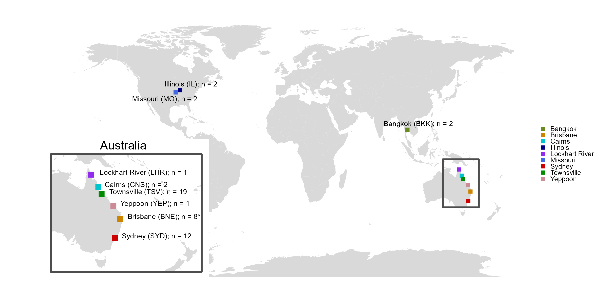
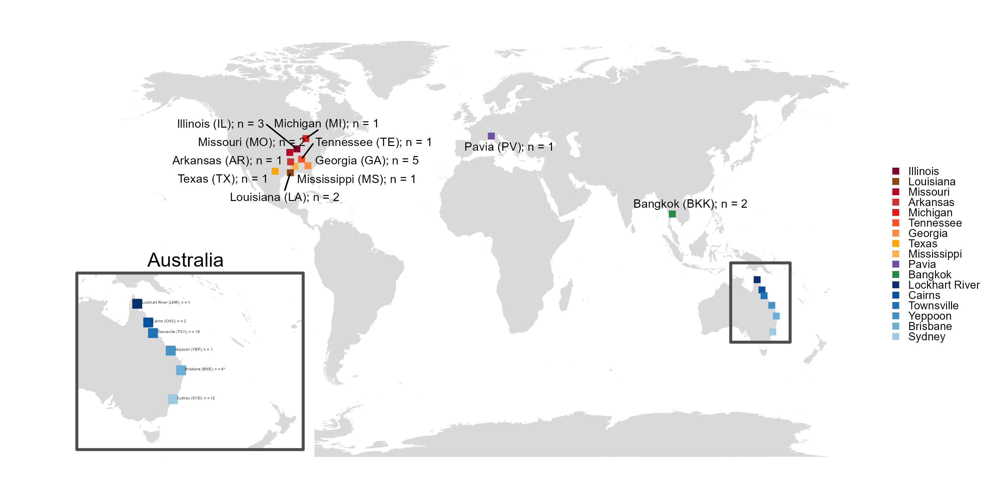

# Dirofilaria immitis WGS Lab Book - Sample map

### Rose Power USYD 2023

## World map of samples I currently have

```R
# Map samples

## Load packages
library(ggplot2)
library(dplyr)
library(purrr)
library(stats)
library(graphics)
library(grDevices)
library(utils)
library(datasets)
library(methods)
library(base)
require(maps)
library(mapdata)
library(tidyverse)
library(readxl)
library(ozmaps) 
library(grid)
library(RColorBrewer)
library(gridExtra)
library(ggrepel)

# Set working directory
setwd("C:/Users/rpow2134/OneDrive - The University of Sydney (Staff)/Documents/HW_WGS/R_analysis/map")

#-- metadata that describes information about the samples, such as country of origin, and GPS coordinates
location_file <- "location_summary_world.csv"

# Read the actual data into R
location <- read.csv(location_file, header = TRUE)

## Make world map data
world_map <- map_data("world")

# Set colors for the points
scale_colour_pop <- c("Brisbane" = "orange3", "Cairns" = "turquoise3", "Lockhart River" = "purple2", "Sydney" = "red3", "Townsville" = "green4", "Yeppoon" = "lightpink3", "Bangkok" = "olivedrab4", "Illinois" = "navy", "Missouri" = "royalblue" )

# Create a ggplot for the world map
world_plot <- ggplot() +
  geom_polygon(data = world_map, aes(x = long, y = lat, group = group), fill = "grey85") +
  geom_point(data = location, aes(x = longitude, y = latitude, color = city), size = 2, shape = 15) +
  geom_text_repel(data = location, aes(x = longitude, y = latitude, label = label), size = 3) +  # Add labels
  scale_color_manual(values = scale_colour_pop) +
  theme_void() +
  guides(color = guide_legend(keywidth = unit(0.5, "lines"), keyheight = unit(0.5, "lines"))) +  # Adjust spacing between legend item
  theme(
    legend.position = "right",  # Move the legend to the right
    legend.direction = "vertical",  # Vertical layout for the legend
    legend.title = element_blank(),  # Remove the legend title
    legend.text = element_text(size = 8),  # Decrease the font size of the legend text
    legend.background = element_rect(color = NA, fill = "white"),  # Add a box around the legend
    legend.box.spacing = unit(0.2, "lines"),  # Adjust the spacing around the legend box
    plot.margin = unit(c(1, 1, 1, 4), "lines")  # Adjust the spacing around the plot (top, right, bottom, left)
  )

# Display the world plot
print(world_plot)

# Add map inset to zoom in on Australian samples
# Manually specify the coordinates for the area of the world map to show in the inset
inset_xmin <- 130
inset_xmax <- 180
inset_ymin <- -45
inset_ymax <- -6

# Filter the world map data for the inset area
inset_data <- subset(world_map, long >= inset_xmin & long <= inset_xmax & lat >= inset_ymin & lat <= inset_ymax)

# Aus location data
location_aus <- read.csv("location_summary_aus.csv", header = TRUE)


# Create a ggplot for the inset
inset_plot <- ggplot() +
  geom_polygon(data = inset_data, aes(x = long, y = lat, group = group), fill = "grey85") +
  geom_point(data = location_aus, aes(x = longitude, y = latitude, color = city), size = 3, shape = 15) +
  geom_text(data = location_aus, aes(x = longitude, y = latitude, label = label), size = 3, vjust = 0, hjust = -0.1) +  # Add labels
  scale_color_manual(values = scale_colour_pop) +
  geom_rect(
    aes(xmin = inset_xmin, xmax = inset_xmax, ymin = inset_ymin, ymax = inset_ymax),
    color = "grey30", fill = NA, linewidth = 1  # Add a grey border around the inset
  ) +
  coord_fixed(ratio=1) +
  theme_void() +
  guides(color = "none") +
  theme(
    panel.background = element_rect(fill = "white", color = NA),
    plot.margin = unit(c(-0, -0, -0, -0), "lines")
  )

# Add title "Australia" above the inset_plot
inset_plot <- inset_plot +
  annotate("text",
           x = mean(inset_data$long),   # Adjust x-coordinate of the title
           y = max(inset_data$lat) + 3,     # Adjust y-coordinate of the title
           label = "Australia",
           size = 5)

print(inset_plot)

# Recreate the world map with a square indicating where the inset is from
world_plot <- ggplot() +
  geom_polygon(data = world_map, aes(x = long, y = lat, group = group), fill = "grey85") +
  geom_point(data = location, aes(x = longitude, y = latitude, color = city), size = 2, shape = 15) +
  geom_text_repel(data = location, aes(x = longitude, y = latitude, label = label), size = 3) +  # Add labels
  scale_color_manual(values = scale_colour_pop) +
  geom_rect(
    aes(xmin = inset_xmin, xmax = 160, ymin = -38, ymax = inset_ymax),
    color = "grey30", fill = NA, size = 1) +  # Add a rectangle around the area of the inset
  theme_void() +
  guides(color = guide_legend(keywidth = unit(0.5, "lines"), keyheight = unit(0.5, "lines"))) +  # Adjust spacing between legend item
  theme(
    legend.position = "right",  # Move the legend to the right
    legend.direction = "vertical",  # Vertical layout for the legend
    legend.title = element_blank(),  # Remove the legend title
    legend.text = element_text(size = 8),  # Decrease the font size of the legend text
    legend.background = element_rect(color = NA, fill = "white"),  # Add a box around the legend
    legend.box.spacing = unit(0.2, "lines"),  # Adjust the spacing around the legend box
    plot.margin = unit(c(1, 1, 1, 4), "lines")  # Adjust the spacing around the plot (top, right, bottom, left)
  )

# Display the world plot
print(world_plot)


# Create a combined plot using annotation_custom()
combined_plot <- world_plot +
  annotation_custom(
    ggplotGrob(inset_plot),
    xmin = min(world_map$long) + (max(world_map$long) - min(world_map$long)) * -0.3,  # Adjust the x-coordinate of the inset
    xmax = min(world_map$long) + (max(world_map$long) - min(world_map$long)) * 0.55,  # Adjust the width of the inset
    ymin = min(world_map$lat) + (max(world_map$lat) - min(world_map$lat)) * 0,    # Adjust the y-coordinate of the inset
    ymax = min(world_map$lat) + (max(world_map$lat) - min(world_map$lat)) * 0.55     # Adjust the height of the inset
  )

# Display the combined plot
print(combined_plot)

# Save plot
ggsave("map.png", height=5, width=10)
```


## World map of samples I may have in the future

```R
# Predict the map for when I also have Steve & Javier's sample


#-- metadata that describes information about the samples, such as country of origin, and GPS coordinates
location_file <- "location_summary_world2.csv"

# Read the actual data into R
location <- read.csv(location_file, header = TRUE)

## Make world map data
world_map <- map_data("world")

# Set colors for the points
red_palette <- brewer.pal(n = 9, name = "YlOrRd")
blue_palette <- brewer.pal(n = 9, name = "Blues")
green_palette <- brewer.pal(n = 9, name = "Greens")
purple_palette <- brewer.pal(n = 9, name = "Purples")


scale_colour_aus <- c("Lockhart River" = blue_palette[9], "Cairns" = blue_palette[8], "Townsville" = blue_palette[7], "Yeppoon" = blue_palette[6], "Brisbane" = blue_palette[5], "Sydney" = blue_palette[4])

scale_colour_usa <- c("Illinois" = red_palette[9], "Missouri" = red_palette[8], "Michigan" = red_palette[7], "Tennessee" = red_palette[6], "Georgia" = red_palette[5], "Mississippi" = red_palette[4], "Louisiana" = "chocolate4", "Texas" = "orange", "Arkansas" = "brown3")

scale_colour_asia <- c("Bangkok" = green_palette[7])

scale_colour_eur <- c("Pavia" = purple_palette[7])

scale_colour_pop <- c(scale_colour_aus, scale_colour_usa, scale_colour_asia, scale_colour_eur)

# Create a ggplot for the world map
world_plot <- ggplot() +
  geom_polygon(data = world_map, aes(x = long, y = lat, group = group), fill = "grey85") +
  geom_point(data = location, aes(x = longitude, y = latitude, color = city), size = 2, shape = 15) +
  geom_text_repel(data = location, aes(x = longitude, y = latitude, label = label), size = 3, max.overlaps = 20) +  # Add labels
  scale_color_manual(values = scale_colour_pop, limits = c("Illinois", "Louisiana", "Missouri", "Arkansas", "Michigan", "Tennessee", "Georgia", "Texas", "Mississippi", "Pavia", "Bangkok", "Lockhart River", "Cairns", "Townsville", "Yeppoon", "Brisbane", "Sydney")) +
  theme_void() +
  guides(color = guide_legend(keywidth = unit(0.5, "lines"), keyheight = unit(0.5, "lines"))) +  # Adjust spacing between legend item
  theme(
    legend.position = "right",  # Move the legend to the right
    legend.direction = "vertical",  # Vertical layout for the legend
    legend.title = element_blank(),  # Remove the legend title
    legend.text = element_text(size = 8),  # Decrease the font size of the legend text
    legend.background = element_rect(color = NA, fill = "white"),  # Add a box around the legend
    legend.box.spacing = unit(0.2, "lines"),  # Adjust the spacing around the legend box
    plot.margin = unit(c(1, 1, 1, 4), "lines")  # Adjust the spacing around the plot (top, right, bottom, left)
  )

# Display the world plot
print(world_plot)

# Add map inset to zoom in on Australian samples
# Manually specify the coordinates for the area of the world map to show in the inset
inset_xmin <- 130
inset_xmax <- 180
inset_ymin <- -45
inset_ymax <- -6

# Filter the world map data for the inset area
inset_data <- subset(world_map, long >= inset_xmin & long <= inset_xmax & lat >= inset_ymin & lat <= inset_ymax)

# Aus location data
location_aus <- read.csv("location_summary_aus.csv", header = TRUE)


# Create a ggplot for the inset
inset_plot <- ggplot() +
  geom_polygon(data = inset_data, aes(x = long, y = lat, group = group), fill = "grey85") +
  geom_point(data = location_aus, aes(x = longitude, y = latitude, color = city), size = 3, shape = 15) +
  geom_text(data = location_aus, aes(x = longitude, y = latitude, label = label), size = 1, vjust = 0, hjust = -0.1) +  # Add labels
  scale_color_manual(values = scale_colour_pop) +
  geom_rect(
    aes(xmin = inset_xmin, xmax = inset_xmax, ymin = inset_ymin, ymax = inset_ymax),
    color = "grey30", fill = NA, linewidth = 1  # Add a grey border around the inset
  ) +
  coord_fixed(ratio=1) +
  theme_void() +
  guides(color = "none") +
  theme(
    panel.background = element_rect(fill = "white", color = NA),
    plot.margin = unit(c(-0, -0, -0, -0), "lines")
  )

# Add title "Australia" above the inset_plot
inset_plot <- inset_plot +
  annotate("text",
           x = mean(inset_data$long),   # Adjust x-coordinate of the title
           y = max(inset_data$lat) + 3,     # Adjust y-coordinate of the title
           label = "Australia",
           size = 5)

print(inset_plot)

# Recreate the world map with a square indicating where the inset is from
world_plot <- ggplot() +
  geom_polygon(data = world_map, aes(x = long, y = lat, group = group), fill = "grey85") +
  geom_point(data = location, aes(x = longitude, y = latitude, color = city), size = 2, shape = 15) +
  geom_text_repel(data = location, aes(x = longitude, y = latitude, label = label), size = 3, max.overlaps = 20) +  # Add labels
  scale_color_manual(values = scale_colour_pop, limits = c("Illinois", "Louisiana", "Missouri", "Arkansas", "Michigan", "Tennessee", "Georgia", "Texas", "Mississippi", "Pavia", "Bangkok", "Lockhart River", "Cairns", "Townsville", "Yeppoon", "Brisbane", "Sydney")) +
  geom_rect(
    aes(xmin = inset_xmin, xmax = 160, ymin = -38, ymax = inset_ymax),
    color = "grey30", fill = NA, size = 1) +  # Add a rectangle around the area of the inset
  theme_void() +
  guides(color = guide_legend(keywidth = unit(0.5, "lines"), keyheight = unit(0.5, "lines"))) +  # Adjust spacing between legend item
  theme(
    legend.position = "right",  # Move the legend to the right
    legend.direction = "vertical",  # Vertical layout for the legend
    legend.title = element_blank(),  # Remove the legend title
    legend.text = element_text(size = 8),  # Decrease the font size of the legend text
    legend.background = element_rect(color = NA, fill = "white"),  # Add a box around the legend
    legend.box.spacing = unit(0.2, "lines"),  # Adjust the spacing around the legend box
    plot.margin = unit(c(1, 1, 1, 4), "lines")  # Adjust the spacing around the plot (top, right, bottom, left)
  )

# Display the world plot
print(world_plot)


# Create a combined plot using annotation_custom()
combined_plot <- world_plot +
  annotation_custom(
    ggplotGrob(inset_plot),
    xmin = min(world_map$long) + (max(world_map$long) - min(world_map$long)) * -0.3,  # Adjust the x-coordinate of the inset
    xmax = min(world_map$long) + (max(world_map$long) - min(world_map$long)) * 0.5,  # Adjust the width of the inset
    ymin = min(world_map$lat) + (max(world_map$lat) - min(world_map$lat)) * 0,    # Adjust the y-coordinate of the inset
    ymax = min(world_map$lat) + (max(world_map$lat) - min(world_map$lat)) * 0.5     # Adjust the height of the inset
  )

# Display the combined plot
print(combined_plot)

# Save plot
ggsave("map2.png", height=5, width=10)
```


## Map samples (Australia)

```R
# Get map
aus <- ozmap("states")

# Plot sampling sites
location %>% 
  ggplot() + 
  geom_sf(data = aus) +
  geom_point(aes(x = longitude, y = latitude, color = city), size = 4) +
  xlim(112, 155) +
  labs() +
  theme_bw() +
  theme(panel.background = element_rect(fill = "lightgray"))
```

