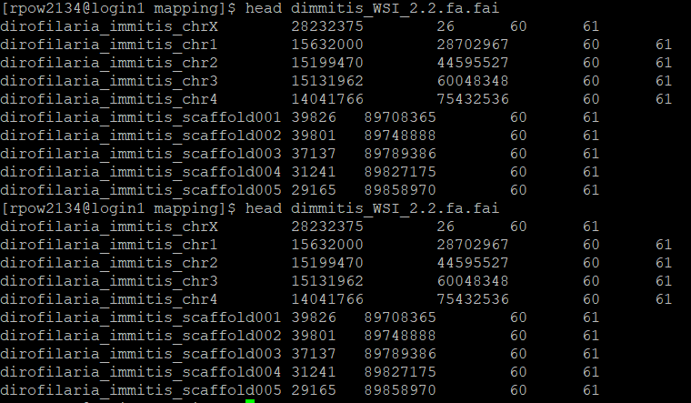
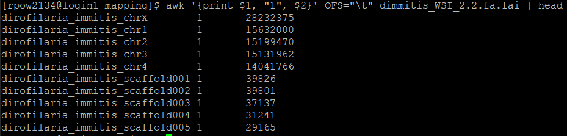
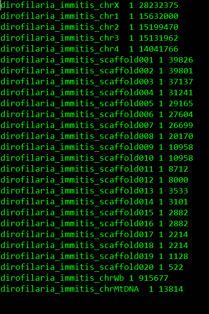

# Dirofilaria immitis WGS Lab Book - Test JS6279

### Rose Power USYD 2023

To save time, I will select just 1 sample to test my code/analysis on. I will select JS6279 (this is one of Wilson's worms from a Sydney dog).


## Get subset of reads to test

I will use just 1 of the paired read files for this sample (since I have 2-3 pairs of reads for the same sample sometimes). 
If I had just one huge fastq file, I could extract just the first million reads for testing:

```bash
zcat JS6279_FSFP220054792-1r_HTY2GDSX2_L1_1.fq.gz | head -n 4000000 | gzip > test_JS6279_1.fq.gz
zcat JS6279_FSFP220054792-1r_HTY2GDSX2_L1_2.fq.gz | head -n 4000000 | gzip > test_JS6279_2.fq.gz
# If we want the first 1 million reads, we need to do the head tool for 4 million reads (layout of fastq file has 4 lines).
```


## FastQC & Multi-QC

We want to get some stats on the raw data.

```bash

#!/bin/bash

# PBS directives 
#PBS -P RDS-FSC-Heartworm_MLR-RW
#PBS -N fastQC
#PBS -l select=1:ncpus=2:mem=20GB
#PBS -l walltime=00:20:00
#PBS -m e
#PBS -q defaultQ
#PBS -o fastQC.txt

## qsub -P RDS-FSC-Heartworm_MLR-RW fastQC.pbs

# Load modules
module load fastqc/0.11.8

# FastQC
cd /project/RDS-FSC-Heartworm_MLR-RW/HW_WGS_test

INPUTDIR="/project/RDS-FSC-Heartworm_MLR-RW/HW_WGS_test/data/fastq"
NCPU=2
OUTDIR="/project/RDS-FSC-Heartworm_MLR-RW/HW_WGS_test/data/analysis/fastqc"

fastqc -t $NCPU -o $OUTDIR $INPUTDIR/*.fq.gz
```


Looks like pretty good quality. Quality of reverse reads are a bit worse but that's normal.


## Trimming

We may want to trim the raw reads. To do this, we can use the trim_galore and trimmomatic tools.

### Trim galore

```bash
# qsub trimgalore.pbs

cd /project/RDS-FSC-Heartworm_MLR-RW/HW_WGS_test/data/analysis/trimgalore

# Load modules
module load trimgalore/030816

# Run Trim galore
trim_galore --paired --fastqc --length 50 /project/RDS-FSC-Heartworm_MLR-RW/HW_WGS_test/data/fastq/JS6279_FSFP220054792-1r_HTY2GDSX2_L1_1.fq.gz /project/RDS-FSC-Heartworm_MLR-RW/HW_WGS_test/data/fastq/JS6279_FSFP220054792-1r_HTY2GDSX2_L1_2.fq.gz

```

### Trimmomatic

```bash
# qsub trimmomatic.pbs

cd /project/RDS-FSC-Heartworm_MLR-RW/HW_WGS_test/data/analysis
mkdir trimmomatic
cd trimmomatic

# Load modules
module load trimmomatic/0.38

# Run Trimmomatic
java -jar /usr/local/trimmomatic/0.38/trimmomatic-0.38.jar PE \
-threads 10 -phred33 \
/project/RDS-FSC-Heartworm_MLR-RW/HW_WGS_test/data/fastq/JS6279_FSFP220054792-1r_HTY2GDSX2_L1_1.fq.gz \
/project/RDS-FSC-Heartworm_MLR-RW/HW_WGS_test/data/fastq/JS6279_FSFP220054792-1r_HTY2GDSX2_L1_2.fq.gz \
JS6279_1_trimpaired.fq.gz JS6279_1_trimunpaired.fq.gz \
JS6279_2_trimpaired.fq.gz JS6279_2_trimunpaired.fq.gz \
SLIDINGWINDOW:10:20 MINLEN:50

# SLIDINGWINDOW:10:20 means it will scan the read with a 10-base wide sliding window, cutting when the average quality per base drops below 20.

# Instead of SLIDINGWINDOW, in my previous practice code I used 'AVGQUAL:30 MINLEN:150'.
```


## Mapping

We want to map the reads to 3/4 different genomes: 
1. Nuclear HW
2. mt DNA HW
3. Wolbachia
4. Domestic dog *Canis lupus familiaris* (GenBank accession: GCA_014441545) # This is the one Steve used in his recent paper

The code below uses bwa mem for mapping, but I could also use minimap2 -> Sambamba to mark duplicate reads -> Samtools merge to combine mapped reads (when there are multiple read sets).

### Map trimmed reads to D. immitis/Wolbachia reference genome

```bash
# qsub mapping_di_wol.pbs

# Map reads to DI/Wol reference genome

# Set working directory
cd /project/RDS-FSC-Heartworm_MLR-RW/HW_WGS_test/data/analysis/mapping

# Load modules
module load bwa/0.7.17
module load samtools/1.9

# index reference sequence
bwa index dimmitis_WSI_2.2.fa

# Perform mapping, sam-to-bam conversion, filtering, and indexing

# map the reads
bwa mem dimmitis_WSI_2.2.fa ../trimmomatic/JS6279_1_trimpaired.fq.gz ../trimmomatic/JS6279_2_trimpaired.fq.gz > JS6279_di_wol.tmp.sam
	
# convert the sam to bam format
samtools view -q 15 -b -o JS6279_di_wol.tmp.bam JS6279_di_wol.tmp.sam

# sort the mapped reads in the bam file
samtools sort JS6279_di_wol.tmp.bam -o JS6279_di_wol.sorted.bam 
 
# index the sorted bam
samtools index JS6279_di_wol.sorted.bam

# lets clean up and remove files we don’t need
rm *tmp*

# Mapping statistics

How much was worm/not worm? Collect this information into an excel sheet.

# Samtools flagstat
cd /project/RDS-FSC-Heartworm_MLR-RW/HW_WGS_test/data/analysis/mapping
module load samtools/1.9
samtools flagstat JS6279_di_wol.sorted.bam > JS6279_di_wol_flagstat.txt
# Or use assembly-stats tools.
```


### Map trimmed reads to dog reference genome

```bash
# qsub mapping_dog.pbs

# Map reads to dog reference genome

# Set working directory
cd /project/RDS-FSC-Heartworm_MLR-RW/HW_WGS_test/data/analysis/mapping

# Load modules
module load bwa/0.7.17
module load samtools/1.9

# index reference sequence
bwa index GCA_014441545.1_ROS_Cfam_1.0_genomic.fna

# Perform mapping, sam-to-bam conversion, filtering, and indexing

# map the reads
bwa mem GCA_014441545.1_ROS_Cfam_1.0_genomic.fna ../trimmomatic/JS6279_1_trimpaired.fq.gz ../trimmomatic/JS6279_2_trimpaired.fq.gz > JS6279_dog.tmp.sam
	
# convert the sam to bam format
samtools view -q 15 -b -o JS6279_dog.tmp.bam JS6279_dog.tmp.sam

# sort the mapped reads in the bam file
samtools sort JS6279_dog.tmp.bam -o JS6279_dog.sorted.bam 
 
# index the sorted bam
samtools index JS6279_dog.sorted.bam

# lets clean up and remove files we don’t need
rm *tmp*

# Mapping stats

# Samtools flagstat
cd /project/RDS-FSC-Heartworm_MLR-RW/HW_WGS_test/data/analysis/mapping
module load samtools/1.9
samtools flagstat JS6279_dog.sorted.bam > JS6279_dog_flagstat.txt
# Or use assembly-stats tools.
```


### Map trimmed reads to combined D. immitis & Wol & dog genome

- cat the 2 references together
- map reads to the combined reference
- samtools to pull out DI scaffolds I want
- do stats before filtering, so I can see how many were mapped, then how many after filtering etc. Do before samtools view -q 15.

```bash
# qsub ../mapping_di_wol_dog.pbs

# Combine the 2 references
# cat dimmitis_WSI_2.2.fa GCA_014441545.1_ROS_Cfam_1.0_genomic.fna > reference_di_wol_dog.fa

# Map reads to combined reference genome

# Set working directory
cd /project/RDS-FSC-Heartworm_MLR-RW/HW_WGS_test/data/analysis/mapping

# Load modules
module load bwa/0.7.17
module load samtools/1.9
module load bcftools/1.11
module load tabix/0.2.6

# index reference sequence
bwa index reference_di_wol_dog.fa

# Perform mapping, sam-to-bam conversion, filtering, and indexing

# map the reads
bwa mem reference_di_wol_dog.fa ../trimmomatic/JS6279_1_trimpaired.fq.gz ../trimmomatic/JS6279_2_trimpaired.fq.gz > JS6279_di_wol_dog.tmp.sam

# Mapping stats
samtools flagstat JS6279_di_wol_dog.tmp.sam > JS6279_di_wol_dog_flagstat1.txt
	
# convert the sam to bam format
samtools view -q 15 -b -o JS6279_di_wol_dog.tmp.bam JS6279_di_wol_dog.tmp.sam

# sort the mapped reads in the bam file
samtools sort JS6279_di_wol_dog.tmp.bam -o JS6279_di_wol_dog.sorted.bam 
 
# index the sorted bam
samtools index JS6279_di_wol_dog.sorted.bam

# lets clean up and remove files we don’t need
rm *tmp*

# Mapping stats after filtering
samtools flagstat JS6279_di_wol_dog.sorted.bam > JS6279_di_wol_dog_flagstat2.txt
```


## Extract reads that mapped to the *D. immitis* genome

If I mapped to the *D. immitis* and dog genomes separately, there could be reads that mapped to both genomes. To avoid this, I mapped to the combined D. immitis/dog genome. I can now extract the reads that mapped to only the *D. immitis* genome and use this for downstream analyses.

```bash
# Index the reference file (from Steve's paper) using samtools faidx
samtools faidx dimmitis_WSI_2.2.fa

# Get the scaffolds/positions.
head dimmitis_WSI_2.2.fa.fai
# Column 1 is the chromosome/scaffold, column 2 is how long it is, then there's some other info.
```



```bash
# Get chromosome, then start and end positions
awk '{print $1, "1", $2}' OFS="\t" dimmitis_WSI_2.2.fa.fai | head
```


```bash
# Save this info as a bed file
awk '{print $1, "1", $2}' OFS="\t" dimmitis_WSI_2.2.fa.fai > dimmitis_WSI_2.2.bed
# Now we have a nice bed file that has info telling us where things are
```


```bash
cd /project/RDS-FSC-Heartworm_MLR-RW/HW_WGS_test/data/analysis/mapping

# Extract reads that only mapped to D. immitis.
samtools view -b -h -L dimmitis_WSI_2.2.bed JS6279_di_wol_dog.sorted.bam > JS6279_extract.bam
# Should still be in sorted form
# -b flag makes sure the output is bam
# -h flag includes the header in SAM output

samtools view JS6279_extract.bam | head

# Do I have to sort the bam file again? No, it should still be sorted.
```

## QC

```bash
# How many D. immitis reads were extracted?
# Load modules
module load samtools/1.9
samtools flagstat JS6279_extract.bam > JS6279_extract_flagstat.txt
```


## SNPs (raw)

Now that I've extracted the reads for D. immitis, I can continue to call SNPs.
The code below uses bcftools for SNP calling. I could also use GATK -> variants identified -> HaplotypeCaller to generate GVCF files for each BAM file -> consolidate variants -> CombineGVCFs to merge GVCF files -> GATK GenotypeGVCFs for joint-call cohort genotyping -> generate single multisample VCF file (contains all initial variants and samples).


```bash
# List all of the extracted files and write them to a new file-of-file-names - "bam.fofn".
# This will contain the names of all the bam files

cd /project/RDS-FSC-Heartworm_MLR-RW/HW_WGS_test/data/analysis/mapping

# Load modules
module load samtools/1.9
module load bcftools/1.11
module load tabix/0.2.6

ls -1 *_extract.bam > bam.fofn

# call SNPs in the bam files using bam.fofn to generate a multi-sample bcf
bcftools mpileup -Ou --annotate FORMAT/DP --fasta-ref dimmitis_WSI_2.2.fa --bam-list bam.fofn | bcftools call -v -c --ploidy 1 -Ob --skip-variants indels > all_samples.bcf
# Can just use DI reference genome now

# index the multi-sample bcf
bcftools index all_samples.bcf

# convert the bcf to a compressed vcf
bcftools view all_samples.bcf -Oz > all_samples.vcf.gz

# index the compressed vcf
tabix -p vcf all_samples.vcf.gz
```

## QC

```bash
# Get stats for bcf and vcf files we just created
# Load modules
module load bcftools/1.11
bcftools stats all_samples.bcf > all_samples_bcf_stats.txt
bcftools stats all_samples.vcf.gz > all_samples_vcf_stats.txt
```
Both of these outputs seem to be the same. Can just get stats on the compressed vcf file.

## SNPs (filter)

- SNP callers tend to call too many variants, so some filtering is required. The code below uses vcftools. I could also use GATK SelectVariants & VariantFiltration. Nuclear, mitochondrial & Wolbachia variants filtered separately. 
- Quality metrics I can look at: QUAL, DP, MQ, SOR, FS, QD, MQRankSum, ReadPosRankSum. Also min/max alleles, minor allele frequency, Hary Weinberg Equilibrium, per genotype depth.
- Missingness: per-sample & per-site
- Are there SNPs in certain chromosomes I want to keep/exclude?

```bash
#!/bin/bash

# PBS directives 
#PBS -P RDS-FSC-Heartworm_MLR-RW
#PBS -N snps_filter
#PBS -l select=1:ncpus=4:mem=20GB
#PBS -l walltime=03:00:00
#PBS -m e
#PBS -q defaultQ
#PBS -o snps_filter.txt

# qsub ../snps_filter.pbs

# Filter SNPs in the vcf to select variants with:
# 1. a minor allele frequence (maf) greater than 0.05, and
# 2. minimum and maximum allele count of 2 

cd /project/RDS-FSC-Heartworm_MLR-RW/HW_WGS_test/data/analysis/mapping

# Load modules
module load vcftools/0.1.14

vcftools --gzvcf all_samples.vcf.gz --maf 0.05 --min-alleles 2 --max-alleles 2 --recode --out all_samples.filtered

# --gzvcf options reads compressed VCF files directly
# --maf 0.05 includes only sites with a minor allele frequency greater than or equal to 0.05. Allele frequency is the number of times an allele appears over all individuals at that site, divided by the total number of non-missing alleles at that site.
# --min-alleles 2 and --max-alleles 2 includes only sites with a number of alleles greater than or equal to 2 and less than or equal to 2.
# --recode is used to generate a new file in either vcf/bcf from the input vcf/bcf after applying the filtering options.
# --out defines the output filename prefix

# barely used any time/gb, make it way less next time.
```

## QC

```bash
# Load modules
module load bcftools/1.11

cd /project/RDS-FSC-Heartworm_MLR-RW/HW_WGS_test/data/analysis/mapping

# How many SNPs remain after this filtering step?
bcftools stats all_samples.filtered.recode.vcf > all_samples_filtered_stats.txt
```


